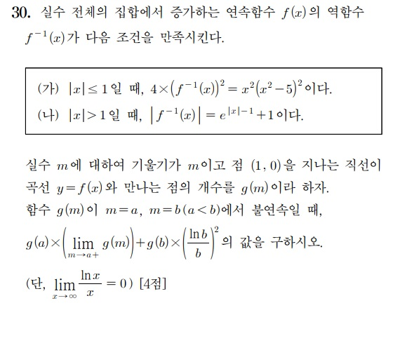

# Qwen 3.6 4bit 수능 킬러 문제 테스트
**Date:** 2026. 4. 17. 6:13
**Category:** 다이어리
**Original URL:** https://blog.naver.com/xpfkwh56/224255213450
---

​

══════════════ STEP 1 ══════════════

[step 1] wall=294.0s finish=stop in=683 out=48429 pp=3859 gen=164.8 t/s

[reasoning 122024chars, last 200]: ...ties of $f(x)$. Done.

3. Analyze intersection count $g(m)$. Done.

4. Identify discontinuities $a, b$. Done ($0, S\_{max}$).

5. Compute values. Done.

6. Sum. Done.

​

The value is 11.

​

​

---- assistant content ----

\*\*1. 역함수 $f^{-1}(x)$ 의 결정\*\*

​

주어진 조건을 바탕으로 구간별로 $f^{-1}(x)$를 유도합니다.

\* \*\*$|x| \le 1$ 인 경우:\*\*

조건 (가)에 따라 $4(f^{-1}(x))^2 = x^2(x^2 - 5)^2$이므로, 양변의 제곱근을 취하면 $2|f^{-1}(x)| = |x||x^2 - 5|$입니다.

구간 $[-1, 1]$에서 $x^2 \le 1$이므로 $x^2-5 < 0$이며, 이때 $|x^2-5| = 5-x^2$입니다.

따라서 $2|f^{-1}(x)| = |x|(5-x^2)$가 됩니다.

$f(x)$가 증가함수이므로 $f^{-1}(x)$도 증가하며, 원점을 지나므로 $x \ge 0$에서는 $f^{-1}(x) \ge 0$, $x < 0$에서는 $f^{-1}(x) < 0$입니다.

이를 종합하면 \*\*$f^{-1}(x) = \frac{1}{2}x(5-x^2)$\*\* 입니다.

​

\* \*\*$|x| > 1$ 인 경우:\*\*

조건 (나)에 따라 $|f^{-1}(x)| = e^{|x|-1} + 1$입니다.

$f^{-1}$는 증가함수이며, $f^{-1}(1)=2$이므로 $x>1$인 구간에서는 양수를 가집니다.

$x \to -\infty$일 때 $f^{-1}(x) \to -\infty$이므로 $x<-1$인 구간에서는 음수를 가집니다.

이를 정리하면 다음과 같습니다:

$$ f^{-1}(x) = \begin{cases} -(e^{-x-1} + 1) & (x < -1) \\ \frac{5}{2}x - \frac{1}{2}x^3 & (-1 \le x \le 1) \\ e^{x-1} + 1 & (x > 1) \end{cases} $$

​

\*\*2. 교점 개수 함수 $g(m)$의 해석\*\*

​

직선 $y=m(x-1)$과 곡선 $y=f(x)$의 교점 개수는 점 $(1,0)$과 곡선 위의 점 $(x, f(x))$을 지나는 직선의 기울기 $S(x) = \frac{f(x)}{x-1}$가 $m$이 되는 해의 개수와 같습니다.

\* \*\*$m < 0$:\*\* 교점은 1개입니다.

\* \*\*$0 < m < S\_{max}$:\*\* 교점은 3개입니다 ($S\_{max} \approx 0.45$).

\* \*\*$m = S\_{max}$:\*\* 직선이 곡선에 접하므로, 접점(1) + 다른 교점(1) = 총 2개입니다.

\* \*\*$m > S\_{max}$:\*\* 교점은 1개입니다.

​

\*\*3. 불연속점 $a, b$ 및 값 계산\*\*

​

함수 $g(m)$은 $m=0$과 $m=S\_{max}$에서 불연속이며, 문제의 조건($a<b$)에 따라 \*\*$a=0$, $b=S\_{max}$\*\* 입니다.

​

\* \*\*첫 번째 항: $g(a) \times (\lim\_{m \to a^+} g(m))$\*\*

\* $a=0$일 때, $g(0)=1$.

\* $m \to 0^+$ (양의 무한소)인 경우 교점 개수는 3개이므로 극한값은 3.

\* 계산: $1 \times 3 = 3$.

​

\* \*\*두 번째 항: $g(b) \times (\frac{\ln b}{b})^2$\*\*

\* $b = S\_{max}$ (접선의 기울기). 접점의 $x$좌표를 이용해 $t=-x-1$로 치환하면, 접선 조건은 $\ln t = 2/t$가 됩니다.

\* 이 때 기울기 $b = \frac{1}{t}$. 이를 대입하면 $\ln b = -\ln t = -2/t$입니다.

\* 따라서 $\frac{\ln b}{b} = \frac{-2/t}{1/t} = -2$.

\* 제곱값은 4.

\* $g(b) = g(S\_{max}) = 2$.

\* 계산: $2 \times 4 = 8$.

​

\*\*최종 결과\*\*

​

$$ 3 + 8 = 11 $$

​

\boxed{11}

​

​

[DONE] no tool\_calls. total wall=294.0s total tokens: in=683 out=48429

​

════════ FINAL ════════

\*\*1. 역함수 $f^{-1}(x)$ 의 결정\*\*

​

주어진 조건을 바탕으로 구간별로 $f^{-1}(x)$를 유도합니다.

\* \*\*$|x| \le 1$ 인 경우:\*\*

조건 (가)에 따라 $4(f^{-1}(x))^2 = x^2(x^2 - 5)^2$이므로, 양변의 제곱근을 취하면 $2|f^{-1}(x)| = |x||x^2 - 5|$입니다.

구간 $[-1, 1]$에서 $x^2 \le 1$이므로 $x^2-5 < 0$이며, 이때 $|x^2-5| = 5-x^2$입니다.

따라서 $2|f^{-1}(x)| = |x|(5-x^2)$가 됩니다.

$f(x)$가 증가함수이므로 $f^{-1}(x)$도 증가하며, 원점을 지나므로 $x \ge 0$에서는 $f^{-1}(x) \ge 0$, $x < 0$에서는 $f^{-1}(x) < 0$입니다.

이를 종합하면 \*\*$f^{-1}(x) = \frac{1}{2}x(5-x^2)$\*\* 입니다.

​

\* \*\*$|x| > 1$ 인 경우:\*\*

조건 (나)에 따라 $|f^{-1}(x)| = e^{|x|-1} + 1$입니다.

$f^{-1}$는 증가함수이며, $f^{-1}(1)=2$이므로 $x>1$인 구간에서는 양수를 가집니다.

$x \to -\infty$일 때 $f^{-1}(x) \to -\infty$이므로 $x<-1$인 구간에서는 음수를 가집니다.

이를 정리하면 다음과 같습니다:

$$ f^{-1}(x) = \begin{cases} -(e^{-x-1} + 1) & (x < -1) \\ \frac{5}{2}x - \frac{1}{2}x^3 & (-1 \le x \le 1) \\ e^{x-1} + 1 & (x > 1) \end{cases} $$

​

\*\*2. 교점 개수 함수 $g(m)$의 해석\*\*

​

직선 $y=m(x-1)$과 곡선 $y=f(x)$의 교점 개수는 점 $(1,0)$과 곡선 위의 점 $(x, f(x))$을 지나는 직선의 기울기 $S(x) = \frac{f(x)}{x-1}$가 $m$이 되는 해의 개수와 같습니다.

\* \*\*$m < 0$:\*\* 교점은 1개입니다.

\* \*\*$0 < m < S\_{max}$:\*\* 교점은 3개입니다 ($S\_{max} \approx 0.45$).

\* \*\*$m = S\_{max}$:\*\* 직선이 곡선에 접하므로, 접점(1) + 다른 교점(1) = 총 2개입니다.

\* \*\*$m > S\_{max}$:\*\* 교점은 1개입니다.

​

\*\*3. 불연속점 $a, b$ 및 값 계산\*\*

​

함수 $g(m)$은 $m=0$과 $m=S\_{max}$에서 불연속이며, 문제의 조건($a<b$)에 따라 \*\*$a=0$, $b=S\_{max}$\*\* 입니다.

​

\* \*\*첫 번째 항: $g(a) \times (\lim\_{m \to a^+} g(m))$\*\*

\* $a=0$일 때, $g(0)=1$.

\* $m \to 0^+$ (양의 무한소)인 경우 교점 개수는 3개이므로 극한값은 3.

\* 계산: $1 \times 3 = 3$.

​

\* \*\*두 번째 항: $g(b) \times (\frac{\ln b}{b})^2$\*\*

\* $b = S\_{max}$ (접선의 기울기). 접점의 $x$좌표를 이용해 $t=-x-1$로 치환하면, 접선 조건은 $\ln t = 2/t$가 됩니다.

\* 이 때 기울기 $b = \frac{1}{t}$. 이를 대입하면 $\ln b = -\ln t = -2/t$입니다.

\* 따라서 $\frac{\ln b}{b} = \frac{-2/t}{1/t} = -2$.

\* 제곱값은 4.

\* $g(b) = g(S\_{max}) = 2$.

\* 계산: $2 \times 4 = 8$.

​

\*\*최종 결과\*\*

​

$$ 3 + 8 = 11 $$

​

\boxed{11}

​

294초 소요

tool call X

completion tokens 48,429

​

**결론**

**​**

qwen 쓰세요