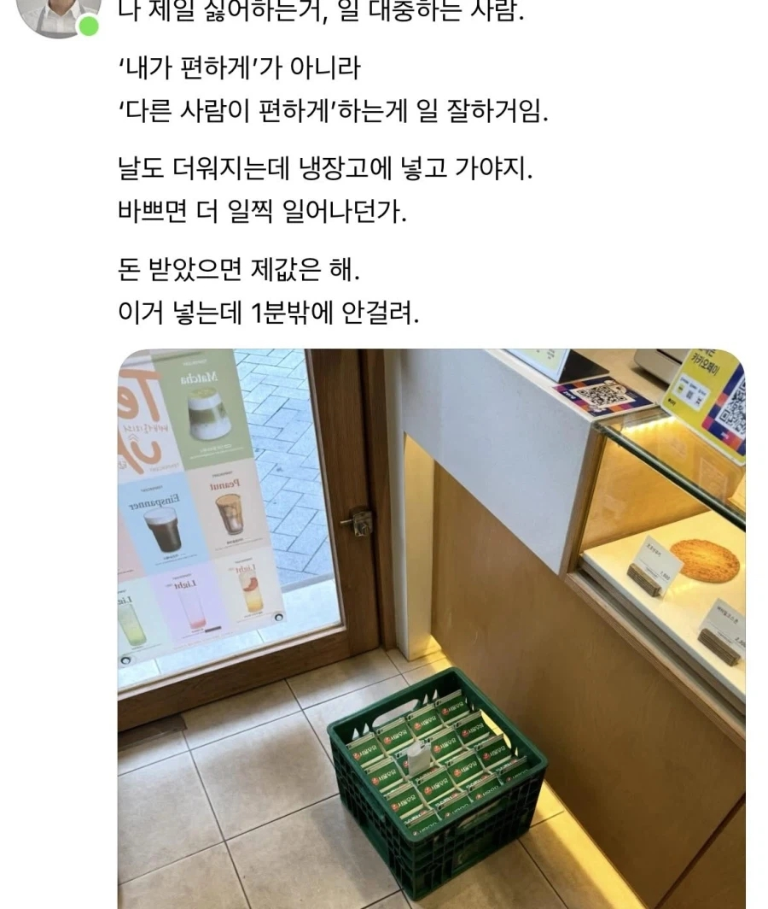

# 뭐 대표적으로 이런 것 아닐까
**Date:** 2026. 4. 20. 1:26
**Category:** 다이어리
**Original URL:** https://blog.naver.com/xpfkwh56/224258136336
---

1분 밖에 안 걸리면 본인이 하시지 ,, 바쁘시면 더 일찍 일어나던가 ,,

​

1. 놀랍게도 본문에서 틀린 말은 없음

​

일을 대충한다는 것은 나 또한

**'죄악'** 에 가깝다고 생각을 하고,

​

똑같이, 일을 잘 한다는 것은

내가 편하게 가 아니라

**'남을'** 편하게 하는 것이 맞음

​

2. 그럼 저 발언의 문제는 뭘까?

​

1) **'방향'** 이 틀렸음

​

본인이 알고 있는 것을 남이 아니라

나 스스로에게 적용하려고 했어야 됨

​

**\* 당연히 쉽지 않지만**

​

우유 배달은 상대가 **'편하게'** 한 것이니,

내가 상대를 어떻게 **'편하게'** 할 것인가

​

를 고려해봤으면 별 문제도 안 될 사안임

​

2) **'해상도'** 가 낮았음

​

배달 하는 사람도 사정이 있었을 것이다,

라고 가늠해볼 수 있는 단서가 없었을 것

​

본문처럼 본인이 날도 더워지는데,

진짜 우유가 상할까 걱정이었는지

​

아니면 내가 직접 우유 박스에서

꺼내서 넣는 것이 귀찮았든 간에

​

그거야 진의를 전혀 알 수는 없지만

쟤도 나처럼 힘든 일을 하고 있다,

​

라는 해상도가 있었으면 아마도

더 긍정적인 대응이 가능했을 것임

​

**3) 돈 받았으면 제 값을 해**

​

**'우유'** 만 산 것인지,

​

넣어주는 **'서비스'** 까지

산 것인지 확실히 했어야 됨

​

후자를 지불하지 않았는데,

전자에 포함되었다고 착오 했으면

​

내가 **'착오 했음 정도'** 는

성찰할 수 있었어야 했음

​

3. 내가 막 엄청 오래산 것은 아닌데,

살면서 정말 어려운 것 중 하나가

​

**'나 스스로에게 솔직하게 사는 것'** 임

​

근데 이게 하늘에서 **뚝딱** 되지가 않음

​

분명 어느정도 경험이 필요하고,

나를 돌아볼 시간이 필요하고,

​

솔직할 수 있을 정도의

**'여유'** 까지도 갖춰야 가능함

​

넓은 세상, 큰 세상, 높은 세상은

각각 전부 다른 개념이라고 보는데

​

본인의 세계관 내에서 위에 있는

세 요소를 착오하면 저럴 수 있는 듯

​

아, 자영업 한다고 너무 바쁜데

​

우유 배달 기사님이 혹시라도 매번은

아니더라도 한가할 때가 되신다면

좀 넣어주시면 너무 감사할 것 같다

​

라고 좋게 좋게 했으면 아마 쫌 ,,