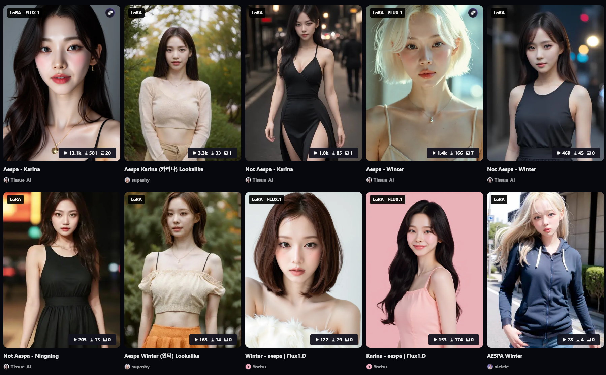

# 로라가 뭔데요?
**Date:** 2026. 4. 25. 7:51
**Category:** 다이어리
**Original URL:** https://blog.naver.com/xpfkwh56/224264462605
---

​

1. 모델 가중치를 의도적으로

과적합해서 연산을 어쩌고 (x)

​

그냥 특정 그림 뽑는 **'금형'** 입니다

​

나쁘게 쓰면 딥페이크로 악용될 수 있지만,

좋게 쓰면 긍정적으로 쓸 여지들이 많음

​

**2. 개인적으로 가장 권장하는 것은**

**가족들, 특히 부모님 사진 갖고 하는 것**

​

보통 동아시아 사람 이미지 나,

동물 관련해선 정보를 찾기 어렵지만

​

노-오력 해서 열심히 찾으면 되는데

이렇게 해서 로라를 많이 갖고 있으면

​

**1) 언제든지 학습 데이터 기반으로**

**원할 때, 부모님 사진 만들어낼 수 있음**

​

아기 혼자 찍혀있는 사진인데,

옆에 내가 포토샵이랑 등등 쓰면

​

**실제처럼 우리 부모님, 시댁 부모님**

**다 도란도란 앉아 있는 것 구현 가능**

​

2) 아이 사진 기준으로 할 때면,

​

**1살 때, 5살 때, 10살 때,**

**중학교 때, 고등학교 때 이미지를**

**각각 개별로 뽑는 것도 가능합니다**

**​**

즉, **'앨범'** 을 만드는 것이 아니라

**'동적 앨범'** 을 만들 수 있단 것이죠

​

여기에 영상 기술까지 접목하면,

해리포터에 나오는 움직이는

신문 같은 것도 구현 가능합니다

​

제가 제 사진으로 고딩 때, 20대 초반 때

찍었던 사진으로 해봤는데 **아주 재밌었음**

​

1호기한테 해주려고 하는 것인데,

​

자기 어렸을 때 사진이랑

현재 사진이랑 양쪽으로

대칭하게 만들어서,

​

과거의 나와 미래의 내가

서로 한 공간에 있는 이미지를

연출해서 만들 생각도 있음

​

이런 것은 대부분의 사람에게

꽤 근사한 경험이 될 것임

​

**3) 동물**

​

저는 강아지를 키우는데,

​

다들 그렇겠지만 아주 큰 애착을

갖고 있던 갱얼지가 암으로 떠났음

​

그래서 남아있는 강아지들이랑

같이 찍을 때, 그 빈자리가

가끔 아쉽게 느껴지곤 했는데

​

그럴 때, 예전에 찍었던 사진이랑

영상들에서 데이터 추출해다가

만든 로라로 옆에다 합성 해두면

​

**없는 것보단 낫단 생각** 들었었음

​

적으면 30-40장 정도면 충분하고,

​

<https://youtu.be/5faivT1Wp3E?si=vchQjErWMEvkwKuw>

​

컴퓨터 비전 기술은 정말 하루가 다르게,

**'급속도로'** 진보가 빨리 일어나기 때문에

​

본인이 **깎으면 깎을수록** 정밀해집니다

​

관심 있으시면 NeRF, 3DGS 같은

키워드로 접근해 보실 수도 있는데

​

어렵긴 많이 어렵고 그에 비해서

당장 이게 벌이에 도움이 될 수 있냐,

​

쪽은 애매할 수 있지만

​

**\* 인테리어, 언리얼 이런 쪽으로**

**본인이 생각 있으면 저거는 어차피**

**캐드처럼 익숙한 기술이라 좀 쉬움**

**​**

취미 삼아서 기왕 하는 김에

하나 갖고 있을 기술로는

제법 나쁘지 않다고 생각함

​

딥페이크 관련으로는 남조선에서도

법제화가 꽤 깊게 자리잡았기 때문에

​

**\* 처벌도 쌥니다**

**​**

괜히 애먼 곳에 쓸 생각하진 마시구욬ㅋ