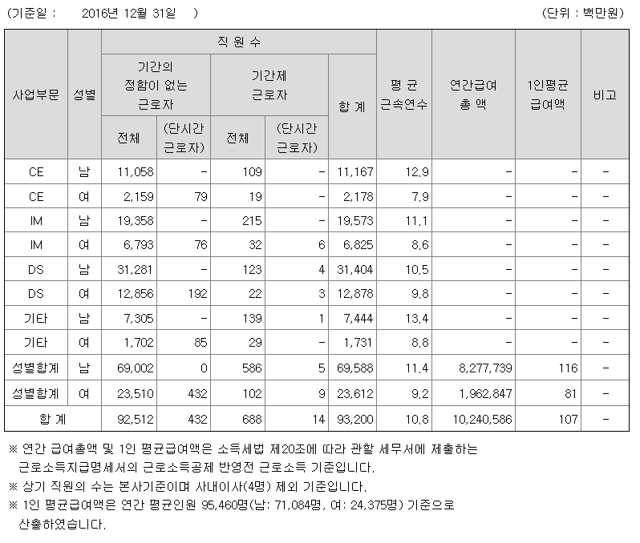
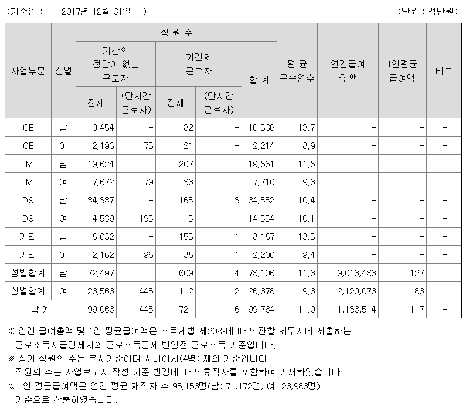
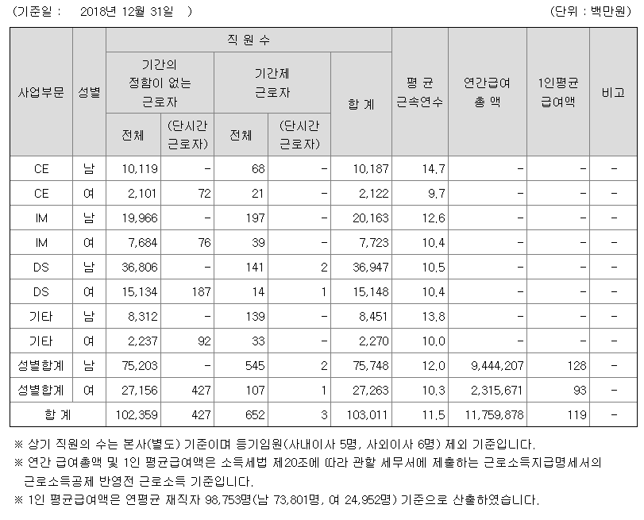
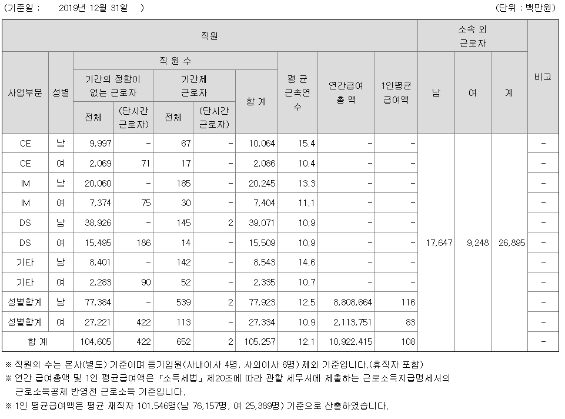
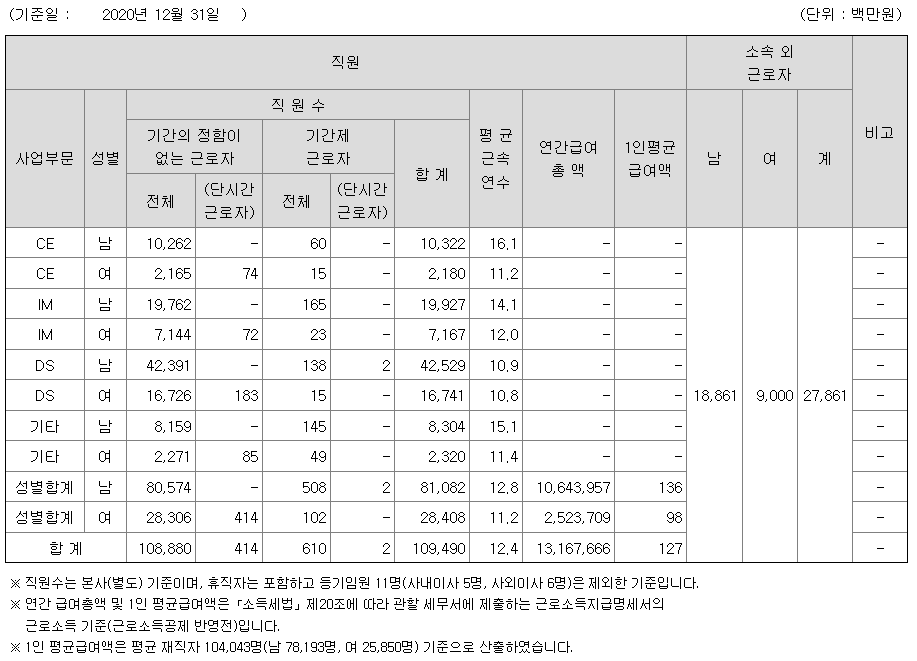
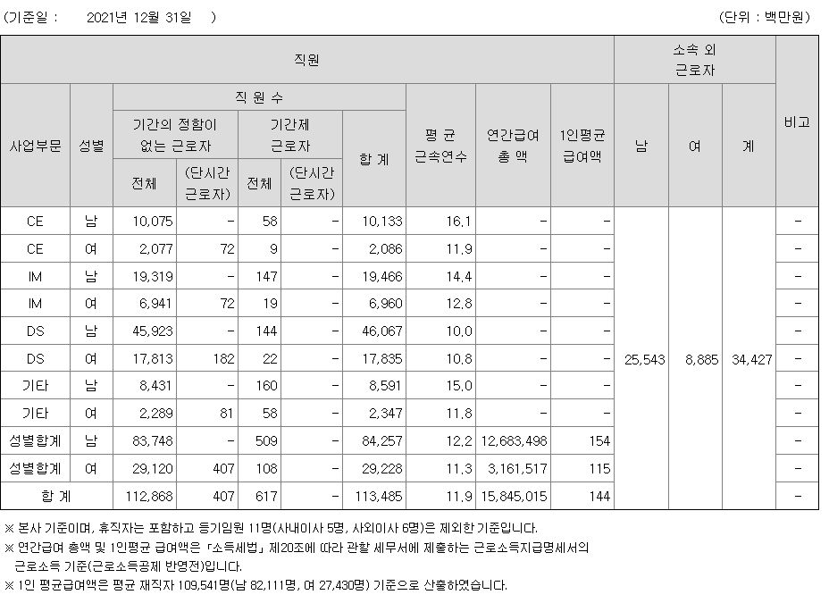
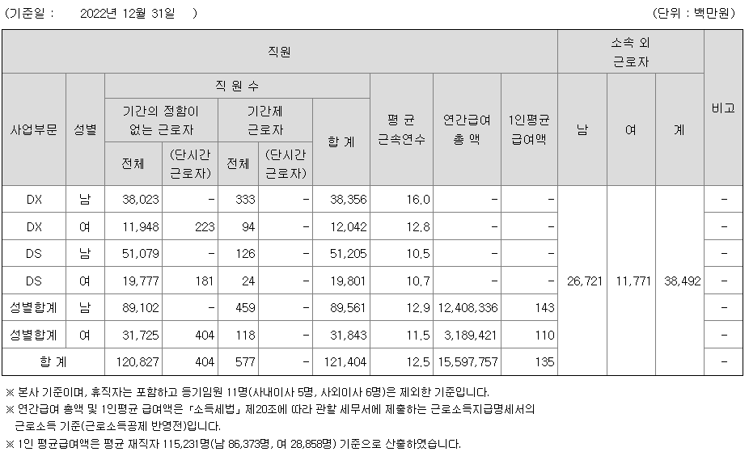
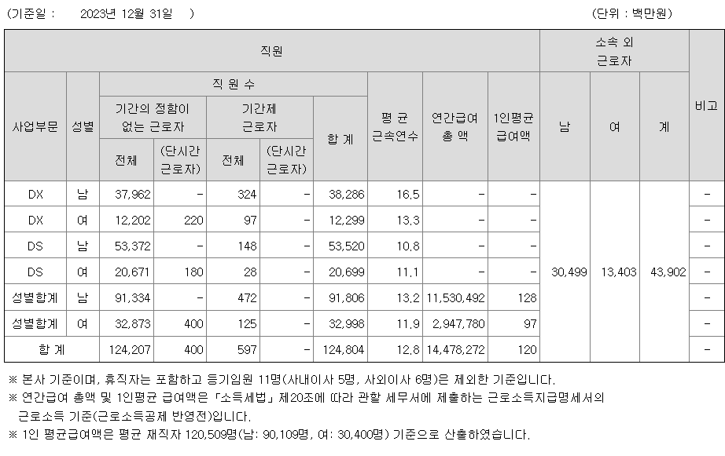
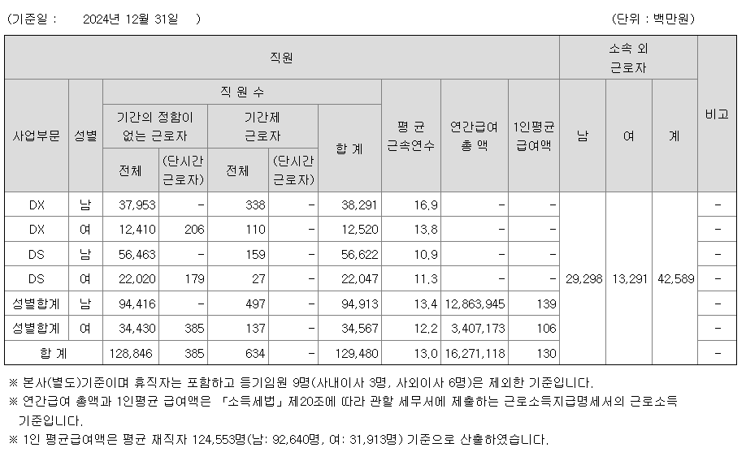
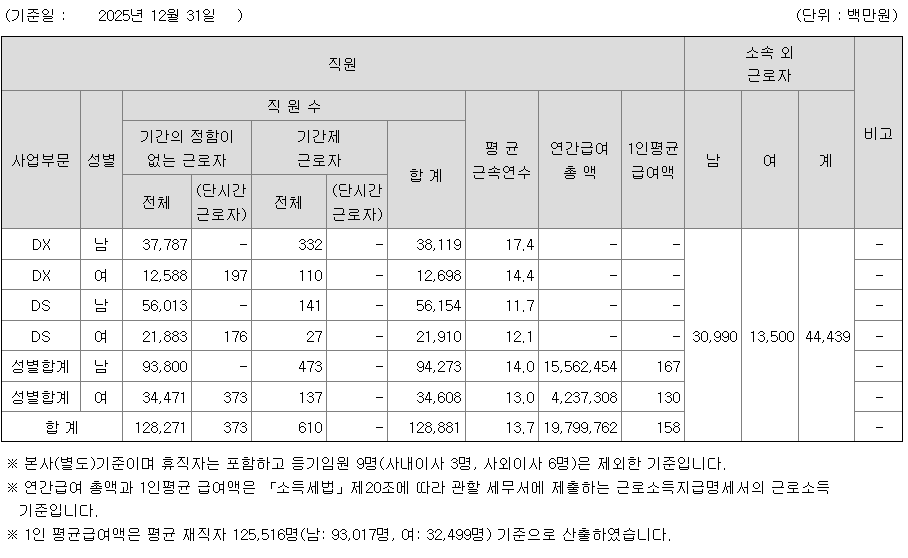

# 삼성전자 약 10년치 인건비 추이
**Date:** 2026. 4. 26. 10:49
**Category:** 다이어리
**Original URL:** https://blog.naver.com/xpfkwh56/224265443892
---

​

1. 내가 월 200 벌고 있는데,

월 400 으로 바뀌면 차이가 큼

​

근데 내가 월 1천 벌고 있는데

거기에 100-200 더 늘어나고

줄어든다고 해서 인생 잘 안 바뀜

​

2. 보상 자체가 세후 400 을 기점으로

구조적 비효율을 부르게 되어있는데,

​

**\* 사람마다 다를 수 있겠지만 제 생각에,**

**400 까지는 그냥 일을 많이 하기만 해도**

**건강을 팔아서 벌 수 있는 범주라고 봄요**

**​**

사업부 향후 비전, 전망을 예측해서

취직할 분야를 고른다는 것은

현실적으로 불가능한 일에 가깝고

​

**\* 그런 혜안이 있으면**

**투자를 하는 것이 낫다**

​

통장에 월 8-900 들어오다가

경기 나빠서 6-700 으로 바뀐들,

​

허리띠 졸라잡고 방 빼고 이사 다니고

그러기보단 내년에는 더 나아지려니,

​

하고 그냥 출/퇴근 할 것이라고

생각하는 것이 타당하다고 생각

​

3. 2016년부터 2025년 컷까지

물가 상승률, 최저임금 상승률 보면

​

적어도 시총 1위 대표적인 대기업

임금 상승률이 저점 상승률 대비로

격차를 이끌어낸다고 보기는 어려움

​

저점은 계속 높아지고,

고점은 계속 낮아지고,

​

매 년마다 기회가 쏟아지는 세상이라

​

하고 싶은 사람 한정으로 주어진 일,

내 할 일 열심히 하고 사는 것이 답 임

​

4. 그리구 제 경험상,

저는 장사를 해봤었는데

​

**\* 요새는 기억도 가물가물하지만**

**​**

한 달 수익, 1년 수익 일희일비 해서는

맨 정신으로 그 직업을 유지 못 합니다

​

비전, 전망, 대우, 이런 것 보고 하기보다

진짜 걍 내가 잘 할 수 있는 일 골라야 됨