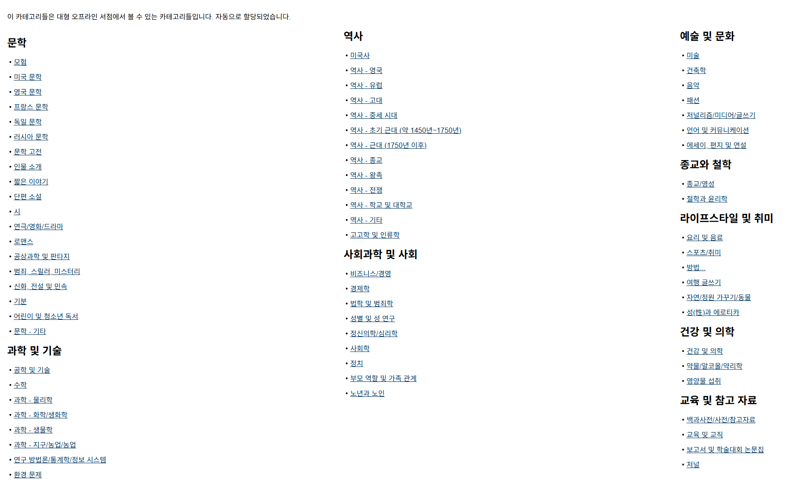
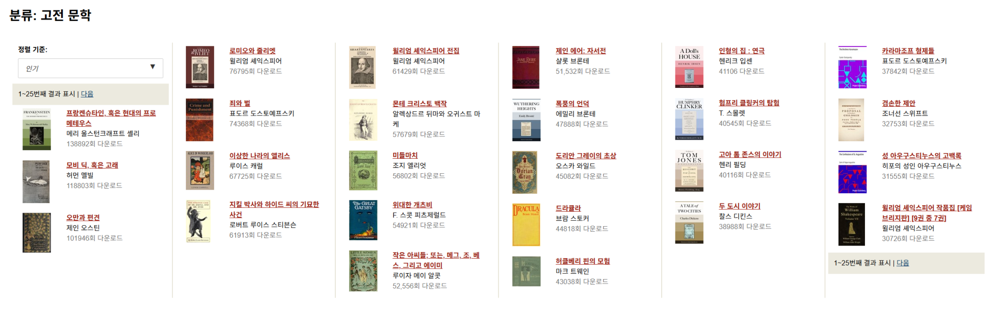
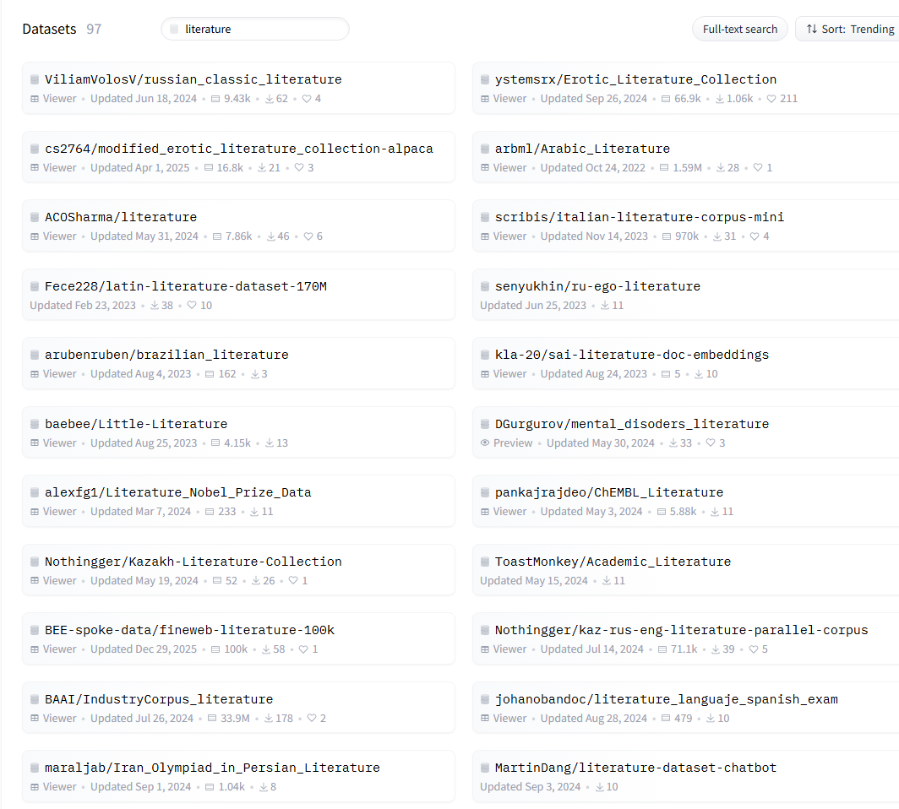
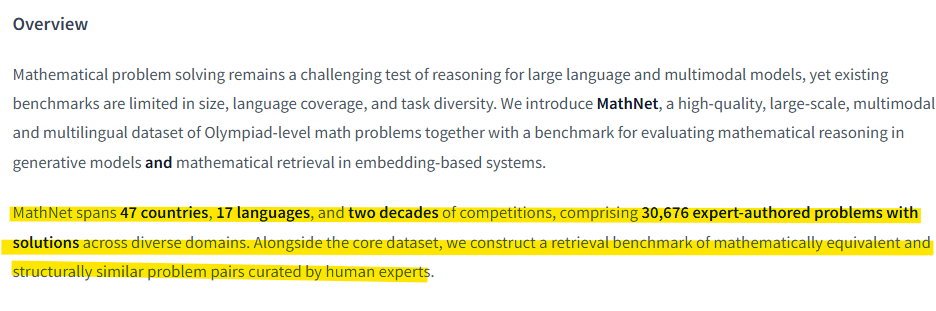

# 인구 감소와 미래 교육
**Date:** 2026. 4. 28. 1:13
**Category:** 다이어리
**Original URL:** https://blog.naver.com/xpfkwh56/224267385652
---

**1. 지금 태어나는 저출산 인구 애들은**

**나중에 어디서, 어떻게 경쟁하고 살까요?**

​

너무 복잡한 문제지만,

어차피 나라 망할 일은 없고

​

어느 때고, 각자 모든 세대들이

그 시대에 어려운 점이 있는 만큼

비슷하다는 것은 동일할 것 같음

​

**2. 사회부양 비용**

​

다만, 사회부양 비용이 지금보다

으마으마하게 올라간단 것은 아마

확정된 사실에 가깝지 않을까 싶음

​

지금은 통나무를 5-6명 정도가

같이 들고 있는데 시간이 지나면

​

이제 3명, 2명, 1명 심지어는

혼자서 통나무 2개, 3개 씩을

들어야 되는 시대도 공상은 아님

​

그래서 뭔들, **생산성** 이 좋아야 하고

​

**\* 덜 넣고, 더 뽑을 수 있는**

​

사회를 **잘 굴릴 수 있는** 능력이

있어야 살아가기 좋을 것 같은데

​

그 핵심에 있는 것이 **'인공지능'**

더 정확히는 **'도구 활용력'** 같음

​

3. 제가 이거 맨날 파는 약인데,

​

어린이 전집 한 세트 살 생각하면

최소 100 에 비싸면 천도 넘어감

**​**

**왜 why?**

​

글쓴 사람 띠어줘, 출판사 떼어줘,

마케팅비 들어가, 유통사 들어가,

​

원재료도 공짜가 아니니까 펄프 들어

잉크 들어, 먹어야 되는 입 너무 많음

​

부가가치가 높다, 생산성이 좋다,

효율이 좋다 라는 말은 다르지만

​

결국 셋 다 덜 넣고, 더 많이

무언가 뽑아낼 수 있다는 뜻임

​

<https://www.gutenberg.org/>

[**Project Gutenberg**

Project Gutenberg is a library of free eBooks.

www.gutenberg.org](https://www.gutenberg.org/)

​

그냥 구텐베르크 도서관 딸깍 하면

전자책으로 7만 5천권 **전부 공짜** 임

​

​

이게 뭐 대단히 어려운 것도 아니고,

​

크롬에서 자동번역 한글 켠 다음에

​

​

고전 문학 카테고리 들어가서,

​

프랑켄슈타인 딸깍 누르면

어디 뭐 보관할 공간도 필요 없고

그냥 아무나 맘대로 읽을 수 있음

​

**\* 어느 집에 책 7만권 달린**

**서재를 만들어줄 수 있을까요**

**​**

**도서관 평생 다녀도 다 못 읽음**

**​**

​

허깅페이스 들어가서, 데이터셋에

적당히 아무 검색어만 집어넣고 나면

​

뭐 별의 별 희한한 데이터셋이

여기저기 다 깔려있는데,

​

이거 받아다가 LLM 한테 먹이고

책 읽어줘 하면 바로 **독서 선생** 됨

​

​

사교육으로 비싼 것이 수학, 과학,

영어, 논술, 코딩 뭐 이런 것들인데

​

적어도 인공지능한테 저런 것들은

마치 **숨 쉬듯이** 아주 쉽다는 것이지요

​

그래서 서점 가서 책 사다가

냅다 권장도서 읽는 것 보다

​

이미지 생성 도구랑, LLM 바탕으로

번역 작업을 해본다든가, 삽화라도 넣고

본인이 동화책을 집필하게 한다든가

​

**\* PBL**

**​**

이러는 것이 더 **'미래적'** 이라 한 것임

​

**\* 학원을 간다 → 교육 서비스 소비**

**남을 가르친다** **→ 교육 서비스 생산**

**​**

4. 우리 시대는 신데렐라 딱 읽고,

오래오래 행복하게 지냈답니다

​

하면 와아아 하고 끝났는데,

지금 시대는 **그래서 뭐야 끝?**

​

그 뒤에 다른 이야기는 없어? 하면서

​

신데렐라와 왕자 엄마 간의 고부갈등

​

17, 19세기 프랑스 민담을 통해

유추한 여성 상속권에 대한 이해

​

신데렐라의 유리구두에 관한

재료 공학적 해석과 실용화 방안

​

**\* 굉장히 투명한데 잘 안 깨져?**

**그럼 템퍼링 과정을 어떻게 했지?**

**​**

같은 것들을 본인의 관심사 나

탐구 주제에 맞춰 할 수도 있는

시대로 접어들고 있다고 생각함

​

예전에야 신문이 유일했고,

읽을 거리가 없어서 가만히

​

집에 있으면 세상 돌아가는

소식을 하나도 알 수 없었지만

​

지금은 볼 것이 너무 많아서

뭘 봐야 될지도 헷갈릴 정도에

​

그조차 알고리즘이

큐레이션을 해줌

​

과거에 있던 공채 시대야,

워낙 사람이 많았으니

​

시험 하나 뚝딱 봐서 줄 세우고

적당한 사람 뽑아서 데려갔는데

​

면접관 보다 지원자가 더 많다면

사람 하나하나를 더 심층적으로

깊게 볼 기회가 생길 확률이 높고,

​

**'다른'** 기준이 적용될 것 같음

​

뭐 하나를 해도 **'제대로 하고'**,

**'진짜로'** 해야 될 것 같단 것 이죠