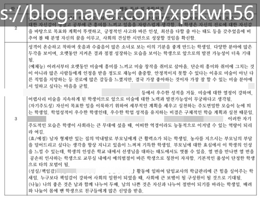
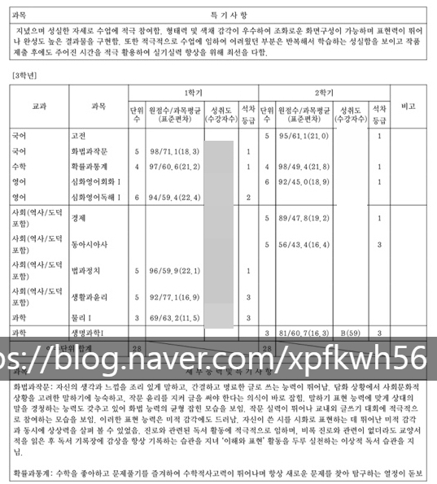
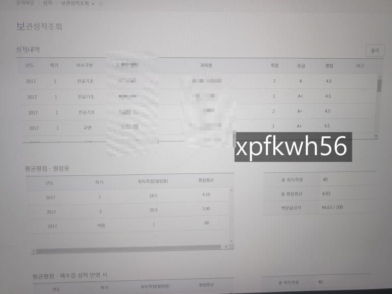

# 인생 모름2
**Date:** 2026. 4. 28. 8:43
**Category:** 다이어리
**Original URL:** https://blog.naver.com/xpfkwh56/224267568014
---

​

1. 살짝 어려운 가정환경에서

열-심히 공부해서 노-오력 해서

고스란히 승승장구 했으면

​

**열심히 하면 되던데?** 라고

생각하고 쭉 살았을 것 같음

​

2. 근데 가세 한 번 꺾여가지구,

​

**\* 내가 물론 서울대 의대 가고**

**이럴 정도를 해낸 것은 아니지만**

**​**

나름 내 딴에는 할 만큼 했는데

**노력해도 안되네?** 를 느끼니까

​

가치관에 변화가 좀 생겼었음

​

3. 여느 평범한 10대가 그렇듯,

​

학교에서 만나는 사람들이

넌 열심히 하니까 잘 될 것이다

​

라고 얘기해서,

그런가 보다 했는데

​

**이게 뭐람?**

**​**

나는 수능 끝나자마자

​

알바 요이땅 하고

돈 벌기 바빴는데,

​

대학 와보니까

​

과장 쪼끔 섞어서 샤넬을

안 들고 있는 애가 없었음

​

**\* 지금이야 신경도 안 쓰지만,**

**갓 스무살 눈에선 쉽지 않았음**

**​**

4. 쟤넨 쟤네고 나는 나지,

하고 학교는 학교대로 다니고

​

알바는 알바대로 하면서

학교생활 열심히 하는데

​

**\* 학업 + 노동 = 많이 빡쌤**

**​**

이거 아무리 봐도 내가

학교를 다닐 상황이 아님

​

(중략)

​

5. 살아야지, 하고 바둥바둥

열심히 살다 보니까

​

운도 따랐고, 적성도 맞았고

지금은 여유롭게 살고 있는데

​

나처럼 똑같이 산 사람이 있다면

​

당연히 나랑 비슷한 가치관

생길 수밖에 없다고 생각함

​

아마도? 20대 중에 빨갱이 마인드 있는

친구들은 저랑 비슷한 사람 꽤 많을 걸요

​

나야 운이 좋았으니

자수성가 소리 듣고 살지

​

마침 운이 없었거나

기회가 없던 사람은?