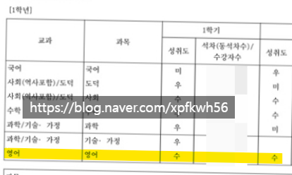
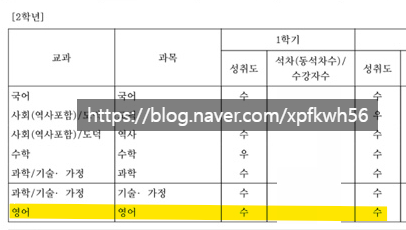
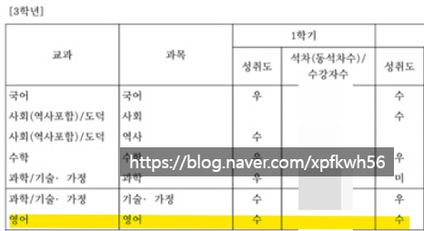
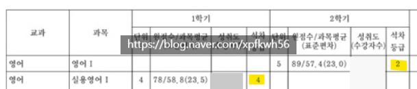
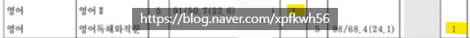
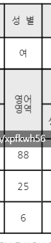
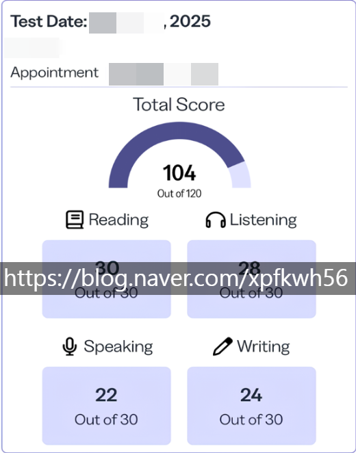

# 사람은 바뀔 수 있을까?
**Date:** 2026. 4. 29. 22:05
**Category:** 다이어리
**Original URL:** https://blog.naver.com/xpfkwh56/224269704971
---

1. 법무부에서 종이가 날아왔길래,

누가 고소를 했나? 하고 읽어봤더니

​

고등학생 여자아이를 강간 했다는

사람의 머그샷이 정갈하게 쓰여있었음

​

초범도 아니고, 재범이던데

왜 세상에 풀어놓게 된 것일까,

​

화학적 거세 같은 것도 있고,

​

교도소 지을 돈이 없으면

세금 그깟거 더 걷으면 안 되나

라는 생각까지 들기도 했음

​

​

인간을 혐오하지 않으려고 내 딴에는

나름대로 많이 노력하고 사는 편인데,

​

같은 하늘 아래에서 같은 공기를

마시고 있다는 것이 구역질 났음

​

2. 레미제라블은 빅토르 위고 라는

대문호가 쓴 소설로,

​

굶주린 조카들을 위해 빵 한 조각을 훔쳤다가

무려 20년 동안 감옥살이를 한 전과자임

​

출소 후, 사회에서 냉대를 받으며 떠돌던 그는

한 주교의 따뜻한 자비를 통해 개과천선 하고,

​

도시의 시장 자리까지 오르며 성공하지만

집요하게 그를 쫓는 경찰관 하나 때문에

​

평생을 자기 이름도 못 쓰고

도망자 신세로 살아가게 됨

​

신분을 숨기고 잘 살아가고 있었는데,

애 먼 사람 하나가 장발장으로 오인되어

재판을 받게 되는 상황에 놓이게 됨

​

침묵하면 평생을 점잖은 시장으로 살며

공동체에 헌신할 수 있다는 유혹이 있고,

​

다른 한 쪽에는 무고한 사람을 자기 대신

감옥에 보낼 수 있다는 양심이 대립함

​

마침내, 장발장은 법정으로 달려가

재판이 진행되는 중에 들어가서 외침

​

그는 무고하오!

​

존경받는 시장이 장발장 이라는 사실에

법정은 충격에 빠지고, 장발장은

오랜 시간 숨겨왔던 자기 정체를 밝힘

​

**3. 사람은 바뀔 수 있을까?**

​

내가 최근 하는 것 중 하나는,

해외 취업을 알선하는 일 임

​

종종 어른들은 문서에 글을 담는 것을

어색하게, 낯설게, 느끼기도 하고,

​

시스템이 요구하는 언어에 맞게끔

기재하는 것을 어려워할 때가 있음

​

우리가 가능한 **'깔끔한'** 외국인을

입국 시키고 싶은 것처럼, 타국 또한

​

특별히 문제를 일으키지 않는

성실한 동아시아 근로자를 원함

​

구술로 듣고, 내가 대필하는

행정 서류의 내용에는

찜찜한 질문이 하나 있는데

​

그건 **당신은 전과가 있습니까?** 임

​

사실 서류를 적는 시간 보다,

​

사람 하나 붙들고 내가 아는 한에서

이런 근거로 당신은 해당이 아니다

​

라는 것을 설명하는, 신뢰를 얻는

시간이 더 오래 걸리는 것 같은데,

​

듣고 있다 보면 쫌 헷갈릴 때가 있음

​

일단, 모든 분들이 다 그렇지는 않겠지만

내가 최근 일을 보며 알게 된 것 중 하나는

​

노가다 현장에 계신 분들 중, 비율적으로

**'사연'** 이 있는 팔자들이 제법 많았단 것임

​

내가 할 수 없는 범위는 자신이 없어서,

​

추천인 1명, 가정이 있고,

등초본 내역에 문제 없고,

​

자녀가 있고, 등 어찌 인생 잘 살아보겠다

라는 **'각'** 이 나오는 분들만 받았는데도,

​

단순 폭행, 심하면 상해 정도,

그 외 운전자 바꿔치기, 음주운전,

​

공무집행방해, 뭐 이런 것들이

심심치 않게 말로 나오고는 했음

​

​

애들이 있으면 대개 학령기 쯤이라

다 한참 전의 이야기임을 감안해도,

​

쨌든, 명확한 죄가 있긴 있는 것인데

​

**\* 내가 수사기록, 판결문 까지**

**싸그리 직접 본 것은 아니지만**

​

50대, 60대 연령에 있는 사람이

사람 팬 것이야 당연히 잘못된 일이나

​

20년, 30년도 더 된 이야기 가지고

**인간적 거부감** 이 들진 않았던 것 같음

​

아마 내 기준에서는,

​

갱생할 수 **있는 죄** 와

갱생할 수 **없는 죄** 라는

​

분명한 기준이 있는 듯함

​

4. 나는 사람을 평가하는 것에 대해

별로 자신이 없는 쪽에 가깝기 때문에

​

과거, 대부/채권 쪽 파트로 일을 했을 땐

애초에 대화 자체를 차단하기를 선호했으나

​

**\* 채무자랑 대화 깊게 하면, 내 한계가 옴**

**사기꾼/채무자 입에 나오는 말은 정말로**

**그 어떤 것 하나조차 믿으면 안 되기 때문**

**​**

**인적 네트워크 연결망을 내 경우는,**

**어느 정도 믿고 가는 경향이 있긴 한데**

**저 두 타입의 경우는 예외로 보고 있음**

​

지금 하는 일은 그런 영역에 있어서,

​

불가피하게 사람을 정성적인 요소에서

판단해야 되는 부분이 존재하는데

​

나는 신이 아니니, 실체도 알 수가 없고

여기서는 멀쩡했던 사람이 저 나라가선

​

술 먹고 사고를 치든, 난리를 치든,

그건 내가 보증할 수도 없는 일이긴 함

​

다만, 내 스스로의 양심에 비추어

51% 이상 확률로 문제가 없을 것 같고

​

문제가 생겨도 49% 보단 낮을 것 같으면

​

**그래 다 먹고 살자고 하는 건데**, 라고

마음을 먹는 것에 좀 더 가까운 것 같음

​

그럼에도 불구하고, **'믿을 수 있냐'** 고

묻는다면 **믿는 것은 아니다** 쪽에 가까움

​

근본적으로 나는 인간이 언제나

**유동적인 대상** 이라고 보기 때문임

​

그럼, 인간은 어디까지

어떻게 해야 바뀔 수 있을까

​

먼저 인간을 매 순간,

**재측정** 되어야 하는 존재로

둬야 된다고 생각함

​

​

5. 이건 내 중학교 성적표 임

1-3학년 내내, 성적이 좋았는데

​

​

고등학교 땐, 4등급 삐끗도 있었고

​

​

수능에서는 6등급 을 받음

​

자료만 보면, 평소에 잘 했는데

​

수능에 컨디션 난조로 조졌구나?

라고 해석하기 쉽지만,

​

당시 저는 그냥 엉덩이 붙이고

**외우기만 하면 장땡** 인 줄 알아서,

​

수능 문제를 딱히 풀 수도 없었음

​

**\* 시험 범위를 딱 정해주고,**

**이거에서 나온다 하면 잘 하는**

​

원문/해석 달달 외우고, 그대로

답지에 쓰는 것이 당시 내게는

영어의 전부 였었기 때문에

​

당연히 언어를 활용할 수도 없었고,

​

내가 하고 싶은 의사 표현을

영어로 한다는 것도

온전히 읽기도 불가능 했음

​

**\* in married life three is**

**company and two is none.**

**​**

**→ 이게 뭔 소리야? 와**

**이게 뭔 개소리야? 의 차이**

​

늘 답이 정해진 문제만 풀다가,

​

태어나 난생 처음 보는 문제들을

**'알아서'** 해야 되는 상황이 된 것은

직장을 다니고 창업을 했을 땐데,

​

정보가 필요하니 구글링을 했고

같은 정보도 영어로 찾으면 많았고,

​

무역을 하니, 영어를 안 할 수 없었고

당시 해외선물 트레이딩을 비롯해서

​

꾸준히 외국어가 필요한 상황이 되니,

영어를 나름 꼼지락꼼지락 하게 되었고

​

​

25년 무렵에는 토플 104점 정도

성적은 꽤 가뿐하게 낼 수 있었음

​

여기까지 걸린 시간이 **약 ~10년** 임

​

**\* 그 전에도 이미 쓸 일이 있으면**

**쓰고 다녔기 때문에 차이는 쫌 있음**

**​**

이러나 저러나 짧은 시간은 아녔음

​

지금에는 인공지능 관련 자료를

읽거나 그 외 활용하는 작업에 있어서,

​

적어도 언어적 불편은 별로 없음

​

중학교 때, 나한테 너 영어 함?

물어보면 잘 한다고 할 것이고,

​

고등학교 때, 나한테 같이 물으면

학교 성적은 나온다고 할 것이며,

​

수능 직후 무렵에 물어본다면

아마 못 한다고 대답을 할 것 같음

​

그 동일한 질문이 지금 주어지면

사는데 불편은 없는 정도다 쯤이

가장 적합한 자리 아닐까 싶음

​

6. 본질적으로 보면

사람의 **'변화'** 라는 것은

​

사람은 고쳐 쓰는 것이 아니다

사람은 바꿀 수 있다 정도의 선에서

단순하게 설명될 문제가 아닌 듯함

​

가장 좁은 범위 에서,

내가 변할 수 있냐 라고 하면

​

변할 수 있는 범위 내에 있다고 할 때,

포기하지 않는 선에서는 가능하다 고

​

남이 변할 수 있냐 라고 하면

​

그 변화를 수용할 수 있는 수준이냐,

아니냐 라는 문제로 귀결되는 것 같음