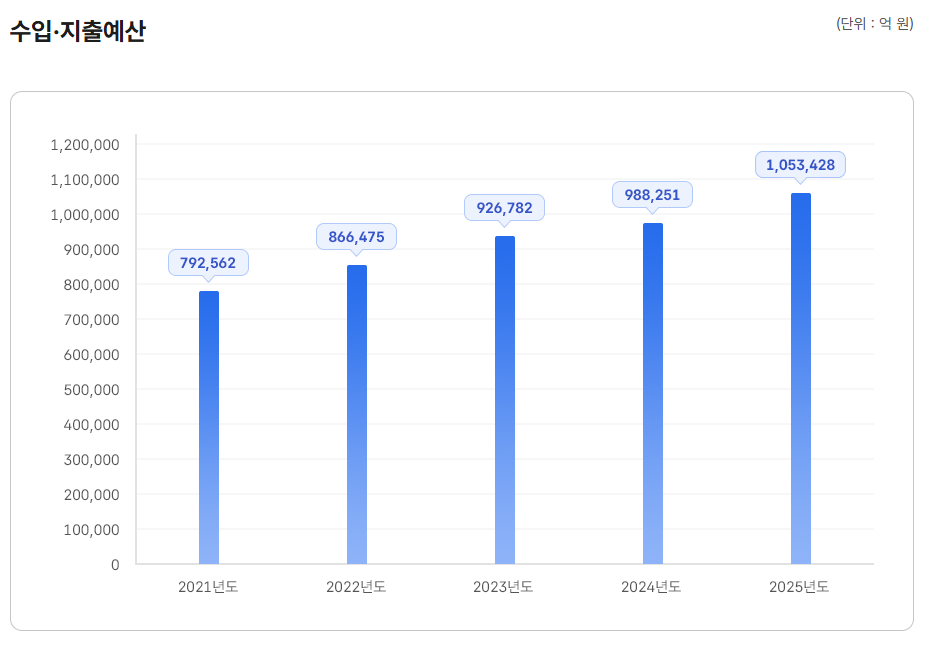

# 필수 의료 살리는 방법
**Date:** 2026. 4. 29. 19:43
**Category:** 다이어리
**Original URL:** https://blog.naver.com/xpfkwh56/224269579756
---

지금 건보료 안 내는 사람들 중에서,

​

숨 넘어가는 사람들 제외하고 지금보다

징수 범위 더 넓게 잡은 다음에

​

1인당 건보료 **5만원씩만**

더 부담하면 해결할 수 있음

​

​

당장 지금만 해도 딱 5만원만 더 올리면,

​

보건복지부, 통계청 기준으로 제일 최신 자료 찾아보면

직장 가입자가 약 2천만, 지역 가입자가 약 1천만 해서

총 3천만명 나오는데, 3천만 \* 5 \* 12 하면 1년에 약 17조

직장 사업자에서 고용주 부담분 12조 하면 **30조** 나옴

​

**1년에 30조씩 더 걷으면 어케 되는데요?**

​

그 돈으로 장난질 하지 않는다

라는 전제 하에 걍 **'다'** 할 수 있음 ;;

​

이국종 같은 사람이 1년에

한 트럭씩 쏟아져 나올 수도 있음

​

다만, 세종대왕 정도 인망 높은 사람이

집권하지 않는 한 저런 얘길 했다가는

​

평생 정치판에 발도 못 대게 되기 때문에

현실적으로 이루어질 가능성은 좀 희박함