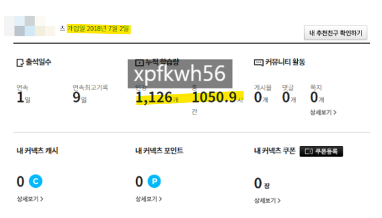
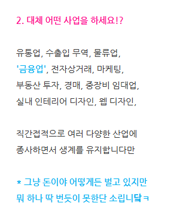

# 조언과 기준
**Date:** 2026. 4. 30. 4:15
**Category:** 다이어리
**Original URL:** https://blog.naver.com/xpfkwh56/224269924529
---

**1. 부동산 샀을 때, 내 생각**

​

공급절벽 + 인플레이션

+ 미래가치 + 어쩌고 (x)

​

갈아타기 생각도 없었고,

**걍 하나 있어야 된다** 였음

​

후술하겠지만 팔 생각도 없음 ,,

​

금고 현찰이나 아파트나 저한텐

겉만 다르지 속성이 아예 똑같음

​

**1) 서울로 선택한 이유**

​

문화 생활, 학군, 강남 인접 등등 (x)

​

도시 경쟁력이 집적도에서 나오는데

서울이랑 똑같은 수준으로 키우려면,

돈을 얼마나 들여야 그게 가능할까? (o)

​

지방 광역시만 해도, 사람 사는 것에는

솔직한 말로 **'하등'** 불편 대부분 없음

​

서울이면 대중교통이 조금 더 낫고,

경기권만 나가도 차가 있어야 된다

​

그 쯤인데, 부동산 베팅 고려할 정도면

차량의 유무 그 자체는 의미도 없을 것

​

도시를 형성하는 것도 결국 자본이면,

다른 곳에 똑같이 지어놨을 때 그 액수를

​

원가라고 볼 것이고, 그 차이의 가치값을

내가 지불할 비용이자 이익이라고 봤고,

​

그 계산 외에는 서울 외에는 선택지 없었음

​

만약 예산이 더 부족했어도 빌라를 샀지

그 외 지역은 고려하지 않았을 것임

​

**2) 결정한 이유**

​

저는 서울에서 월세만 전전하고 살았지,

어디 지역에 뭐가 어떻게를 잘 몰랐음

​

임장 한 두번 다닌다고 그 지역에 대한

라이프스타일 이해하는 것도 될까, 싶었고

**​**

**\* 5년치 재무제표 본다고 될 일이 아니고**

**결국 기업에 대한 트레킹을 해야 답 나옴**

​

내 예산 범주로 1차 스크리닝을 했음

​

당시 기준으론, 한강 벨트 기준 안에서

비선호 아파트 정도가 **'안정적으로'** 내가

​

이거는 다 망해도 나중에 박스만

줍고 다녀도 감당할 수 있겠다 싶은

금액 범주에 물건들이 나와 있었구,

​

단지만 간략하게 추린 다음에,

거기서부터 디테일 잡기 시작함

​

여기 살면 뭐가 좋고, 뭐가 안 좋겠다,

​

첫 매수인데 주변에 마땅하게

조언해 줄 사람이 없었기 때문에

​

저도 저 나름 알아보기도 하고,

주변에 물어물어 가면서 했었음

​

애초에 집을 사서, 거기에 내가 실제로

**'거주'** 하겠단 생각 자체가 없었기 때문에

​

**\* 저는 인터넷만 되는 동네면**

**어디든 살아도 상관 없습니다**

**​**

첫 계약인 만큼, 세입자 파트에 있어서

이런저런 많은 노오력을 했던 것 같음

​

**3) 결과**

​

오르든, 말든 신경도 잘 안 씀

대출 부담도 거의 없는 상태 임

​

**2. 주식/파생 했을 때, 내 생각**

​

계좌 갓 파고 주식을 처음에

깔짝깔짝 했었는데,

​

뭐가 뭔지 하나도 모르겠어서

첫 시작은 아주 간단하게 갔음

​

1) 내 상식에서 이거는 결국

회사를 인수하는 게임 인데,

​

1년에 장사해서 얼마를 남기냐?

그 회사가 얼마냐? 배당 얼마주냐?

앞으로도 사업 계속 할 수 있냐?

​

정도만 보고, 뇌피셜 벨류에이션으로

가격 추이 확인해서 샀다 팔았는데

​

**\* 첫 거래까지 시간은 길었음**

​

수익이 좋았고, 당시에 어느 정도

장사하던 것 시스템이 잡혀 있어서

​

시간적 여유가 있었기 때문에,

​

본업은 본업대로 하고,

매매는 매매대로 해도 되겠다

​

라고 판단이 들었구,

​

같은 돈으로 해선으로 가면

레버리지도 더 크고, 해선은 밤이니까

​

낮에는 장사하고, 밤에는 어차피

가끔 사업체 대응만 하면 되는 것

​

투트랙으로 해야겠다고 계획을 함

​

주식할 때, 했던 것이 가투소 라고

당연히 다 아는 그 카페가 있는데,

​

거기 있는 글을 1페이지부터

어지간한 것은 거의 다 봤음

​

**\* 계속 넘기면서 일단 보긴 다 봄**

​

쭉 읽다보면, 피차 커뮤니티에서 하는

말이라는 것이 별 차이가 없는 편인데

​

내 생각에는 이게 약간 **'무속적'** 이고,

**'미신적'** 이라는 생각이 드는 것이 많아

​

더 명료한 설명이 있음 좋겠단 생각했고,

​

당시에 구글 스콜라 같은 것 보면서

트레이딩이나, 가치 평가 방식들 찾고

​

**\* 구글 스콜라 = 무료**

**​**

실제 시장에서 구현했을 때, 어떤 식으로

반응이 나타났었는지 같은 것들을 봤었음

​

이 시기에 마켓 메이커 개념이랑,

메이저 입장에서 시장에 있는 팩터들을

어떻게 해석하는 것이 **'정석'** 이구나

​

같은 것들을 주로 익힐 수 있던 것 같음

​

<https://blog.naver.com/xpfkwh56/223043309560>

[**집 나간 제 아반떼가 돌아왔읍니다**

나스닥, 너의 패인은 내게 차트를 너무 오래 보여준 것이다. 『길』을 막지 마라, 이 녀석!

blog.naver.com](https://blog.naver.com/xpfkwh56/223043309560)

​

2) 당시 포스팅 내용이 남아있는데

오일을 시작하고 거의 금방 안 돼서,

​

2천만원 정도 손실로 시작을 했음

​

**\* 오일로 시작한 이유도 있긴 한데,**

**나중에 혹 기회가 된다면 써보겠음**

​

추세니, 역추세는 해보면 그렇지도 않고

그게 말도 안 되는 소리라고 생각하고

​

아주 간단히 말하면, 가격을 정한 다음

그 가격이 도달할 시간 마진을 어디까지,

​

그리고 로스컷 여유를 어디까지 볼 것이냐

라는 식으로 접근을 한 것이 **핵심** 인데,

​

**\* 처음부터 주식을 선물처럼 했고,**

**선물을 옵션처럼 접근하고 있던 셈**

**​**

가물가물 하지만, 실시간으로

알아야 될 정보들이 **너무 많았음**

​

요즘도 그런 줄은 모르겠는데,

​

내가 매매를 했을 적에는 개인 기준

베이시스 기반으로 차트를 해석해서

전체 추이를 최대한 파악/짐작 하고

​

참 추상적인 말이지만, 전체적으로

어떤 흐름이다 를 아는 것이 중요했는데

​

이게 데일리 트레이딩에서는

별로 쓸모가 없었고, 유동성 시기

그러니까 메이저 창구들이

​

거래를 하는 시간, 이벤트,

페어 지표들이 더 유의미 했음

​

주식은 하나의 기업을 오-래 보고,

그거부터 쌓아가면 되는 반면에

​

원자재는 하루의 흐름을 오-래보고,

시세를 잡는 것이 중요한 것 같았고

​

그 시점부터는 **꾸준히** 계속 좋았음

​

<https://blog.naver.com/xpfkwh56/223148158378>

[**해외선물 3개월 단위 승률 레코드**

승률, 손익비 이 정도 나오면 해선으로 돈 꽤 벌 수 있는 듯요 따로 알아본 바에 따르면 워뇨띠가 승률 80%...

blog.naver.com](https://blog.naver.com/xpfkwh56/223148158378)

​

3개월 레코드 보시면,

데이 트레이더 인데도

​

매매 횟수가 **'그리'** 많지는 않고

승률도 계속 견조하게 유지 했었음

​

무슨 워뇨띠급 괴물은 아니었지만

65~70% 제 손익비로 계속 매매하고

그걸 유지만 해도 생계는 지장 없었음

​

**3) 도메인**

​

이게 왜 그랬나, 곰곰2 생각을 해보면

​

저는 해선을 하기 전부터 이미

유통업에 종사하면서 물건을 팔고,

사고, 소싱하고, 벨류에이션 하고

​

차트랑, 프로그램이 없었을 뿐이지

거래하고 매매하는 일을 **계속** 했었음

​

그리고 상황적인 요인 부분도 있었는데,

​

이미 매일매일 현금이 따박따박

꽂히고 있던 상태 였기 때문에

​

제가 어디서 대출을 받느니,

남의 돈을 구해다 밀어넣느니,

​

들고 있던 돈을 다 가져다가

시장에 넣고 헐어먹는 일만 아녔으면

제 인생에 기스 생길 일이 없었음

​

이 돈을 잃으면 좋된다 (x)

멈출 수 있을 때 멈추면 된다 (o)

​

당장 저 2천 이라는 금액만 해두,

​

물론 매일 그렇지는 않았지만

장사 좀 잘 되는 날이면 어떻게

하루 만에 몇백, 몇천이 벌렸는데

​

1일 수익, 3일 수익 날아갔네,

정도로만 여겨졌을 뿐 큰일 났다

​

내 본전 찾아와야 된다

이렇게 생각하진 않았음

**​**

**\* 매매 빠따가 커지면서 하루에**

**몇 천, 최대는 1억까지 왔다갔다**

**했을 때는 마음 고생도 많이 했음**

​

**3. 사업 했을 때, 내 생각**

​

블로그에 많이 적었었는데,

​

저는 창업을 하고 싶어서,

또는 하려고 한 사람이 아님

​

직장에서 일을 열심히 했던 이유는

보릿고개가 생기면 월세부터 해서

생활이 다 붕괴 되었기 때문이었고,

​

당시에 다니던 회사에서 대표님이

기회를 주셨을 때두, 그거를 나름

​

열심히 하려고 했던 이유는

이 사장이 돈을 벌어야 나를

안 짜르고 계속 고용을 한다

​

라고 생각을 했었기 때문임

​

**\* 당연히 내가 벌 수 있는 돈**

**= 이 사람이 벌고 남은 돈 이니**

​

일부 **관성적인** 요인도 있었는데,

​

제가 취직하기 전,

​

사이비 종교 생활에

한동안 빠져 있었는데

​

나름 거기서 열심히 뭐 해보겠다고

**해버릇 하던** 영향도 있었을 것 같긴 함

​

**\* 그렇다고 가시진 마시고**

​

지금에 돌아보면 으지간히 종교에

돌았다는 사람도 성경 통독 하는 일이

1회 있긴 있을까 싶다고 생각 하는데

​

신천지에는 비유풀이 라고 해가지고,

시험도 보고, 큐티를**빡쌔개** 하는 편임

​

하도 오래되서 가물가물 하지만,

​

어지간한 **'은어'** 는

여전히 다 기억하고 있고,

​

성경 구절도 어디 스위치 누르듯이

문장 딱 던져지면 어디에 뭐다 쯤이

지금도 나올 정도로 많이 읽고 외웠음

​

거긴 구역장 이라는 직위가 있는데,

세상 말로는 사회복지 인턴 같은 것임

​

사람들 힐링 상담부터 시작해가지고,

짬나면 노상 봉사활동 다니고,

​

끼리끼리 모여가지고 독거노인들,

혼자 사는 심심한 사람들 말동무 등

​

일정 빽빽하게 보내면서도

돈을 벌긴 커녕, 쓰기 바빴는데

​

**\* 제가 나름 진짜 깊이 아는데**

**부당한 헌금 이런 문제가 아니고**

**실제는 빈번한 경조사가 재앙 임**

**​**

**사람이 많으니까 이거 뭐 하루 건너**

**누구 생일, 결혼, 환영회**

**이게 굉장히 큰 압박이 됩니다**

​

직장은 그거보다는

돈을 **훨씬** 많이 주고,

​

열심히 하니까 인정도 받고,

대표님이 성격이 좋으셨어서

​

일을 하는 것이 그리 어렵진 않았음

​

잘한다, 잘한다 하다가

이거도 해봐라 저거도 해봐라

​

하다가 어어 하다보니까,

창업을 하게 되었기 때문에

​

그런 기회가 없었더라면

그냥 직장 멀쩡히 계속 다니면서

거기서 열심히 살았을 것 같음

​

​

**\* 취직하고 직장은 직장대로 다녔고**

**혹시 잘 안 풀리면 공무원 하려고**

**시간 나면 그거도 준비하고 있었음**

**​**

**창업하고 자리 잡은 다음부터는**

**교양으로 넘어 취미 삼아서 했었고**

​

장사야 어디 대기업 굴리는 것

아닌 이상에야, 사장이 열심히 하면

​

기본적으로 밖에 나가서 월급 받는

그만치는 대개 다 할 수 있는 일이고

​

제가 돈을 좀 크게 벌었을 시점은,

​

사이즈 있는 회사를 원래 시세보다

더 저렴하게 구입할 기회가 생겼어서

​

**\* 당시 저한테는 인생 베팅이었고**

**정말 정말 많이 따져서 봤었으니,**

**비슷한 제안이 들어올 때 덥썩은 X**

​

이걸 인수하면서 부터 라고 봐야 됨

​

네트워크 + 인프라 폭이

폭발적으로 늘어 나면서

​

**무슨 일을 할까?** 가 아니라,

​

그냥 주어진 일을 빨리, 효율적으로,

잘 쳐내는 것이 중요한 상태였고

​

**\* 뭐 좀 하고 있다보면, 이거 좋다**

**주변에서 말도 나오고, 저거 괜찮다**

**라고 제가 생각이 드는 것들도 있고**

**​**

요즘은 경기가 최소한 당시

시절보단 안 좋은 것 같은데,

​

제가 기억하는 코로나 유동성 시기에는

사람들이 돈을 **'아주아주'** 잘 쓰고 다녔음

​

뭐 벌이 괜찮은 것 없나, 뽈뽈 거리면서

찾아다녔던 시절도 제게 당연히 있고,

​

<https://blog.naver.com/xpfkwh56/223100551211>

​

**장사는 현금흐름 바로바로 발생하는 것**

**그리고 보통 중장년들이 하는**

**어떻게 보면 지루한 비즈니스들** 이,

​

저랑은 사대가 잘 맞았어서

비교적 잘 할 수 있었던 것 같음

​

**4. 블로그 했을 때, 내 생각**

​

처음에는 공부하던 것 정리하고,

게임 같은 것 공략 올리고 했는데

​

저도 다른 또래들이 그런 것처럼

​

당시에는 막연하게 그냥 집을

사야겠다는 생각을 하고 지냈고,

​

벤봉장님 블로그 한참 구독하다

댓글로만 쓰기에는 내용도 많고,

​

나도 해봐야지 했던 것이 시작 임

​

예나, 지금이나 글이야 계속 썼고

​

초기에는 애드포스트 도 해보고

이런 것도 되는구나, 저런 것도

되는구나 하면서 꽤 좋게 여겼는데,

​

여러가지 일들을 관찰하고 또

경우에 따라서는 겪기도 하면서

**​**

**아, 이게 내 생각과 좀 다르구나**

를 느끼고, 블로그 톤이 생긴 듯함

​

진짜 솔직한 마음으로는 ,,

트래픽/인지도 의미가 있나 ,,

​

라는 생각도 없지는 않습니다

​

글만 해도 한참 전부터

다 검색 비공개로 쓰고 있고

​

약간 **'이 바닥'** 을 알겠다 라는

생각이 들었을 때부턴 통계도 안 봄

​

매일 쓰고 싶거나, 생각나는 글을

그냥 쓰고 싶을 때, 생각날 때,

쓰고 정리하면서 지내고 있지요

​

애기가 아직 덜 예민한 덕도 보고 있고요

​

**5. 결론**

**​**

1) 많이 했다

2) 점들이 선으로 연결되었다

3) 운이 좋았다

​

그래서 내가 일반적인 기준에서

보편성을 갖는 조언을 할 수 있을까

라는 생각을 자주 갖기도 함니다

​

창업만 해도, 엑싯하고 손 놓은지 한참

연애는 결혼 했으니 미혼 얘긴 남 일이고,

​

매매만 해도, 파생으로는 올려치기

살짝 해서 10억 벌고 가끔 생각날 때,

뉴스 모니터링 정도나 하는 수준에

​

어떻게 제로에서 했었는지는 저도

간사한 인간이라 가물가물 헙니다

​

뭘 쌓아야 되냐, 하면 보이는 것이든

떠올리는 것이든 다 해야 된다 정도가

그나마 해줄 수 있는 조언 쯤 이지요

**​**

**\* 진짜 많이 알아야 되니까**

​

근래 가장 제 스스로가 엣지에

가깝게 있다고 생각하는 분야라면

**잉공지능** 이랑 **육아** 정도 인데,

​

전자는 로컬 AI 를 하고 있고,

​

**\* 그나마도 ComfyUI 기반**

**이미지, 영상 작업이 주 되니까**

**​**

**가뜩이나 넓고 빠른 이 장르에서**

**LLM 같은 쪽은 도움도 잘 안 됨**

​

후자는 제 고집이 잔뜩 들어가 있어,

**쟤는 저렇게 하는구나** 정도 쯤일 것임