# 기적과 해석
**Date:** 2026. 5. 1. 6:52
**Category:** 다이어리
**Original URL:** https://blog.naver.com/xpfkwh56/224271217416
---

1. 서구 문명을 이해할 수 있는

커다란 두 개의 축이 있는데,

​

하나가 그리스 로마 신화고,

남은 하나가 기독교 문화 임

​

[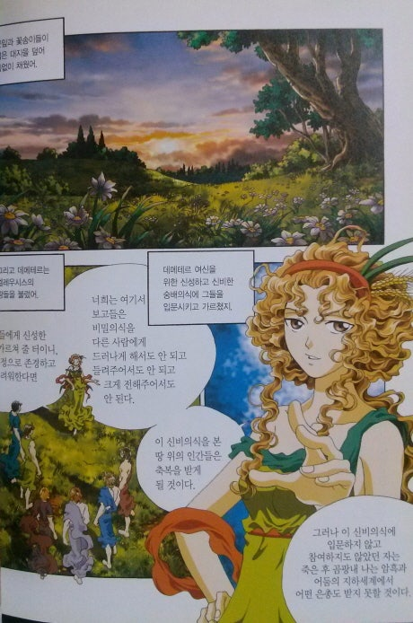](#)

​

2. 그리스 로마 신화를 보면,

**데메테르** 라는 여신이 나옴

​

곡식과 풍요의 여신,

데메테르 신전 근처에는

​

여신의 가호로 지켜지는

신성한 숲이 있었다고 함

​

그 숲에는 다른 나무들보다

유독 더 특별한 나무가 있었는데

​

데메테르 여신은 그 나무를

끔찍할 정도로 사랑 했다고 함

​

사람들이 공물을 바치고,

​

많은 요정들의 쉼터로 쓰이던

소중한 나무를 보고, 어느 날인가

​

**에리식톤** 이라는 오만한 사람이

나타나 그 나무를 베려고 했음

​

그는 불경한 자로, 신들을 경멸하였으며

원하는 바는 뭐든 이뤄야 하는 인간이었음

**​**

**여신이 총애하는 나무라도 상관없다**

**이 신목을 베어, 집을 만들 것이다**

​

하인들은 나무를 베어,

신의 미움을 받을까 걱정했지만

​

에리식톤은 그들을 매질하며

당장 나무를 베라고 재촉함

​

회유하고, 벌을 내려도 하인들이

그 나무를 베어내지 않자

​

에리식톤은 직접 도끼를 들고

나무를 향해 크게 휘둘렀음

​

**그러자, 나무가 새빨간 피를 흘리며**

**엄중한 응벌을 내리겠다고 저주함**

​

보고 있던 사람들은 공포에 떨었지만,

에리식톤은 전혀 개의치 않아 했음

​

마침내 나무를 쓰러뜨리고, 그는

하인들에게 나무를 옮기라 명령하고

의기양양하게 자신의 집으로 돌아감

​

데메테르는 에리식톤의 부덕에 크게 분노하여,

평생 그 욕망을 채울 수 없게 만들겠다고 했음

​

이튿날, 아침 에리식톤은 이제껏

단 한 번도 겪어본 배고픔을 느꼈음

​

온 재산을 팔아 음식을 구입했음에도

허기는 그치지 않았고,

​

재산을 전부 처분한 후에도

배고픔을 달랠 수 없던 에리식톤은

​

마침내 자신의 딸을 팔아, 음식을 샀음

​

만약 배고픔만 달랠 수 있으면

딸을 1번 팔든, 2번 팔든 그거는

더 이상 신경 쓸 일이 아니었음

​

에리식톤의 딸, 메스트라가

잔업으로 퇴근이 늦어지던 사이에

​

굶주림에 고통받던 에리식톤은

자기 몸을 먹어치우기 시작함

​

손과 발부터 시작하여

전신을 스스로 뜯어먹던 그는

​

치아만 남아서도 딱딱 거리며

씹을 것을 갈구했다고 전해짐

​

3. 사람이 몸을 계속 뜯어먹으면서

마침내 이빨만 남는 것이 가능할까?

​

**불가능** 함

​

그럼 피를 흘리는 나무는 **진짜** 일까?

​

[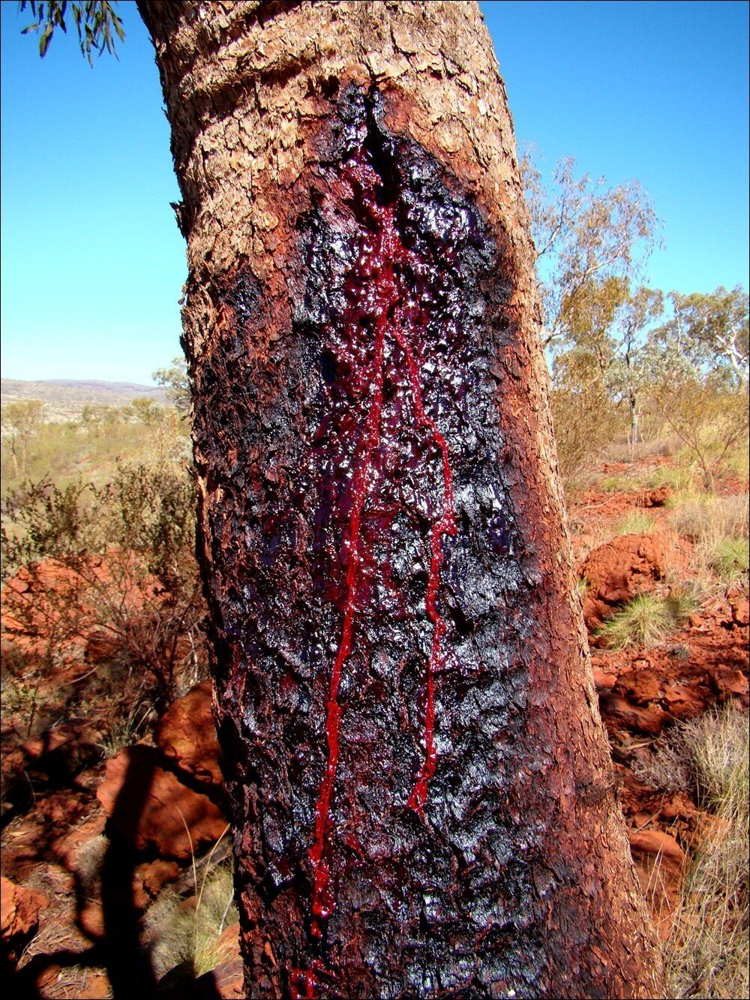](#)

[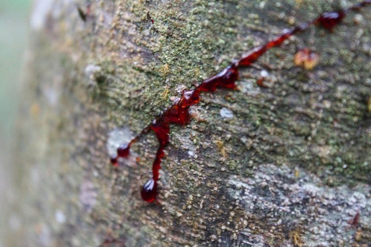](#)

[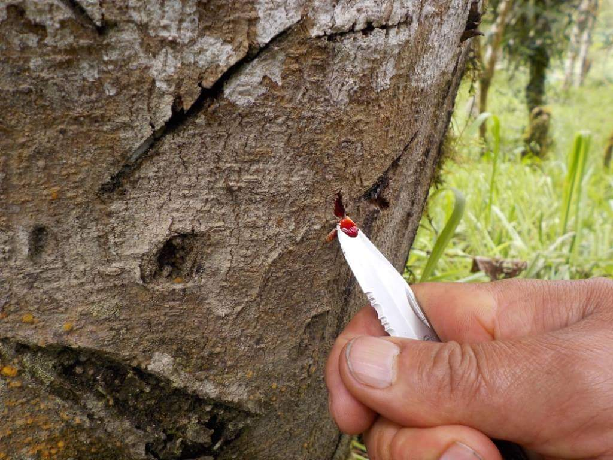](#)

​

**진짜** 임

​

[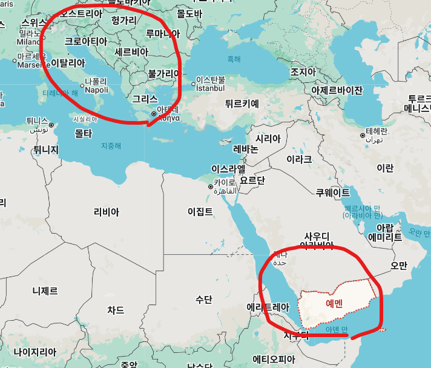](#)

​

예멘 령의 소코트라섬에서 자라는

용혈수 라는 식물로, 큰 수종은

높이가 25m 를 넘고, 줄기의 지름이 5m

​

수명도 길고, 그 나무가 흘리는

수액을 **용혈** 이라고 부르는데,

​

소독 및 지혈 등의 치료 효과가 있어,

​

고대에는 진귀한 약재,

화장품/유약 재료 등으로

사용되었다고 알려짐

​

피를 흘리는 신성한 나무가 있다,

라는 말을 들으면 **눼눼 그러시겠죠**

​

라고 반응할 가능성이 높지만,

​

직접 그걸 본다면 하물며 현대인도

**'헷갈릴'** 정도인데 지중해 문명을 살던

고대인 입장에서는 식겁 했을 것임

​

4. **'나무'** 를 베면 안 된다는 경고는

동서고금을 막론하고 자주 나타남

​

그럼 세상 많고 많은 것들 중에서

왜 **하필** 나무를 베지 말라 했을까?

​

[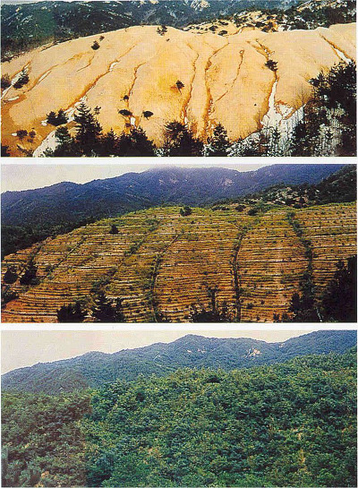](#)

​

과학과 기술이 발달하기 전,

​

나무는 연료, 건축 등

**효율적인 자원** 임과 동시에

​

산사태를 막아주고, 나무 자체로

자연의 **생태계를 지켜주곤 했음**

​

급하다고 나무를 다 베어버리면

당장 문제는 해결할 수 있지만,

​

장기적으로 더 큰 손해가 생기고

**정주민들에게는** 더 그랬을 것임

​

[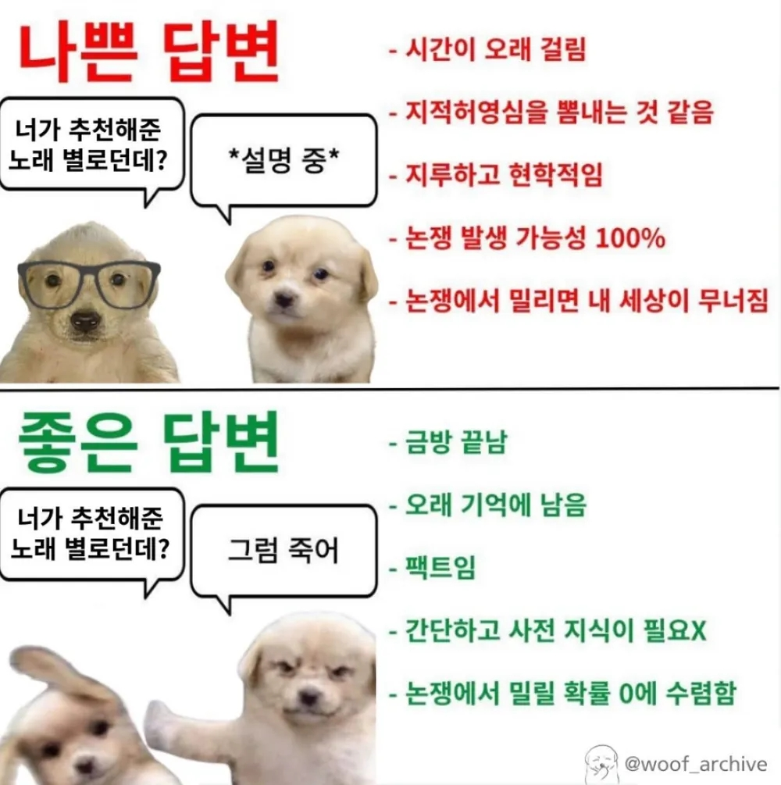](#)

​

**'신화적'** 금기로 설명하던 규범은

현대에 이르러 법률화 되었고,

​

현재 나무를 베는 행위는

산림 보호법 등으로 처벌받음

​

**\* 5년 이하의 징역 또는**

**5천만원 이하의 벌금**

**​**

[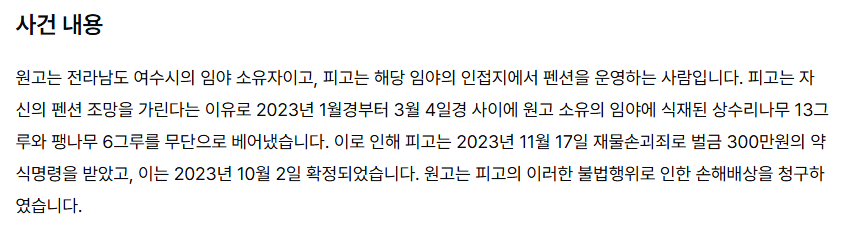](#)

[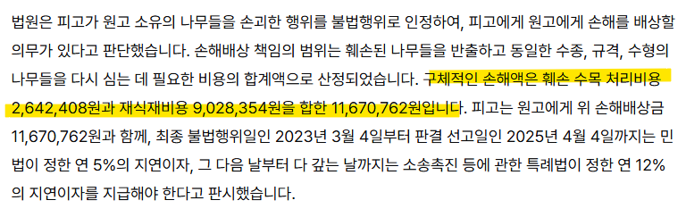](#)

​

뿐만 아니라 상황에 따라서는

이런 일이 생길 수도 있음

​

**\* 상품 가치가 높은 수목의 경우,**

**나무 하나에 몇 천만원, 몇 억도 됨**

**​**

5. 요한복음 의 집필시기는

**1세기 말**로 추정하는데,

**​**

디오니소스가 문헌상,

처음으로 나타나는 시기가

**기원전 13세기 경** 무렵이고,

​

안드로스 섬 디오니소스 신전에서

제공하던 액티비티 중 하나는,

**​**

샘물에서 나오는 **'포도주'** 를

신도들에게 제공하는 거였음

**​**

**샘물** 에서 **포도주**가 나온다?**​**

**​**

​

스페인 안달루시아에는

**리오 틴트**라는 강이 있는데,

​

이 강에 있는 물은 철분과

철산화 박테리아의

화학 작용으로 강물 전체가

진한 핏빛 적포도주 색깔을 띠고 있음

​

안드로스섬은 고대로부터 철광이

유명한 지역이었고, 철분 뿐 아니라

망간도 풍부한 지질을 갖고 있으므로

​

포도주 기적이, 디오니소스 에서

차용한 Fork 라고 대범히 가정하면

​

납득 가능한 설명이

나올 수도 있을 것임**​**

**​**

[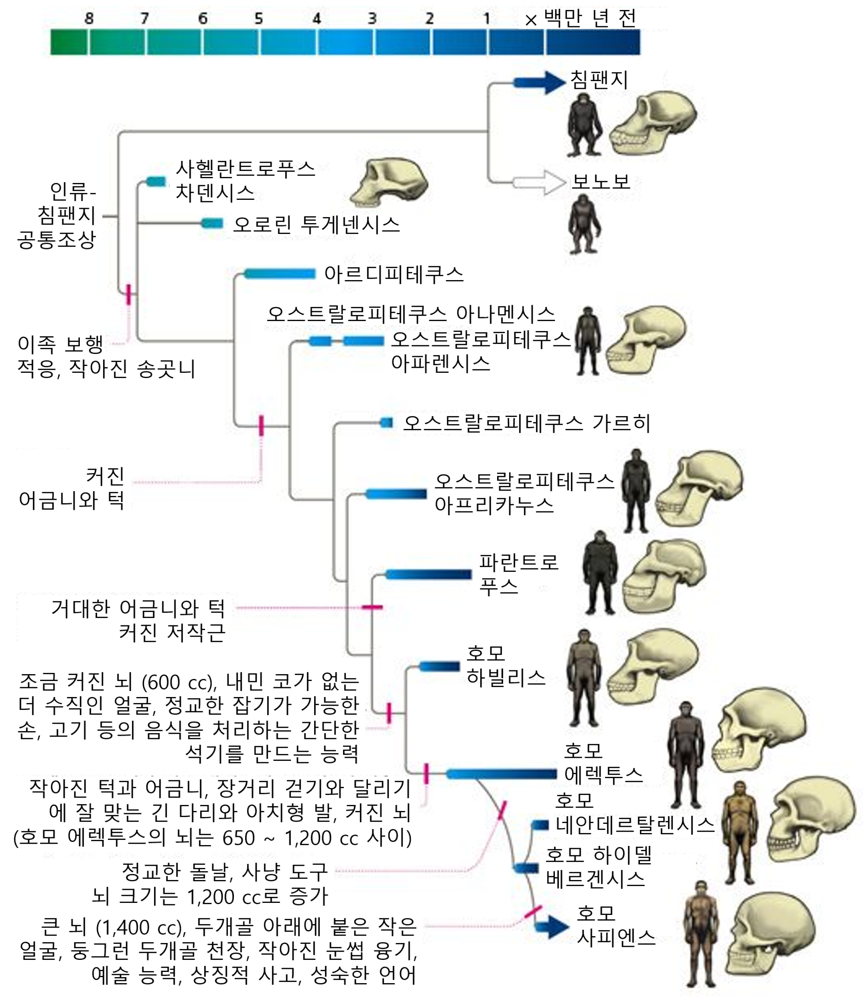](#)

https://horizon.kias.re.kr/28343/

**​**

6. 인류의 역사를 약

600만년 정도로 잡는데,

​

인간이 지구에 도래한 이래로

우리는 다양한 **기적** 을 목도함

​

​

나병 환자에게 기적을

선사할 수 있게 되었고,

​

​

열병으로 누워있던 자를

일으킬 수 있게 되었고,

​

​

귀신들린 이를

고칠 수 있게 되었고,

​

[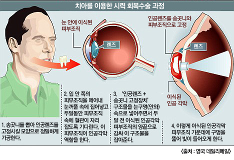](#)

​

눈이 보이지 않는 자를,

눈 뜨게 할 수 있게 되었고

​

[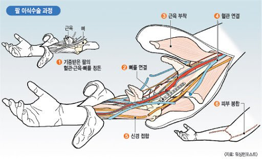](#)

​

팔이 없는 자에게

팔도 달아줄 수 있고,

​

[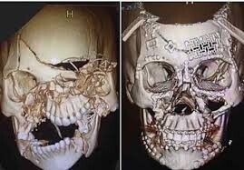](#)

​

얼굴이 박살 나도,

다시 맞춰줄 수 있고

​

[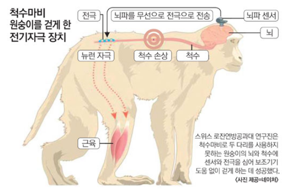](#)

​

뇌에 전기자극 장치를 달아,

​

[](#)

삼중통합 뇌/척추 인터페이스 기술 - 자푸민 상하이 푸단대 교수팀

​

걸을 수 없는 이를 걷게 하고,

다리를 움직일 수 있게도 했음

​

[](#)

딥씨 챌린지

​

바다로는 심해를 탐사하고,

​

​

하늘을 날고,

​

[](#)

이걸 대체 어케했누?

​

우주를 갔다가 **'되돌아'** 오는

미친 기술까지 되는 상태인데,

​

그럼에도 차마 열리지 않아

**신의 영역** 으로 남긴 부분을

도전 하려는 사람들이 있음

​

바로 그 영역 중 하나가,

**'불확실한 미래를 예측하는 것'** 임

​

7. 인간이 갖고 있는

고등 능력 중 하나는

​

**일반화 능력** 과 **추상화 능력** 임

​

일반화는 특정 사례들로

공통되는 속성들을 뽑아,

​

**단순화** 하는 것이고

​

추상화는 복잡한 현상과

단순화 하여, 중요한 개념이나

기능만을 **남기는 것** 을 말함

​

일반화는 부분을 통해, 전체에 통용되는

원리를 도출하는 것에 주로 사용되며,

​

추상화는 시스템 안에서 부수적이고,

불필요한 것을 제거하여 마침내

가장 본질적인 것을 추출할 때 씀

​

흔히, 본질/통찰 같은 어휘를 쓸 때

대개 **같은 범주로** 묶어질 때가 많고

​

[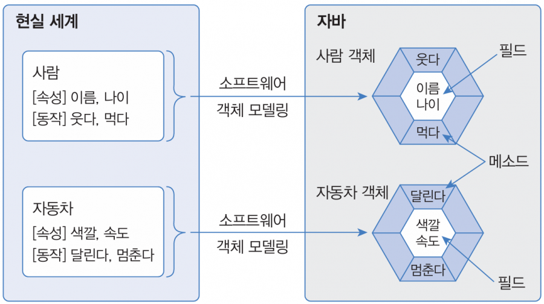](#)

​

**객체 지향 프로그래밍** 의

핵심 개념 중 하나기도 함

​

신화와 기적은 아마도

현상과 경험 대한 일반화 이자

추상화 라고 봐도 될 듯함

​

[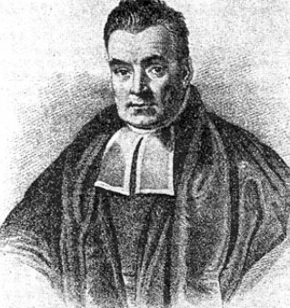](#)

​

8. 18세기, 토머스 베이즈는

영국 장로교 목사이자

아마추어 수학자였음

​

뉴턴이 자연과학적 방법론으로

물리학을 썼던 것과 마찬가지로,

​

데이비드 흄은 실험적 추론을 통해

도덕적 주제를 설명하고 싶어 했는데

​

​

회의주의자이자, 경험론자였던 흄은

**기적을 목격했다는 증언으로부터**

**기적의 실재를 추론할 수 없다고** 주장함

​

심히 불경한 주장이었지만,

베이즈는 흄의 논증을 보면서

​

**관측된 결과로부터 그 원인을**

**확률적으로 추론하는 방법을**

**숫자를 써서 정립할 수 있을까?**

​

라는 **아이디어** 를 갖게 됨

​

베이즈가 직접 연구를 발표하지 않았지만,

​

비슷한 시기, 프랑스 수학자 라플라스가

독립적으로 같은 원리에 호기심을 갖고

**베이즈 추론** 이라는 **표준** 도구가 생기게 됨

​

> 베이즈 추론

​

라플라스는 다음과 같이 추상화 했음

​

어떤 사건이 과거에 n번 연속 발생했을 때,

다음 번에도 똑같은 사건이 나타날 확률은?

​

즉, 우리는 **'해가 매일 들 진짜 확률'** 을 모름

​

이 때, 이 미지의 확률을 변수 p 로 두고,

p 를 0 과 1 사이의 어떤 값으로만 존재한다고

상정하면 **'결과값'** 을 구해낼 수 있단 것임

​

라플라스는 인류의 역사를 5천년으로 잡았고,

P(다음에도 일어남 l n번 연속 일어남)

= n+1/n+2 라는 식에 따라, 여태까지

​

1,825,000 일 동안 계속 해가 떴으니까

P 값은 1825001/1825002 ≈ 0.9999...

​

라는 식이 나올 수 있다고 계산을 해냈음

​

**'매우 그럴듯'** 하지만,

이 방식은 문제가 많았음

​

9. 매력적인 남자와 결혼할 확률을

라플라스가 제안한 것처럼 계산하면,

​

내가 만나는 남자가 결혼하기 좋은

남자일 **'진짜'** 확률을 모르기 때문에,

​

무차별 원리를 적용해서 0%부터

100%까지 어느 비율이든

동등하게 가능하다고 출발해야 됨

​

어떤 여자가 지금까지

만난 남자가 20명이고,

​

그 중 에서 결혼해도 괜찮겠다 라고

판단한 사람이 2명이었다고 가정함

​

P(D l p) = 1x2행렬(n k)p^k(1-p)^n-k

= (20 2)p^2(1-p)^18

​

균등 사전분포에 이항분포를 곱하면,

사후 분포는 베타 분포가 되므로 Beta(3, 19)

이 분포의 평균은 about 0.136 나옴

​

결론만 보면, **약 13.6% 쯤** 이에요

​

**'수학적으로 도출한 겁니다'**

라고 말이야 할 수 있겠지만,

​

아무도 만난 적 없는 사람이면

결과가 어떨까? 1/2 = 50%

​

5명 만났는데 다 별로면 14.3%

10명 중 1명이 괜찮았으면 16.7%

100명 중 10명이 좋았으면 10.8%

​

**???**

​

데이터가 적으면 결국

사전분포값 50%에 끌려가고,

​

데이터가 많아질수록

사전분포 데이터를 압도하므로

​

실상 **'계산을 하지 않아도 알 수 있으며'**,

심지어 **'찍는 것'** 과 별 차이가 없어짐

​

[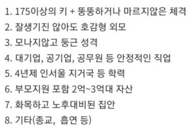](#)

​

잘생기진 않아도 호감형 외모인 남자가

모나지 않고 둥근 성격일 확률은 어떨까?

​

4년제 인서울, 지거국 학력을 가진 사람이

사회적으로 안정적인 직업을 가질 확률은?

​

부모가 2-3억대 자산을 지원해줄 수 있는

집이 화목하고, 노후 대비된 집안인 쪽은?

​

시행이 독립도 아닐 수 있으며,

​

20대 초반에 만난 연애와

30대 초반에 만난 연애가

​

같다는 보장이 없으므로

시행이 동질하지도 않고

​

**'결혼감을 찾겠다'** 라는 것이

이항 변수조차 아님

​

10. 학술적으로 **'토이 프로젝트'** 취급 쯤,

받고 있던 베이지 추론은 그럼에도 불구하고

​

**'사장'** 당하기 보다는, 여전히

**'실전'** 에서 사용되고 있었는데,

​

논리적 헐거움이 있다고는 인정하나

**그거라도 없으면 뭘 봐야 됨?** 이라는

매우 명확한 유인이 있었기 때문 임

​

현실 문제는 정확한 진리가 아니라,

​

**'최소한'**, **'거의'** 써먹을 수만 있을 쯤의

품질만 갖고도 굴러갈 때가 많은 편이고

​

더 좋고, 나쁘고를 규정할 수 없을 때는

**'있고, 없고'** 가 더 영향을 미칠 수도 있음

​

한편 베이즈의 이론이 학계에서 묻혔던

가장 큰 실용적인 이유는 접근법이 아닌,

​

**'당대 기술로는 풀 수 없던 문제'** 라서 임

​

추론의 핵심인, 사후 확률을 구하려면

분모에 있는 적분값을 계산해야 되는데

​

차원이 1차원만 커져도 인간의 손가락과

머리로는 해석적으로 해답을 낼 수 없었음

​

[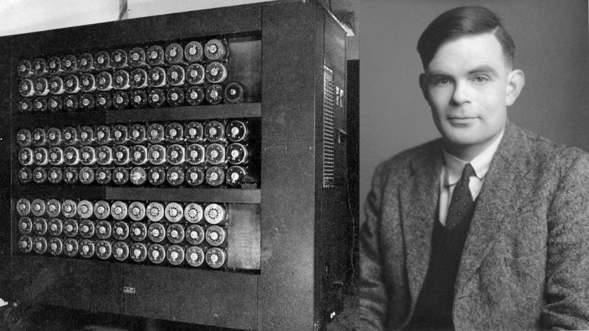](#)

앨런 튜링

​

**극히, 일부의** 인간이 아닌 사람들은

그걸 실제로 계산해서 전쟁 당시에

암호문을 푸는데 쓰기도 했지만 말임

​

20세기, 컴퓨터 혁명이 발달하면서

이제 세상에는 **'탁월한 계산기'** 가 나왔고,

​

물리학계에서 발견된

메트로폴리스 알고리즘이

깁스 샘플링 이라는

새로운 도구를 출현 시킴

​

깁스 샘플링을 통해 베이즈 추론의 한계를 깨고

많은 문제를 풀 수 있는 범용 도구임이 증명되며,

​

[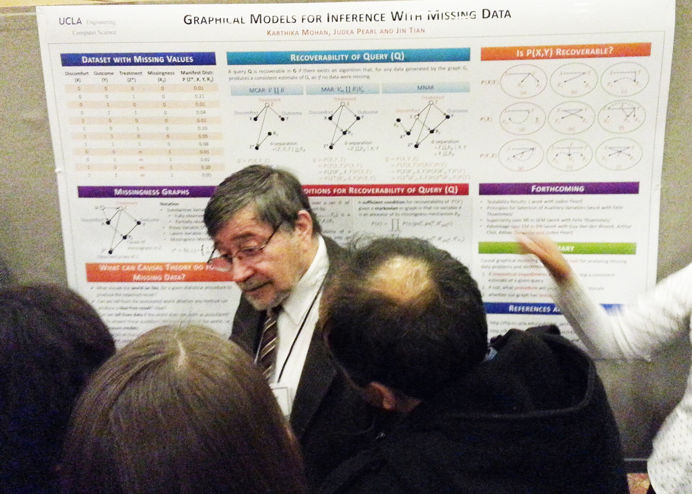](#)

주디아 펄 - 2011년 튜링상 수상

​

**88년**, 베이지안 네트워크라는

그래프 기반 확률 모델을 제시됨

​

라플라스의 연속 법칙이

성공/실패 라는 이진 추정이었다면,

​

베이지안 네트워크는 적합성을 만드는

요인들과 인과 구조를 명시적으로 모델링함

​

먼저 결혼하기 좋은 남자를

결정하는 변수들이 무엇이 있는지

인과적으로 따져보겠음

​

정말 많겠지만 당연히 설명일 뿐이니,

단순화를 위해 딱 6개의 변수만 가정함

​

V = 가치관 일치 (Y/N)

E = 정서적 안정성 (Y/N)

F = 경제적 능력 (Y/N)

​

C = 의사소통 잘 됨 (V,E 의존)

R = 신뢰할 수 있음 (E,F 의존)

M = 결혼하기 좋음 (C,R 의존)

​

여기서 조건부 확률표(CPT) 를

임의의 값으로 가정한다고 치면,

​

V = .3

E = .5

F = .6

​

P (C l V,E) 는,

​

V(Y) & E(Y) = .9

V(Y) & E(N) = .5

V(N) & E(Y) = .4

V(N) & E(N) = .1

​

P (R l E,F) 는

​

YY = .95

YN = .6

NY = .5

NN = .1

​

P (M l C, R) 은

​

YY = .9

YN = .4

NY = .5

NN = .05

​

라는 값이 나오게 됨

​

V=Y, E=Y: 0.90 × 0.30 × 0.50 = 0.135

V=Y, E=N: 0.50 × 0.30 × 0.50 = 0.075

V=N, E=Y: 0.40 × 0.70 × 0.50 = 0.140

V=N, E=N: 0.10 × 0.70 × 0.50 = 0.035

​

E=Y, F=Y: 0.95 × 0.50 × 0.60 = 0.285

E=Y, F=N: 0.60 × 0.50 × 0.40 = 0.120

E=N, F=Y: 0.50 × 0.50 × 0.60 = 0.150

E=N, F=N: 0.10 × 0.50 × 0.40 = 0.020

​

P(M) 을 구함에, 시그마를 취해서 답을 내면

​

C=Y, R=Y: 0.90 × 0.385 × 0.575 = 0.1993

C=Y, R=N: 0.40 × 0.385 × 0.425 = 0.0654

C=N, R=Y: 0.50 × 0.615 × 0.575 = 0.1768

C=N, R=N: 0.05 × 0.615 × 0.425 = 0.0131

​

**P(M=Y) ≈ 45%**

​

숫자가 엄청 복잡한 것 같지만,

​

불필요하게 복잡한 계산들일 뿐이지

연산 자체가 어렵고 그런 것은 아님

​

베이지안 네트워크의 위력은

이제 저 답이**'나오고 부터'** 임

​

정서적인 안정과 의사소통만 **'관측'** 해도,

사전 확률이 45%에서 80%로 크게 오르고,

​

의사소통의 질만 떨어져도

확률이 31%로 떨어지게 됨

​

반대로 결혼감으로 관측되었음, 일 때

원인을 역으로 추론해 볼 수도 있는데

​

P(V=Y l M=Y) =

P(M =Y l V =Y) P(V=Y) / P(M=Y) 이므로

​

**결혼감 으로 보였다는 사실 그 자체가**

**가치관 일치의 증거임을 추정할 수도 있음**

​

라플라스 방식으로는, 미래 예측만 가능할 뿐이고

그나마도 **'그렇다니까 그런가 보다'** 정도 지만

​

베이지안 네트워크를 활용하면,

가치관이 일치하면 결혼감일 확률은?

결혼감으로 보인다면 정서 안정 확률은?

​

의사소통이 좋은데, 가치관도 일치한다

상대가 정서 안정인 경우 확률 변화는?

​

정서 안정은 확인된 상태고,

경제력은 모르는데 의사소통은

별로 안 좋더라, 나 결혼해도 됨?

​

같은 문제를 접근할 수 있다는 것임

​

11. 세상에는 이진 변수가 많을까?

아니면 다차원 변수가 많을까?

​

자명히 압도적으로 후자가 많음

​

고로 베이즈의 관측으로부터

합리적으로 믿음을 갱신한다

라는 아이디어가 틀렸다기보다

​

**'시대에 맞게, 변주하고**

**진화하며, 개선되었다'**

​

라고 보는 것이 타당할 것임

​

베이지안 추론 이라고

흠이 없는 것은 아님

​

그래프 구조 자체가 가정이며,

이산화 과정에서 정보가 압축됨

​

성격이 나랑 잘 맞냐?

Y/N 이 아니고 더 정확히 하면

​

-xxx~+yyy 값 같은 형태로

정밀하게 뽑는 쪽이 더 나음

​

소수점 몇 자리 까지 하면 정확할까?

당연히 많으면 많을수록 좋을 것임

​

**어!?**

**​**

[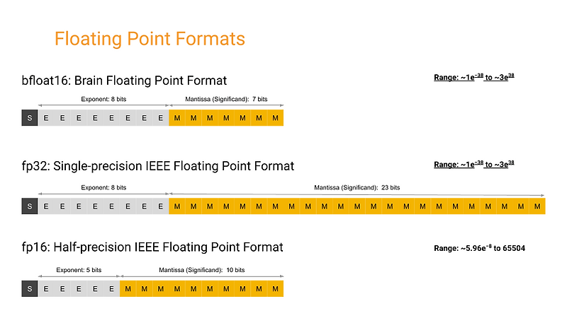](#)

​

12. 펄은 이후, 자신의 연구를

개선해서 변수 간의 상관성이 아니라

'특정 정보가 개입되었을 때'

​

어떻게 서로 상호작용하는 것인지

연구를 지속해, 관찰 데이터에서

​

인과 효과를 추정하는

형식적 방법론을 정립했고,

​

그 당시 펄의 나이는 81세 였음

​

50대에 베이지안 네트워크를 정립했고,

70대에 튜링상을 받고, 89살이 된 지금도

현역으로 열심히 연구 활동을 하고 있음

​

2012년, 알렉스넷 이후 딥러닝이 폭발하면서

AI 업계의 주류는 베이지안 그래픽 모델에서

신경망 메타로 급격하게 노선을 틀게 됨

​

표면적으로는 베이즈가 또 밀려난 시기였지만,

실제로는 베이지안 아이디어가 딥러닝 안으로

흡수되면서 재편성 되고 있었다는 견해도 있음

​

양 갈(Yarin gal)의 경우, 16년 논문에서

드롭아웃을 베이지안 추론의 근사로 해결했는데

​

자율주행이나, 법률, 의료, 금융처럼

모델이 모를 때, 모른다고 말해야 되는 영역에서

이 연구는 꽤 유의미한 도구로 사용될 수 있었음

​

최근 주목 받고 있는

에이전트 시스템에서도,

​

인공지능 에이전트의 환경에 대한 믿음을

갱신하며 행동하는 문제는 본질적으로

부분 관찰 마르코프 결정과정(POMDP) 에

가깝다고 봐도 될 정도고, 이 경우

​

베이지안 추론의 직접적 응용이라고

해석하는 것이 비약이라 볼 수만은 없음

​

그래픽 작업에서 빼놓을 수 없는

가우시안 개념에서도 베이즈를

아예 빼놓고 설명할 수가 없는데,

​

전기가 전자제품은 아니지만,

거의 모든 전자제품이 전기를 쓰듯

​

베이즈 모델의 상당수가

가우시안을 쓰고 있는 중임

​

​

13. **지피티-이미지-2.0** 이

26년 4월 21일자로 나왔음

​

현재 이미지 생성 도구가 풀 수 없는

마치 **난제** 에 가까운 문제들은 뭘까?

​

**'사고'** 할 수 없다는 것 임

​

구체적인 예시로 풀어보겠음

​

[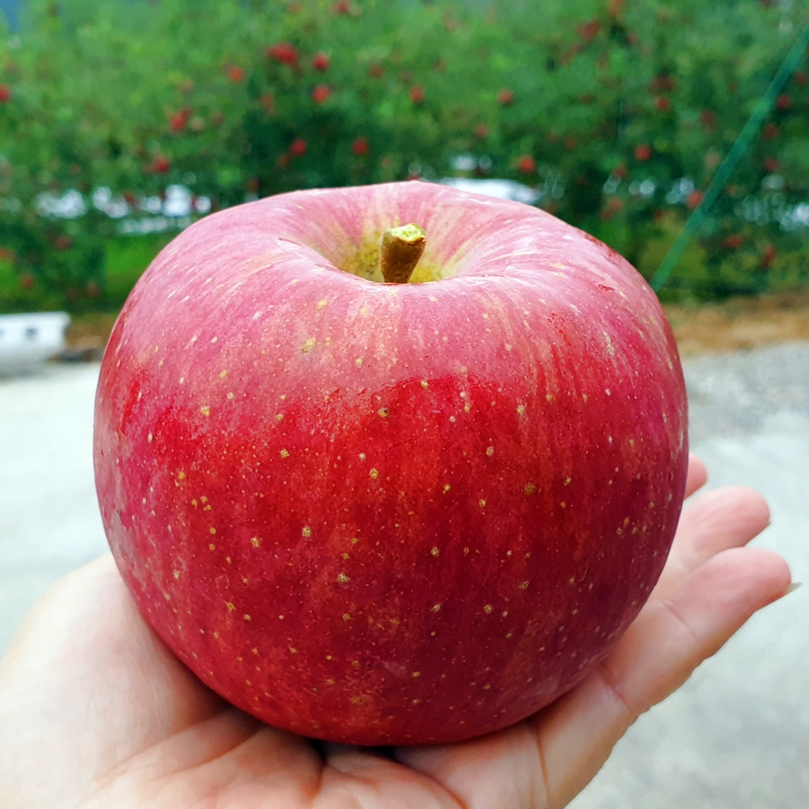](#)

​

이게 뭐임?

​

**사과** 임

​

[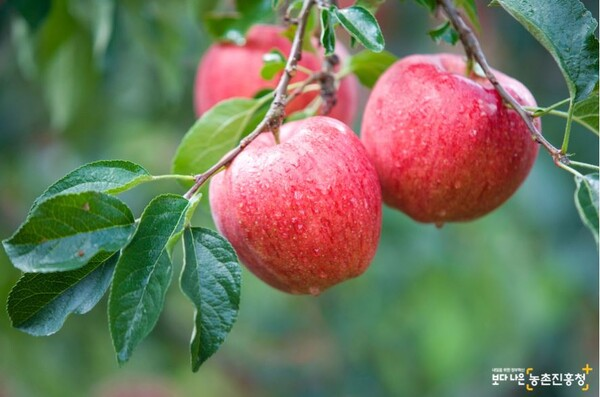](#)

​

이건?

​

**나무에 매달린 사과 3개?**

**​**

[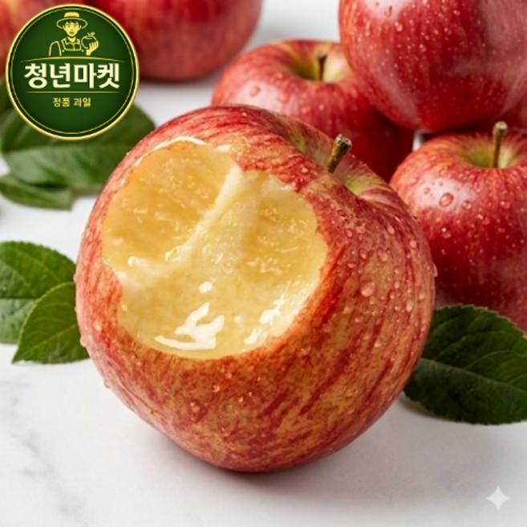](#)

​

이건?

​

**누군가 베어먹은 사과?**

**아니면 누가 파먹은 사과?**

**​**

[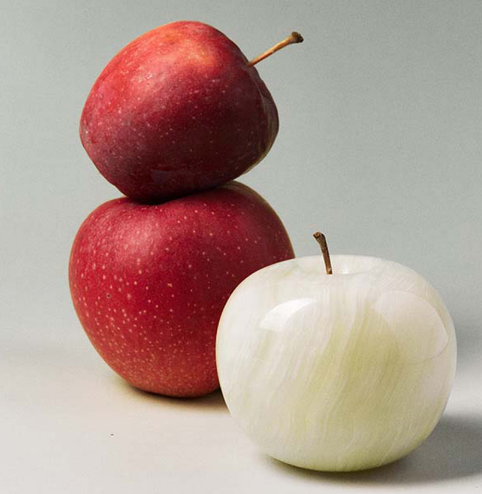](#)

​

**이건?**

​

뒤에는 사과가 2개 세로로

쌓인 상태고, 아래 사과가

위보다 더 크기가 크고,

​

원근적으로 제일 앞에는

이질적인 사과가 보이는데

하얀색 유리, 또는 옥 재질로

​

마치 목성과 같은 무늬를

보이고 있으며, 광택이 있고,

하얀 계통의 색깔을 갖고 있음

​

과육 부분과 달리, 꼭지는

온전한 과일이 갖고 있는

​

꼭지 형태를 갖고 있으며

수분기 없이 말려진 상태임

​

현존하는 생성형 AI 는 위와 같은

**'프롬프트로 이미지를 생성하는 것'**

정도는 간신히 노가다로 가능하지만,

​

내가 5초도 걸리지 않아 읽은 내용을

비전 모델을 사용해 **'읽을 수는 없음'**

​

만약 **'가중값'** 에 하얗고 둥근 형태의

다른 과일이 더 많이 입력된 상태라면

​

**연산값에 맞게**, 가장 **'확률'** 이 높은

아예 다른 과일로 해석할 가능성이 큼

​

**\* 임베딩 공간에서 가까운 거리에**

**매핑된 결과를 향해 수렴하기 때문**

**​**

즉, 무엇이 무엇보다 우선하고

어떤 것이 어떤 것보다 중요한 것인지

​

**'직접'**, **'추상화'** 할 수 없음

​

VLM 에서 이런 문제를 푸는 방법은

현재 알려진 기준으로 크게 둘 인데,

​

**\* 추상화는 커녕, 공간추론도 잘 안 됨**

​

1) 데이터를 마구마구 많이 넣는다

2) **'해낸다'** 뿐 임

​

[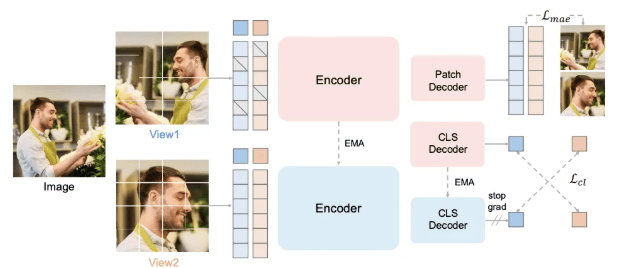](#)

https://arxiv.org/pdf/2604.21681

​

27일에 새로 나온, 사피2 는 또 모르겠지만

여태 포즈 추론에 있어서 내가 작업하면서

​

**'잘 안 되던'** 부분들이 애매했었는데

​

지피티 2.0 의 경우, 추론 작업들에 있어

**'데이터만 박은 건 아닌 것 같은데?'** 라는

​

현상들이 보이고 있는 중이라,

​

[](#)

​

따거가 해줄지, 아니면 시간이 지나

자연스럽게 공개될 지는 모르겠지만

​

**어떻게 한 것일까?** 기대를 하고 있음