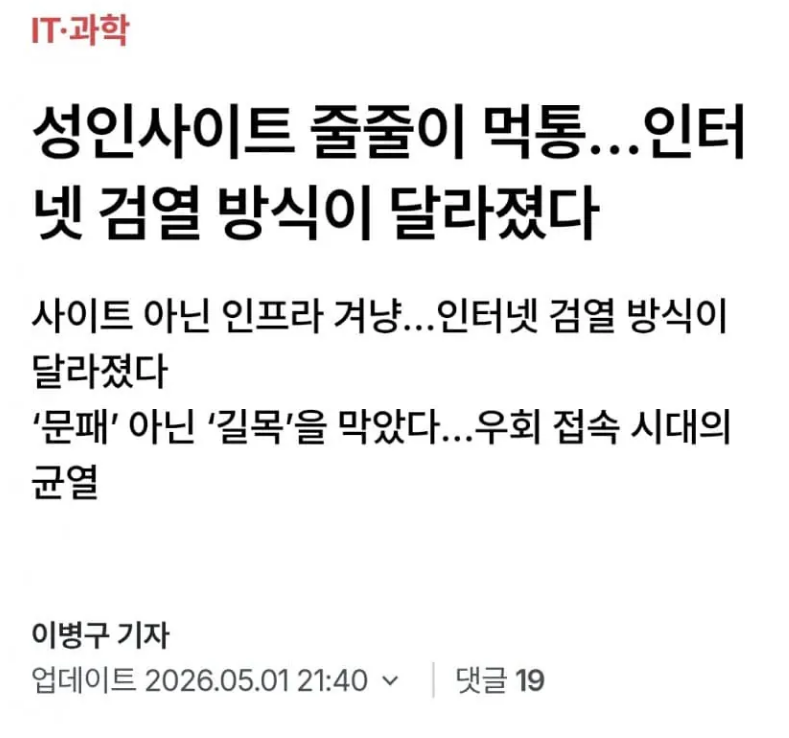
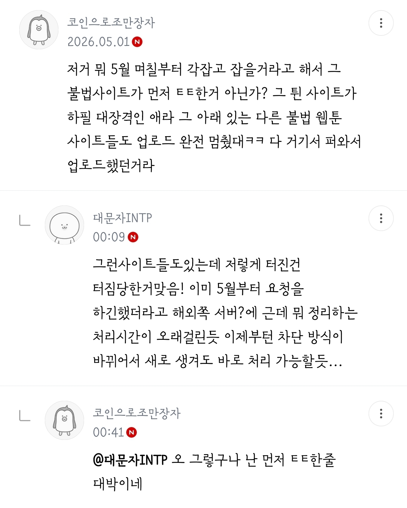
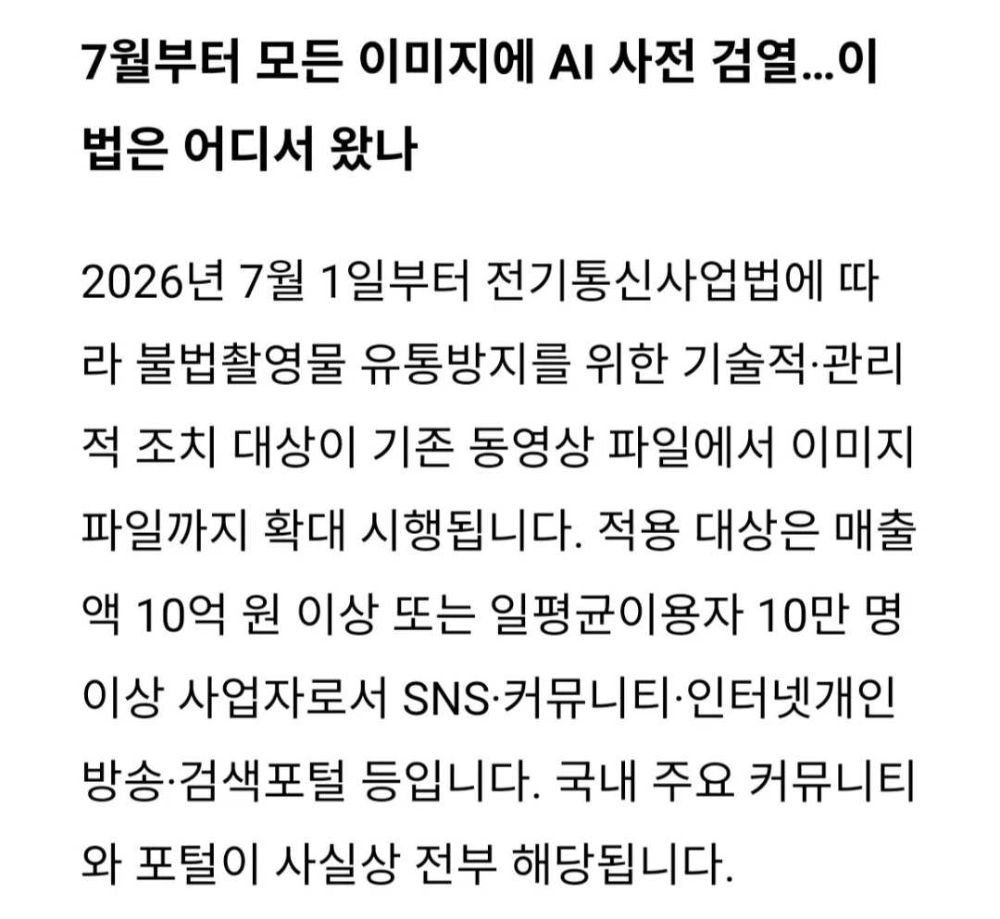

# 성인 사이트 검열 및 인공지능 이미지 규제
**Date:** 2026. 5. 2. 20:08
**Category:** 다이어리
**Original URL:** https://blog.naver.com/xpfkwh56/224272684543
---

​

**1. 불법 성인 사이트**

​

정확한 유통경로 갖고 있는 것을 보든가,

실제 사람 말고 애니메이션 이런 걸로 보든가

​

대안이 없는 것도 아닌데, 유출 영상이니

뭐니로 죽은 사람도 많았고 심지어는

지운다고 지워지는 것도 아닌 케이스 많음

​

**2. AI 악용**

​

이거는 내가 기술이 있는

입장에서 볼 때, **답이 없음**

​

1) 모든 작업물에 대해서

AI 워터마크 필수 달게 하고,

​

2) **문제가 될 법한** 것의 경우는

사람으로 **'오인'** 될 수만 있어도

만들 수 없게끔 아예 막아야 되고

​

처벌도 강해야 하고,

진작 일찍 했어야 됨