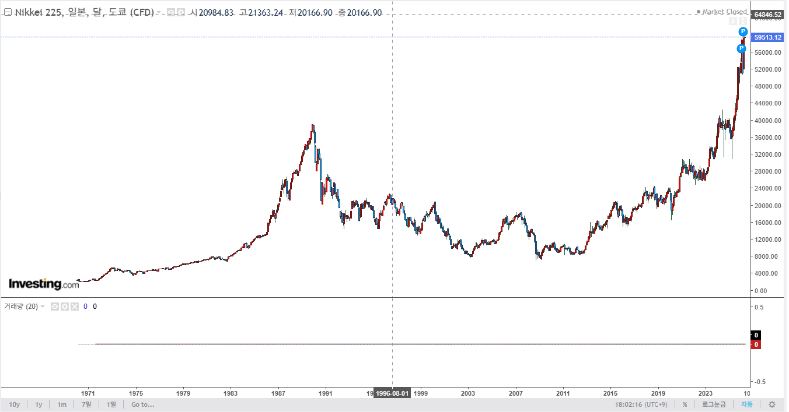
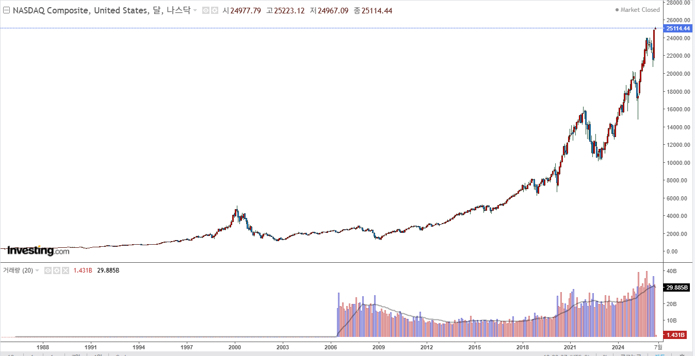
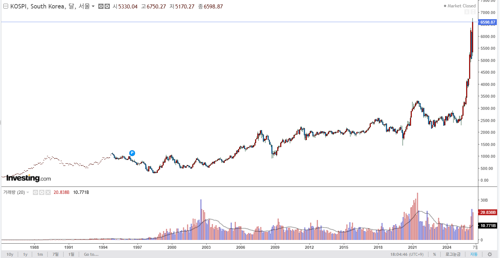

# 무지성 ETF 는 무적이라는데?
**Date:** 2026. 5. 3. 18:09
**Category:** 다이어리
**Original URL:** https://blog.naver.com/xpfkwh56/224273475027
---

​

닛케이 전고점 돌파 40년 걸림

​

​

나스닥 전고점 돌파 15년 걸림

​

​

코스피 2020년 전까지는

2천 언더 박스피 유지 했었음

​

100년 따리 증시 역사에서 우리가

겪고 있는 것이 **'처음'** 겪는 일인데,

​

이유를 **'내가'** 찾아서 이해한 것도 아니고,

누가 먹여줘서 알고 있는 상태라면 글쎄?

​

증시는 종국에 우상향 하는가? **'Yes'**

​

​

근데 그건 당신은 언젠가

죽는다 같은 명제에 가깝지,

​

의사 결정에 유의미한

영향을 주는 요인은 아닐 것임