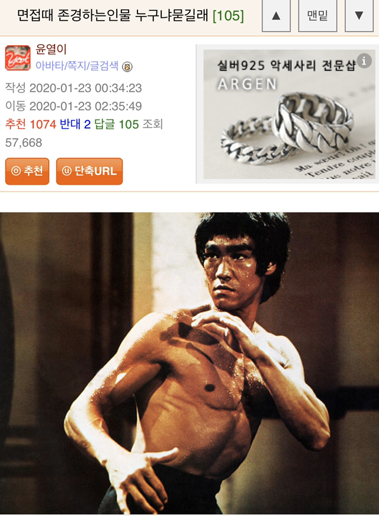
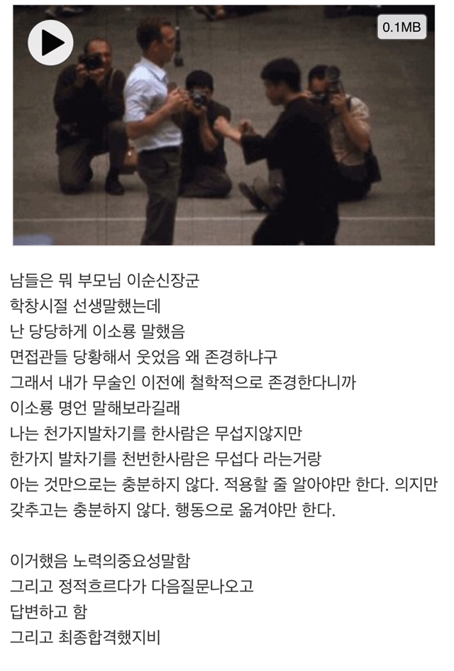
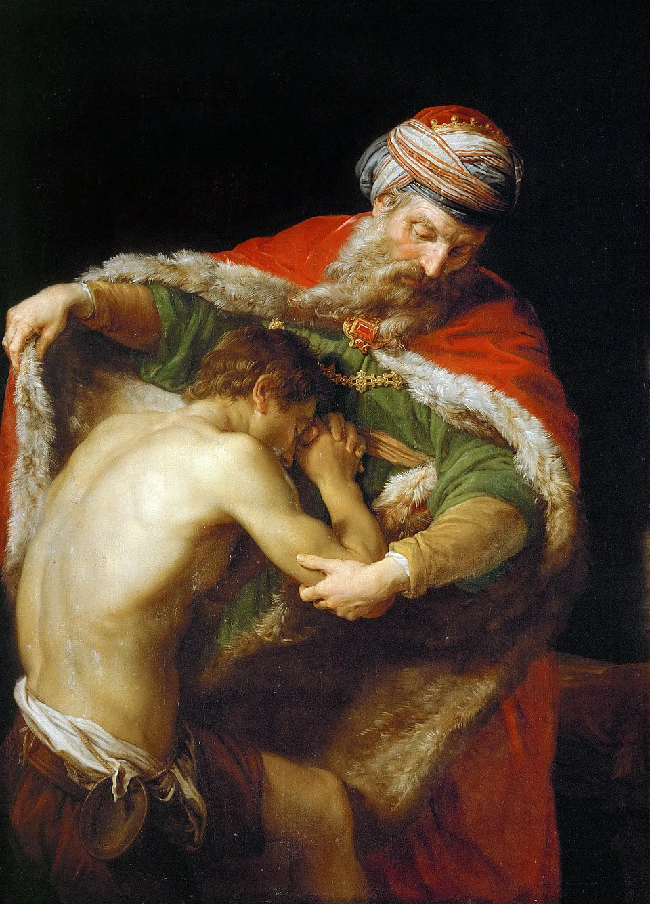

# 책을 많이 읽는 아이가 좋을까?
**Date:** 2026. 5. 4. 22:48
**Category:** 다이어리
**Original URL:** https://blog.naver.com/xpfkwh56/224274865831
---

1. 내 생각은 **'No'**

​

책을 많이 읽히면 책을 많이 읽은 아이가 될 뿐,

​

좋음에 대한 명확한 기준이 규정되지 않았다면

그 자체만으로 좋다, 나쁘다를 논할 수 없다고 봄

​

더 정확히는 단순히 많이 읽냐,

안 읽냐가 조금 섣부르다고 생각

​

​

2. 책을 여러 권 읽은 아이는 여러 권을 읽어서

다학제적이고, 통섭적인 사고가 아무래도

그렇지 않은 아이보다 유리할 수 있을 거고,

​

**\* 폭넓은 배경지식과 교양**

**​**

한 권을 깊이 있게 읽은 아이는, 그 깊이를

바탕으로 어떤 사고 도구를 가진 상태에서

다양한 현상과 환경을 해독하려고 할 것이고,

​

**\* 깊은 장르 이해도와 응용력**

​

책을 읽지 않은 아이는 그 시간 동안

외부와 독립적으로 사유하고, 경험하며

자기가 직접 체계를 쌓게 될 수 있을 것임

​

**\* 독창성과 자기 이해도**

**​**

3. 고대 아테네에는 프로크루스테스 라는

악당이 살았는데, 여행자들이 있으면

집으로 초대해 집에서 쉬게 해주었다고 함

​

그 집에는 침대가 있었는데,

​

여행자가 침대에 누웠을 때 키가 작으면

몸을 늘려서 죽였고, 키가 더 큰 경우는

도끼로 나온 만큼 몸을 잘라 죽였다고 함

​

4. 정말로 책을 읽히고 싶은 것일까?

​

아니면 뭐라도 해야 되는데 잘 모르겠으니

남들이 좋다는 것을 따르고 있는 것일까?

​

적어도 부모와 자식 관계에 있어서 만큼은,

​

세상 어떤 대문호가 썼다는 명작을 가져와도

대화, 커뮤니케이션 보다 나을 수 없다고 봄

​

저는 종종 엄마를 통해서 오래 전,

제 어릴 적 이야기를 들을 때가 있음

​

**그건 꽤 재밌는 경험이었는데**,

​

1호기의 집중력이 어떨지, 산만할진

모르겠지만 너가 태어난 이후 한참 동안

눈을 안 떠서 내가 걱정이 많았다는 것

​

주사를 맞으러 갔는데, 울지 않아서

혹시나 뇌에 문제가 있는 것은 아닌지

초음파를 찍으러 병원에 갔었다는 것

​

겨울 밤에 기저귀만 채우고,

유모차에 담요만 대충 덮어서

나갔다가 주민 신고를 당해서

​

아동 학대로 경찰이 집에

방문한 적이 있었다는 것

​

이런 것들을 **'아마'** 아이가 꽤 즐겁게

들어줄 것이라는 생각도 할 때가 있음

​

**\* 아님 말고**

​

그 순간의 모든 것들이

내겐 어제처럼 생생함

​

그리고 모두가 잊어도,

아무런 단서가 남지 않아도

​

나는 그걸 평생 기억 해줄 수 있음

​

5. 우리 아이가 영재인지, **'각'** 이 나오는지,

같은 것은 이미 답이 나온 기출이라고 판단됨

​

어떤 필터를 들고, Yes/No

이진 평가를 할 것이 아니라

​

**\* 그거는 어차피 사회 나가면**

**평생에 걸쳐서 질리게 할 짓임**

**​**

**내가 누구인지?** 교육 받을 기회가

제공되어야 한다고 생각함

​

나조차 기억할 수 없는,

​

내가 모르는 나를 보관해두었다가

돌려주는 사람을 통해서 말임

​

6. 일전에 들었던 이야기 인데,

좀 건강한 체형의 여자분이 계셨음

​

집에서 노상 듣는 것이, 뚱뚱하다

살을 빼라 같은 말이었다고 하심

​

부모님은 그 말씀을 하시면서,

​

남들이 이런 이야기를 해주냐

집에서라도 맞는 말을 해줘야 된다

​

라는 취지로 말을 하셨다는데,

나는 오히려 반대로 생각을 했음

​

탕자의 비유

​

**'집 에서라도 편하게**

**있어야 되는 것 아닐까'**

​

무엇보다 여자특이, 정신건강에 기스나면

**이유불문 -90% 디버프** 걸린다는 점인데

​

저런다고 해결이 되긴 될까 싶기도 했음

​

살 빼라, 돼지야, 정서적 학대 신나게 당하면

개과천선해서 자기 객관화, 메타인지 쌓여서

​

하루 아침에 슬렌더로 환골탈태가 될까?

​

**마찬가지** 로,

​

그냥 살 빼라는 소리

들은 사람만 될 뿐 임