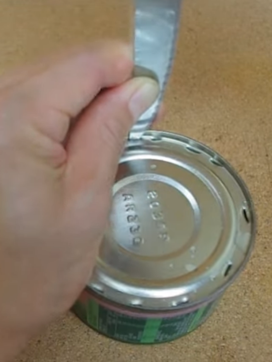
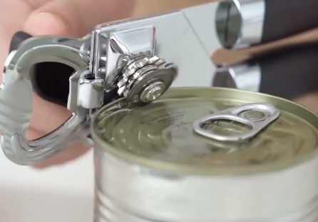
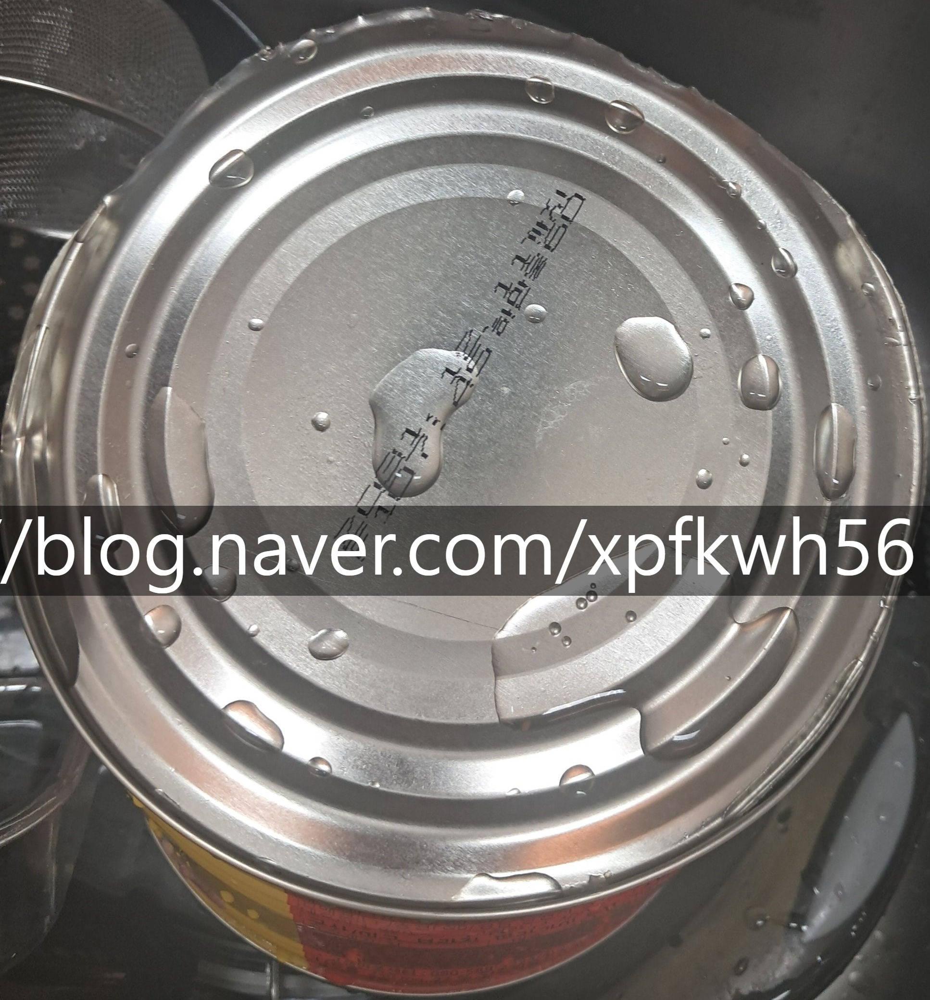
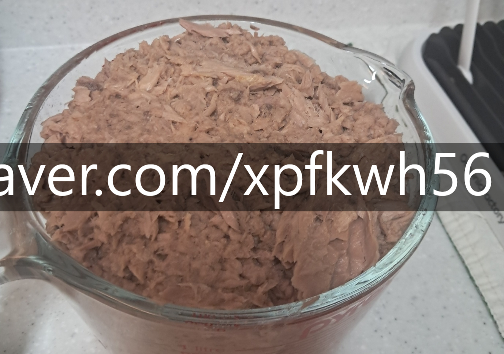

# 인공지능을 배우는 방법
**Date:** 2026. 5. 5. 1:27
**Category:** 다이어리
**Original URL:** https://blog.naver.com/xpfkwh56/224274982508
---

1. 주변에서 AI 라면서 난리이기도 하고,

영어, 운동 이런 것처럼 하면 좋을 듯 한데

​

막상 어디부터 시작해야 좋을 것인지

막연하게 느껴지는 것 중 하나가 AI 임

​

특히, 막연한 것이 **'길'** 이 없다는 점인데

​

깔끔하게 커리큘럼 하나가 딱 있어서,

​

그거만 열심히 내가 붙들고 있으면

결과가 나오는 장르가 아니라서 그럼

​

**2. 예를 들어보겠음**

​

얼마 전, 오프라인 마트에서

전단 세일을 하고 있어서 방문함

​

그리고 쿠팡 최저가보다 훨씬 싸게

**대용량 참치 통조림** 이 있어서 샀음

​

우리 집에는 캔따개 가 없었는데,

​

https://youtu.be/ACS8RBLREkE?si=13yYbX3EkCT2sfbt

​

유튜브 몇 개를 찾아서 보니까,

​

칼로 캔 부분에 구멍을 뚫어서

스티치를 내고 여는 방법이 있음

​

​

생각을 했음

​

1) 캔따개 를 산다

→ 몇 번이나 쓰겠냐 (기각)

​

2) 칼로 딴다

→ 위험한데 괜찮을까?

​

Ok 나왔고, 칼을 쓰다가

​

칼날이 상하거나

문제가 생길 수 있으니

날의 뒷면을 쓰기로 함

​

집에 이미 **'망치'** 는 있었기 때문에

작은 과도를 뒷면 부로 닿게 한 다음,

​

콩콩 하고 두드렸더니 구멍이 났음

​

**\* 날이 부러지면 리스크가 큰데,**

**각도만 잘 조정하면 될 것 같았음**

**​**

구멍을 3개 정도 낸 다음에 든 생각이,

​

​

수직으로 망치를 치는 것이 아니라

**사선으로 치면** 캔따개랑 똑같겠는데?

​

라는 생각이 들었고,

​

​

깔끔하게 참치를 꺼낼 수 있었음

​

**3. 인공지능을 쓰는 방법은 간단함**

​

프론티어 모델을 사용하든, 로컬을 쓰든,

​

아무거나 내가 하고 싶은 것이 있으면

자연어로 입력하고 요청을 하면 **끝** 임

​

다만, 그게 **'전부'** 가 아니라 어려운 것임

​

**\* 수행 해보고, 시행착오를 해봐야 하니까**

**무슨 결과가 나올 건지 쉽사리 예측이 불가**

**​**

캔따개가 없으면, 집에 있는 칼을 들고

구멍을 내고, 그 구멍들을 연결하신 다음

​

안에 있는 참치를 꺼내면 됩니다, 정도가

대부분 **'남들한테'** 배울 수 있는 수준 임

​

심지어 여기서 캔 가운데에 커다랗게

구멍을 낸 다음에 그 구멍을 통해서

참치를 꺼내는 것도 **방법은 방법** 이고,

​

**경우에 따라서는** 그게 더 나을 수도 있음

​

**\* 이 경우, 참치캔에 내야 되는 원의**

**크기가 외곽 전체를 도려낼 때 보다**

**더 작기 때문에 효율적일 수도 있을 것**

​

결국 내가 지금 무슨

문제를 해결해야 되냐?

​

가 규정되지 않으면,

​

캔따개 없이도 참치캔 따는 방법!

이라고 배워봤자 **쓸모가 없단 것임**

​

4. 다음은, 불가피하게도

**'하면서 깎을 수 밖에 없는 것'** 이 있음

​

편의상, 온라인에서 내가 찾은 방법을

스티치 방식 이라고 명명하자면,

​

스티치 방식으로 **'충분했을 때'**

​

아마도 나는 다른 방법을

고안할 필요가 없었을 것임

​

근데 이거 두드리다 보니까,

한땀씩 위치 맞추기도 번거롭다

​

라는 **'불편'** 이 들었기 때문에

​

날을 캔 부분에 박아놓고

망치로 날의 등 부분을 쳐서

​

캔을 자르는 방식을 해야겠다

라는 **생각을 하게 된 것** 임

​

이런 것은 내가 그 상황에 직접

놓여지지 않는 한, 알 수가 없고

​

하고 나면 아무 것도 아니지만,

​

모르면 모르는대로 **'특히나'**

반복적인 작업일 때, 치명적임

​

​

5. 거기에 방법을 **배워도** 문제인 점이,

​

이걸 이제 어떻게 써야 되나요? 를

**계속 물어봐야 될 확률이 높아서** 임

​

내 경우, 처음부터 참치가 있으면

어떻게 보관하고, 어디에 해서 먹고

​

이런 것이 계획된 상태에서 뜯었으니

작업이 끝나고도, 이후가 수월한 반면

​

일단 부랴부랴 참치캔 따는 법 익힌 후,

​

약 2kg 의 참치를 주방에 올려놓으면

당연히 머리에 물음표만 찍힐 따름 임

​

6. 고로, 잉공지능을 쓰는 방법은

실용적 관점에서 크게 둘로 구분 됨

​

1) 회사, 학교와 같은 곳에서

​

**그 기술을 요구하는 스텍을 주면**

**그걸 열심히 연마해서 따르는 것**

​

2) 내가 오늘 하고 싶은 것,

​

오늘 당장 하고 있는 것을 바탕으로

**'내가 나의 불편'** 을 해소하는 것

​

회사에서 어떤 일을 하고 있는데

이걸 조금이라도 더 손을 덜 쓰고,

더 빠르게 완성도 있게 하고 싶다

​

살림을 하고 있는데, 어떤 부분에서

도움을 받으면 참 편리할 것 같은데

​

이 부분이 아쉽다, 저 부분이 아쉽다

라고 느끼는 점이 있으면 그걸 쓰면 됨

​

깔짝 해보고 결과가 안 나왔다,

라고 바로 금방 멈추지 말고

​

왜 안 되는가? 어떻게 하면 되는가?

를 갖고 하나씩 배워 나가기 시작하면

​

아주 높은 확률로

본인의 **'영역'** 이 나옴

​

그 영역을 만들고, 마치 공장 라인처럼

뚝딱뚝딱 뽑아낼 수 있을 무렵이 되면,

​

AI 를 쓸 수 있는 사람이 **되는 것** 이지

​

뭐도 할 줄 알고, 뭐도 할 줄 안다고

AI 를 쓰는 사람이 되는 건 아닌 것 같음

​

문제가 있는 상태에서

공식 설명서를 읽고,

​

그 내용을 그대로 따라서

하나씩 해보는 것이

제일 빠르고 효율적임

​

**7. 내가 권하는 가장 매력적인 영역**

​

개발, 디자인, 교육 서비스 계열이 훌륭함

​

특히 예전부터 강조하던 분야가 **교육** 인데,

​

학습 데이터 자체의 양도 워낙 방대하고

레퍼런스 데이터만 조금 보여주고 읽혀도

​

비싸기로 유명한 교육들 쉽게 해결할 수 있음