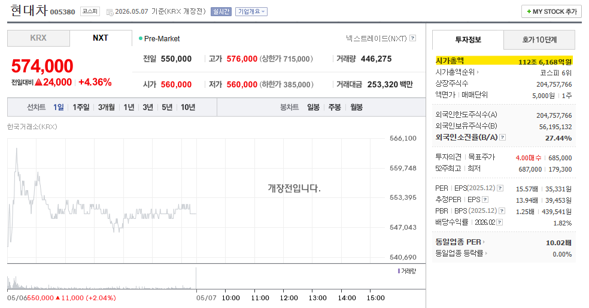
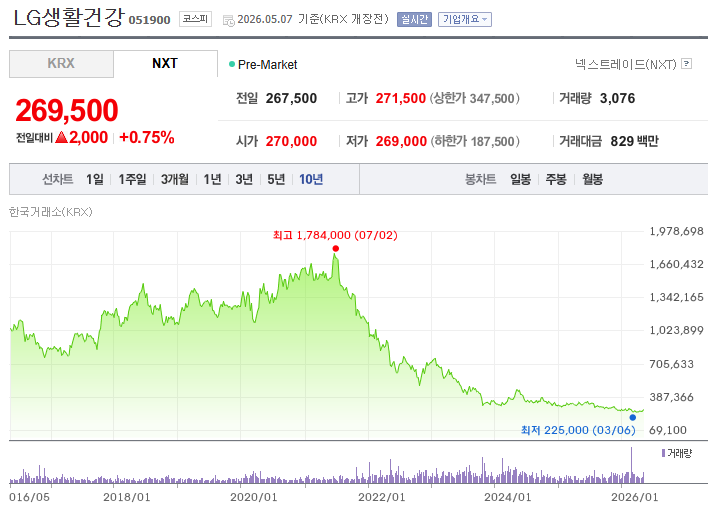
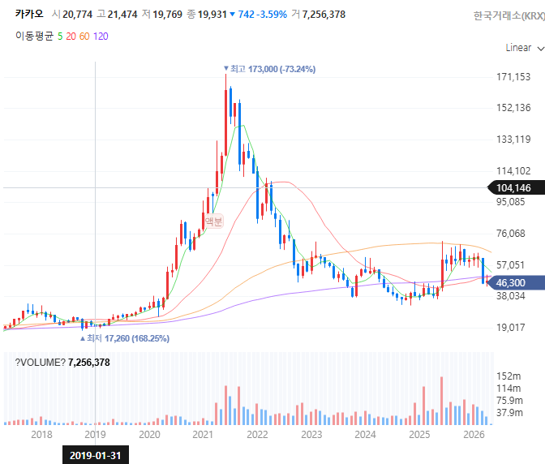
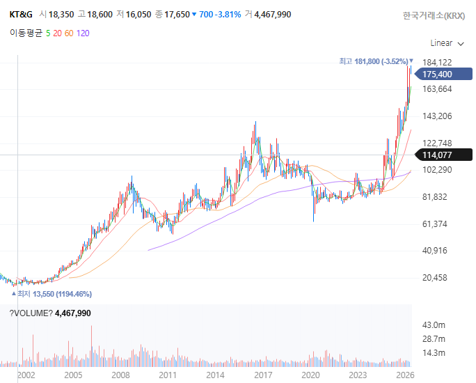
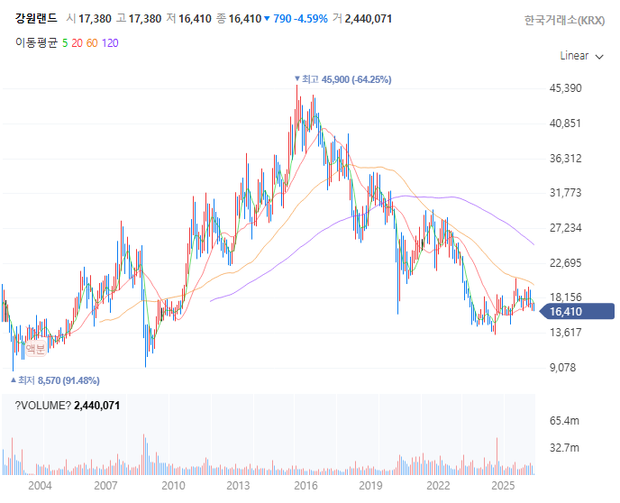
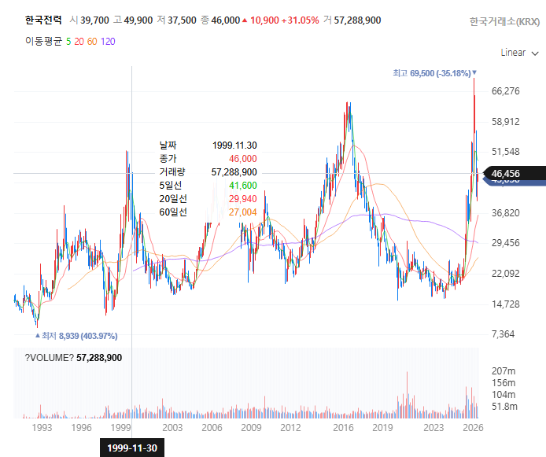

# 문과 멸시의 시대
**Date:** 2026. 5. 7. 8:32
**Category:** 다이어리
**Original URL:** https://blog.naver.com/xpfkwh56/224277339520
---

1. 액면가 보다 저렴한 주식은

무조건 저렴하니까 안 살 이유 없다

​

라고 생각했을 때, **'님 도랏?'**

이라는 말이 나오는 사람이 있고

​

**'와 그러네?'** 라는 사람이 있음

후자면 금융 하면 안 되는 사람 임

​

2. 코스피에서, 삼전이랑 하닉 합치면

전체 시총의 **약 40%** 정도에 육박하고

​

삼전이 갭 10% 떴다는 소리는

하루 만에 천조 넘는 회사의 시총이

100조 넘게 증가했다는 말과 같음

​

​

100조가 얼마냐? **현대차 시총** 임

​

3. 삼전, 하닉 같은 우량주 를 살 것이니,

나는 다른 투기꾼과 다르다고 생각을 하면

​

​

이 두 기업을 떠올릴 필요가 있음

​

​

하나는 담배 파는 회사고,

하나는 독점 도박 회사고,

하나는 공공 전기 회사 임

​

펜더멘털이랑 센티멘탈 안 똑같음

​

<https://snapshot.bok.or.kr/dashboard/C6>

[**한국은행 금융·경제 스냅샷**

물가 소비자물가 상승률 즐겨찾기 그래프 확대 데이터 다운로드 이미지 저장 자료 : 국가데이터처 기대인플레이션율 즐겨찾기 그래프 확대 데이터 다운로드 이미지 저장 주 : 1) 소비자동향조사 중 향후 1년간 소비자물가상승률 전망, 일반인 기준 자료 : ECOS 생산자물가 상승률 즐겨찾기 그래프 확대 데이터 다운로드 이미지 저장 자료 : ECOS

snapshot.bok.or.kr](https://snapshot.bok.or.kr/dashboard/C6)

​

4. 우리가 늘 봐야 하는 것은

raw data랑 정부 발표 자료인데,

​

gdp고 gnp고 뭐고 다 더해도

아무튼 확실히 3천조는 안 됨

​

그럼 **'코스피'** 만 해서 지금

시총이 얼마냐? **6천조** 정도 임

​

탕후루 가게 창업하면 돈 많이 번다고,

권리금 10억, 100억 찍는다고 하면

​

그럴 수도 있지, 라는

말 밖엔 할 수가 없음

​

**'3%'** 경제 성장을 한다고 가정하겠음,

​

7천 스피에서 1.4만 스피 되면,

시총이 1경 2천조 된다는 뜻이고,

​

그래봤자 3천조 안 되는데

단순 산수만 해도 **4배** 란 소리임

​

5. 당연히 뭘 배우고, 뭘 안다고 해서

그게 돈 버는 것이랑 관계는 없겠지만

​

**\* 대주주, 주요 이해관계자 매도 보시면**

**당사자들이라고 뭘 알고 하는 것은 아님**

**​**

1년치 연봉, 10년치 저축 같은 돈을

별자리 보고 박는 것은 아닌 것 같음

​

확신을 가질 만큼, 본인이

**'직접'** 보고 하는 것을 권함 ,,

​

왜 직접 알아보라고 하냐?

분위기 타면 끝도 없어지기 때문