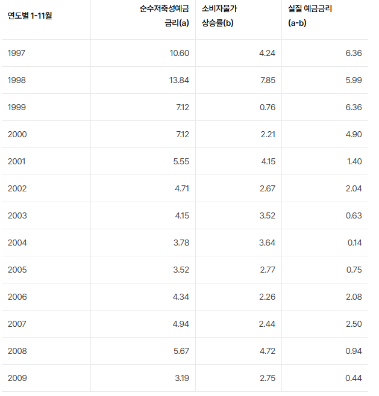
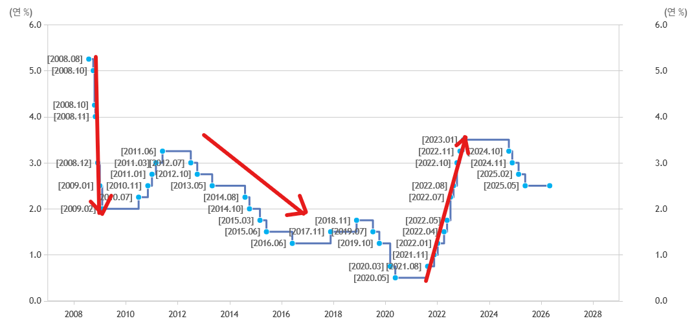

# 80년대 후반, 90년대 초반 인생 정답지
**Date:** 2026. 5. 8. 17:14
**Category:** 다이어리
**Original URL:** https://blog.naver.com/xpfkwh56/224279112510
---

1. 부모가 돈 생기면, 뒤도 돌아보지 않고

​

무조건 한양 땅으로 이사를 갔어야 했고,

얼마든 버는 돈 있으면 **무슨 수를 써서라도**

강남 3구 들어가서 등기를 때렸어야 했음

​

**\* 금융비용은 차피 세입자가 내준다 마인드**

**​**

그럴 시드 여유가 안 되는 사람이라면

서울 외곽 한적한 동네라도 잡아가지고,

​

도심 재개발 하는 지역에라도 갔어야 됨

​

**문제는?**

​

월세가 저렴하니, 목돈 자체가 없으면

전세를 살아야겠다는 유인이 없었고,

​

전세를 사는 입장에서는 **가만히 있으면**

내 자산 대비, 생활 수준이 **'최소'** 2배 이상

​

심하면 5배, 10배 이상 호화로웠기 때문에

집을 살 **유인** 자체가 존재하기가 어려웠음

​

그 시절에 어른들이 등신이라

집을 안 산 것이 아니고,

​

**불과 이명박 정권 전후 시기만 하더라도**

**집 사는 것보다 대형 카페 차리는 것이**

**초메이저 아파트 보다 수익률이 좋았음**

​

26년 기점에서, 롯데리아/맥도날드/

베스킨라빈스 같은 것 창업한다고 하면

​

**'?그걸 왜 하죠'** 소리가 나오는데,

​

당시 기준으로 시드 없을 때 기준 2억,

넉넉하단 가정 하에 4억 정도만 있으면

​

**'망하지만 않으면 3년 안에 본전 나오고,**

**권리금 엑싯 하거나 평생 연금이 가능했음'**

​

창업판에서 대성공이 14개월 전후인데,

이러면 **'월'** 수익률이 약 7% 정도가 됨

​

36개월로 잡아도 월 수익률이 **3.xx%**

​

원금은 길어야 3년 안에 무적권 회수하고,

회수된 다음에 업장이 없어지는 것도 아니니

​

100 이든, 200 이든 내 본전은 깔아놓고,

월세만 내면 평생 거기서 생계가 돌아간다?

​

와이프가 집 사야 돼! 해도, 가장이

​

**'집은 무슨, 야 우리가 월세 내고 있는**

**상가만 하나 사도 집 수익률 다 이겨'**

​

가 **'당시'** 기준으로는 정답지 였음

​

그럼 창업만 **'답'** 이었을까?

​

​

위 자료는 한국은행에서 발표한

97-09년 까지의 금리 지표인데,

​

https://www.bok.or.kr/portal/singl/baseRate/list.do?dataSeCd=01&menuNo=200643

​

리먼 직후에는, 본인이 직접 대출을 받아서

어디든 굴려놓기만 하면 **금리 이상을 땄음**

​

남조선에 있는 대표적인

자본 집약 벌이가 부동산이고,

​

밖에서나 아파트 아파트 타령 하지,

예전 시절에는 민간 분양 필지 받아다가

​

1층에 짓고, 1층 지은 걸로 대출 받고

2층 짓고, 2층 지은 걸로 3층 짓고 하면

​

갭투자는 **'비교 불가능한'** 수익률 나왔음

​

**\* 시행사에 들어가면 징역을 가든가,**

**아래로 3대 팔자를 바꾸던가 했던 시절**

**​**

대출 업계에서는 쌍방 수익률도 가능했고,

​

**\* 대출이 나가면, 대출 상담사가**

**돈 빌려간 사람, 돈 빌려주는 사람**

**양 측에서 수수료를 모두 받게 됨**

​

단통법 이전, 휴대폰 대리점의 경우는

책가방에 현찰을 수천만원씩 들고 다니는

사람들이 **'밥만 먹고 사는'** 취급을 받음

​

**\* 핸드폰 하나 팔면 그 자리에서 60만원,**

**통신비의 5-10% 정도 고정 수익률 확보**

**​**

경기부양 고성장 시대였기 때문에, 아무튼

뭐라도 **'하기만'** 하면 큰 돈을 벌 수 있었고

​

지금처럼 **'할 것이 없어서 내몰리는'**

시대랑 차이가 있었다는 점을 봐야 됨

​

**2. 70만 수험생 중, 50만이 문과던 시절**

​

먼저 유/초등 교육에 힘을 쓰지 말았어야 됨,

지금이야 대졸자가 발에 치이는 세상이지만

​

**\* 최소한 학력 프리미엄이 지난 20년의**

**시계열 대비 압도적으로 작아졌음은 분명**

​

여성 대학 진학률은 80년에 **27%** 부터

시작해서, 10년대에 **약 50%** 까지 오름

​

여기에 **디테일** 을 잡을 부분들이 있는데,

​

1) **평균적으로** 어머니의 교육 수준은

낮았을 가능성이 높았다는 지점 이고,

​

**\* 어머니 세대에 여자한테 고등 교육,**

**4년제 졸업장을 줬으면 집이 잘 산 것**

**아니면 이례적으로 부모가 깨어있던가**

**​**

2) 지금 어머니 세대는

**여성 사회 진출 1세대** 이자,

​

상당히 높은 확률로

**문과** 였을 것이란 것임

**​**

**\* 더 정확히는 수학, 과학을 못 하는**

​

그럼 **05-10학번** 기준으로 시대를 보겠음

​

**\* 3040 세대, 여자가 스타벅스 가서**

**커피 먹으면 사치스럽다 소리 나오던 시절**

**근데 그 시절엔 그게 틀린 말도 아니긴 했음**

​

이 시기의 사람들한테 **'실업계'** 를 간다,

이거는 **사회적 자살** 에 준하는 결정이었음

​

유독 공부를 특출나게 잘 하는 경우 아니면,

거의 다 **인문계** 진학이 확정된다고 봐야 했고

​

일단 여기부터 **첫 단추를 잘못 꿴 것** 임

​

> 직능 교육을 해주는, 실업계로 진학이 정답

​

당시 기준, 10대가 할 수 있는 최선의 알파는

**실업계 이후, 공기업/대기업 TO 받기** 였음

​

내가 만약, 타임 머신을 탄다면

**마이스터고** 또는 **해사고** 처럼

​

바로 **직업교육, 취업** 과 연관된 곳을 진학해,

일단 밥벌이를 가장 먼저 고민했을 것 같은데

​

좋게 보면, 시대적인 이유 때문에

​

나쁘게 보면 성리학 딸딸이, 화이트 컬러 선호,

겉멋, 간판 선호도 같은 이유들이 작용하면서

**​**

**'간판만 만들어놓으면, 누가 날 사갈 것이다'**

라는 인식을 가진 사람들이 사회에 쏟아지게 됨

​

그럼 **'왜'** 그렇게 생각을 하고들 살았을까?

​

지금 3040 이 봤던 시대는, 대기업과 중소기업의

또는 전문직과 비전문직의 임금격차가 **'매우 컸음'**

​

누가 배달을 해서 월 천을 번다고 하면,

​

지금은 **'잘 하나보네'** 지만, 과거로 본다면

**'지랄하지마'** 라는 반응이 그냥 **'당연'** 했음

​

이과는 평균적으로 두루두루 잘 하는 사람이 많고,

1등도 꼴지도 일단 문과에 있는 시절이기도 했음

​

물론 그 와중에 운이 좋은 인간들은,

**'기대에는 100% 미치지 못 했겠지만'**

​

일단 job 을 잡고, 생활을 할 수 있었지만

대부분의 사람들은 **'청년 실업'** 을 마주함

​

**3. 플랜 B**

​

> 인문계에서도 문과가 아니라, 이과를 갔어야 됨
>
> 먹고사니즘 최악의 선택, 예체능

​

동일 경쟁 성적권 내에서, 이과 진학 시에

문과 선택보다 간판을 얻기가 **훨씬** 좋았고,

​

전체 수험생의 숫자와 TO 간의 관계 때문에

물론 문과 대비 **'허수'** 의 숫자가 적긴 했지만

​

이후, 취업률 이슈에서 출발선이 다르긴 했음

​

지금 문과 출신으로, 서울 교대 들어간 인간들은

**​**

**다군 지방 의치한** 버리고

**스카이랑 고민하던** 사람들임

​

그냥 **'딱'** 숫자만 놓고 계산을 쳤을 때,

지금 고쓰리한테 물어본다고 가정을 함

​

**'서울에서 학교 다니면서'** 교사 할래?

아니면 **지방에서 재학하면서** 의사 할래?

​

라고 하면, **'서울 포비아 + 나는 피 못 봐'**

같은 얼토당토 않은 이유로 예전 사람들이

의사 결정 했던 것을 이해하지 못할 것 임

​

이 계열에서 제일 운이 좋은 사람들이,

**지거국 진학 → 마이너 찬스** 를 잡은 부류임

​

**\* 직장인 코스에서, 현재 신흥 자산가 계열**

​

고졸, 전문직, 지거국, 지역인재 찬스를 타면

공무원, 공기업, 대기업 같은 장르에 있어서,

​

보다 덜 경쟁하면서 진입하는 것이 가능했음

​

이 시점에서, 최선 까지는 다양 하겠지만

**'최악'** 의 선택을 하는 사람들이 나오게 됨

​

1) 영유아 영재 교육 받고 사립초 졸업

2) 비특수 중학교, 일반 인문계 문과 진학

3) 문과에서 수시도 아니고 정시로 수험

​

4) 아주 높은 확률로 재수 이상 한 다음에,

애매하게 전공 못 살리는 그나마 본인이

최대한으로 찍을 수 있는 간판 결정을 하고,

​

5) 서울/경기권에서 사립대 빚 내서 다니고,

심지어 캠퍼스 생활 즐기면서 돈 쓰고

학점 관리 3학년 부터 해서 애매한 사람

​

6) 롯동금 언저리 또는 그 외 중견 **공채** 가서,

**'유지보수'** 업무를 보고 있는 사람이거나

​

그나마도, 일자리 못 잡고 밖으로 나왔다면

돈은 제일 많이 쓰고, ROI 는 제일 나쁜 셈 임

​

7) 그리고 5-6번 테크에서 **'결정적'** 으로

대학원 진학하고, 박사 안 마치고 석사로

나온 다음에 일자리를 찾기 시작하는 것 임

​

**\* 갈 ,, 곳이 ,, 없다**

​

이렇게 결정한 사람들이 **'멍청해서'** 가 아니고,

시대가 너무 빠르게 변하는지 **몰라서** 그런 것임

​

지금은 의치한약수도 아니고,

**의치한수** 로 바뀌었다고 함

​

나는 **'수'** 도 뒤에 있다고 보는데,

​

**현행 기준으로, 지거국 수의대 정도가**

**인서울 공대에 거의 비비던 시절 있었음**

​

26년 기준으로, 연공 갈래?

지방 수의대 갈래? 하면

​

아마? 3년치 수명 정도는

지불할 사람 널렸다고 생각함

​

**3. 문과 정시의 개빡 난이도**

​

자료를 통해서만 유추한 것이므로

실제 수험생 입장은 다를 수 있겠음

​

정시 기준, 5개 이내로 틀렸다고 치고

제 2외국어랑, 내신+수능+논구술(면접)

잘 치면 서울대 메이저 갈 수 있음

​

**\* 가군 연고, 나군 서울대 다군 취향**

**​**

수능은 잘 봤고, 나머지 2개 조졌으면

마이너 진학 하게 됨, 인문계 기준 임

​

수능에서 똑같이 5개 이내 틀리면,

연고 메이저 갈 수 있음

​

그리고 **언수외 주요과목** 에서

1-2개 더 틀릴 때마다 간판 바뀜

​

5개 이내 → 연고대

1-2개 더 틀림 → 서성한

1-2개 더 틀림 → 중경외시

​

간판 정한 다음에, 이제 탐구 과목이나

6교시 원서 영역으로 메이저/마이너 나뉨

​

**'솔직한'** 내 생각은,

​

그 시절 인서울 쯤 했으면

**그게 그거 아니냐 ,,** 이거임

​

이 기조는, 간접적으로는 20대 후반

**극심한 것이 40대 전후** 나이에 있는데

​

그들이 과잉 공급된 교육 받은

인적자원 1세대 임을 감안하면

​

쉬었음 청년 현상과, 각자도생 이

주요 메타로 떠오른 것도 납득이 감

​

4. 그 와중에 공부 잘 했던 사람이라면

어쨌든 지 밥벌이는 찾고 살지 않나요?

​

**저 시절 기준으로, A 매치 금융 공기업이나**

**한수원, 한국전력 같은 회사를 쳐다보면 됨**

​

남들이 월급 100만원 받고 살 시절에

내가 공부 잘 해서 월급 500만원 받으면

​

이 **'5배'** 의 상대 격차를 활용할 수 있지만,

​

**\* 명문대 과외 시급은 민간에 맡겨져 있지만,**

**최저시급 1천원 시절도, 1만원 시절도 유사함**

**​**

중소기업, 대기업 격차

비전문직, 전문직 격차

​

같은 것이 점점 더 감소할 시점에는

​

**'윗 세대'** 꿀통을 생각 안 할 수가 없어서

현타를 아예 안 느끼기는 쉽지 않을 것 임

​

**5. 결론**

​

시대가 달라졌으니,

변주는 있을 수 있음

​

근데 과연 앞으로 라고, 남조선이

**'변화가 없는 사회'** 로 쭉 머무를까?

​

지금 조차 기회는 계속 나타나고 있고,

하루가 다르게 세상이 변화하고 있음

​

아는 인간과 모르는 인간,

보는 인간과 못 보는 인간만 있을 뿐