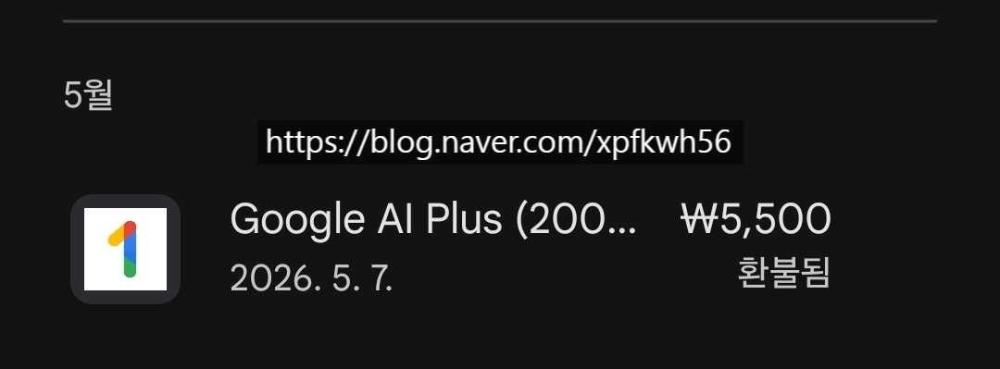

# 아이한테 무슨 책을 읽혀줄까요?
**Date:** 2026. 5. 8. 17:46
**Category:** 다이어리
**Original URL:** https://blog.naver.com/xpfkwh56/224279147834
---

**1. 구글 계정을 새로 만드세요**

​

2. 구글 계정 새로 만들고

지피티 들어가면 PRO 계정

1개월 무료 오퍼 줍니다

​

**\* 직업적으로 쓰는 것 아니면**

**굳이 돈 주고 쓰지 마세요**

**​**

즉, 연장 결제를 취소하고 탈퇴하면

**'공짜로 1개월 쓸 수 있단 겁니다'**

​

3. 1개월 무료 계정을 받으셨으면,

​

그 계정으로 GPT 한테 아무 정보나 주고

아무 그림이나 1개 만들어보게 시키세요

​

4. 그리고 아무 그림동화,

아무 책이나 쓰게 하세요

​

엄마, 아빠랑 오늘 어디를 놀러 갔다 왔다

오늘 뭐를 했다, 우리 동네에 뭐가 있다,

내가 뭐를 봤다 같은 것 **뭐든 다 상관 없음**

​

**5. 글자가 있고, 그림이 있는 것이 나옴**

그 **'정보 콘텐츠'** 를 다룰 수 있게 하세요

​

<https://blog.naver.com/xpfkwh56/224278281232>

[**가내수공업 잉공지능 웹툰**

98년생 돌아온 유부녀 블로그

blog.naver.com](https://blog.naver.com/xpfkwh56/224278281232)

​

버린 것 제외하고,

약 300 컷 정도? 뽑았고

​

전부 무료 계정으로 했습니다

​

**\* 한도 다 쓰면, 새로 가입 반복**

​

지피티에서 못 잡는 것은

제미나이로 일부 사용했고,

​

대기업 이라 상식적인 정도의 요구를 하면 자비를 베풀어 줌

​

마찬가지로 사용 후, 환불 했음

**​**

**\* 환불 안 돼도, 5500\*2 원 손해**

​

6. 영어든, 중국어든, 과학이든,

국어든, 수학이든 본인이 본인을

​

직접 가르칠 수 있는 콘텐츠를

작업하게 시키는 것이 학습 밀도면에서

제일 크다고 생각하고 있읍니다

​

**\* 클라우드 기준, 검열이 너무 쌔서**

**잘못된 이미지는 만들어주지도 않음**

**​**

**7. 작업 시간은?**

**컴퓨터 앞에 계속 있어야 하잖음**

​

늘 말하듯, **원격 기능** 을 쓰세요

​

휴대폰, 테블릿, TV, 노트북 등

소형 기기에서 데탑 구동 가능함

​

내 할 일 하면서 시켜놓은 다음에,

사람이 꼭 검토해야 될 것만 검토하면

​

비동기 업무도 가능하고,

​

자동은 몰라도 사람의 개입이

**최소화** 된 상태에서 처리 가능