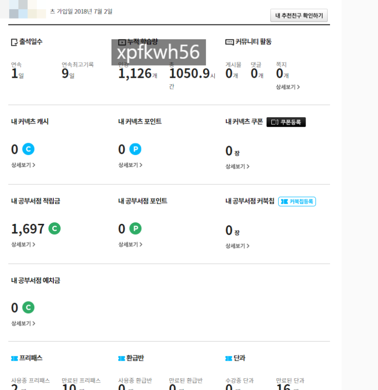
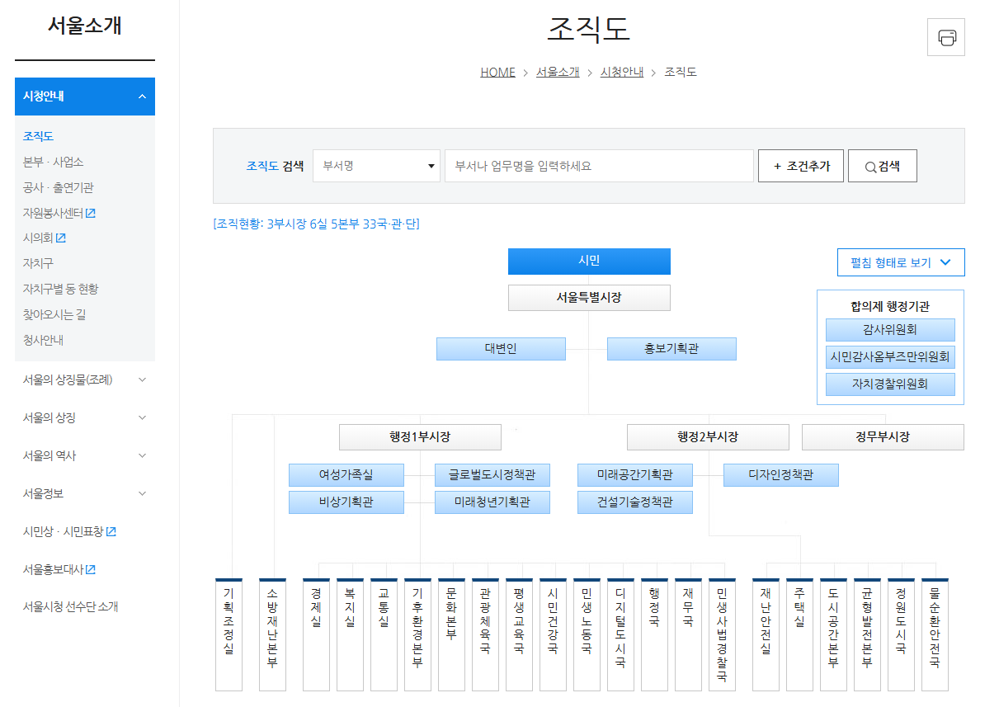
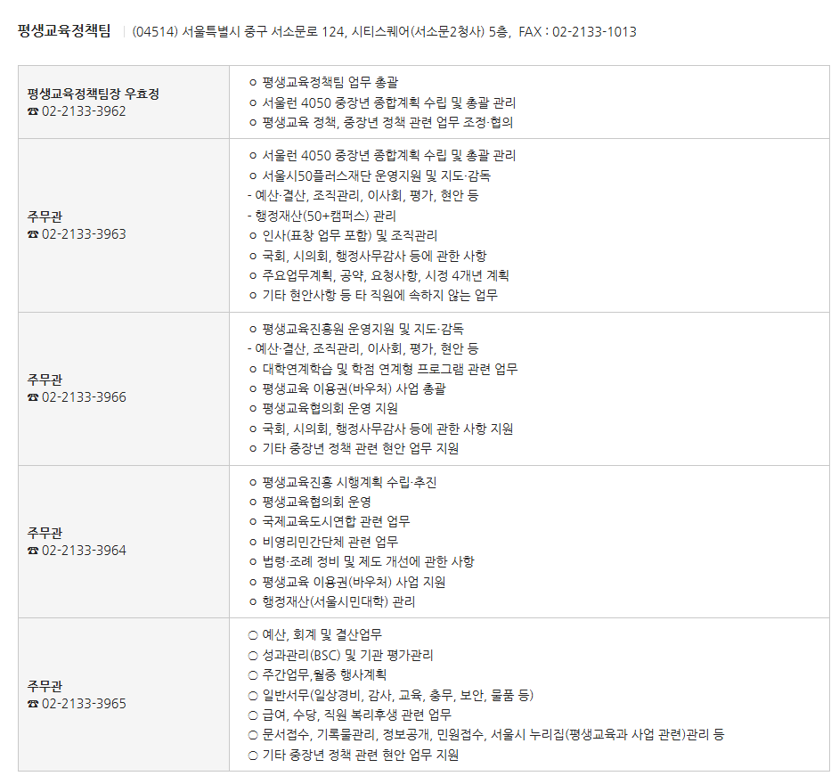

# 자기 방법을 찾으라고 하는 이유
**Date:** 2026. 5. 8. 22:47
**Category:** 다이어리
**Original URL:** https://blog.naver.com/xpfkwh56/224279386352
---

​

1. 으아아아주 옛날에,

​

저는 여러 가지 이유로 설렁설렁

7/9급 공시를 공부했던 적이 있음

​

공무원 하려고 하셨나요? 아뇨 그냥 함

​

몰라도 상관없기는 한데, 알면 좋은

여러 가지 법률이나 절차, 규칙 등을

공시 공부하면 일단 **'알'** 확률이 증가함

​

당연히 다 세부적으로 달달 지금까지

외우고 있냐, 라고 물으면 그건 아니지만

​

제 수준에서 법률적, 행정적으로 여태껏

생긴 문제들은 거의 다 자급자족 했었음

​

**\* 단, 사업하는 사람은 저 기준에서 예외**

**시간 나고 여유 생기면 무조건 공부하세요**

**장사꾼이 법 모르면 좋되는 수가 많읍니다**

**​**

**2.** **너는 어떻게 하길래,**

**시스템을 그렇게 잘 쓰냐?**

​

<https://blog.naver.com/xpfkwh56/223603994189>

[**좋은 화장품 고르는 방법**

직관적이죠? 아모레퍼시픽 나오네요 세계 1등은 로레알 아모레퍼시픽 vs 로레알? 둘 중 누가 1등이지? 그보...

blog.naver.com](https://blog.naver.com/xpfkwh56/223603994189)

​

제가 보는 것들은 어딘가에 숨겨져있는

비밀스러운 정보가 아니고, 손가락으로

검색만 열심히 하면 얻을 수 있는 것들임

​

다만, 두 가지에서 문제가 있을 수 있음

​

**1) 내가 뭘 찾아야 하지? 라는 문제**

2) 이제 어떻게 **찾아나갈 것** 이냐 문제

​

우선 첫 번째는 스스로 좁히는 수밖에 없음

​

돈을 벌고 싶다, 라는 질문이라고 가정함

그럼 저는 저런 문장을 잘라서 읽는 편임

​

돈, 무슨 돈? 돈이 뭔데? 화폐?

아니면 금전적 가치가 있는 것?

교환가치만 있으면 다 되는 것? 등,

​

벌고 싶다는 것이 뭔데? 일을 해서 월급?

아니면 딱히 근로 하지 않고 받는 수익?

권리 소득? 과세? 비과세? 이런 것들을

​

이제 내가 **'할 수 있는 만큼'** 찾아서 봄

​

그럼 열-심히 찾아봤을 때, 어느 시점 부터는

굳이 누구한테 물어볼 이유 없이 내 스스로가

이미 내가 궁금한 것이 뭔지 알고, 찾아봤고,

​

결론이 나왔기 때문에, 질문에 답을 하게 됨

​

이 시점에서 이제 **'남의 의견'** 을 보는 것 임

​

감히 말하자면, 내 경험상 보게 되는

팔 할의 정보 정도는 거의 스킵하게 되고,

​

나머지 내용 안에서 내가 알아본 것과

상충되거나, 내가 틀리게 알고 있던 것들을

조사해서 확인하는 시간을 갖게 될 것 임

​

이걸 계속 반복하면, **보통** 시간이 모자란데

​

당장에 뭘 어떻게 하지? 가 아니라,

​

아, 시간만 많으면 더 알아볼 텐데

하면서 일정 시점에서 **'스돕'** 하게 됨

​

3. 즉, **'질문을 명료하게 하는 작업'** 이

내가 답을 찾는 작업과 상당히 밀접함

​

나는 20대 애 키우고 있는 여자고,

**도움을 받고 싶어요** 라고 한다 가정함

​

이런 질문으로 제대로 된 답을

얻을 확률은 거의 낮다고 봐야 됨

​

서울 특정 지역에서 살고 있고,

남편은 무슨 직업을 가진 사람이고,

​

현재 종소세 는 얼마 내고 있고,

재산은 얼마나 있고, 증빙 경력은 이렇고,

월 가용 시간은 얼마 정도 있고,

​

어떤 조건에서 무슨 일을 하고 싶은데,

혹시 이런 상황에서 일자리를 찾거나

소득 촉진, 또는 대출 금융, 등등

​

특정 섹터에 관하여 도움을 받을 수 있는

곳이 있는지 알고 싶다 정도만이라도 되면,

​

그대로 복붙해서 **국민 신문고** 에 물어보면

친절하게 어디에 문의하라고들 다 알려줌

​

통계가 궁금해? 그럼 통계청

​

통계청에서 자료를 봤는데, 그 자료가

무슨 근거로 나왔는지 궁금해? 그럼 질의

​

제도를 쓰고 싶은데, 그 제도를 담당하는

소관부처가 어딘지 모르겠다는 것은

​

사실 **'당연한'** 것 임

​

<https://www.gov.kr/portal/orgInfo>

[**중앙행정기관 | 정부/지자체 조직도 | 정책정보 | 정부24**

2026. 1. 2. 시행 조직도 다운로드 (19부 6처 18청 6위원회) 대통령 해당 기관의 누리집이 없는 경우, 상위 기관 누리집으로 연결됩니다.

www.gov.kr](https://www.gov.kr/portal/orgInfo)

​

근데 정부/지자체 조직도 검색해서,

​

​

홈페이지 들어가서 소개란 보고,

​

​

클릭하면, 각 공무원 연락처부터 하는 일

같은 것들이 전부 인터넷에 나와 있음

​

**4. 결론**

​

1) 하고 싶은 것이 없다 → 방법 X

​

2) 하고 싶은 것은 있는데,

그게 구체화된 상태가 아니다

​

→ 구체적으로 생각해서 좁혀본다

​

3) 구체적으로 좁혀서 생각이 어렵다,

정리되지 않은 것을 정리 받고 싶다

​

→ 확률이 그리 높진 않지만

그나마 쓸 것은 국민 신문고

​

**\* 공무원한테 도움을 청하면, 대부분**

**그 사람이 나한테 해를 끼치지는 않음**

**​**

어떻게 너는 특정 부처, 공직 내부에

있는 정보를 아는 것임 무슨 끈이 있음?

​

인터넷으로 질의 하거나,

전화를 해서 물어보거나

정보공개 청구를 하는 것임

​

<https://blog.naver.com/moeblog>

[**교육부 : 네이버 블로그**

대한민국 교육부 공식 블로그입니다.

blog.naver.com](https://blog.naver.com/moeblog)

​

일례로 교육부 블로그 같은 것도

이웃 추가 해놓으면 나쁠 건 없음

​

누구나 할 수 있는 일임,

많이 귀찮고 번거로울 뿐