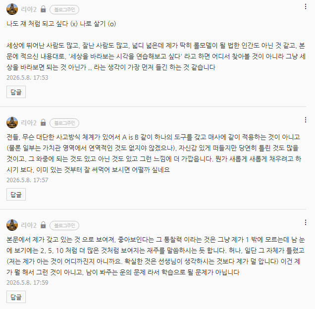
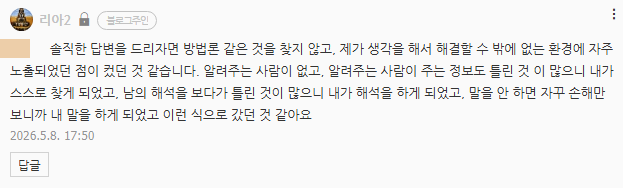

# 질문과 답변
**Date:** 2026. 5. 8. 18:01
**Category:** 다이어리
**Original URL:** https://blog.naver.com/xpfkwh56/224279164095
---

​

다른 사람의 등을 한참 보고 살다가,

​

그 사람도 다른 사람의 등을

보면서 걷고 있다는 것을 알았고,

​

대열에서 살짝 빗겨나서 보니까

제일 앞에 있는 사람은 남의 등

​

안 쳐다보고 살길래, **어라?** 했음

​

그럼 쟤는 뭘 보고 가는거지? 했더니,

걔가 보는 앞에는 아무 것도 없음

​

그게 끝 임