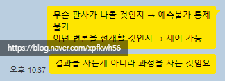

# 탕후루 가게
**Date:** 2026. 5. 8. 20:46
**Category:** 다이어리
**Original URL:** https://blog.naver.com/xpfkwh56/224279294381
---

1. 중국식 디저트가 국내에 들어옴

​

2. 두쫀쿠처럼 공급은 적었는데,

수요는 엄청 많아서 구하기 귀했음

​

3. 모 탕후루 가맹 기준, 21년 시점에

10개 내외 있던 매장이 1년 뒤 40개

그리고 23년에는 400개가 넘게 생김

​

4. 22년만 해도, 그게 있나 싶기도 하고

먹는 애들만 먹다가 초기엔 못 구했는데

​

23년 시점에는 동네마다 있었고,

최소한 구하기는 그리 어렵지 않았음

​

5. 1년 뒤, 탕후루 물 빠짐

​

폐업 넘쳐남

​

권리금 받고 팔 수 있던 매장이

역권리 줘도 팔릴까 말까가 됨

​

**6. 중요한 점은 이 지점에 있음**

​

그럼 지금도 멀쩡히 살아있는

탕후루 가게들은 **뭐냐?** 이거임

​

1) 일단, **할 만 하니까 한다** 이거임

​

제가 종종 우려하는 말이 있는데,

**내 인건비가 얼만데 이걸 내가?** 임

​

근데 그 관점으로 하면 할 것이 없음

​

그렇다면 할 것이 없으니 할 일이 없고,

할 일이 없으니 **할 줄 아는 것이 없어짐**

​

적어도, 내 경험상 본인의 무능을

직접 마주하는 것이 쉽지 않은 일임

​

그제도, 어제도 잘하던 애들이

오늘 잘 하는 것이지, 갑자기 마음 먹고

​

어디 먼치킨 웹툰물처럼 하루 아침에

똑딱 하고 잘해지는 그런 것은 없음

​

**비법 찾지 말란 소리** 임

​

2) 겨울을 준비한 사람일 확률 높음

​

탕후루 가게가 월 1천을 버는데,

창업 비용이 1억 이라고 가정함

​

이 경우, **per 이 채 1도 안 됨**

​

올타쿠나, 하고 사면 된다? 안 된다?

​

본디 지식은 현상을 해석하는 도구지,

판단을 정당화 하는 도구가 되면 안 됨

​

**\* 특히 AI 업계에는 이게 매우 심함**

**늘 하는 이야기지만 벤치 믿지 마세요**

​

골드 러쉬 때, 청바지 장수가 잘 벌었다고

머리 굴린다고 가맹사 투자하는 것도

뭔가 이상하게 상황을 해석하는 것 임

​

가맹사 다 망하면 본사도 당연히

망하는데 아무대나 인문 섞어대다간

앨런 소칼 지적사기 시즌 2 나옴

​

결국 나갈 돈 줄이고, 버는 돈 늘리고

잘 된다고 천년만년 된다 생각 말고,

​

펜더멘털 내실 잘 다지고, 그러다가 또

좋은 날 오면 좋은 날 오나보다 했으면

​

어떻게든 꾸역꾸역 굴러가긴 하는 것임

​

7. 이 사례를 보고, 과열된 것은 망해

영원히 비싼 것은 없어 로만 여기면 안 됨

​

​

시장을 구성하는 것이 뭔지

**'내가'** 알아야 된단 소리 임

​

변호사를 사는 이유는 형량을 적게 받고,

가능한 무죄를 얻기 위함일 수 있겠지만

​

실제 내가 구입하는 것은 결과가 아닌,

어떤 변론을 받을 것인지 과정을 사는 것임

​

장르 막론하고, 둘을 잘 구분할 필요가 있음