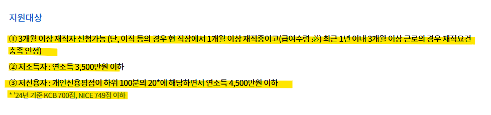
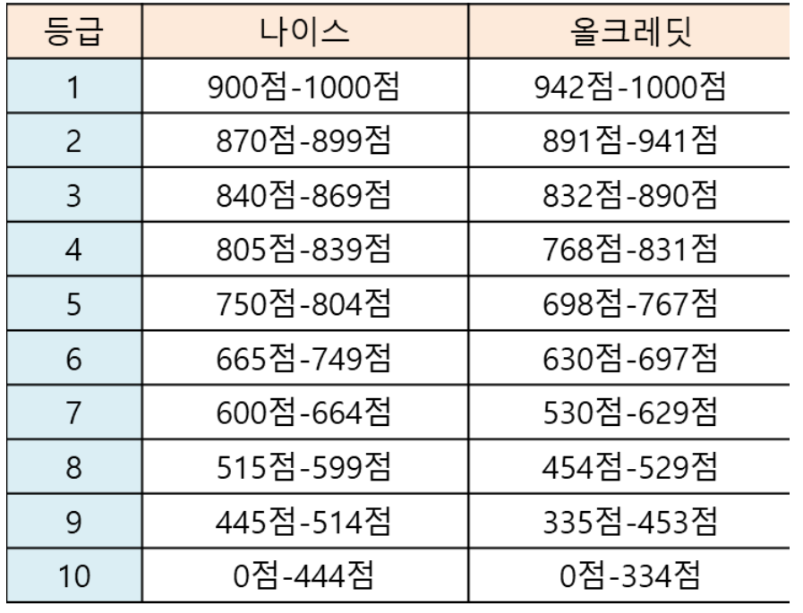
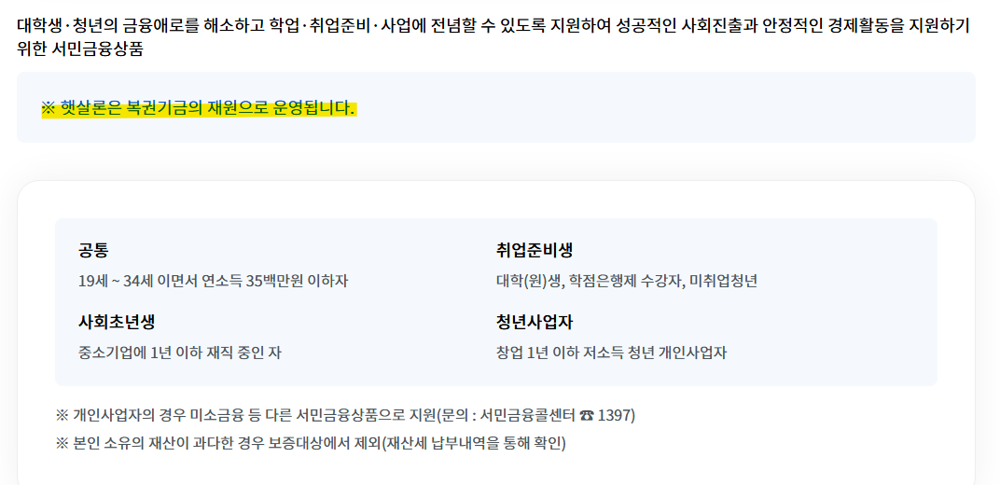
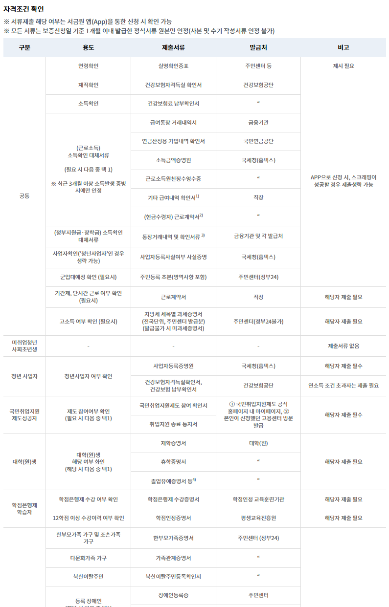
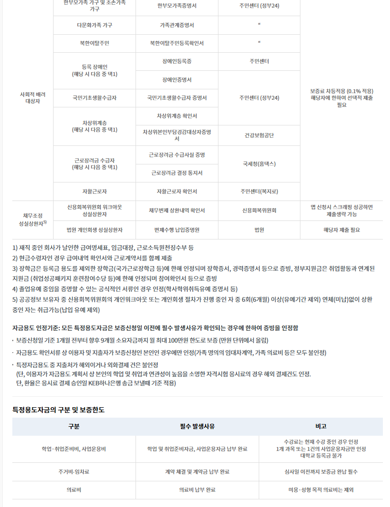
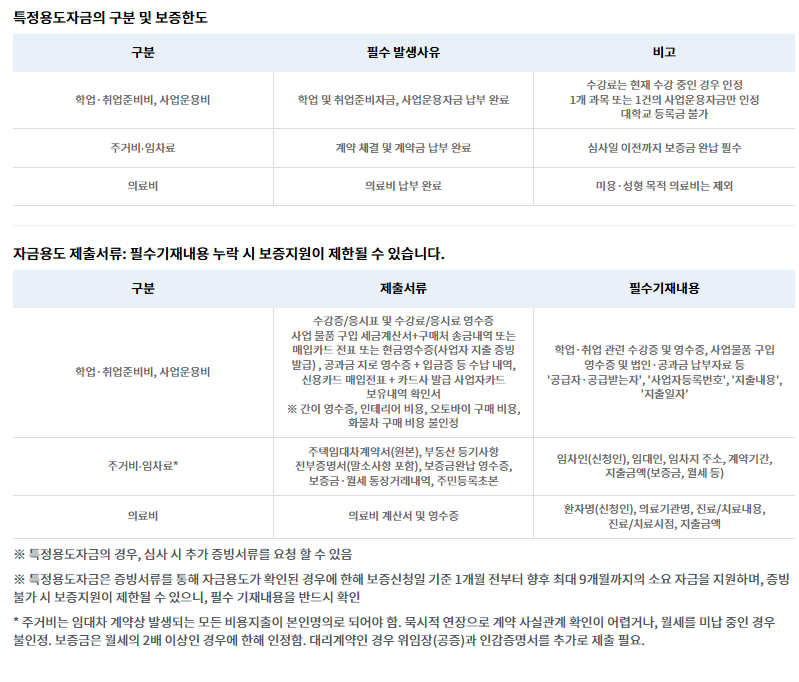
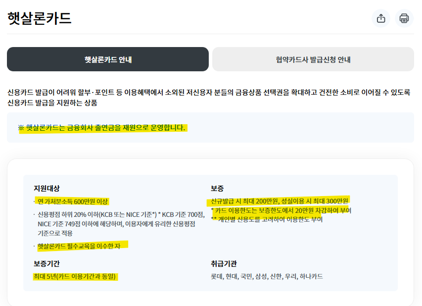
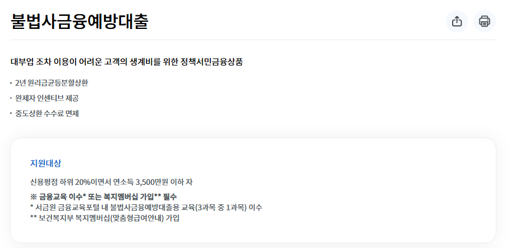
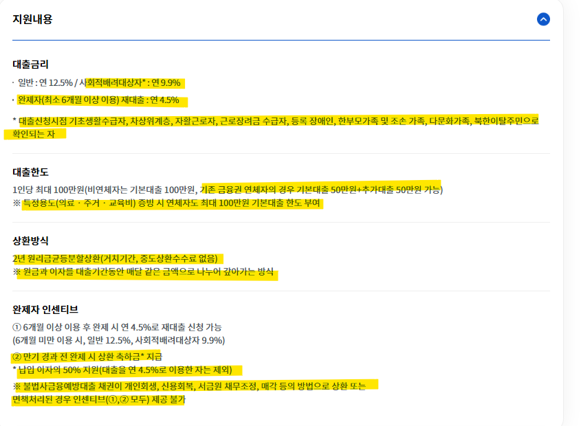

# 서민금융진흥원의 대출 자금에 대해 알아보자
**Date:** 2026. 5. 12. 19:01
**Category:** 다이어리
**Original URL:** https://blog.naver.com/xpfkwh56/224283270355
---

<https://www.kinfa.or.kr/financialProduct/employeeHessalLoan.do>

[**서민금융진흥원 홈페이지**

서민금융상품(근로자햇살론, 햇살론15, 햇살론유스, 미소금융), 서민생활지원, 휴면예금 지급서비스 제공

www.kinfa.or.kr](https://www.kinfa.or.kr/financialProduct/employeeHessalLoan.do)

​

**1. 근로자햇살론**

​

​

**3개월 이상 4대보험 내역** 이 있어야 하고,

연 소득이 3500만원 이하에다가

**​**

**\* 저소득, 저신용 조건을 제외하면**

**시중에 있는 대부/저축은행 등등 도**

**유사한 소득 기준을 보고 대출을 줌**

**​**

​

예전 기준으로 5등급 아래 여야 됨

​

8, 9, 10 등급은 의미가 없는 등급이고,

보통 연체 한 번 찍히면 7부터 시작인데

​

핸드폰 요금 밀렸거나, 공과금 밀렸거나

이러면 시작할 때부터 7이 찍힐 수 있음

​

**\* 시작이 5등급, 부모님이 핸드폰 요금만**

**본인 앞으로 꼬박꼬박 내줬어도 3등급 감**

​

5등급 언더 아니면, 거의 높은 확률로

1금융권 쪽 신용대출은 구경 못할 것이고,

​

농/수협이나, 저축은행, 캐피탈로 빠짐

거기서 이제 돈 나왔으면 바로 뒤가 대부

​

필요한 돈이 2천이라고 가정하면,

​

소위 2금융에서 1500 나온 다음에

대부에서 500 채우는 식으로 하고

​

이렇게 받으면 123등급도

6-7등급 언저리부터 가야 됨

​

그러다 1-2개월 연체 터지면 7,

연체를 못 막으면 8910 **신불** 됨

​

​

**2. 햇살론 유스**

​

​

**3. 햇살론 카드**

**​**

​

4. 불법 사금융 예방 대출

​

​

**5. 결론**

​

방만하게 돈 달라는 애들한테 펑펑 주고 있다 (x)

심사를 똑바로 하지 않고 막 퍼주고 있다 (x)