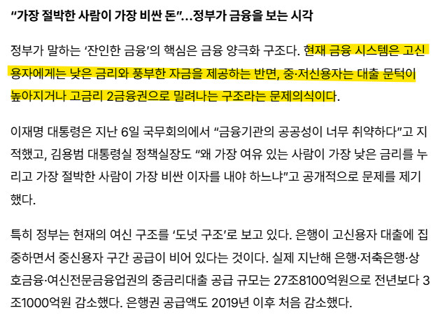
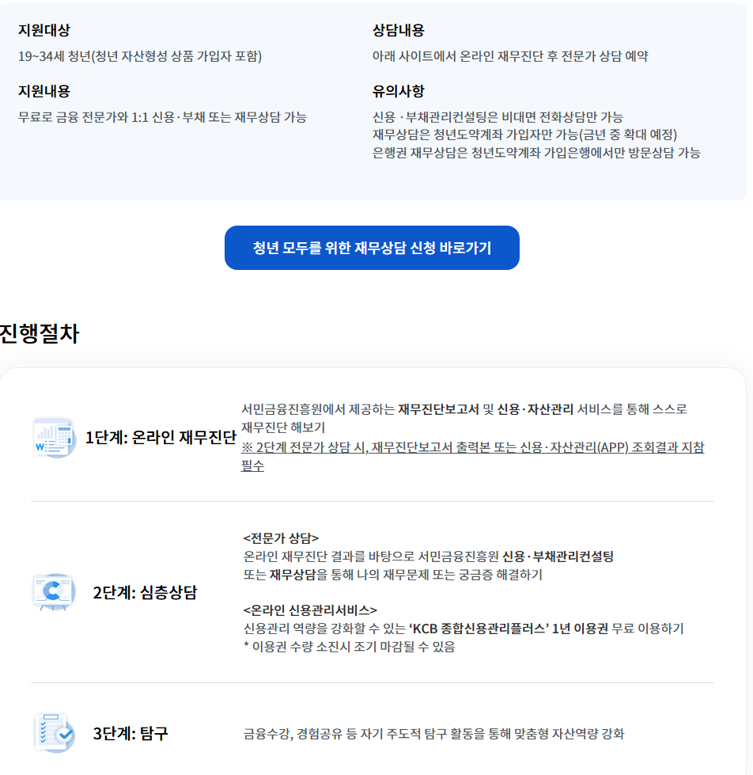

# 이거도 잘 읽어보면 디테일 있음
**Date:** 2026. 5. 12. 16:21
**Category:** 다이어리
**Original URL:** https://blog.naver.com/xpfkwh56/224283097677
---

​

1. 신용도 낮다 = 돈 갚을 확률이 낮다

→ 이자율이 높아야 비즈니스가 돌아감

​

신용도 높다 = 돈 갚을 확률이 높다

→ 이자율이 낮아도 비즈니스가 돌아감

​

시장 논리에 따라서, **'당연히'** 맞는 말

​

그런데 문제는?

​

<https://www.joongang.co.kr/article/25366169>

[**연 6만% 이자 챙긴 악질 사채조직…못 갚으면 '차용증 셀카' 박제 | 중앙일보**

급전이 필요한 사람들을 상대로 소액을 빌려준 뒤 지인과 가족을 협박해 최대 6만%의 이자를 뜯어낸 불법 사채업자 일당이 붙잡혔다. 이들은 은행 ‘ATM 스마트·간편출금’ 기능을 불법 사채 수금 창구로 악용하고, 소셜네트워크서비스(SNS)에 신상을 박제하는 등 악질적 추심을 일삼은 것으로 나타났다. 심지어 가족·지인이 포함된 단체 채팅방을 개설해 차용증 인증 셀카를 유포하거나 페이스북에 피해자 정보와 차용증 셀카를 박제해 망신을 줬다.

www.joongang.co.kr](https://www.joongang.co.kr/article/25366169)

​

80년대 뉴스도 아니고, 2025년 뉴스임

​

저걸 왜 빌려? 하는데 그걸

빌려야 되는 인간들이 있음

​

적어도, 제가 대부 쪽 일을

해봤던 경험에 의하면,

​

사실 저거를 갚든, 돈이 더 나오든

저 사람들 **어차피** 또 어디서 돈 구함

​

열에 아홉은 다 그렇게 사는데,

거기서 1명 정도는 백에 하나 쯤은

​

미끄러지지 않을 수 있는 인간이 나오고

그 사람 하나가 번듯하게 잘 살면

​

그 밑으로, 옆으로 번듯한

인간이 2명 3명 4명 나옴

​

반대로 저 사람 하나 자빠지면?

​

자기도 살겠다고 여기저기 사기 치든가,

사고 치든가 하면서 문제를 **'더'** 일으킴

​

**\* 강의팔이 대란 때도, 흙수저 서사는**

**내가 흙수저 였으니 너를 잘 이용해서**

**팔자를 바꿔볼 것이다 로 자주 나타남**

**​**

아주 자세히는 모르겠지만, 저렇게 빌릴 때

등/초본에 주민번호 다 오픈하고 가족들 사진,

이런 것들도 채권자한테 넘기는 경우 많은데

​

사고 치는 가족 둔 입장에선 **답도 안 나올 것임**

**​**

**1년에 6만%면 돈이 얼마야?** 하는데,

​

저거 돈 빌려주는 것이

5만원, 10만원 이럼

​

진짜 많이 빌려줘도 요즘은 모르겠지만

내가 대부쪽 일 했을 때 기준, **50** 쯤 나감

​

50만원 나가고 하루 5만원, 10만원씩

일수 찍고 그거 안 갚으면 저렇게 사진이랑

​

신분증 받아다가 SNS 에 뿌리거나

통장 만들어오라고 하고 대포통장으로

유통 하거나 별의 별 방법을 다 쓰는데,

​

**'약은'** 인간들이나, 쌩까지

​

어리숙한 사람들은

보통 **끝도 모르고 빨림**

​

내가 통장이 없어, 신용 불량이야

​

그럼 어차피 급할 때 돈 빌릴 구멍은

늘 정해져 있으니, **'신용 역프리미엄'** 을

지불하며 살아가는 팔자도 적진 않았음

​

**\* 압류방지계좌 가 생겼는데,**

**몇이나 수혜를 받을진 모르겠음**

**​**

2. 여태껏 남의 돈 귀한 줄 알고,

열심히 잘 갚던 사람이 10억 빌렸고

​

흥청망청 밥 먹듯이 연체만 하다가

개인회생에, 파산에 버는 족족

​

사다리에, 토토에 쓰고 다니던 애가

10억 빌렸는데 둘 다 똑같은 이율?

​

심지어 후자에 더 낮은 이율?

이거는 정신 나간 이야기 맞는데,

​

돈 100만원만 저리로 뿌려줘도

불 끌 수 있는 사람의 숫자가 **많음**

​

1명한테 1억 빌려줘서 이율 5%

100명한테 100만원 빌려줘서 이율 3%

​

이렇게 보면, **'어 그럴 수 있네'** 싶단 것임

​

<https://www.kinfa.or.kr/main.do?searchKeyword2=null>

[**서민금융진흥원 홈페이지**

서민금융상품(근로자햇살론, 햇살론15, 햇살론유스, 미소금융), 서민생활지원, 휴면예금 지급서비스 제공

www.kinfa.or.kr](https://www.kinfa.or.kr/main.do?searchKeyword2=null)

​

심지어 나라에서 이런 것도 만들었음

​

각자도생이 되는 메이저 리그에서는

별 의미도 없는 정보지만, 마이나 에서는

있고 없고 차이가 굉-장히 클 수 있는데

​

막상 보시면, 이율이 **막** 만만하지도 않음

​

굳이, 역차별적 요소가 있다고 하면

중/저신용자나, 회생/면책자 같은 경우,

​

자산 형성을 꼬박꼬박 하면

추가적으로 서비스 넣어주고,

​

큰 빚을 성실하게 잘 갚고 있었으면

이자 조금 빼주거나 이렇게 하는데

​

이건 확실히 **'복지'** 영역이라고 보임

​

​

한편 이거만 해도 그래요,

​

어디선 재무설계, 재무상담 이랍시고

모객 해서 보험 갈아 태우게 시키는 것이

​

어떤 경우에는 **'노하우'** 라고 풀리는데,

​

알려주는 사람 없어가지고

어디서 빨래질 당할 사람 있으면

​

나라에서 건실하게 살아갈 수 있도록

도와주는 것이니 별로 나쁘게 안 보임