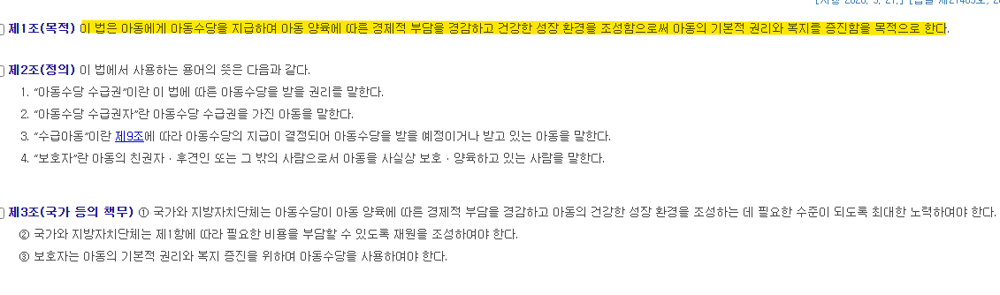
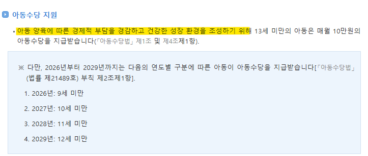
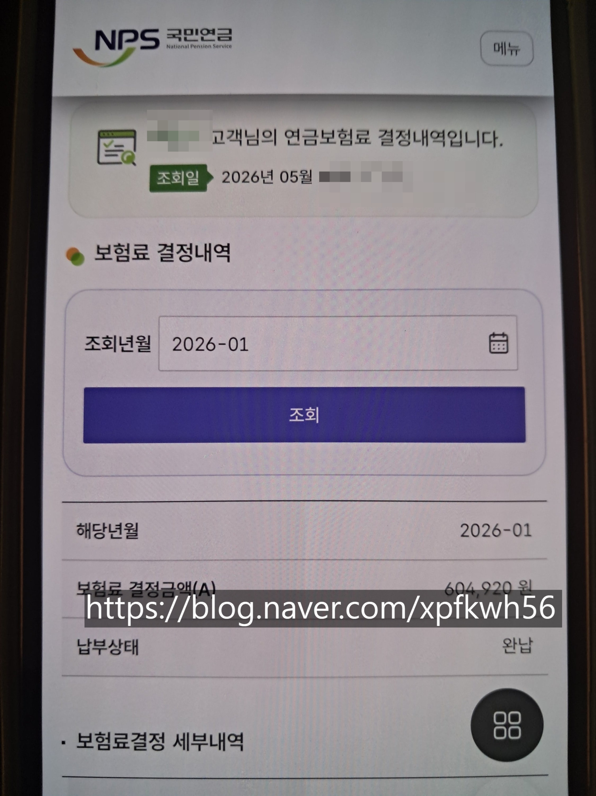
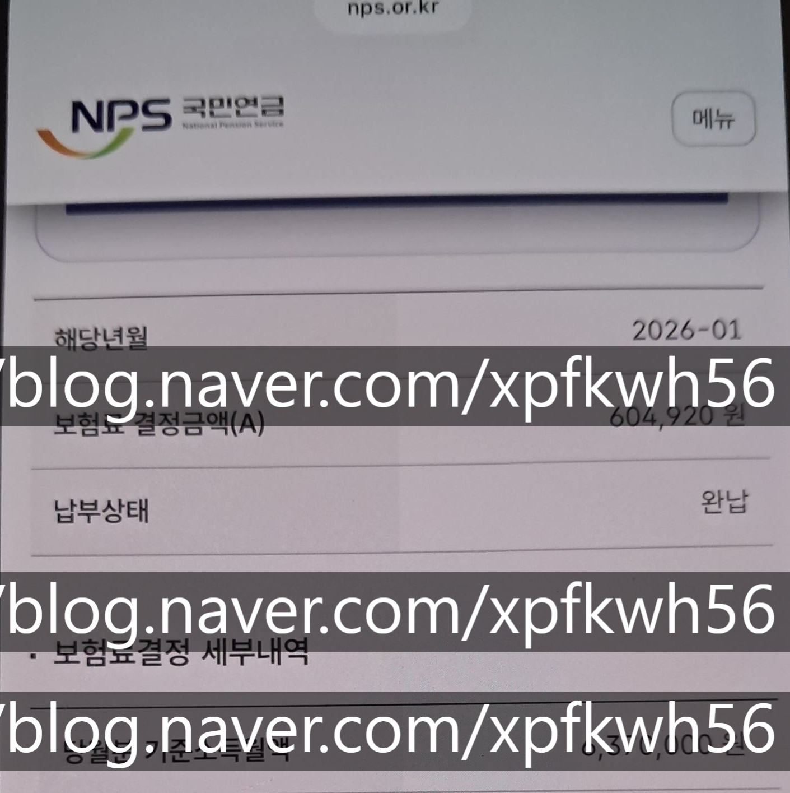
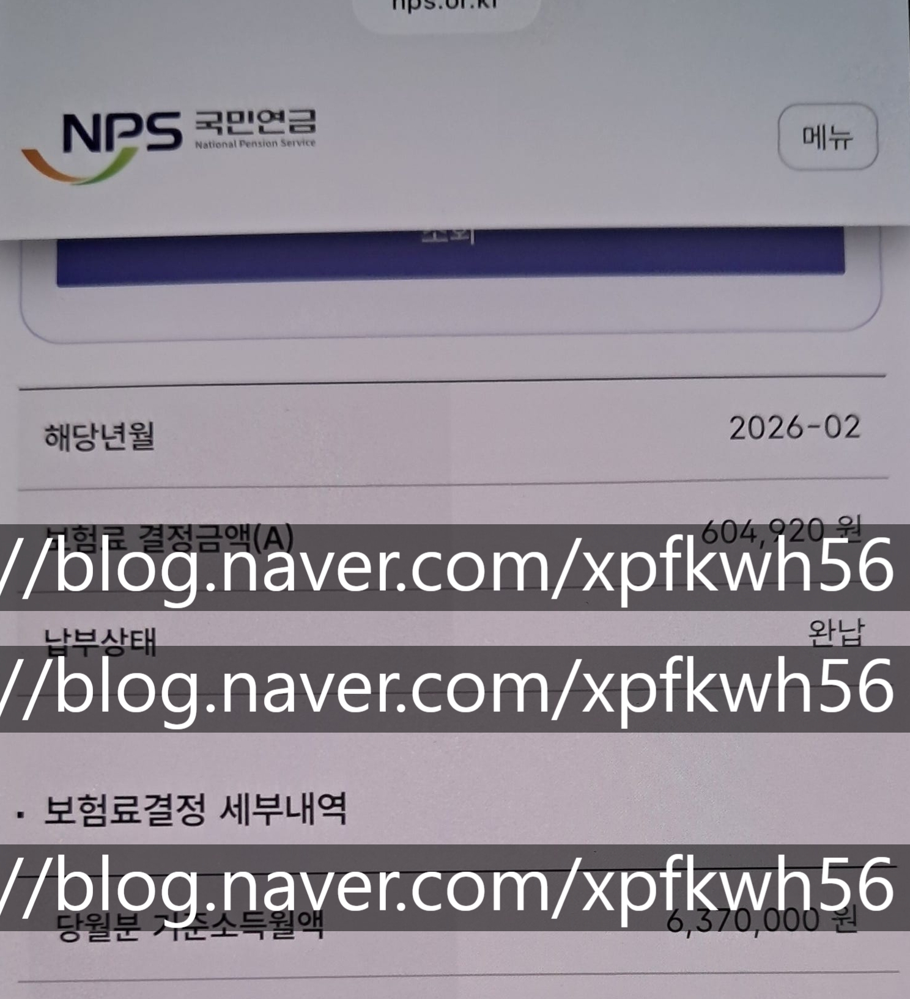
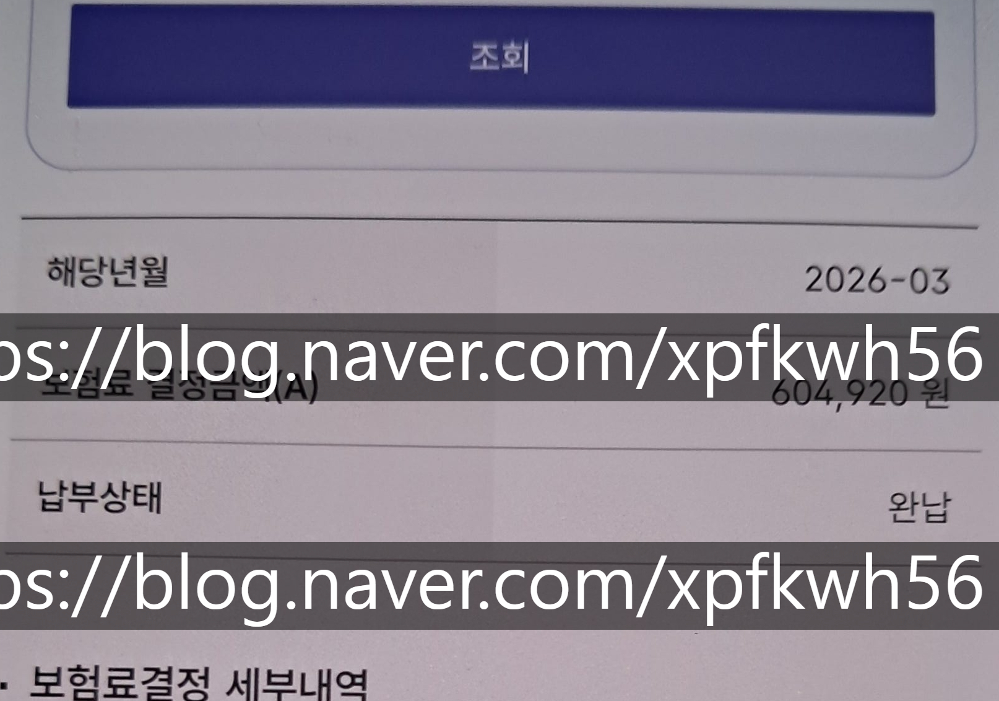

# 창업 생각 있는데, 도저히 아이템이 안 나와요
**Date:** 2026. 5. 13. 18:50
**Category:** 다이어리
**Original URL:** https://blog.naver.com/xpfkwh56/224284447348
---

1. 마음 차분하게 먹고, 세상 돌아가는 일에

여유롭게 관심을 갖고 구경을 하시면 좋을 듯함

​

**\* 잡념이 많은 사람이 하기 좋다고 생각**

​

2. 지금 아가를 낳으면 돈 주는 제도가 있음

​

​

이런 식으로 그냥 캐시를 따박따박

통장에 넣어주는데, 증여로 녹여도 되고

**현찰** 이라는 특성상 사용 가치가 뛰어남

​

제 경우, 처음 독립했을 때는

갖고 있는 돈이 하나도 없어서

​

큰 오빠 생활비 버스 탔고,

​

나중에 아예 독립할 때, 내가 처음으로

목돈 잡았던 것이 500 안 된걸로 기억함

​

**\* 300 인가, 500 인가**

**거의 보증금만 들고 있었음**

**​**

**실상 보증금 = 전재산 이었고**

**​**

**근데 1호기는? 다 떠나서 시작부터 내가**

**보증금 들고 있던 것의 2배 이상 갖고 있음**

**걍 시기 좋게 태어났다는 이유 하나만으로**

​

**3. 근데 보셈?**

​

​

아동수당, 부모급여

둘 모두 입법 취지를 보면

​

**아동의 경제적 부담 경감과**

**양육 환경에 쓰라고 써있지,**

​

모아놨다가 목돈으로 쓰세요

라는 내용이 **없음**

​

4. 그럼 생각할 수 있는 것이 이런 것임

​

1) **'사각지대'** 가 생겼구나

​

저는 **'통계적'** 기준으로 했을 때,

경제적으로 여유로운 축에 속하고

​

매직 넘버 637

​

제 블로그 발행 빈도에서 확인되는 것처럼,

​

집에서 애 키우는 전업주부 치고 어지간한

직장인 정도의 수익은 무난하게 뽑고 있음

​

**\* 여하튼 제 생활이 부족하진 않습니다**

**​**

**애 앞으로 들어오는 돈을 그대로 놔두면?**

​

1.xx억 증여를 했다고 가정할 때,

돈의 가치가 +20%

​

약 5.xx억 증여를 했다고 칠 때 +30%

10.xx억 증여 했다고 칠 때 +40% 임

​

**\* 명목가액 기준**

**​**

> ?? 그게 무슨 말이에요
>
> 애 앞으로 들어온 수당으로 주식해서 번 돈은 증여 대상이라는데?

​

뭘 굴리고 말고 할 것이 아니고,

​

애초에 내가 1억 1원 줄 생각이 있으면

실제 내가 써야 되는 돈은

​

1억 1원 + 2천만원 임 (20%)

​

근데 애 앞으로 바로

비과세 증여 꽂히면,

​

**\* 아동수당법 해석 준용**

​

아무런 비용 없이 돈을 줄 수 있음

​

그럼 아이 입장에서는 원래 라면은,

자기 앞으로 형성될 자산에 +n 생길 때

​

소정의 세금을 부담했어야 하는 반면에,

​

그게 없어지니까 자산을 더 많이 증여하는

집에서 태어난 아이일수록 **더 많이** 쥐게 됨

​

이론상, 30억 초과 하는 경우에는

50% 로 만약 총 수당을 하나도 안 쓰고

전부 물려주면 실제 받은 것은 3천 이지만

​

그 3천이 형성되는 비용까지 감안하면

실질적으로 3천+1500 해서 **4500** 이 됨

​

**\* 액수도 액수지만, 이런 역진성이 디테일**

**​**

**그렇다면 봅시다?**

**​**

A 가정은 복지 수당으로 들어오는 돈을

실제 양육에 사용해야 집이 돌아가고,

​

B 가정은 그걸 저축할 수 있는 여력이 있고,

​

C 가정은 최소한의 비용으로 자산을

이전하는 것이 고민이 되는 집이라 침

​

이때,

​

A 가정에 있는 아이는 20살 땡 할 때,

손에 쥐고 있을 수 있는 것이 거의 없게 됨

​

**\* 키운다고 다 썼으니까**

​

B 가정은 저축된 돈을 그대로 주거나,

그걸 요령껏 잘 굴려서 물려주게 될 것 임

​

C 가정은 **'이미 받은 것도 많은데 거기에**

**더해서, 더 낮은 비용을 부담하고 더 얻음'**

​

제가 이런 상황을 보면 드는 생각은 이거임

​

> 이거, 앞으로 오래 못 갈 제도다

​

시간 문제지, 어느 시점에는 매우 높은 확률로

현금 지원이 아니라 **바우처** 로 바뀔 것으로 보고,

​

그 바우처의 사용처를 **아주 좁힐** 가능성이 높음

​

극단적으로는 특정 지역에서만, 특정 수준의

매출 구간에서만 소비하라고 제약을 줄 것이고,

​

그게 아니더라도 최소한 **'저축'** 을 하는 것은

못 하게 막거나 차등해서 제도화 할 확률이 높음

​

당장 지금만 해도, 부모가 저 돈 가져다가

토토를 하든, 유흥비로 쓰든 관리가 안 됨

​

2) 그럼 바우처의 용처는 어떻게 될까?

​

가장 정당한 것은 **'양육 그 자체에'** 쓰는 것 임

​

아동 수당을 아동을 위해서만 쓸 수 있는 곳에

분배하는 것이 옳습니다, 라고 주장한다고 치면

​

이 주장에 대해서 반박하기는 다소 까다로움

​

**\* 그 범위에 대한 논쟁이 있을 순 있겠지만**

​

통상적으로 입법에 시간이 걸린다는 점을 보면,

여론이 형성된 시점에서 **약 2-3년** 정도는 걸리고

​

**\* 시기가 mim 2년 같단 것이지 언젠진 모름**

**​**

밑밥을 깐다면, 아동 유기/방임/학대한 부모가

수당을 받아서 그 돈으로 모바일 게임에 사용했다

​

지 새끼는 안 키우고, 게임 캐릭터 키우는 값으로

다이아 사고 아인하사드 먹였다 같은 식으로 만약

뉴스가 나온다면 물살을 **'빠르게'** 탈 확률이 높음

​

고렇다면, 내가 **'선점할 지점'** 이 나옴

​

0-1세 바탕으로 100만원 쯤 돈이 있을 때,

가장 **'알차게'** 쓸 수 있는 꺼리를 만들면 됨

​

그걸 언제?

​

지금부터 준비를 하면서 들어가는 것 임

​

영유아 시장은 어떤가, 경쟁자들은 어떤가,

소비자들은 어떤 의사 결정을 하는가,

​

산업 구조는 어떻게 형성된 상태인가,

가장 수혜 받을 수 있는 하부 섹터는 뭔가 등

​

할 수 있는 만큼, **많이/깊게/빨리/오래** 하면 됨

​

잉공지능 알아봤던 시기만 해도, **꽤 일찍** 이었고

​

지금 가장 원가 기준, 비싼 가격으로 형성된

이미징 모델이나, 에이전트 모델 관련해서도

​

**'일반적인 경우'** 보다는 일찍 선점할 수 있었음

​

**\* 물론 반도체 파운드리 대폭발은 전혀 예상 X**

**애초에 빅테크 모델 자체도 회의적인 입장이고**

**다만 컴퓨터 부품 매수 타이밍은 비교적 좋았음**

​

무언가를 **'준비'** 하는 것은

​

닥칠 때 하는 것 보다 대부분은

미리 하는 것이 더 좋을 때 많음

​

저 또한, 당연히 하루가 24시간 이고

체력과 물리적인 한계가 존재하는데

​

**\* 물론 애가 순한 편이긴 함**

**​**

양육, 육아 하면서 생기는 온갖 호기심과

정보, 찾아내야 될 것들을 시시각각 상황마다

파악해서 해결해야 되었다면 부담 컸을 것임

​

**\* 해도 그만 안 해도 그만인데,**

**여유가 혹시 되면 임신 전에 임신 예습**

**출산 전에 육아 예습하면 수월할 것임**

**​**

장사도 똑같음

​

**'돈이 없을 때, 생계가 빠듯할 때'**

준비하면 마음이 급해져서 잘 안 됨

​

근데 여유 있을 때, 나랑 당장 관련 없는 것

긴장 풀고 5분 10분 이라도 들여다 본다면

​

별 것도 아닌 **'여유'** 자체가 시야를 넓혀줌

​

늘 말하는 내 주변을 찬찬히

구경하라는 것이 이런 것들 임

​

<https://blog.naver.com/xpfkwh56/222964860787>

[**임원, 관리자, 실무자**

기업 - 오퍼레이터 임원 : 회사 내부의 문제를 파악해서 그것을 보고함에 그치지 않고 그것을 해결하는 사...

blog.naver.com](https://blog.naver.com/xpfkwh56/222964860787)

​

대충 검색해서, 언제 썼는지는 모르겠지만

제가 창업해서 조직 운영할 때 썼던 사고 임

​

저한테 **'AI 에이전트 개념'** 이

아마 낯설진 않았을 것임

​

하던 짓은 똑같고

그냥 기계로 바뀌었네

​

딱 그거에 불과 했음

​

사무실 구하고, 사업자 낸다고

그 날부터 장사꾼 되는 것 아님

​

어제도, 오늘도 하고 있던 사람이

그냥 내일 도달하는 것에 불과함