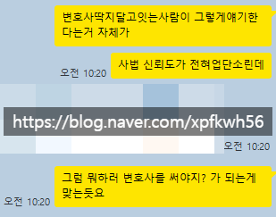
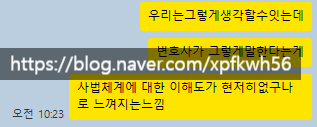
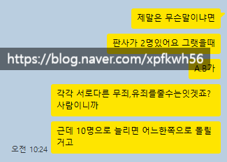
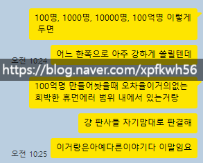
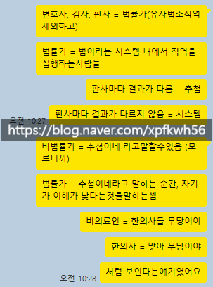
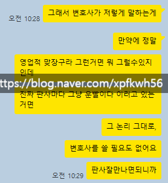

# 직업 윤리
**Date:** 2026. 5. 14. 1:08
**Category:** 다이어리
**Original URL:** https://blog.naver.com/xpfkwh56/224284752339
---

1. 사람이 그야말로 간사한 것이

어떤 **'업'** 이라는 생산 활동을 하면,

​

남은 몰라도 난 알게 되는 것들이 있음

​

2. 제 경우 에는, 장사를 할 때

다른 것보다 이게 참 어려웠는데

​

붙들고 있다 보면, **'깎고 싶어짐'**

​

지금 넘겨도, **'납품 컷'** 은 통과인데

​

조금만 더 시간이 있으면

내 눈에는 저게 좀 밟히는데

​

이거를 조금 더 보완해야 되는데,

라는 **'어린'** 완벽주의가 발동되면

​

마치 내 작업물이 내 새끼 같아서

차마 품 밖에 내보낼 수가 없는 것임

​

**\* 돌고 돌아, 어디서 멈출 것인가?**

**를 결정하는 게임으로 귀결되는 듯**

**​**

3. 현실적으로 이런 문제도 있음,

​

누가 알아줘? 라고 질문을 했을 때,

​

내가 알아 라고 하는 것도

아닌 말로 원데이 투데이지

​

그거도 팍팍할 때는 **잘 안됨**

​

몇 가지 경험에 대해서 더 다뤄보겠음

​

**1) 회사 다녔을 시절**

​

나는 알바를 했을 때, 제법 호되게

혼이 났던 적도 있고, 꽤 나름대로

신망을 받으면서 일을 했던 적도 있음

​

처음 취직 같은 취직을 했을 때,

**'정말'** 여기서 잘 하고 싶었는데

​

운이 좋아서 어찌어찌 풀리고 있었음

그러다, 사무실에서 이런 일이 있었음

​

다른 팀에서 어떤 직원이 일을 했는데,

​

쨌든 그 일을 보고 있지 않은 선임자가

새로 들어와서 그걸로 무지 화를 냈음

​

일을 어떻게 하는 것이냐,

​

월급을 받았는데 왜 일을 안 하냐,

놀이터냐 이런 식이던 걸로 기억함

​

나는 문득, 내가 예전에

**'내 딴에는 잘 한다고 했는데'**

​

않이 시발 어쩌라고, 라는 소리가

목구멍 까지 꽉 찼던 기억이 났음

​

전쟁에서 패배한 장수 라고 한들,

그 역시 전쟁을 안 해본 자가 아님

​

적어도 당시에 나는, 내가 나중에

누군가를 부리는 자리에 올라간다면

저렇게는 하지 않아야겠다 다짐 함

​

**물론, 늘 그렇지는 않았지만**

​

죄 짓고 애먼 곳 가서 속죄하는

신도처럼 인지하지 않으려 했고,

​

최소한 업무에 내 감정이 개입해,

불필요한 대응을 했다 싶은 날이면

​

그걸 **'기억'** 하려고 하기는 했었음

​

2) **최근에 내가 경험했던 일** 임

​

​

나는 꼭 뭔가 하나의 가치를

어필하기 위해서, 다른 가치를

깎아 내려야 되는 줄 모르겠음

​

서울이 좋아, 라고 하면

그냥 서울이 좋다 하면 될 것을

​

지방은 이래서 안 좋고,

서울이 좋아 라고 들어가야

더 나은 것도 아닌데 말임

​

결혼해서 좋으면 그냥 좋은 것임

​

미혼은 이래서 안 좋은데,

결혼을 해야 돼 로 흘러가거나

​

결혼은 이래서 안 좋으니까

혼자 살아야 돼 같은 수사적인

사족이 **'굳이'** 있어야 되냐? 임

​

**\* 물론 경우에 따라 다르겠지만**

**​**

일종의 작은 트릭이라면 트릭인데,

​

칭찬은 거시적으로,

흉은 미시적으로, 하면

​

확률적으로 적을 덜 만들 수 있음

​

변호사들은 의사들과 달리,

자기 업계 종사자들을 무시한다

​

판사도 대충 판결한다고 하고

국선들도 다 실력 없다고 하더라

​

라는 것과,

​

변호사는 이렇더라 라고 하는 것과

**'저'** 변호사는 그렇더라 라고 하는

그 차이는 의외로 그리 작지 않음

​

지나치게 배타적일 필요는 없겠지만,

​

내가 내 업에 대해 존중 한다는 것은

나와 함께 가는 사람들도 동시에

존중 한다는 것을 의미한다고 생각함

​

**\* 우덜식으로 덮어주고 그런 것 말고**

​

4. 이런 일들에는 **미묘한 균형** 이 요구됨

​

**\* 타산지석 또는 그 외의 어딘가**

**​**

불가피하게 사정이 있었을 수도 있고,

그 나름대로는 이유가 있었을 수도 있고,

​

또 **'모든 일'** 에 그렇게 다 챙겨주면서

내 손해 까지 감수할 필요는 없기도 함

​

하지만 그 모든 것들을 결국 하긴 했을 때,

​

남은 몰라도 **'나는 아는 지점'** 이 남고

나는 그게 직업 윤리의 영역이라고 생각함