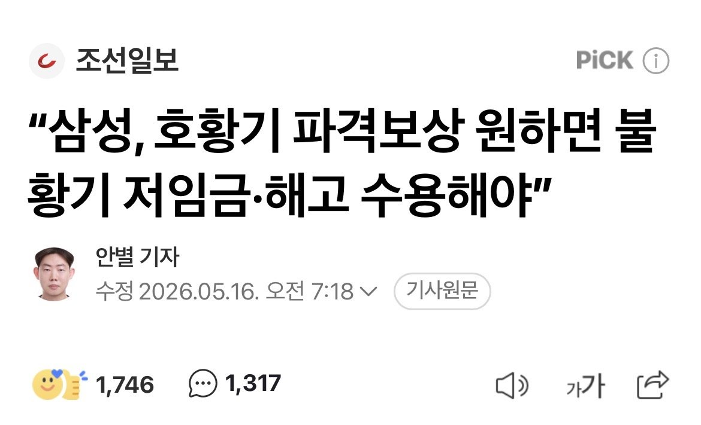
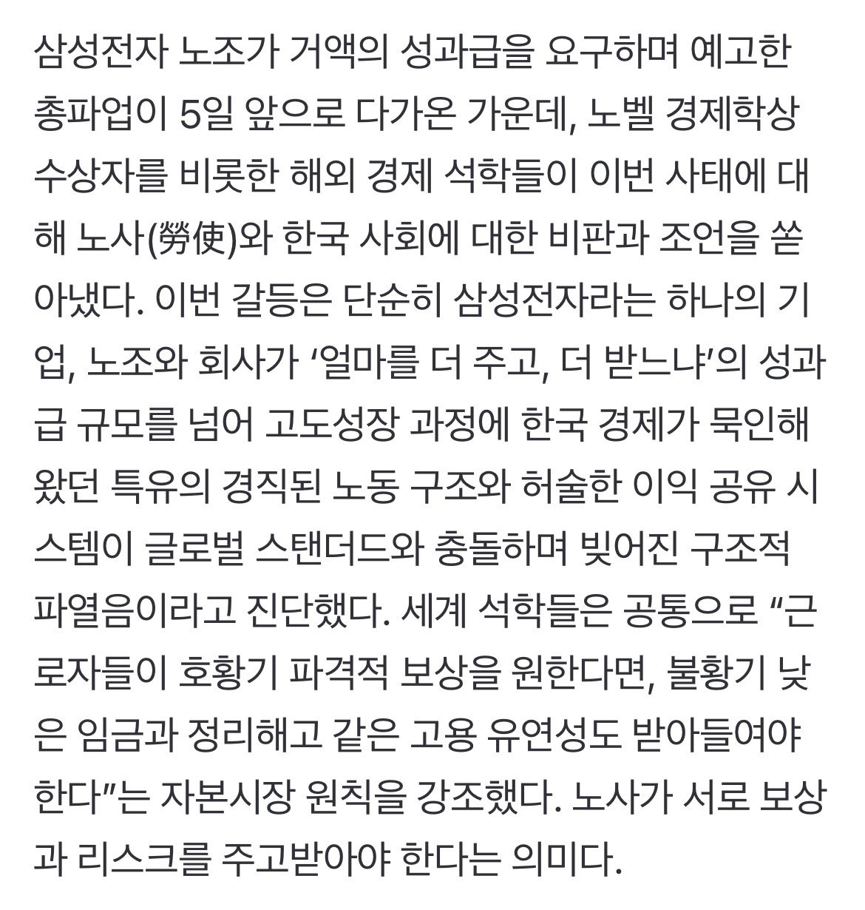
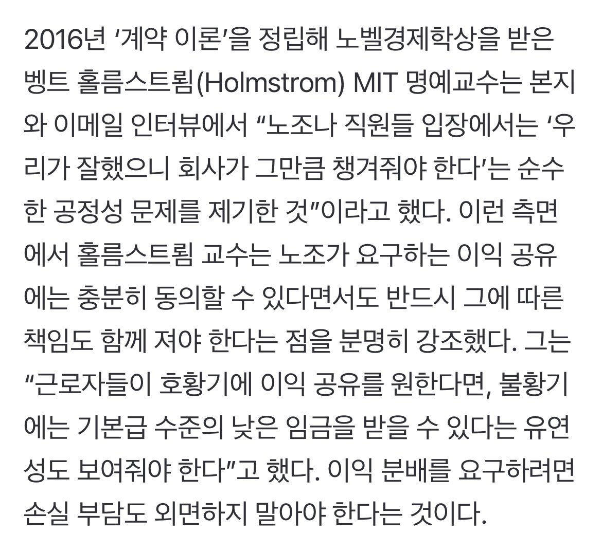
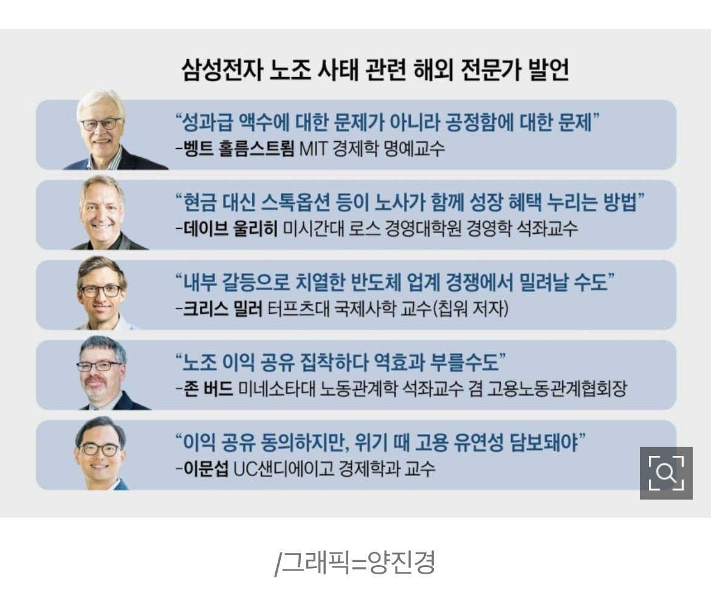
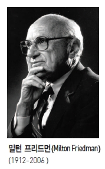
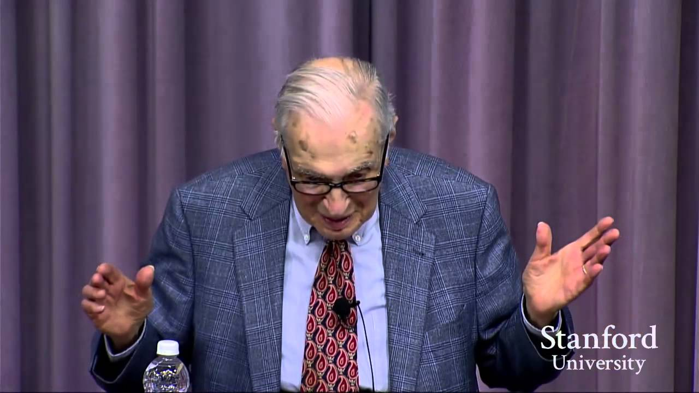

# 머무르는 사람과 떠나는 사람
**Date:** 2026. 5. 16. 20:14
**Category:** 다이어리
**Original URL:** https://blog.naver.com/xpfkwh56/224287560056
---

​

1. 크기는 당연 다르겠지만,

좋소에서도 있는 일인데

​

업황이 좋아서 돈을 왕창 벌 때면

이게 **'버는 것'** 만 보이게 되는 경향이

인간인 이상 없지는 않는 것 같았음

​

2. 그럼 **'야생'** 에서는 보통 저런 일을

어떤 식으로 해결하기를 선호할까?

​

창업자 바닥에서 티어는 명확히 갈림,

​

1) **'내 돈 넣은 놈'**

​

그 장사에 돈 넣은 놈이 **대부분 1위** 임

​

모든 의사결정에서 가장 큰 영향력 있고,

돈을 넣었다는 자체가 정당성을 보조함

​

2) **'손님 데려오는 놈'**

​

모든 사업의 기초는 **세일즈** 이고,

고객을 안 데려오면 지속 불가능 함

​

이 영업이라는 것은 워낙 귀한 재주라,

**개인기** 에 따라서는 돈 넣은 놈도 이김

​

3) **'엉덩이 붙이고 있는 놈'**

​

모든 일이든, 누구 1명이 반드시 거기에

꼭 지키고 있어야 되는 작업이 있기 마련,

​

그리고 매일, 정해진 시간, 그걸 계속 반복

이걸 하는 사람이 그 다음의 위치를 차지함

​

**\* 이게 인식이 쌓이는 것이라 어려움**

​

4) **'뽑아서 쓸 수 있는 사람'**

​

흔히 직장에서, 고용 이 발생하거나

유지 보수, 지속형 업무가 있을 때

그 자리를 하게 되는 역할들을 의미함

​

**\* 객관적으로 가장 몸이 가벼운 사람**

**​**

가장 큰 배분이 위에서부터 차례대로 가고,

각 역할에 맞는 **'기능'** 에 맞게 우선을 가짐

​

3. 결국 경제적 자원이든, 비경제적 자원이든

거기에 오래 머무르고 있는 사람이 나중이 될 때,

보상을 배분 받는 것에 대한 **'우선권'** 을 갖곤 함

​

좋소는 내일을 기약할 수 없는 형편이므로,

고용 보장에 대한 메리트가 그리 높진 않음

​

**\* 지 발로 나가는 사람이 더 많음**

​

마치 창업가 정신이,

상아탑에서 나오기보다

​

**이 새끼 이거 좋도 아닌 것 같은데,**

**돈 꽤 많이 버네? 나도 한 번 해봐?**

​

에서 나타나기 더 쉬운 것과 같이,

​

오래 거기 머무르고만

있어도 구조를 배우는데,

​

**\* 불필요한 것으로 자원 쓰다 보면,**

**생계에 위협이 나오고, 알아서 자연스레**

**시장 논리가 본인을 생존 특화로 밀어냄**

**​**

**그걸 못 견디면 이제 돌아가는 사람이 됨**

​

대체 **'얼마'** 를 **'누구에게'** 약속해야 되는가

라는 것을 규정하기가 큰 회사일수록 아마,

​

훨씬 더 정하기 어려울 것으로 보임

​

호황기에 취직해서, 성과금 팽팽 잘 받다가

​

불황일 때는 고용보장으로 존버 타면서

업황 좋은 곳으로 이직을 할 수도 있는 거고,

​

**\* 순전히 근로자 입장에서는**

​

만약 어떤 프로젝트를 10년 준비했는데,

9년 내내 꼴기만 해서 한직 취급 받다가

​

1년 만에 10년치를 다 회수하게 된다면

그걸 **'버틴 애'** 한테 줘야 되는 것인지,

​

**'지금 들어온 애들한테도'** 줘야 되는 것인지

결정하기 난해한 요소들이 좀 있을 것 같음

​

'밀턴 프리드먼 어록' 치면 기가 막힌 문장 많음

​

고렇다면, 왜 남조선에서는

신자유주의 라는 **'상식적인'** 메타가

그리 쉽게 통용될 수 없는 것일까?

​

의외로 간단한데, 우리가

그냥 **미국이 아니라서** 그럼

​

이게 널리 할 얘긴진 모르겠지만,

남조선에서 부를 잘 누리는 최적 경로는

​

**1) 규제의 헛점과 해자를 잘 쓰는 것**

**2) 관을 끼고, 메인 스트림 들어가는 것**

​

극단적으로 표현하면 이 둘로 정리되는데,

​

**\* 아닌 것 같으면 선생님 말씀이 옳습니다**

​

이 과정에서 관치의 손아귀에서

벗어나는 일이 정-말 쉽지가 않음

​

다른 사람들은 모르겠지만, 적어도 내 경우는

저 두 방법으로 돈을 벌었기 때문에 확신을 함

​

재주도 있겠지만, **'구조와 환경'** 이 없었다면?

장담컨대, 그 사람은 **'절대'** 부를 누릴 수 없음

​

4. 재벌가들은 **'재벌'** 이라는 독립적인

시장 집단이 하나 따로 있는 것이 아니고,

​

실상 국가에서 운영하는 어떤 모델 하나를

위탁해서 굴리는 **초거대 B2G** 에 불과한 편임

​

그러니, 저런 **'부자연스러운'** 이야기들이

나오는 것이고, 복합적 사회 갈등이 뜨는 듯

​

케네스 에로우

​

시장은 모든 것을 해결할 수 있을까?

​

완벽한 시장 균형과 완벽한 민주적 제도가

우리에게 동시에 성립할 수 있을까?

​

**1972년** 인류가 닿은 해답은, **'불가능'** 하다