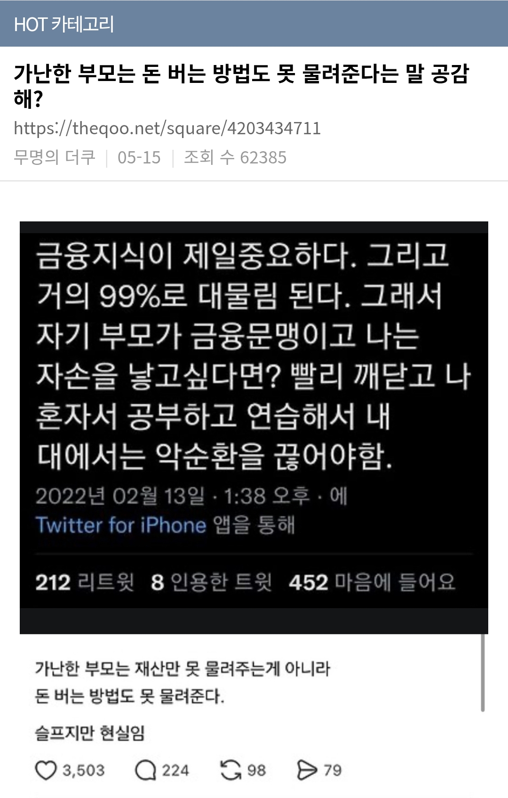

# 가난한 부모는 돈 버는 방법도 못 물려준다?
**Date:** 2026. 5. 17. 0:50
**Category:** 다이어리
**Original URL:** https://blog.naver.com/xpfkwh56/224287730828
---

​

1. 나보다 넉넉한 집은 모르겠지만,

적어도 내가 봤던 내 근방의 집구석은

그 여유를 갖고도 가르칠 엄두 못 냄

​

사업이나, 투자로 돈을 번 집은

그렇다면 자식을 어떻게들 키우냐?

​

**공무원 or 전문직**

​

부모님들 취향 따라, 크게 이렇게 갈리고

그 다음에 **'아, 너는 저 방향 아니구나'**

​

그럼 너는 인생을 편하게 살 자격이 없다

그래도 내 새끼인데, 굶게 할 수는 없지

​

같은 느낌으로 **'만약'** 그 시점까지 본인이

실제 실무를 뛰고 있으면 이거라도 해라,

​

같은 느낌으로 그냥 **'일자리'** 를 줄 뿐임

​

2. 그럼 본인이 돈을 **'벌어본'** 부모는 어떨까

​

경험이야 들려줄 수는 있겠지만, 말 정도야

사실 **아무나 해줄 수 있는 말** 정도 범위 내고,

​

특히 크게 착각하고 있는 부분을 지적하자면,

​

**'버는 방법'** 이라는 것의

수명 주기가 그리 길지 않음

​

이 게임이 정답을 찾는 게임이 아니라,

**'정답으로 가는 과정'** 을 반복하는 게임이다

​

라는 것을 **알고, 모르고** 차이인 것 같은데

​

열심히 수련을 해서, 내 대에서 이걸 끊겠다

라는 것 자체가 사실 잘못된 접근 방법 임

​

**'벌어서, 그 돈을 실제로 지니고 있냐'**

​

그게 **'전부'** 임

​

3. 예전에 썼던 비유를 그대로 가져옴

​

내가 통장에 1천만원이 있다,

그럼 1천만원을 가진 사람의 생각

​

이걸 찾을 것이 아니라 본인이 하는

그 생각이 1천만원 가진 사람 생각 임

​

마찬가지로 10억 있는 사람처럼

생각을 해서 10억을 갖겠다, 라는 것은

​

1천만원 없는 사람이 1천만원을 가진

사람처럼 생각해서 1천을 갖겠단 소리임

​

**'한다고 되겠음?'**

​

우리동네 명륜진사갈비 알바가 공고 기준,

월급 330 정도 주고 있는 것 같은데 집밥 먹고

6개월 정도 일 하면서 잘 모으는 것이 더 빠름

**​**

**\* 본인이 무슨 생각을 했고, 안 했고를 떠나서**

​

10억을 가진, 100억을 가진 사람의 생각을

따라하고, 좇겠다 라고 생각을 할 것이 아니라,

​

그냥 10억 가진 사람이 하는 생각

= 10억이 있으니까 그 생각에**라벨링**

​

이렇게 여기는 쪽이, 실제로도 맞고

본인에게도 유효할 가능성이 무척 큼

​

4. 실제 일을 해도 마찬가지 인 것이,

어디서 무슨 일이든 본인이 하고 있으면

​

대체로 짧으면 1분기, 길어도 2년 안에

신입 시절에 했던 상황과 생태적 관점에서

큰 변화들이 계속 나타나고 있었을 확률 큼

​

그걸 그 업종에 종사하는 사람은,

조금씩 겪으면서 **경험으로** 녹이는데

​

**\* 이거도 아무나 되는 것은 아니지만**

​

처음 그 업종에 들어오는 사람은

마치 어떤 하나의 고정된 **'매뉴얼'** 이

하나 정해져있고, 그거만 알고 나면

​

초보 탈출, 숙련자처럼 일을 할 수 있다

이렇게 여기는 경향이 많았던 것 같았음

​

사실은 그게 일을 **'배우는 것'** 이 아니라

그냥 **'익숙하게 하는 작업'** 인데도 말임

​

5. 가난한 부모가 없는 것은 돈이 아님

​

부모가 응당 가질 수 있었을 **'권위'** 지

​

그리고 가난한 가정에서 태어난 자녀들이

진짜 없는 것 역시도, 사실은 돈이 아님

​

**'권위'** 를 **'신비'** 로 대하고, 외부 밖에서

찾아야만 하는 것이 그들의 진짜 **짐** 임

​

못 봐서 문제가 아니라,

있는 것을 볼 수 없는 것이

​

그들이 겪을, 겪고 있는

진짜 비극이란 소리 임