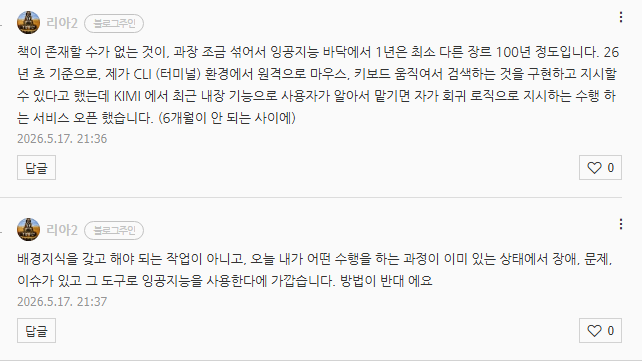

# 왕초보 잉공지능 활용 입문서 (x)
**Date:** 2026. 5. 17. 21:38
**Category:** 다이어리
**Original URL:** https://blog.naver.com/xpfkwh56/224288400221
---

<https://chromewebstore.google.com/detail/kimi-webbridge/fldmhceldgbpfpkbgopacenieobmligc>

[**Kimi WebBridge - Chrome Web Store**

Kimi WebBridge — browser extension for AI agents. AI can open pages, click, fill forms, extract info, and automate web tasks.

chromewebstore.google.com](https://chromewebstore.google.com/detail/kimi-webbridge/fldmhceldgbpfpkbgopacenieobmligc)

​

지금 와서는 했제, 긴 하지만 제 경우

크롬 콘솔도 일찍 알아둬야 된다고 했긴 함