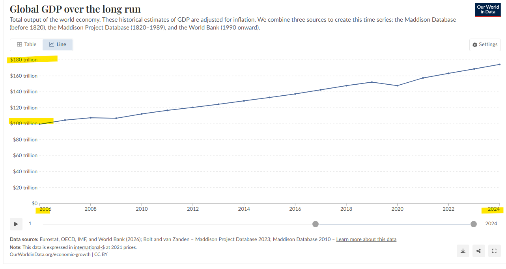
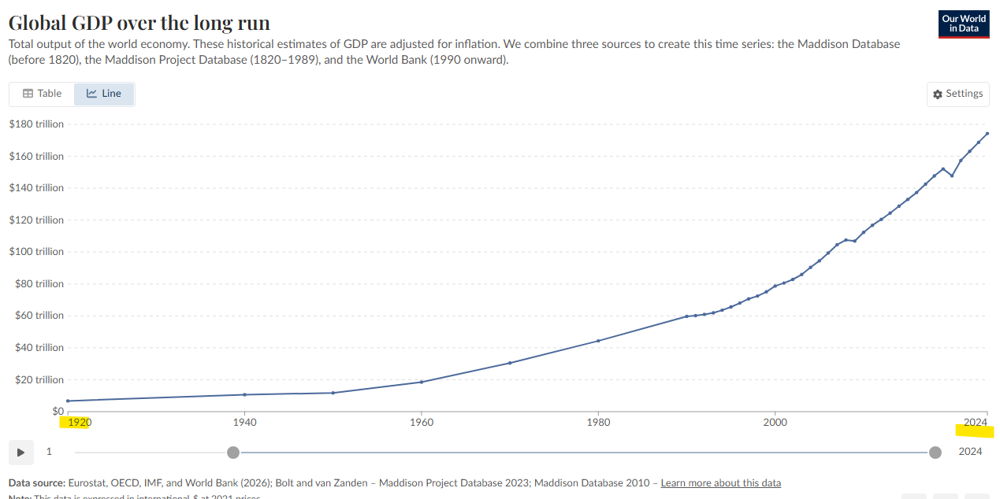
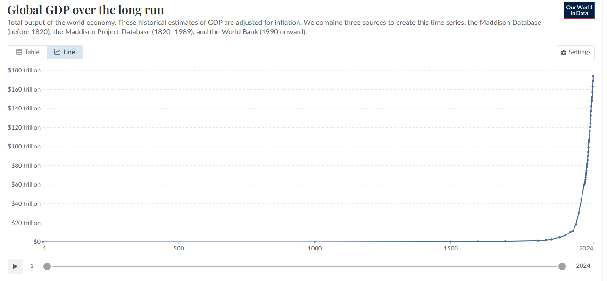
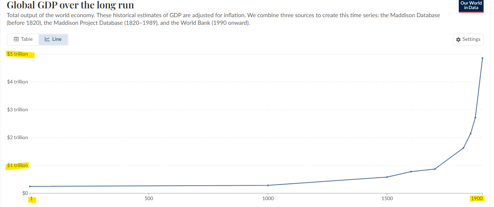
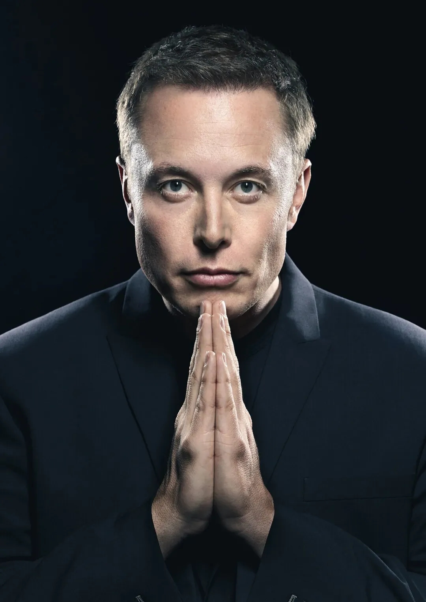

# 인플레이션에 대한 메타 전략적 대응
**Date:** 2026. 5. 17. 6:08
**Category:** 다이어리
**Original URL:** https://blog.naver.com/xpfkwh56/224287831685
---

1. 아빠는 사기꾼, 엄마는 독실한 종교인,

​

미성년자 아들을 상대로 밥 먹듯이

사기를 쳐서 돈을 빼앗아 가기도 했고,

​

하루가 멀다하고 동네에서 싸움박질에

불치병으로 고생하는 사람들 속이면서

검증도 안 된 약을 파는 아버지가 있었음

​

이런 여자가 왜 저런 남자를 만나서

결혼을 했을까? 의아할 정도 인데,

​

아이들에게 항상 근검절약 하라고 하고,

**근본** 을 지키라고 살면서 가르쳤다고 함

​

아들은 무난하게 자라서, 나중에

직장 생활을 하고 살게 되는데

​

그 와중에, **'대박'** 기회가 터짐

​

**그 기회가 무엇이냐?**

​

텍사스에서 유전 대란이 터져서,

운 좋게 땅만 잘 사서 막대기 박으면

​

로또를 맞을 수도 있고,

꽝 일 수도 있던 그런 것 임

​

친구들이 기름 나오는 땅만

쳐다보면서 찾고 다닐 때,

​

이 남자는 **색다른 접근** 을 했음

​

> 1. 기본적으로 땅에서
>
> 석유가 나올 확률이 적다
>
> ​
>
> 2. 석유가 나온다고 해도, 시기에 따라서
>
> 기름값이 비쌀 수도, 저렴할 수도 있다
>
> ​
>
> 3. 그러므로 석유 대박을
>
> 노리는 것은 **비경제적** 이다
>
> 변동성을 피하고 필연성에 베팅한다

​

그리고 이 사람이 노린 것이 **'정유'** 임

​

석유는 석유 자체로 아무 쓸모가 없음,

​

반면에 **'정유'** 는 석유가 있으면 필히

거쳐야 하는 처리 과정 이기 때문에

​

정유 사업을 하고 있으면,

​

놀라운 혜안으로 석유를 찾아낸

사람들이 와서 본인의 고객이 됨

​

심지어, 석유 그 자체의 것 보다

정유 과정에 **'부가가치'** 가 높아서,

​

같은 일을 하고도 마진을 더 챙길 수 있음

​

그 길로, 회사 이름을 **스탠더드 오일** 로 짓고,

석유 산업의 **90%** 를 독점 했으며,

​

미국 GDP 의 **'3%'** 를 홀로 차지한

이 사람의 이름이 **록펠러** 임

​

록펠러는 미국 정부에서 그 영향력을

심각하게 여겨, 회사를 **30 조각** 내버림

​

**\* 자의적인 분할상장 이런 것이 아녔음**

​

2. 록펠러가 나온 이후,

​

JP 모건이 미국 금융을 주물렀고

카네기가 철광을, 포드가 자동차를,

지배하면서 거인의 시대가 열림

​

인물이 시대를 대표하던 시절 이었음

​

세계 최고의 국가가 어디냐? 라는 질문에

​

적어도 지난 100년 사이 안에서는

미국에 준하는 국가 조차 없었는데,

​

재계 역사를 다 뒤져도, 저 **'3%'** 를

찍은 인물은 록펠러 밖에는 없음

​

**\* 현재 미국 빅테크 전체가,**

**미국 GDP 의 10% 정도 차지**

**​**

심지어 거인들의 시대가 저문 뒤에는,

​

1명의 인물이 **'초국가적 금권'** 을

휘두르는 일 또한 나타나지 않았음

​

그 이유는 다음과 같음

​

**1) 너무 다변화 됨**

​

옛날에야 볼 것이 신문, TV 끝 이니까

언론에 타면 다 **스타** 가 될 수 있었음

​

반면에 지금은?

​

볼 거리가 너무 많음,

​

누가 천만 유튜버니, 억만 유튜버니

해도 내가 모르는 사람일 수도 있음

​

마찬가지로 산업이 덜 성숙했을 때는

특정 업종 하나만으로 설명이 쉬웠지만

​

지금은 1개의 업종 이라는 말 자체가

그 업종을 설명할 수 없는 단어가 되었음

​

상장사 같은 곳의 기업 보고서는 물론이고,

​

좋소 수준만 해도 얘네가 뭐를 해서 돈을

벌고 있는 것인지 검증하기 아주 어려워짐

​

**2) 인플레이션**

​

세계의 공장 이라는 말은

원래 **'영국'** 을 의미했음

​

지금이야, 서구 선진국 이라고 할 때

척 하고 떠오르는 것은 미국 이지만

​

영/프 투톱 체계의 역사가 길었고,

​

영국은 **전 세계 산업 생산의 30%**

를 홀로 차지하는 포스를 내뿜었음

​

**제일 잘 사는 나라** 였다는 소리임

​

cf. 닉 리슨

​

약 1800년, 그 잘난 영국에서

**'애국보수, 토호지주'** 세력의

비호를 얻던 적폐 of 적폐가 있었으니

​

그게 **베어링즈 가문** 임

​

1천년이 넘도록 유지한 귀족 세력의

선봉장과 다름 없었는데, 당시 기준으로

그들의 1년 **'수익'** 이 **20만 파운드** 쯤임

​

현재 한화 기준으로는?

​

**'4억'** 정도 임

​

?일단 갑자기 의구심이 들지만,

조금 더 이야기를 풀어 보겠음

​

토지를 기반으로 하는 대지주 귀족과

왕실이 국가를 좌우하던 시절에서,

​

19세기 중반까지 영국이 **산업혁명** 을 타고,

혁신적으로 생산성이 폭증하면서

​

영국에는 수천, 수만개의 공장이 세워지고,

​

**'200만 파운드'** 이상의 자산을

갖고 있는 가문이 수백개로 증가하게 됨

​

천년이 넘도록 1개의 가문에서

증여세, 상속세 없이 재산 이전을

​

**'깔끔하게'** 히트 했을 때, 모은 재산을

불과 100년 사이에 10배 넘는 수치로

전부 따라잡은 일이 발생하게 된 것 임

​

18세기 말, 영국 귀족 가문을 위해

일하던 사람들의 숫자는 잘 쳐줘봤자

​

10만 정도지만 19세기 중후반으로 넘어가면

약 500만명 정도의 제조업에 종사하는

노동자들이 있었다고 추측 되고 있음

​

신흥 부자들한테 공장도 짓게 해주고,

설비도 놓게 해줬던 가문이

​

그 유명한 **로스차일드** 가문이고,

영국에서 금융 이라는 것이 태동 함

​

몇 백년이 넘도록 헐어먹은 것도 있고,

잘린 것도 있겠지만 찾아본 바에 의하면

​

현대 그 가문의 수장이 갖고 있는

최대 재산 규모가 **200억 달러** 라는데,

​

작은 돈은 아니지만, **'그 정돈가?'**

싶은 생각을 갖게 될 수는 있을 듯함

​

https://ourworldindata.org/grapher/global-gdp-over-the-long-run?time=2006..latest

​

**3) GDP**

​

위 자료는 06년 부터 24년 까지

​

세계 GDP 를 보정해서

장기 추이로 보여준 것임

​

여튼, 20년 사이에 2배 오름

​

​

100년 시계열에는?

​

​

전체로 보면?

​

​

**1900년 동안, 5배 올랐는데**

**그 양이 5 trillion 밖에 안 됨**

​

3. 록펠러가 나온 지, 약 100년 뒤

​

미국 재계 역사에서 개인 퍼포먼스로

**'3%'** 를 찍은 두 번째 인물이 나타남

​

​

**머스크** 임

​

**1) 재능**

**​**

밀레니엄 이후 시대는,

소프트웨어와 인터넷의 시대였는데

​

메타, 구글 같은 회사들이

bit 만 다루고 있을 무렵에

​

20년을 기점으로 머스크는

**'atom'** 산업을 만지기 시작함

​

전기차, 배터리, 우주, 위성, 반도체,

AI 데이터 센터, 로봇, 에너지 인프라

​

거창한 이름만 지우면, 하드웨어 고

기름냄새 나는 블루컬러틱한 일들 임

​

이런 산업은 SW 운영 방식으로 못 함

​

진짜로 공장 짓고, 부품 깎고,

물리적 시스템을 통합해야 함

​

머스크는 처음부터 이걸 했고,

다른 빅테크 CEO들은 못 하거나 안 함

​

록펠러는 기름장사

외길인생 30년 함

​

머스크는?

​

테슬라, 스페이스X,

xAI, 뉴럴링크, X

​

무려 **인류 문명의 장기 생존** 이라는

제 정신은 아닌 것 같은 테마로

본인은 사업을 한다고 호소 하고,

​

**'5개의 산업'** 을 30년이 안 걸려서

전부 동시에 성공 시킨 미친 짓을 함

​

**\* 심지어 모든 산업이**

**고부가가치 첨단 산업**

​

자연적인 물리 법칙 외에는 다 의심하고,

모든 자본을 급박한 데드라인 안에 던지고,

망하기 직전까지 들어가서 살아남은 다음,

​

다섯 산업을 동시 다발적으로 수행해서,

그걸 수직계열화 시켜서 다 성공을 시킨다?

​

**재능** 임 그냥

​

**2) 행운**

​

20세기 록펠러의 시대는

C/F와 배당 중심이었음

​

그러나 21세기는 **'PDR'** 의 시대 임

​

테슬라는 한 푼도 돈을 못 벌고 있을 때도,

GM 보다 시총이 훨씬 더 컸음

​

머스크가 80년대에 사업을 했다면 망했겠지만,

거대한 비전을 제시하고, 메시아 임을 자처하고,

​

단기 수익보다 미래 점유율을 더 강조하며,

​

본인이 직접 미디어를 운영하는

굉장히 드문 CEO 가 될 수 있는 세상에 있음

​

10년 이후, 신자유주의 시대가 저물면서

미/중 패권 경쟁, 펜데믹 등으로

**'큰 정부'** 메타가 돌아오기 시작했고,

​

정부가 산업에 적극적으로 개입하는

문화가 낯선 것만은 아니도록 바뀌었음

​

인플레이션 감축법, CHIPS act, 등

머스크는 **'상당한'** 정부 지원을 누렸음

​

글카 깎는 노인 젠슨황,

메타버스 낭만파 저커버그 등,

​

다른 빅테크 CEO 들과 비교할 때,

​

가장 **'외교적'** 으로 움직이지 않고,

가장 **'비합리적 위험관리'** 를 해서

​

다 정답만 고르면, 이런 시대에도

100년 만에 나오는 부자 될 수 있음

​

20세기엔 자동차 회사 CEO 가

우주 회사 운영하는 게 불가능 했음

​

산업 간 기술이 너무 달랐기 때문,

​

그러나 지금은 모든 산업의 핵심이

결국 SW/AI/배터리/반도체 수렴을 함

​

자동차도 컴퓨터, 로켓도 컴퓨터,

로봇도 컴퓨터 이기 때문에,

​

어떤 한 사람이 여러 산업의 본질을

이해하기 더 쉬워졌다고도 볼 수 있음

​

**\* 위에서 말한 다변화에 균열이 생긴 셈**

​

머스크가 다섯 회사를 동시에

굴릴 수 있는 건 본인의 광기뿐 아니라

기술 융합 시대의 산물이기도 함

​

사족이지만, 이게 꼭 먼 이야기는 아닌데

​

남조선에서도 **'마케터'** 가 **'세일즈맨'** 이자,

**'창업가'** 로 발휘하는 일이 매우 자주 있음

​

젠지한테는 낯선 유행인데, 더 어머니 세대에는

여자 직업 하면 **미싱공/파출부** 바로 딱 떠올랐고,

​

그 다음 시대에는 **'비서학과 졸업한 사무직'**

​

이 나왔던 시절도 있음, 메타가 달라지면

그 메타를 이루는 본질을 잘 고민해봐야 됨

​

그래야, 같은 것을 같게 다른 것을 다르게

명확하게 구분해서 보다 판단할 수 있어짐

​

**\* 시대가 인물을 만들고,**

**인물이 시대를 형상화한다**

​

**3) 한계**

​

그럼 얘가 잘 못 하는 것도 있지 않을까?

​

**있음**

​

컴플라이언스 계열은 못 함,

move fast and break things 가 안 됨

​

뉴럴링크 임상에 7년 걸렸고,

제약은 아무리 천재가 나타난다고 해도

​

코로나급 재앙이 터지지 않는 한,

자기들이 했던 프로토콜을 안 바꿔줌

​

머스크의 회사들은 모두 **'하이테크'** 분야임

식품, 패션, 호텔, 소매, 엔터 같은

K-내수 스러운 산업은 사대가 안 맞음

​

**\* 할 필요도 없지만**

​

**4. 결론**

​

블라그 경제학에 의하면, 인플레이션이 심하고

자산 시장이 과열될수록 **'생산 도구'** 를 갖춰서

자본주의자가 되라고 이야기 하는 경우들이 있음

​

그러나, 그건 조금 곡해가 들어간 해석이라고 봄

​

적어도 2026년에 통하는

자본주의 메타에 의하면,

​

**'인플레이션으로 내 자산의 감가'** 를

자산 재조정으로 만드는 것보다,

​

**'내가 벼룬 부가가치로 헷징하는 것'** 이

거의 대부분의 상황에서 효율이 더 좋음

​

**5. 제언**

​

집 값 언제 떨어져요?

증시 언제 망해요?

​

→ 디플레이션 언제 와요?

→ 나라 언제 망해요?

​

**안 와요**

​

그건 마치 군대 가기 싫은 소년이

남북통일 희망하는 바램 같은 것임

​

아무거나 사면 부자 되나요?

뭐라도 잡아야 헷징 되나요?

​

→ 인플레이션은 모두를 부자로 만들어

→ 하루 빨리 자본가가 되겠어 블라블라

​

**잘 하는 것 하셔도 먹고 살 수 있는 세상** 임

​

저라고 인생 오래산 것은 아니지만,

사람마다 배운다고 저리 될 일이 아니고,

​

따라한다고 따라서

될 일이 아닌 것들이 있고,

​

세상에서 본인 팔자 바꾸는 것은

대체로 그런 것들입니다

​

**\* 배운다고 배워서 될 일이 아니고,**

**따라한다고 따라서 될 일이 아닌 것이**

**실제로 현대 사회에선 격차가 되므로,**

**​**

**비범하게 살고 싶은 사람이**

**왜 평범한 방법을 추종함?**

**​**

그리고 그게, 2026년 기점으로

**'가장 메타에 잘 맞는 전략'** 입니다