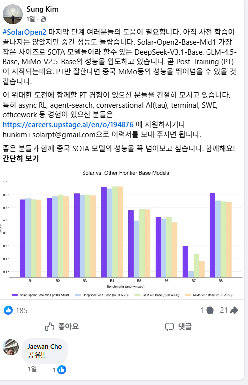
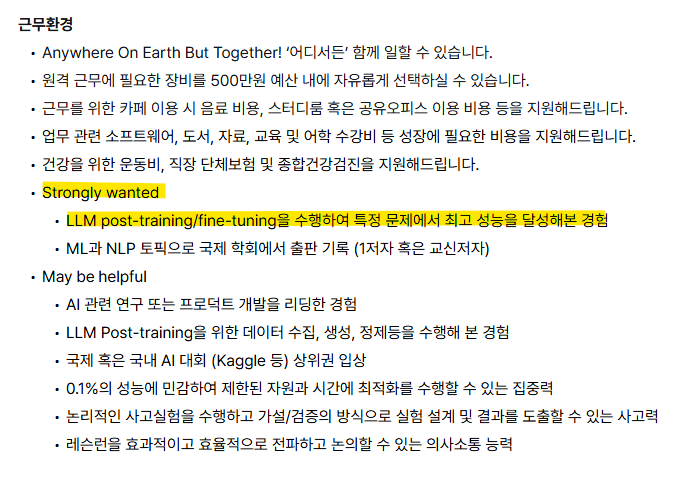

# 잉공지능 어떻게 쓰나?
**Date:** 2026. 5. 17. 9:50
**Category:** 다이어리
**Original URL:** https://blog.naver.com/xpfkwh56/224287923370
---

독파모 유일 스타트업

​

그냥 오버핏 보여주기용 벤치 인지,

진짜인지는 판이 나와봐야 알겠지만

**​**

**'진짜'** 중국 SOTA 모델 성능 잡으면

대형사고 가 날 수도 있긴 있을 것 임

​

**\* 객관적으로 가능성 높은 얘긴 아님**

**​**

https://careers.upstage.ai/en/o/194876

​

여튼 국내 잉공지능 나름 만진다 하는

사람들 중에서는 네임드 인 사람인데,

​

공고에 한 줄 딱 박힌 것만 봐도 답 나옴

​

어디에, 뭘 어떻게 쓰든 상관없이

**'최대'** 성능을 뽑아본 경험이 있으면

​

카클 상위권 입상을 May be helpful

취급받을 정도의 역량으로 인정 받음

​

이거는 지금 우리 세대가 집중할 얘기가 아니고,

아가 키우는 부모님들 입장에서 **섬칫할 얘기** 임

​

왜 자꾸 로컬, 로컬 노래를 부르냐?

​

프론티어를 돌리든,

API 를 돌리든 본인이

직접 돌려보라 이거쥬

​

그렇게 해서 이걸 알 수가 있긴 있는지