# 네이버 홈판, 일확천금 홈판 고시의 시대
**Date:** 2026. 5. 18. 9:05
**Category:** 다이어리
**Original URL:** https://blog.naver.com/xpfkwh56/224288744088
---

[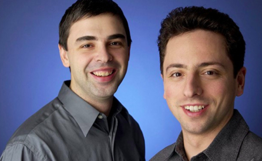](#)

​

1. **프리비어슬리,**

​

인터넷 이라는 업종에만 속해 있어도

상상키 어려운 투자를 받을 수 있었고,

​

서비스의 품질을 따지는 일은

어리석은 사치 로만 여겨지던,

​

그리고 그런 것들에

누구도 신경 쓰지 않는

​

근본이 천박한 농담이 된 시대에

두 남자가 구글 이라는 회사를 세움

​

[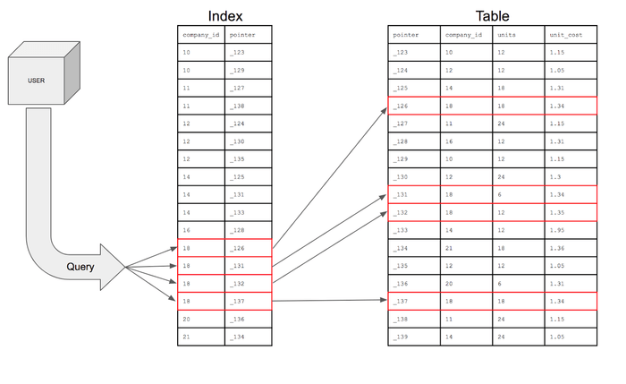](#)

​

2. 초기 검색엔진 모델은

마치 **아주 거대한 엑셀** 같았는데,

​

온라인에 널린 정보들이 있으면

각 웹페이지를 긁어서 보여줬었음

​

아주 초기에는 **검색어** 를 **입력** 하면,

그 검색어 랑 **'매칭'** 되는 웹페이지들을

​

알고리즘이 찾아다 보여주는 식이었고,

​

입력된 검색어가 해당 내용에서 얼마나

빈번하게 등장하는가? 자연어 관점에서

어떤 의미를 포함하고 있는가? 와 같은

​

혁신의 토대가 될 아이디어도 나왔지만,

​

기술력이 그리 좋았던 시절이 아니라서

현실적으로는 무작정 **최신으로** 작성된 것,

​

**상호작용이 많이 발생한 것**, 심지어는

그냥 서비스 제공 업체에서 정해놓은 후,

​

그거만 계속 **고정적으로** 보여주기도 했음

​

[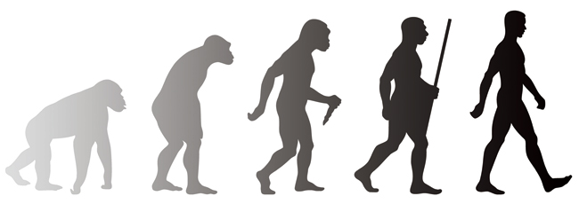](#)

​

3. 이견이 있을 수도 있겠지만,

​

유의미한 상업적 혁신은

**야후** 라는 회사로부터 열림

​

야후 에서는 검색엔진으로 나오는

웹페이지를 **디렉토리 단위** 로 묶음

​

불을 훔치는 프로메테우스

​

이로 인하여, 인터넷 시장은

**한 가지 아주 중요한 깨달음** 을

미래에게 전달하게 되었는데,

​

**'이용자들이 원하는 정보를 주면,**

**이용자들은 그 정보를 소비한다는'**

​

지극히 당연하지만, 공급자들이

늘 놓치고 있던 **명백한 진리** 였음

​

4. 스러져간 다른 선도자들과 같이,

그 무렵, 야후의 자리를 구글이 꿰참

​

구글은 **'정보의 가치'** 가

**'상호 관계성'** 에서 온다는

혁신적 발상을 하게 되었고,

​

웹 페이지 간의 상대적 중요도를

연산하는 알고리즘을 중심으로

**​**

**'광고 서비스 산업'** 을 접목 시켰음

​

[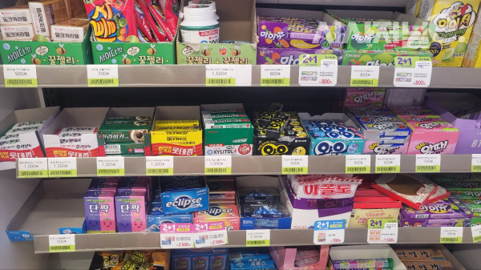](#)

​

편의점을 가서, 자세히 관찰을 하면

가볍고, 저렴한 물건은 계산대 근처

​

무겁고, 가격 있는 물건은 계산대에서

가능한 먼 곳에 위치 시키는 경향 있음

​

다이어트를 검색한 사람은,

​

운동이나 식단에 관심이 있을

가능성이 상대적으로 더 높고,

​

그렇다면 그 키워드를 검색한

이용자는 쉽게 볼 수 있는 자리에

​

운동, 식단에 관한 광고가 있을 때,

**'구매'** 로 **'전환'** 될 확률이 클 것 임

​

[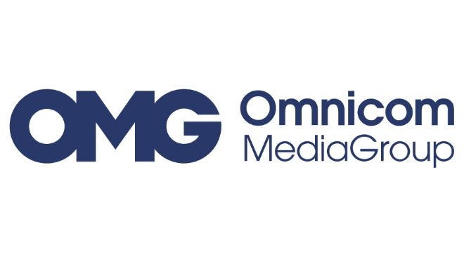](#)

​

세계에서 제일 큰 마케팅, 브랜딩 회사,

**'광고'** 관련으로 종결자들이 어디 있냐?

​

아마 옴니콤 그룹 이라는

기업에 속해 있을 수도 있음

​

**\* 광고 산업의 구성 기준에 따라 상이**

**​**

광고 **'대행'** 관련으로는 끝판왕 임

​

그럼 구글은?

​

전성기 시절, 글로벌 검색

엔진 시장의 **90%** 를 차지했고

​

옴니콤이 1년에 **약 30조** 오버 버는데,

구글은 같은 기간, **'300조'** 수익을 얻음

​

구글은 빅테크에다가, 첨단/미래 산업도

같이 하고 있으니까 그런 것 아닌가요?

​

여전히 **전체 매출의 70% 이상** 은

계속 광고에서 나오고 있는 상태 임

​

[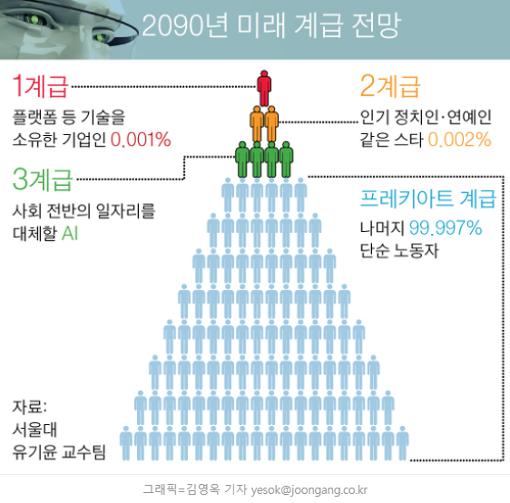](#)

​

피부 미용 의사가 돈을 많이 벌면,

아 의사가 최고구나 다 필요 없구나

​

SK하이닉스 에서 돈을 많이 벌면,

아 공대가 갑이구나 다 필요 없구나

​

라고 생각하는 것은

상식적인 접근에 가까움

​

[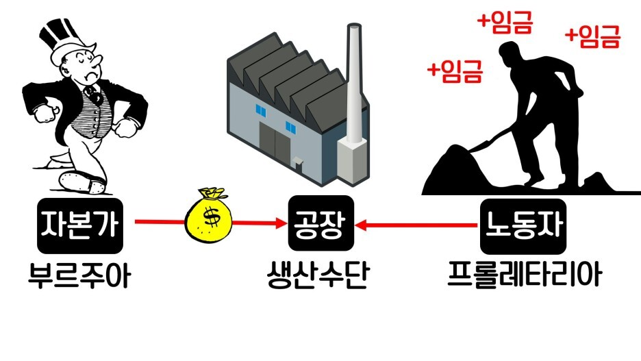](#)

​

이게 **'플랫폼 귀족'** 이라는 개념인데,

​

구글이 하고 있는 것을 보면 누구라도

​

돈은 **'저렇게'** 벌어야 되는 구나 또는

프롤레타리아 혁명이 필요하구나,

​

라고 생각하는 것은 어렵지 않은 일 임

​

​

**권불십년 화무십일홍**

​

기존의 질서를 유지하던

**'판'** 이 통째로 바뀌게 됨

​

인터넷 은 현대 인류의 행동과

사고를 완벽히 바꾼 중요 혁신 임

​

문제는, 모든 사람들이

​

동일한 인터넷 **'활용'** 능력을

갖고 있지 않다는 점에 있었는데

​

서면, 앉고 싶고 앉으면 누우려는 것이

인간의 바꾸기 어려운 본성 인지라,

​

마음만 먹으면 세상 그 어떤 정보든

스스로 찾을 수 있는 시대가 왔지만,

​

그게 누구에게나 허락된 것은 아녔음

​

[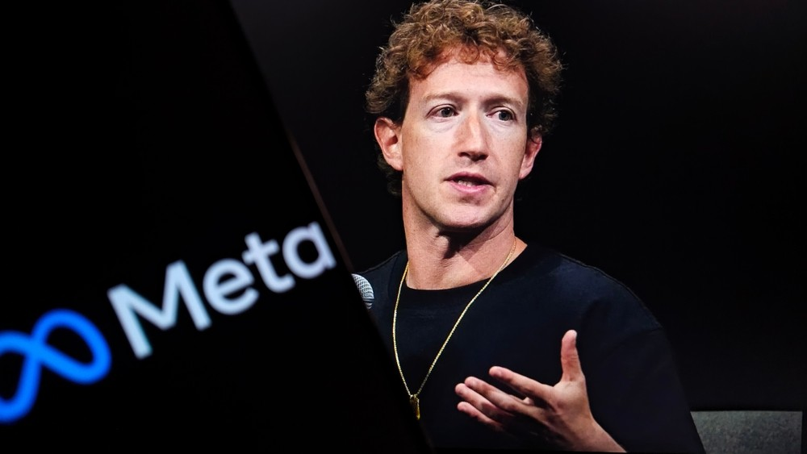](#)

​

거기에 뛰어든 친구가,

메타의 **주커버그** 임

​

**'알고리즘'** 이라는 업계 용어는

이제 일반인들에게도 익숙해졌음

​

하이 테크놀로지가 **알아서**,

내게 필요한 정보를 가져다 주고

​

사용자는 그냥 **'인간'** 이기만 하면,

원하는 것을 거둘 수 있게 된 것임

​

내가 욕망할 필요도 없이,

타인의 욕망이 내게 전이 되고

​

보이지 않는 손이, 가장 좋은 것을

가장 많은 사람들에게 **계속** 전달함

​

하버드 출석부(페이스북) 로

시작했던 메타는 구글과 동시대에

​

광고 시장의 사냥꾼으로 군림하면서,

​

구글의 파이를 **'리드하고'**,

새롭게 개척한 시장으로

​

26년(E), 글로벌 순 광고 매출 규모에서

구글을 추월할 정도까지 사세를 키우게 됨

​

​

5. 구글과 메타가, 광고 산업으로

대표되는 IT 빅테크 시대를 연 무렵,

​

AI, 인공지능 이라는

새로운 신의 한 수가 열림

​

어렵게 구글링 할래? 아니면,

​

GPT, 제미나이한테 **'딸깍'** 으로

찾아 달라고 할래? 라고 한다면

​

계산기가 있는데, 왜 주산을 배워야 하죠?

번역기가 있는데, 왜 외국어를 배워야 하죠?

​

라고 여기게 되는 것도 **당연한 일** 임

​

한때, 교양어 최고 지위에 있던

불란서 말이 영어에 그 자리를 뺏겼듯,

​

구글링을 잘 해서 정보를 찾는 재주 는

언젠가 **'코딩'** 정도 취급이 될 수도 있음

​

[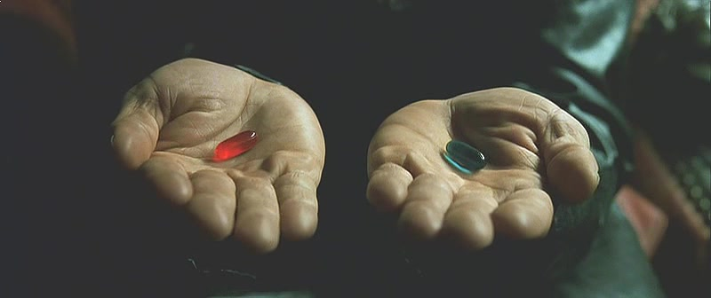](#)

​

SNS 는 가장 자신에게 **'수렴되는'**

정보와 접촉을 알고리즘으로 제공함

​

**'현재'** 를 기점으로 우리가 하는 짓은

사주와 같은 무속도 인공지능 으로 보고,

​

심지어 관상, 손금 까지 주고 있으며,

​

고민 상담을 해주는 비밀 친구 같은 것도,

인공지능 챗봇이 진작 대체하고 있는 중임

​

맛집을 검색할 필요도 없음,

인공지능 한테 물어보면 되니까

​

라는 것이 **'일상화'** 된다면 어떨까?

​

[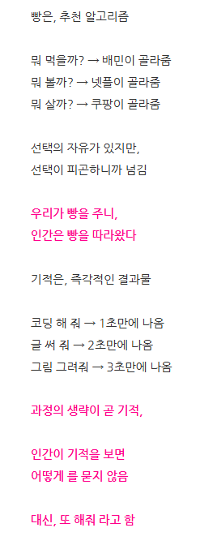](#)

https://blog.naver.com/xpfkwh56/224195811376

​

광고를 이루는 것은 트래픽 이고,

​

트래픽은 모수를 이루는 **'유입'** 과

실제 거래를 발생하는 **'전환'** 으로

​

구분할 수 있는데, 쉽고 편하고 빠르니

유입 이야 **막을 수 없는 흐름** 이 되고,

​

무엇이든 나에게 도움을 주는

AI 모델의 큐레이션은 **'전환'** 을

결정하는 병목을 삭제 시킬 것임

​

수학 공부가 어려워, 라고 물어보면

인공지능은 수학을 가르쳐 주면서

​

그럼 혹시 이런 교재나, 강의는 어때?

​

라고 제안할 것이고,

​

소개팅을 다녀와서, 이 남자랑 저 남자 중

누가 **'내 빅데이터에 더 적합해?'** 라고

물어보면 나도 모르는 나를 알려줄 것 임

​

미래의 인류에게 그것은

**'거부할 수 없는 제안'** 이

될 확률이 상당히 농후함

​

> 미래의 인류에게 있어

​

악마는 **디테일** 에 있음

​

6. 필자는 네이버 블로그를 꽤 오래 했음

​

남들이 그런 것처럼, **애드포스트** 로

핸드폰 값이라도 벌어볼까 생각 했고,

​

운이 좋으면 월급을 대체할 수도 있겠다

여겼던 적이 없다고는 말할 수 없겠음

​

그러나, 다른 블로거들이 그런 것처럼

그 기대가 헛된 것임을 알 수 있었는데,

​

[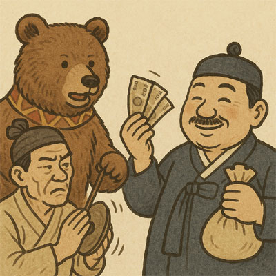](#)

​

네이버의 알고리즘은 보수적인 편이라,

아예 **'꾼'** 수준으로 이 로직을 파든가

​

아니면 열심히 콘텐츠를 작성한다고 해도

자기 만족, 내지 취미 정도 밖에는 안 됐음

​

네이버 나름에서, 정당한 규칙을 짜면

업자들이 그 규칙을 더 깊게 해석해냈고,

​

그걸 우회해서 다시 네이버가 바꾸면

또 그걸 적응하는 **그들만의 세계** 가 됨

​

이 과정에서 **'평범한'** 블로거들이

​

자기 블로그에 방문해 줄 것을 기대하거나

만에 하나라도 그걸 유형적 이익, 보상으로

노려본다는 것은 **거의 불가능** 에 가까웠음

​

[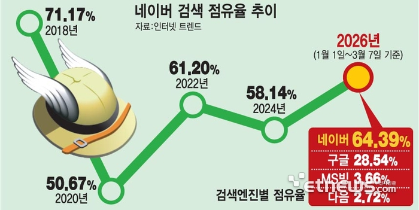](#)

​

7. 인생은? **행운과 재능**

​

26년 3월, 네이버가 구글에 의해

하락하던 점유율을 깨고 60% 라는

압도적인 지위로 다시 올라서게 됨

​

[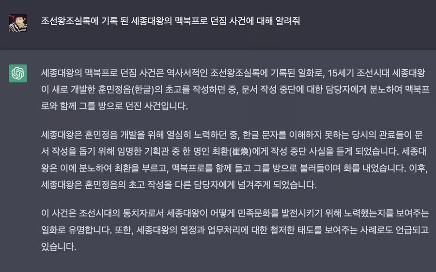](#)

​

점점 더 나아지고 있다고는 하나,

​

할루지네이션 이라는 인공지능의

치명적 한계가 역설적으로 사람들을

​

**'부지런하게'** 만드는 효과를 줬고,

​

[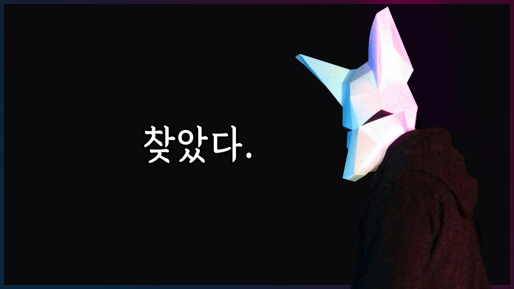](#)

​

알고리즘으로 얻을 수 있는 정보가,

**'편할 순 있어도'** 정확하진 않을 수 있다는

경험적 압력이 **'자기주도성'** 을 부활시킴

​

​

제 4차 산업 혁명 이라는

우리 앞의 거대한 물결에서,

​

러다이트 운동 보다 한발 더 빨리,

​

**'그래도 사람이 해야 된다'** 라는

인식이 생겨났다고도 볼 수 있는데

​

물이 들어올 때, 노를 젓는다고

​

네이버 측에서는 **'기존 스탠스'** 와는

차이가 있는 분배 정책을 내기도 함

​

[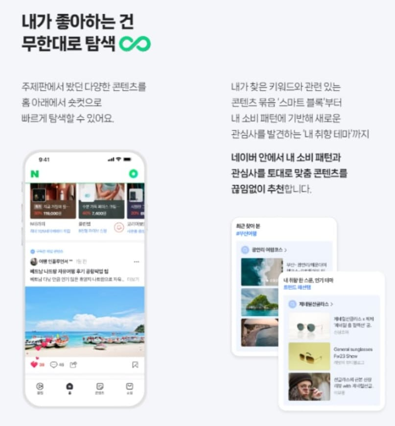](#)

​

그게 네이버 **'홈판'** 임

​

[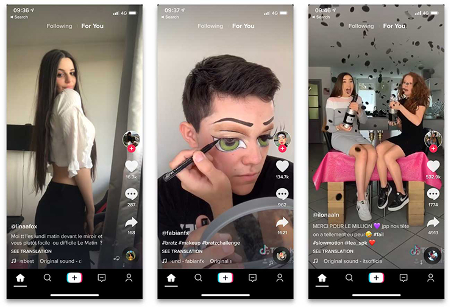](#)

​

지면상, 생략하긴 했지만 현재 이 업계를

주도하고 있는 것은 중국에서 만든 **'틱톡'** 임

​

**\* 미래 광고 시장도 중국이 선도하고 있음**

**​**

**샤오홍슈, 도우인, 등등 에서 파생된**

**온라인 셀러 시스템은 충격적일 정도**

​

네이버가 **'체류시간'** 정도를 변수로 삼을 때,

​

따거들은 한 발 더 나가 **'보는 사람의 시간'** 을

**'보상'** 하는 괴물 같은 구조를 짜버렸는데,

​

[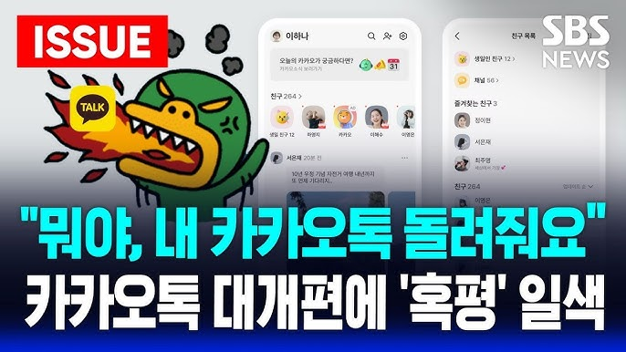](#)

​

국내 빅테크에선, 카카오톡이 그 포문을 열자

네이버가 따라가는 그림 정도로 볼 수 있을 듯함

​

아이폰이 나올 때마다, 혹평을 당하지만

그래도 늘 팔리는 것은 아이폰인 것처럼

​

네이버 측에서도, 앱 켜놓고 쭉쭉 스크롤을

​

내리기만 해도 **'찾아다닐 필요'** 없이

**'시간'** 이 **'머물 수 있는'** 구조에 대해서,

​

비교적 매력적으로 느끼고 있는 것 같음

​

[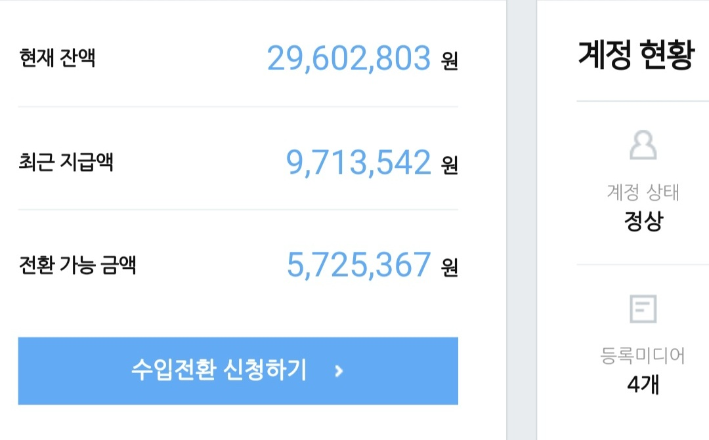](#)

​

SNS 고인물들이 올리는 수입을 보면,

보편적으로 다음과 같은 공감대가 있음

​

1) 홈판은 **'왜'** 올라가는지 **'아무도'** 모른다

​

2) 일단 홈판에 올라가면, **막대한 트래픽** 과

더불어 **상당히** **큰 수익** 이 발생할 수 있다

​

3) 홈판 큐레이션이 초기 네이버 블로그

환경에서 처럼 **'고착화'** 될 가능성이 있다

​

애포가 처음 나왔을 때, 노출 개념이 없어

적당히 밥 먹고 사진만 올려도 월 100 따리는

어렵지 않게 찍을 수 있던 시절이 있기도 했고,

​

그 이후 머잖아, **'이웃만 조금 있으면'**

네이버 인플루언서를 뿌렸던 시절도 있음

​

적어도 과거에 비하자면 지금은

둘 다 노 가성비 프로의 영역 이지만,

​

**홈판도 비슷할 가능성이 높다고 보임**

​

[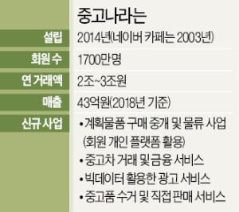](#)

​

8. 네이버에 중고나라 라는 카페가 있음,

​

14년에 설립된 **'회사'** 로 연 거래액이

조 단위 규모로 찍힌 매우 큰 기업인데,

​

2014년 법인 전환 후, **'골드만삭스'** 로부터

240억에 달하는 투자 유치를 받았고,

​

21년 3월, **1,150억원** 에 엑싯에 성공함

​

그렇다면 지금 우리는 물건을 팔 때,

중나 에 들어가서 팔고 있는 중 일까?

​

[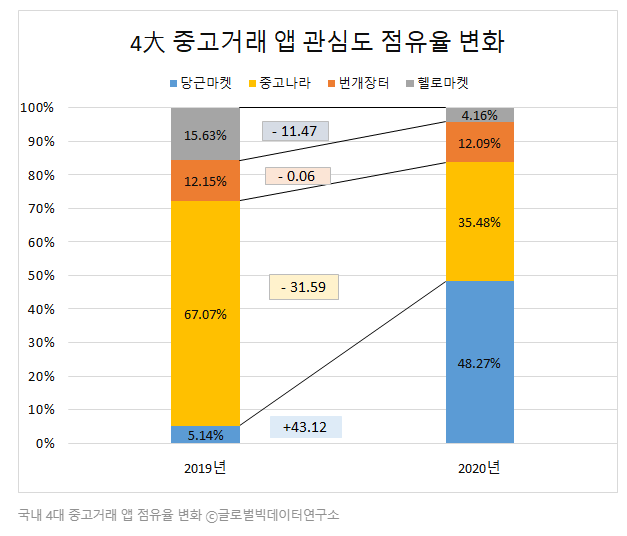](#)

​

2019년, **5% 점유율** 로 시작했던

당근마켓은 이듬해 **50%** 를 찍고,

​

[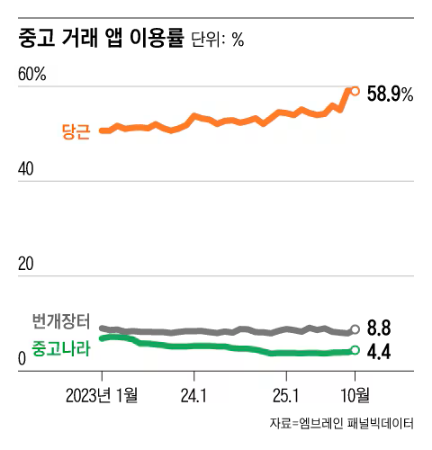](#)

​

2023년 경, **60%** 이용률 점유 후,

​

[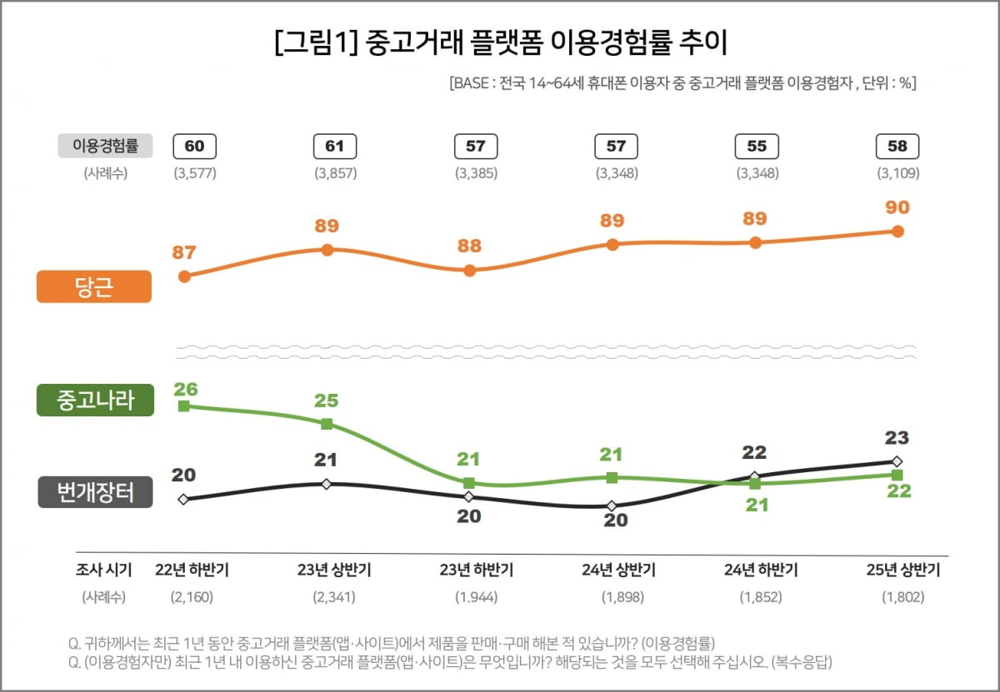](#)

​

25년 상반기 기준에는, 90% 의

이용 경험률 추이를 보여주고 있음

​

굳이 숫자로 확인하지 않더라도,

​

둘 중 **'어디에 돈을 투자 할래?'**

라는 질문만 해도 답이 나올 일 임

​

최근 기준, 당근의 기업 가치는 **3조** 임

​

네이버가 뭘 할 생각인진 모르겠지만,

​

어떤 변화에 집중하고, 대응하는 자세는

단점 보다는 장점이 더 많을 것으로 보임