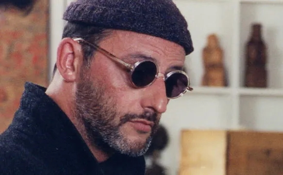

# 클리너 김리아
**Date:** 2026. 5. 18. 15:37
**Category:** 다이어리
**Original URL:** https://blog.naver.com/xpfkwh56/224289172356
---

​

설득은 기술이다, 라는 말을 처음 들었을 때 나는 그것을 받아들이지 못했다. 무대가 정해져 있고 대사가 외워져 있어야 하며, 디렉팅이 한 글자도 어긋나서는 안 된다는 그 말 안에는, 사람이 사람을 만나는 일에 대한 예의 같은 것이 없어 보였기 때문이다. 하지만 사람들은 결국 모두 어떤 형식 안에서만 서로를 만난다는 것을, 20대 초반의 나는 느긋하게 배워가는 중이었다.

​

새벽 동안은 네 시간을 잤다. 알람이 울리기 전에 눈이 떠졌고, 천장의 얼룩을 멍하니 보다가 일어났다. 일전에 고시원비가 밀렸다는 내 또래 여자아이를 만났던 적이 있었다. 특유의 캐캐한 쉰내가 났는데, 그날 이후로 나는 외출할 일이 있을 때마다, 니베아 바디로션을 옷에 얇게 펴 바르곤 했다.

​

베갯머리의 핸드폰은 밤새 푸르스름하게 별처럼 깜빡였다. 철문 위로는 창문 아닌 창문에서 마치 까먹지 말라는 듯이 비상구 라는 글자가 은은하게 빛을 내뿜고 있었다. 그것들은 내 밤의 안녕을 지키던 광원이었다. 더 이상 그 불빛이 거슬리지 않았을 때, 나는 비로소 이 생활에 내가 익숙해졌음을 실감했다.

​

아침 식사로 아스피린을 입에 털어 넣었다. 정해진 대사, 정해진 무대, 정해진 디렉팅. 그것은 외워서 입에 붙이는 것이 아니라, 마치 옷처럼 몸에 익히는 것이었다. 무대 위의 작은 소도구가 그러하듯, 단어 하나하나가 정확한 위치에 가닿아야만 했다. 나는 애드립에 능한 사람이 아니다. 그것이 이 일에 내가 적합한 이유이기도, 이 일이 끝내 나를 망가뜨릴 수도 있는 이유이기도 했다.

​

사람들은 신천지를 두고 사이비라 부른다. 적어도 외부에는 그렇게 알려져 있다. 은밀한 운영, 비밀스러운 포섭, 첩보 영화의 한 장면 같은 것. 글쎄, 그 비유는 어쩌면 그쪽 사람들이 우리를 두고 그릴 수 있는 가장 정직한 그림일지도 모르겠다. 특수 요원이 받는 훈련을 두고 학대라 부르는 사람은 없다. 오직 연습만이 완벽을 만들기 때문이다. 거울을 볼 때면, 습관처럼 나는 스스로를 그렇게 가르쳤다. 그 문장에 처음 동의해버린 순간을 나는 어쩐지 잘 기억하지 못한다. 어느 순간, 그저 그것이 가장 자연스러운 말처럼 되어 있었다.

​

발이 무거웠다. 유독 피로한 날이었다. 택시를 잡지 않고 지하철을 탔다. 택시를 탈 돈도 없었다. 서로가 서로에게 무관심한 군중의 틈에서도, 흔들리는 객차 안에서도 텔레그램을 들여다보고 있었다.

​

외워야 할 것은 대사만이 아니었다. 그녀의 출신 학교, 결혼 여부, 최근의 고민, 자주 가는 카페, 어제 본 영화. 정보는 한 줄도 빠짐없이 내 머릿속에 들어와 앉아 있어야 한다.

​

그래야 무대 위에서, 그것들이 우연처럼 보인다. 아, 그 학교 출신이세요? 저희 언니도 거기 다녔었는데. 우연은 그렇게 만들어진다. 어쩌면 세상의 모든 우연도, 인연도 본래 그렇게 만들어졌는지도 모른다.

​

오늘의 무대는 합정의 한 카페였다. 창이 큰 곳, 오후 두 시에 빛이 가장 잘 드는 자리. 무대 감독은 자리까지 미리 정해주었다. 나는 약속 시간보다 십오 분 일찍 도착했고, 핸드폰을 한 번 더 들여다보고는 화면을 끄고 엎어두었다. 외운 것을 한 번 더 점검하려다 그만두었다. 무대 위에서는, 외웠다는 사실 자체를 잊어야만 그것이 살아난다.

​

그녀가 들어왔다. 화려하지만 고급스럽지 않은 액세서리, 뿌리와 끝이 다른 머리 색깔. 자리에 앉으면서 그녀가 내 쪽으로 몸을 당겨 앉는 것을 보고 나는 이 사람이 외로운 사람이라는 것을 알아챘다. 외로움은 어떤 표정의 결로 드러난다. 능란한 표정에도 그렇게 펴지지 않는 자리는 있는 법이다. 그녀가 가만히 웃으며 말했다.

​

" 언니는 이거 재미로 하는 거야 "

​

순간, 무대가 한 박자 흔들렸다. 정해진 대사, 정해진 무대, 정해진 디렉팅이 한 글자도 빠짐없이 전부 머리에 새겨져 있었다. 그녀가 자신을 언니 라고 지칭하는 것만 빼고.

​

가벼운 웃음 하나. 나는 정확히 그 대본대로 움직였고, 정확히 그 박자에 웃었다. 그런데 그 한 음절, 언니, 가 내 안의 어딘가 미처 예상하지 못한 자리에 떨어졌다. 나보다 스무 살은 더 많아 보이는 여자가 나에게 본인을 그리 부르고 있었다. 그것이 무대의 약속이라는 것을 나도 그녀도 알고 있었고, 그래서 어쩌면 우리는 같은 무대에 함께 서 있는 두 명의 배우인지도 몰랐다. 다만 그녀는 자신이 무대 위에 있다는 사실만은 아직 모르고 있었다.

​

엄마가 자주 하던 말이 있었다. 세상에 공짜는 없단다. 무엇이든 치르게 되어있어, 사람 일이란. 그때는 그 말이 너무 빈한해서 듣기 싫었다. 지금은 그 말이 어쩐지 아주 정확한 문장처럼 느껴진다. 나는 그녀에게 따뜻한 라떼를 권했다. 그건 대본에 있던 대사였다, 따뜻한 음료가 사람의 마음을 연다고 그렇게 적혀 있었다. 그러나 무엇이 열리고 무엇이 닫히는지에 대해서는, 아무도 내게 가르쳐 주지 않았다.

​

장사꾼을 알아보는 가장 빠른 방법은 그가 말하는 내용이 아니라 그가 말하는 호흡에 귀를 기울이는 것이다. 거짓말을 잘 하는 사람들은 모두 어딘가 같은 박자로 숨을 쉰다. 너무 매끄러우면 의심스럽고, 너무 끊기면 또한 의심스럽다. 진실은 어딘가 어색한 자리에서만 살아남는 법인데, 잘 훈련받은 사람의 발성에는 그런 어색함이 없다. 다만, 어색함을 흉내 내는 정교한 어색함이 있을 뿐이다.

​

B 는 눈 하나 깜빡이지 않고 자기 본업을 무슨 대단한 비밀처럼 고백했다. 인터넷 사업체를 다섯 개 이상 갖고 있다고, 매출을 합산하면 수백억이 된다고, 세계 최고의 기업이라는 A 사를 그저 재미로 다닐 뿐이라고. 진작 경제적 자유를 이룬 상태에서 선의로 도와주고 있을 뿐 이라고. 그녀의 말에는 한 번도 멈춤이 없었다. 마치 한 호흡 안에 모든 자랑을 욱여넣지 않으면 그것이 어디론가 흩어져 버릴까 두려워하는 사람처럼.

​

나는 그녀의 것보다 500원 더 저렴한 라떼를 한 모금 마시며, 머릿속에서 그 자신감의 형식을 가만히 분해해 보았다. 이런 종류의 자기소개에는 일정한 박자가 있다. 부의 규모, 직업의 권위, 그것을 가볍게 다루는 태도. 세 가지가 한 호흡 안에 와야 하고, 마지막의 그 가벼움이 가장 중요하다. 가벼움 없이는 자랑이 그저 자랑으로 끝나버리기 때문이다. 가벼움이 있어야 비로소, 듣는 사람이 자기도 모르게 따라 가벼워지면서, 들은 것을 의심하지 못하는 자리에 가닿게 된다.

​

내가 외운 정보를 떠올려 보았다. 이름 B, 나이 7N년생. 돈 빌려달라고 하면 빌려주지 말 것. 수상한 정황 발생 시 즉각 상급자에게 보고할 것. 텔레그램에 적혀 있던 짧은 문장들이 깜빡였다가 사라졌다.

​

그 사이에 어쩐지 몇 문장이 끼어 있었던 것을 기억한다. 그녀는 집이 없습니다. 그녀가 집으로 초대하면 절대 따라가지 마십시오. 처음 그 글자를 읽었을 때, 나는 그것이 정보 전달의 문장인지 나폴리탄 괴담의 문장인지 분간하지 못했다. 정보든 괴담이든 무엇이든 같은 문체로 쓰면 같은 자리에서 발음되어 버린다. 같은 책상에서 자란 두 아이의 글씨가 서로 닮듯이. 나는 문득 그녀의 등 뒤로 카페의 문을 흘끗 보았다. 그녀의 상상 속에 있는 집이 어떤 모양 일지에 대해, 한순간 매우 구체적으로 상상하다가 멈췄다.

​

B 의 직업은 다단계 판매원이었고, 오늘 이 자리는 내가 난생처음 들어보는 성분이 들어 있다는 건강기능식품을 판촉 당하는 자리였다. 그것이 분명해진 순간, 나는 어쩐지 그녀에게 작은 미안함마저 느꼈다. 잘못된 자리에 잘못된 사냥감이 와 앉아 있다는 사실을, 나도 그녀도 아직 모르고 있었기 때문이다.

​

대화가 길어지자 그녀는 결론으로 들어갔다. 그 좋은 물건을 본인이 직접 팔지 않고 왜 내게 권하는가에 대해서는 한사코 설명하기 시작했는데, 그것은 그녀의 시나리오에 그런 설명이 들어 있었기 때문일 것이다. 그녀는 말했다. 500만원짜리를 380만원에 살 수 있는 절호의 기회라고.

​

다 팔면 푼 돈이긴 하지만 용돈벌이로는 충분할 거라고도 했다. 380만원이 푼 돈으로 환산되는 그녀의 회계 체계를, 나는 잠시 가만히 들여다보았다. 거기에는 어떤 종류의 절박함이 있었고, 그 절박함은 차마 입에 담을 수 없는 종류여서, 그녀는 그것을 가장된 여유라는 정확히 반대되는 형식으로 변환해 발화하고 있었다. 사람이 가장 능숙하게 흉내 내는 감정은 결국 자신에게 가장 결여된 감정이라는 것을, 나는 그날 다시 한번 확인했다.

​

부적격 신도. 나는 보고서를 쓰기에 충분한 정보를 수집했다고 판단했다.

​

헤어지기 전, 그녀는 쿠키 하나를 선물로 받아 가기를 요구했다. 자기처럼 대단한 사람이 시간을 할애해 준 것이 그만큼의 가치가 있다는 것을, 그녀는 진심으로 믿고 있는 것 같았다. 그 진심에는 어떤 거짓도 없었다. 거짓 없는 진심이야말로 한 사람을 가장 먼 자리까지 데려갈 수 있는 법이다.

​

카운터에서 쿠키 하나를 골라 건넸을 때, 그녀는 자신의 것인 양 받아들였다. 다행스러웠다. 스타벅스에서 만났었다면 텀블러라도 사줄 뻔했다, 라고 나는 속으로 가볍게 되뇌었다. 그 가벼움은 정확히, 그녀가 자기 위에 입혀놓은 가벼움과 같은 종류의 가벼움이었다. 어쩌면 우리는 결국 서로 다른 대본 안에서, 그러나 어쩐지 같은 발성법을 배운 두 사람이었는지도 모른다고, 카페를 나서며 나는 다음 일정을 준비했다.