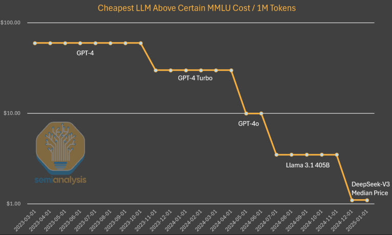
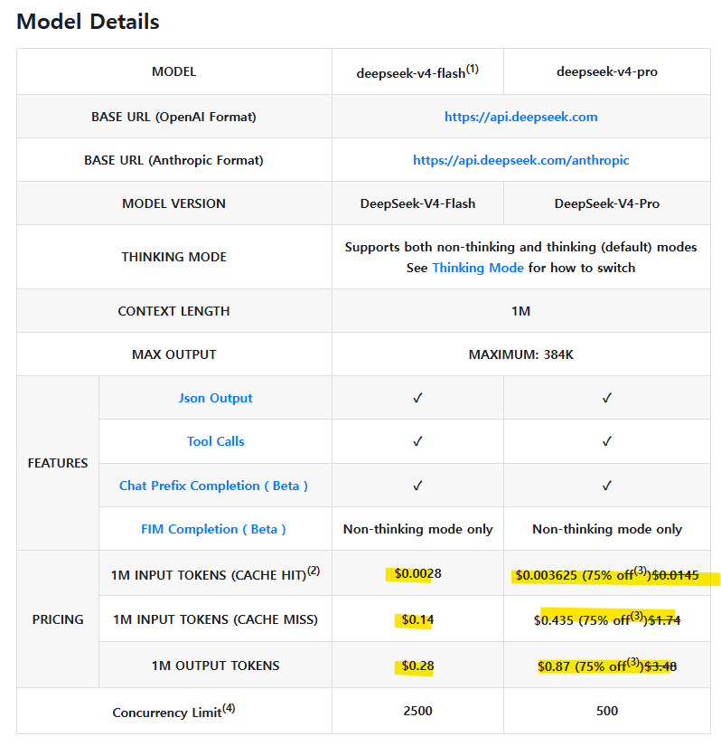
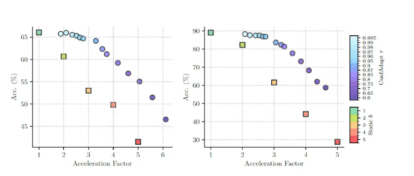
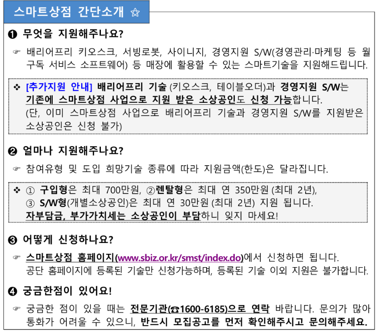
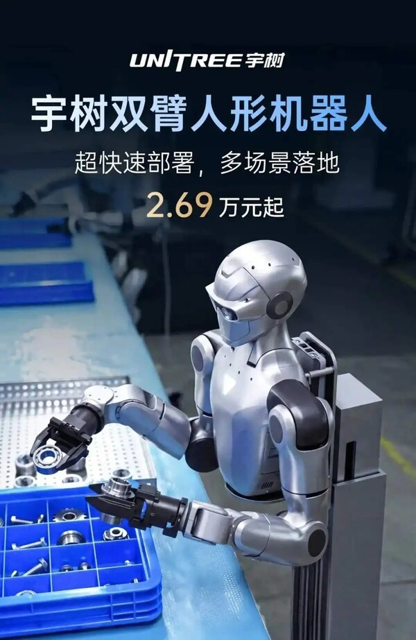

# 인공지능 산업의 비용 최적화와 산업화
**Date:** 2026. 5. 22. 21:03
**Category:** 다이어리
**Original URL:** https://blog.naver.com/xpfkwh56/224293819143
---

1. 추론 비용이 그래서 진짜 줄었나요?

​

​

GPT-3 기점으로 딥시크 까지 하면

대략 **1200배 이상** 감소했습니다

​

​

클로드랑 비교하면 입력 토큰 기준,

**최소 25배**, 출력 토큰 기준으로는

**약 50배 정도** 더 저렴한 상태 입니다

​

기술이 발전하면서, 에이전트 병목이

새로운 시장의 문제로 떠올랐다 (x)

​

오히려, 기술 발전으로 토큰 값이 내려갔으니,

값이 싸니까 사람들이 막 쓰고 있는 것이다 (o)

​

많이 쓰고 있으니까, 초과 수요가 있는 것

앞으로도 이 수요는 견조 할 것이다 (x)

​

토큰 값이 저렴 → 막 씀 → 근데 애초에

AI 한테 맡기는 인간의 업무는 어려운 일 (o)

​

그래서 **'소비자 가격'** 은 터무니없는데,

**'공급자 가격'** 은 계속 오르고 있는 상황 임

​

재벌들이 자선사업 하면서 인프라를 깔고,

거기에 넣는 장비를 공급하고 있는 상태인데

​

자선 사업가들이 **'어, 이거 돈 안 되네?'**

를 느끼는 순간에도, Capex 가 유지 될까?

​

학원비는 학생이 부유해서 내는 것이 아님,

그 부모님의 벌이에 따라 달라지는 것이지

​

의사 하면 좋다고 하니까 의대 가려고 하고,

​

공무원 되면 좋다고 하니까

공무원 된다고 하는 것이므로

​

의사 전망 어두워지고,

공시 인기가 시들해지면

​

해당 사교육 수요도

감소하는 것은 **'당연함'**

​

**\*** **사용량 증가가 단가 하락을**

**추월하는 흐름이 꺾이면 종료**

**​**

API 가격을 올리면 되지 않을까요?

​

1) 월 5000 달러 주고 클로드 쓰실래요?

​

2) **'범용 엔진'** 쓰실래요?

자체 추론 스택 맞춰 쓰실래요?

​

나는 수학 문제만 푸는 용도로 쓰는데,

​

굳이 남들 쓰라고 만들어 놓은 과학 까지

잘 하는 애를 돈 줘가면서 쓸 필요가 없죠

​

최적화 속도는 기관마다 차이는 있는데,

연 평균 10배 씩 감소했다는 말들도 있고

​

앞으로 **'얼마나 감소할 것인진'** 예측도 안 됨

​

​

MTP 나, 투기적 예측 같은 경우,

서빙 환경만 바꿔도 **3-5배 차이** 남

​

**\* 말처럼 간단하지 않을 뿐 이지**

**​**

똑같은 기계로, 똑같은 일을 하는데

토큰 효율이 6배, 8배씩 차이 나는 것들이

구동 환경에서 **'비일비재'** 하게 있는 일임

​

입장 바꿔, 엔지니어를 뽑는다고 치겠음

​

A 는 돈 갖다 쓰고, **신기술 개발** 하는 사람

B 는 **'이미 나가는 돈을 10%'** 절약하는 사람

​

근데 1년에 쓰는 돈이 수천억, 수조 단위 임

1조 쓸 때, 얘가 1%만 줄여줘도 **연봉** 뽑겠죠?

​

그래서 그런 일 하는 애들 몸값이 **매우** 비쌉니다

​

다른 장사들이 그런 것처럼,

투자금 들어오고 밥벌이 걱정 없을 때야

​

미래 먹거리를 준비하느니 어쩌니,

이야기 하면서 A 같은 사람도 챙기지만

​

어디든 발등에 불 떨어지면

저런 사람은 바로 모가지 임니다

​

불황이 오면, 메모리 투자를 할 것이 아니고

있는 소프트웨어로 사람을 **공밀레** 하겠지요

​

2. 중국이 **'자체 수급'** 으로

다 하는 것이 가능할까요?

​

​

요즘 식당 가시면, 키오스크 다 있지요?

그거 업주가 자기 돈으로 하는 것이 아님

​

보스턴 다이나믹스에서 만든

아틀라스 로봇이 양산 단계 돌입시,

​

2억 미만 추산이고 현 가격 기준으로

약 4억 정도 부르는데,

​

​

유니트리에서 나온 로봇이 지금 기준,

**'500만원'** 이면 살 수 있습니다

​

파쿠르 하는 휴머노이드 로봇 보면,

이야 인류 기술 발전이 여기까지 왔구나

​

하고 끝날 일인데, 500만원으로 기계 사서

​

자기 공장에 무인화 라인 깔고 물건을 파는

**'진짜'** 장사를 하는 애들이 중국엔 쌔고 쌨음

​

우리가 **야, 우리끼리 유튜브 해볼래?**

​

하듯이 쟤네는 야 우리 TV 만들어볼래?

TV 는 너무 거창하고, 나 아는 형이 어디서

TV 에 들어가는 부품 만든다고 했는데

그거 우리가 만들어본다고 얘기 해볼까?

​

같은 **'에너제틱한'** 생태계가 **'이미'** 있음

​

고성능 반도체를 당장 중국에서

만들 수 **있다, 없다** 문제가 아니고

​

쟤네는 **'만든 것을 실제 산업에 투입'** 함

​

1) 기기 상용화가 빠르면 좋은 이유

**​**

**수요를 상상할 필요가 없다**

​

시장이 요구하는 것을 그냥 만들면 됨

**​**

**2) 산업 클러스터**

​

중국에 이공계 전공자가 1년에 580만 명 나오고,

매년 박사 학위 소유자가 약 8만명 배출되고

그 절반은 이공계 박사 학위 취득자임

​

**\* 한국에 신생아가 1년에 20만명 태어남**

​

이 사람들이 학교에서 공부 하다가,

기업으로 나가서 배운 것을 **'진짜'** 써먹음

​

공장에 280만개 있고, 하루 평균 쳤을 때

1-2천 명이 **'매일'** 창업 시장에 새로 나옴

​

얘네가 **'기술력 부족'** 때문에,

결국 최첨단 공정은 못 따라잡네?

​

하면서 우습게 볼 문제가 아니구,

​

**'산업 플랫폼'** 이 국가 단위로

돌아가고 있다는 것을 봐야 됨

​

다른 나라에서 10년, 20년 만에

특정 분야 오타쿠 하나 태어나서,

​

마침 운 좋게 빛 보고 그럴 시간에

​

중국에서는 그런 애들이

10만, 100만 단위로 나옴

​

**3) 소프트웨어 혁신**

​

북한이 재래식 무기론 답이 없으니까,

​

핵무기 만들었던 것처럼 중국도 마찬가지로

고립 시키니까, 자기들끼리 방법을 찾아냈음

​

만드는 것은, 50년 이고 100년 이고

공산당에서 계속 **자원 때려 박겠다** 고 하고,

​

그와 동시에, **'그 좋은 것 없어도'**

돌아가게끔 한다가 중국이 하는 짓임

​

그럼 진짜 없어도, 경량으로 돌아가요?

​

온 디바이스 AI, 피지컬 AI,

​

같은 차세대 메타 종주국이

그냥 **유일하게** 중국 입니다

​

**4) 그럼 중국 주식 사면 되나요?**

​

코스피 저평가 시절, 벨류업 기다리듯이

중국 특유의 공산당 금융 적응할 각오가

있으면 용기 있게 도전할 수도 있겠지만,

​

**외국인이 편하게 돈 벌게 해줄지 모르겠음**

​

다만, 기왕 증시에 관심 있는 입장이라면

중국 증시도 미리미리 보는 것은 좋은 듯함

​

**3. 요약 및 정돈**

**​**

1) 반도체 주도주가 돈 버는 이유

→ 빅테크에서 인프라 깐다고 쓰니까

→ 빅테크에서 인프라 까는 이유

→ 그걸 해야, 나중에 돈 버니까

​

→ 돈이 **'확실히'** 벌렸든가, 안 벌렸든가

그 결과가 나오게 된다면 어떤 일이 발생?

​

→ 불확실성이 계산할 수 있는 변수로 바뀜

→ 신도 모르는 알파가 사라짐

​

→ 빅테크에서 인프라 투자 안 하면?

→ 새로 손님 찾으러 떠나야 됨

​

2) 빅테크에서 인프라 투자 안 할 이유가?

→ 어쨌든, 당장 돈이 안 됨

​

**\* 짧으면 27, 길어야 30년 까지는**

**뭐든 나와야 다들 행복해지는 그림 임**

**​**

→ AI 인프라 투자는 투자 이자,

동시에 미래에 대한 보험 임

​

→ 과장 조금 섞으면 다들 하고 있으니까,

하고 학원비 펑펑 쓰는 것과 차이가 없음

​

→ 졸업해도 보장되는 것이 없다 라는

인식이 커질수록, 학부모들은 학원비를

ROIC 관점에서 부정적으로 여길 확률 큼

​

→ **'당장'** 수요만 없으면 지방에다가 냅다

아파트 깔아놓는 것과도 다를 바가 없는데,

​

수요가 있고, 가장 정배에 가까운 투자처라

돈이 많이 쏠린다는 정도의 차이만 있는 셈

​

→ AI 시대라서, 데이터 센터만 많이 깔고

학습/추론/어쩌고 를 하면 다 할 수 있다 함

​

→ 다들 말은 그렇게 하는데, **'실제로'**

산업 전체에 반영하는 국가는 중국 뿐 임

​

→ 기술력이 못 따라오니까, 하드웨어가

없어도 되는 것들로 차력쇼를 하고 있는 중

​

→ 근데 그 차력쇼를 해서 **'진짜'**

진입 장벽을 끌어 내리고 있음

​

→ 돈 많이 써서, PC방에 5090 다 깔아놨는데

사람들이 와서 스타크래프트, 롤만 하고 있음

​

→ 그럼 피시방 업주는 6090 으로

돈 들여서 업그레이드를 할 이유가? 없음

​

**4. 사고 흐름**

​

첨단 선단공정은 지금 서방 진영 밖에 못 함 (o)

​

그리고 앞으로도 첨단 기술은

계속 여기가 주도할 확률 높음 (o)

​

**그럼 1나노, 0.5나노, 0.1나노, 0.01나노**

**0.0001나노 한 다음에는 어떻게 되는데요?**

​

1) AGI (쨌든) 안 됨

2) 범용지능 불가능함

​

**3) 올마이티 만능 학습 AI 가 아니라,**

**특정 프레임 워크 스텍 갖고 있는**

**최적화 모델이 이 게임은 답이네 (o)**

​

→ 학습에서 비전 찾지 말고,

다른 곳으로 방향 돌려서 보자

​

**\* 학습 파트는 경량 파인튜닝 이랑,**

**출력 템플릿 작업이 효율적임이 확인**

**​**

4) 추론만 시킨다고, 데이터/모델링/도메인

세 가지를 초월하는 **'사유/성찰/지성'** 안 됨

​

컨텍스트 늘렸더니, 어텐션 병목이 발생했고,

​

**\* 머리에 들어간 내용은 많은데,**

**각 의미 시멘틱을 잘 읽어내지 못함**

**즉, 글자는 읽는데 독해력이 안 좋음**

​

전부 동일하게 어텐션 줄 수 없으니까,

압축 해서 정보를 효율적이게 처리 함

​

동일한 지시도, 명세 상세하게 주고

쪼개서 시키면 작업 품질이 올라가네?

​

**→ 에이전트 개념**

​

5) 유즈 케이스 한정해서, 반복 작업 시키면

사람 1명의 생산성이 n배 오를 수 있겠네?

​

**\* 사람 없어도 무인으로 돌아가네? (x)**

​

까지가 **제가 아는 지금, 잉공지능 흐름** 임