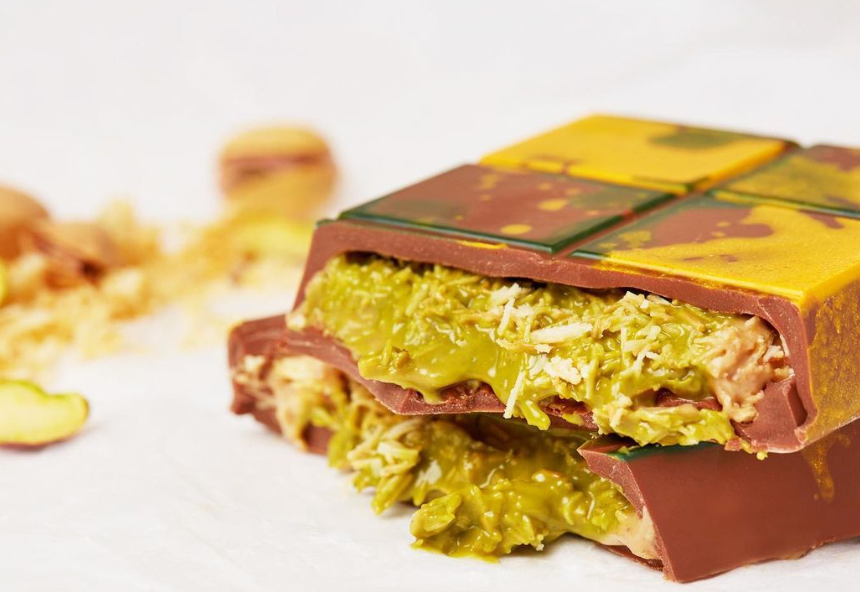
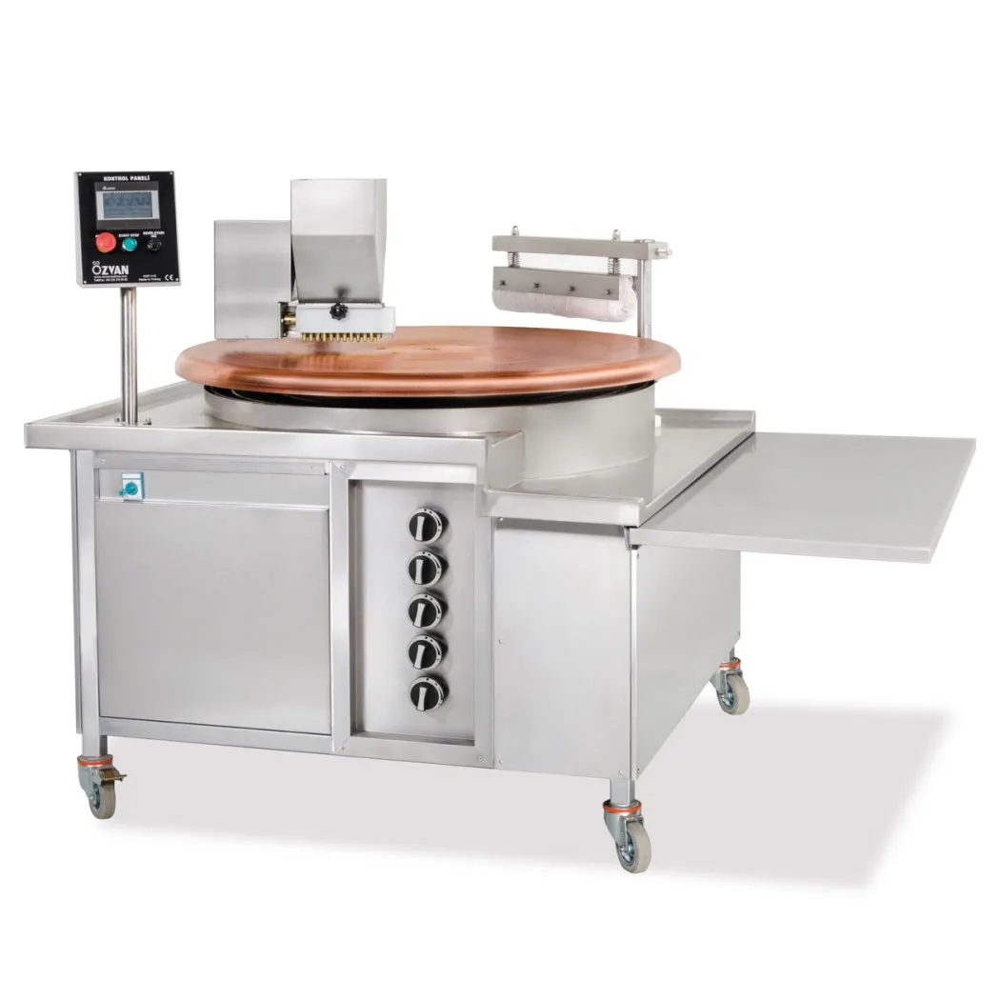
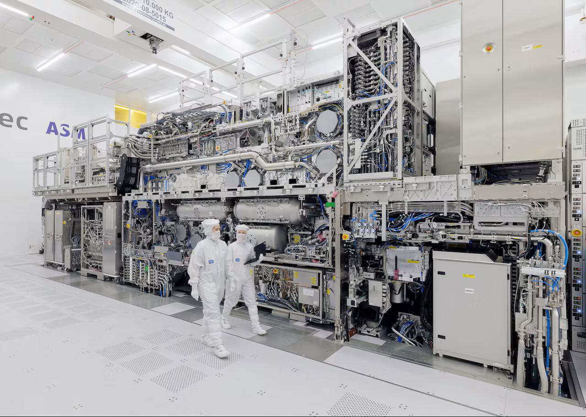
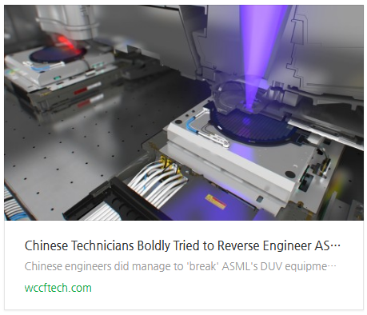
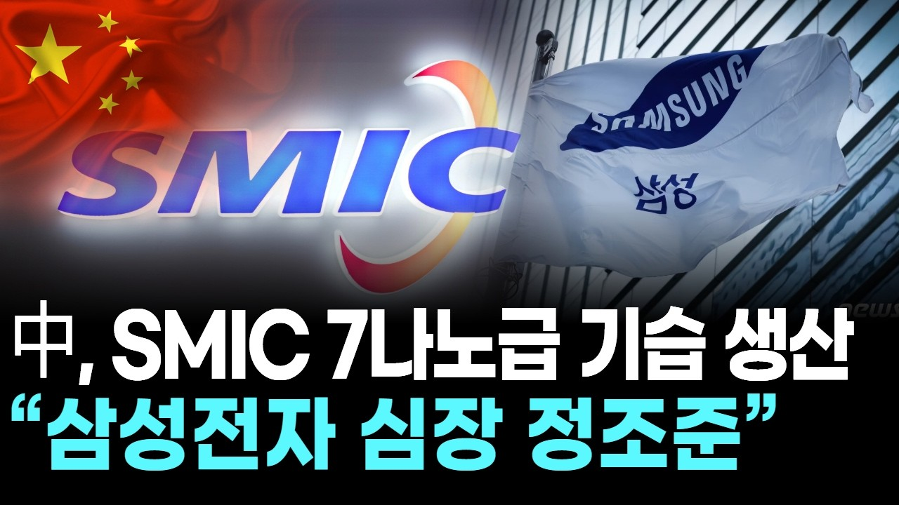
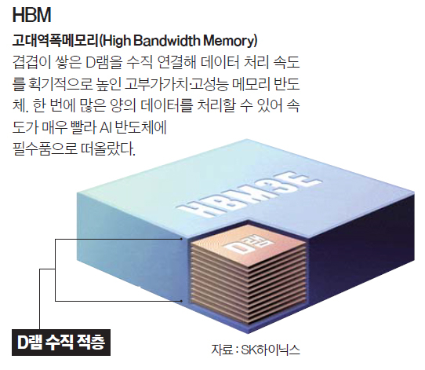
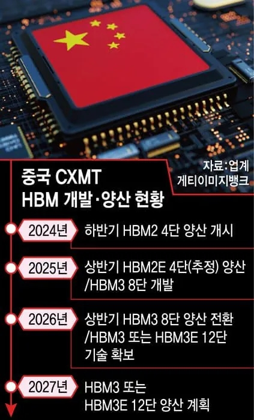

# 코스피는 앞으로 어떻게 흘러갈까?
**Date:** 2026. 5. 22. 2:42
**Category:** 다이어리
**Original URL:** https://blog.naver.com/xpfkwh56/224292986651
---

​

1. **두바이 초콜렛** 이라는 것이 있었음

​

겉은 다들 익히 아는 초콜렛 그 자체고,

​

내부에는 카타이프 라고 부르는

일종의 건면이 들어있는 식품으로

​

지금은 전보다야 시들하긴 했지만

SNS 에서는 두쫀쿠다 뭐다 해서

선풍적인 인기를 끌었던 디쟈트 임

​

이걸 만들려면 핵심적인 두 재료가 필요함

​

하나는 **피스타치오 스프레드** 라는 잼이고,

또 하나는 위에서 이야기했던 **카다이프** 임

​

터키인지, 튀르키예인지 먼 나라에서

식재료를 수입하던 업자들이 아니라면,

​

급격하게 새로 루트를 찾기도 어려웠고

놔두기만 하면 팔리기 바빴기 때문에

​

이들은 현찰에 준하게끔 취급되기도 했음

​

​

2. 이에 대한 업계의 대응은 둘 이었음

​

하나는 **두바이 스타일** 이라고 하는

소면으로 느낌만 가져가는 방법,

​

또 하나는 진짜 카다이프 기계를 사서

**직접 자체적으로 공수하는 것** 이었음

​

편의상, 두바이 어쩌고 마진을 **50%** 잡고

기계값을 **1500만원** 정도라고 잡는다면,

​

총 3천만원 매출만 일으키면 본전이 나옴

​

**\* 본전 기준에 따라 다르겠지만**

**제시한 방법에서 큰 차이는 없음**

​

수요가 꺼질 때까지 기계를 매장에 놓든,

빨리 한 탕 치우고 해먹든 간에 상관없이

​

폭발적인 수요가 보장되는 상황에서,

공급자들은 **'심플한'** 의사결정이 가능함

​

그렇다면, 요런 상상도 해볼 수가 있을 것임

​

> 피스타치오 스프레드,
>
> 카다이프 기계 같은 것을
>
> 쉽게 얻을 수 없다면 어떨까?

​

이를테면, 전 세계에 오직 1개의 회사에서만

지극히 제한적인 장비로 저걸 만들 수 있다면?

​

당장 먹고 싶은 사람은 널려있는 반면에,

공급은 제한적이므로 장사하기 좋을 것임

​

​

3. 두쫀쿠 만드는 기계 같은 것이,

ASML 의 **노광장비** 라고 보면 빠름

​

노광장비는 1년에 50개가 안 나오는

최첨단 현대 공학 기술의 집약체 임

​

그 하나하나의 존재 만으로도

국가권력급 전략 자산 취급이고,

​

모든 산업 스파이들의 성배이기도 함

​

노광장비 가 하는 일은 **아주 간단함**

​

1) 반도체 설계도가 있으면,

2) 그 설계대로 작은 판 에다가

3) **빛으로 회로를 새긴다** 끝!

​

당연히 말은 쉽지만, 그 모든 기술들이

하나하나 삽질 끝에 **간신히** 닿은 것들임

​

분식집 떡볶이 맛을 내려면,

간장과 다시다를 넣어야 된다

​

옥수수를 삶을 때는 뉴슈가를 써라

같은 것이야 **'이미 아는'** 얘기지만

​

정확히 어떤 온도로, 얼마의 양을,

어떤 순서로 넣어야 되냐? 같은

레시피는 해보기 전까진 알 수 없음

​

한편, **'해보기만 한다고'** 될 것도 아님

​

​

중국에서는 ASML 에서 나온 노광장비를

역공학 하려다가 개망신을 당했던 적 있음

​

결국 서방의 도움 없이, 독자적으로는

얘네가 반도체로 **뭘 못 하겠구나** 싶어짐

​

다만 여전히 **'많은'** 사람들이 모르고 있는데,

​

현재 중국은 최첨단 반도체를 혼자서

**'만들 수 있는'** 능력이 없는 것이 아님

​

> ???

​

**노광장비도 없고, 기술 제휴도 없는데**

**혼자서 자급자족으로 국산화 했다고요?**

​

​

이미 7nm 레벨은 **'양산'** 준비 들어갔고,

​

AI GPU 같은 것은 아직 **'요원'** 하지만

중국 산업의 특수성을 **자세히** 따져봐야 됨

​

​

4. 최근 국장을 이끄는 주도주 논의에는

SK 하이닉스 와 삼성전자 를 뺄 수 없음

​

근데 곰곰2 한 번 생각을 해보자는 것 임

​

이 기술이 있는 것은 알겠고,

뛰어난 기술인 것도 알겠는데

​

이걸 **'누가'** 사가냐?

**미국 빅테크** 가 사감

​

그럴 일은 없겠지만, 만약 미국 빅테크에서

더 이상 AI 수요가 필요 없다고 하면 어떨까?

​

우리는 이 부품을 내수로 풀어, 해결해야 하고

5천만 따리 인구에 우리 산업 구조론 **택도 없음**

​

즉, **'막대한 시장을 지닌 수요자들을**

**바탕으로 공급하는 것이 우리의 장기'** 임

​

5. 반면에, 타국의 공조가 없는 상황에서도

**'독자적으로 미래 시장을 점유할 수 있는'**

​

패권 국가가 전 세계에는 딱 둘 밖에 없는데,

그게 **중국** 이랑 **미국** 임

​

ASML 은 네덜란드가 **'대단해서'** 도 맞지만,

​

유럽의 광학기술과

미국의 소프트웨어 기술,

일본의 소재 기술력 등,

​

글로벌 공급망 안에서 **'최정점에'** 있는

어벤저스 그룹이 만들어낸 결과물 임

​

블루투스 샤워기처럼, 아직 인류가

도달하지 못한 신비의 기술로 이뤄낸

​

기적이 아니라, 현존하는 모든 과학/기술을

**'산업'** 레벨로 잘 버무려놓은 것이란 것 임

​

우리는 삼국지의 영향 때문인진 몰라도,

​

장비가 장판파에 시즈모드만 잘 박고 있으면

무력 100 따리 여포가 방천화극만 쥐고 있으면

단순화 된 영웅이 신화를 쓰는 **관념** 이 익숙함

​

그래서 기술 자체만 있으면 산업 패권을 잡고,

몇 명의 천재들이 세계를 주도한다고 믿곤 함

​

그리고, 그게 우리의 **'사고'** 를 멈추게 만듦

​

​

6. 중국은 7nm 를 뽑든,

저층 HBM 을 양산하든,

​

그걸 아주 값싸게 지들끼리 만들어서

지들끼리 소비하는 것이 가능한 국가 임

​

손실이 나면 정부 보조금으로 채워버리고,

질적 취약점은 저점대로 끌어올리며,

​

양적 개선점은 **끝도 모르고** 따라 잡아옴

​

최첨단 기술의 정점에 올라서,

1위 급으로 **'잘 만들면'** 팔린다

​

라는 것은 어쩌면 남조선 사회에 오랜 시간

묶여있던 **'타성적 버릇'** 과 닮아있다고 봄

​

내 스펙을 올리면, 돈을 잘 벌지 않을까?

​

스펙만 SSS 급으로 만들어놓고 난 다음엔

알아서 누군가 내 쓰임을 찾아주지 않을까?

​

그게 **'산업'** 에 똑같이 적용되는 것 같음

​

아마, **'과잉 설비'** 세대라고 할 수 있는

90년대 이후, MZ 세대는 이거를 아무렴

그 이전 세대보다는 잘 실감하고 있을 것임

​

7. 7nm 다음에 3nm 나오고, 3nm 다음에

2nm 등을 선도한다고 우린 기대하고 있는데,

​

**'성능 향상의 상한'** 과

**'산업 전체 발전의 상한'** 은

명백히 다르다는 점이 중요함

​

**\* 극단적인 천재가 나오지 않는 한,**

**구조 공정에서 한계 또한 꽤 명확함**

**​**

적어도, **'인공지능 섹터'** 에 한해서는

​

반도체 단일 축 중심의 혁신 보다는

시스템 전체의 통합/최적화 중심으로,

​

거대한 생태계 전체를 얼마나 잘 통합하느냐?

가 **'먹고사니즘'** 에 가까울 확률이 매우 높음

​

**8. 결론**

​

1) 샤넬 빽 살래? 장바구니 들고 다닐래?

물어보면 전자 산다고 하겠지만, 샤넬 살래?

에르메스 살래? 하면 취향의 문제도 된다

​

**2) 결국 이 게임은 시간 문제지,**

**최적화는 중국이 다 따라잡는다**

​

**\* 이념, 가치관 이런 문제가 아니고**

**구조적으로 따라잡을 수 없는 체급 임**

**​**

3) 남조선은 공학자 백날 육성 해봤자,

그 사람들이 취직할 곳이 없고

한편 창업해도 납품할 회사가 없다

​

그래서 공대를 살리네, 마네 해봤자

고학력 청년 실업자만 늘어날 뿐이다

​

중국은 내가 제품 찍어내면 사갈 회사가 있다

그래서 거기에만 납품해도 밥을 먹고 살고,

​

납품처가 있으니, 창업이 되는 것이고

창업자가 있으니 취직으로 연결이 된다

​

이런 **'산업 클러스터'** 는 중국 밖에 없고,

미국이 리쇼어링으로 간신히 경계 중이다

​

**\* 미국은 기술 패권 생태계를 다 독점 해놔서,**

**짤짤이 안 챙겨도 큰 걱정은 없는 상태이기도**

​

4) 두바이 초콜렛 만들면 돈 많이 번다고,

카다이프 수입처 찾는 인구의 100배 이상이

중국에서는 AI 산업 생태계에 있는 셈이다

​

**5) 그럼 우린 뭘 잘 하냐?**

​

사방 팔방에서 잘 한다는 것 모아다가,

재조립해서 키메라 만드는 것을 잘 한다

​

이거 할 줄 아는 회사 나오기 전까진,

코스피에서 답 찾는 것은 **회의적** 이다

​

**\* 그리고 다들, 주도주 주도주 라는데**

**그 기업들이 저게 되는 회사인지도 잘?**

**​**

단품 부품 공급자 모델만으로는

근본적으로 멀티플 확장이 어렵고,

​

공급망 통합형 기업이 나와야

산업 전반 리레이팅이 가능하다