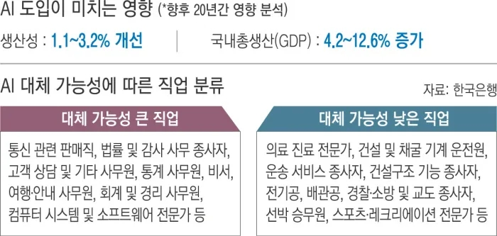
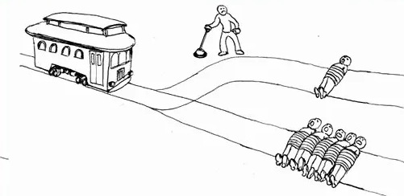
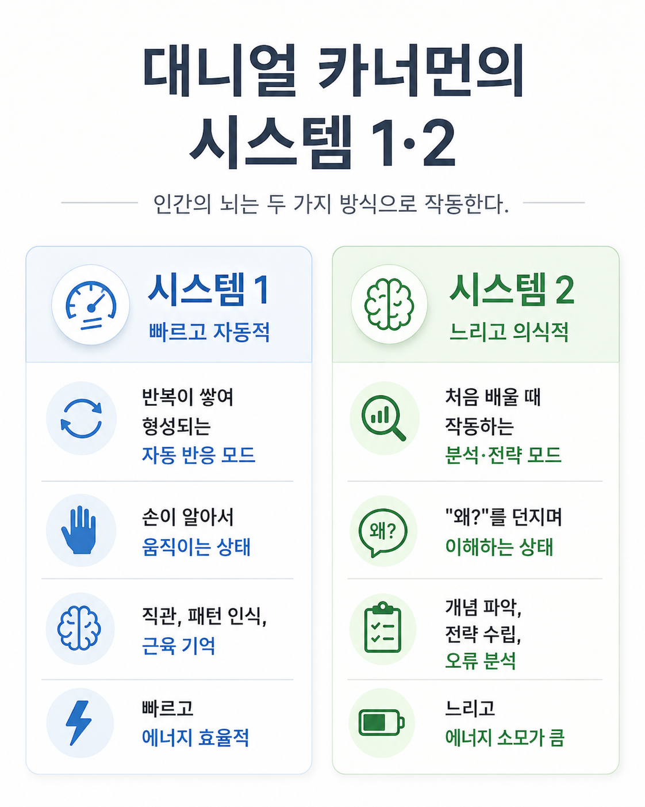
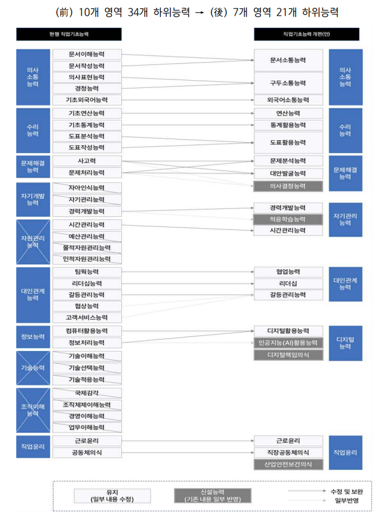
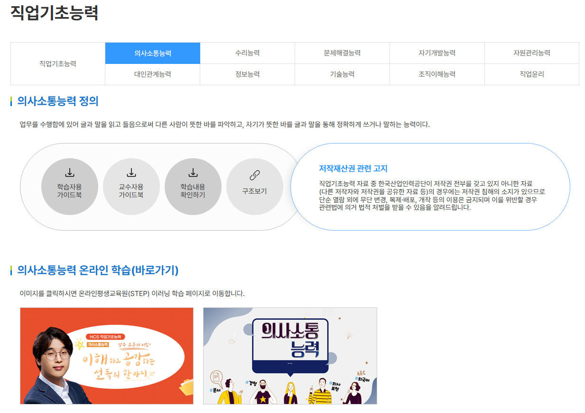

# AI 대체 불가 직업을 찾는 노력은 무의미하다
**Date:** 2026. 5. 23. 6:34
**Category:** 홈판고시
**Original URL:** https://blog.naver.com/xpfkwh56/224294067826
---

AI 대체 가능성에 따른 직업 분류 대체 가능성 큰 직업과 낮은 직업,

향후 20년 생산성 1.1~3.2%·GDP 4.2~12.6% 영향 - 한국은행

> AI 대체 불가 직업을 찾는 이유
>
> 완전한, 안전한 직업을 찾는 것보다,
>
> AI 와 공존하는 역량을 준비하는 것이 낫다

AI 로 내 직업이 대체될 수 있다는 소식은

공포를 넘어, 우리를 체념하게 만들고 있다.

​

AI 대체 직업 순위에 본인 직업이 있다면 있는 대로,

리스트에 없으면 없는 대로 마음 한 켠이 찜찜하다.

​

구직자 입장에서는 안전 직업 리스트를

미리 찾아보고, 진로를 설계하기도 하는데

결론적으로 **'그런다고 될 시대'** 는 아니다.

​

적어도 내가 아는 한, 4차 산업 혁명이든,

5차 산업 혁명이든 터져도 **'그 와중에'**

그나마 안전한 직업은 딱 하나 밖에 없다.

​

그게 뭐냐? 공무원.

​

물론 직권면직 이라고 일컬어지는

반헌법적인 예외도 없지는 않지만

​

적어도 다른 직군보다는 **안전**하다.

​

문제는 상식적으로 가장 안전해 보이는

공무원조차 **'무적'** 은 아니라는 것이다.

​

신분 보장의 정점에 있다는 공무원도

구조조정 이라는 단어에 **'혹시?'** 라는

​

생각을 갖기 마련인데, 다른 직업이라면

여유가 넘치는 것이 외려 이상한 일이다.

​

잘못된 질문에는 틀린 답 밖에 나올 수 없다.

​

AI 시대에 **'안전한 직업'** 을

찾는 일이 왜 잘못된 질문인지,

​

그리고 직업 대신 무엇을 준비해야

하는지를 우선 다뤄볼 필요가 있다.

​

무슨 직업이 안전하냐? 라는 질문 보다는

​

**1) 지금이 도대체 어떤 상태냐?**

**2) 그래서 무엇을 준비해야 되냐?**

​

라는 식의 접근이 더 유익할 확률이 높다.

​

> 완전히 안전한 직업은 왜 찾기 어려운가
>
> 인간의 역량을 찾고자 했던 시도들

위 그림은 트롤리 딜레마 그림이다.

​

참가자는 레버를 당길 수 있다.

​

당기면 1명이 죽는다.

당기지 않으면 4명이 죽는다.

​

어떤 선택을 하든, 찝찝한 결정인데,

여기서 편하게 변수를 바꿔볼 수 있다.

​

오른편에 놓인 숫자를 **일치** 시켜보자,

​

레버를 당기면 사람 1명이 죽는다.

당기지 않으면 동물 1마리가 죽는다.

​

그 동물은 돼지일 수도 있다.

닭, 심지어 곤충일 수도 있다.

​

다른 것들로 바꿔볼 수도 있다.

​

개미 한 마리와 휴지 1장이 있다.

​

개미의 죽음과 휴지의 찢어짐 중에서

무엇이 더 **인간적인** 결정이라고

우리는 판단할 수 있을까?

​

티슈 1장이 찢어지는 것과

사람의 목숨을 비교해야 된다면,

​

그 사람이 **'평범한'** 사람이라고 가정할 때,

둘의 가치는 저울에 올릴 수도 없는 일이다.

​

인류는 **'어디까지를'** 인간으로 가늠할 것인지,

의외로 많은 시행착오를 겪으며 기준을 잡았다.

​

한때 여자나, 노예는 **'재물'** 에 가까웠고,

약자를 **'인간'** 으로 인덱싱한 역사도 길지 않다.

​

1960년대, 제인 구달이 침팬지 연구를

하기 전까지 **'도구를 만들고 쓰는 능력'** 은

오직 인간만이 갖고 있는 재주인 줄 알았고,

​

1970년대, 카를 폰 프리슈가

꿀벌의 언어 체계를 발견하기 전까진

**'언어 능력'** 이 인간만의 것인 줄 알았다.

​

알파고가 사람을 이기기 전까지,

​

바둑 같은 **추상 전략 게임** 은

기계가 따라잡을 수 없다고 했고,

​

기술/사무 숙달은 기계가 할 수 있어도,

예술적, 창의적 수행은 먼 미래에서도

여전히 사람만 할 수 있는 일이라 믿었다.

​

감정을 위로하고, 교감하고, 공감하는 등의

**커뮤니케이션** 은 인간만 가능하다고 했는데,

​

GPT 만 켜봐도, **'사람 보다 나을 때가 많고'**,

​

AI 로 만든 남자, 여자 라는 것을

**'알고 있음에도'** 유료로 인공지능과

데이팅 챗봇을 즐기는 사람도 많다.

​

목수, 배관공 같은 숙련 기술직은

AI 시대에 대체되지 않는다고 한다.

​

하지만, 실제 목수들을 데려다가

헬멧에 카메라를 씌우고 그들이 보고

​

결정하는 것들을 전부 이미징 데이터로

처리해서, **학습** 에 사용하고 있기도 하다.

​

기획하고, 설계하고, 자가 동력으로

완결성 있는 임무를 완수하는 작업은

인간에게만 허락된 일이라고들 하는데,

​

명세만 확실하다면 제한적 범위 내에서는

그런 일조차, **'기계'** 가 더 **'정확히'** 한다

​

현재 인공지능이 **'제일 잘 하는 것'** 은

**영어, 코딩, 수학** 이라고 할 수 있는데,

​

기술 원리적으로 인공지능에게 있어,

그 능력이 유독 더 특화된 것은 아니고

​

**저 셋이 되는 사람들이 개발하는 것** 이

인공지능 이기 때문에 그럴 확률이 높다.

​

외형, 성격 과 같은 개인의 고유성은

기계가 넘볼 수 없는 영역이진 않을까?

​

**굳이 자세한 방법을 소개하진 않겠지만,**

​

이미 공개된 사진, 영상만 있으면,

특정인의 고유 정보들을 학습시켜

​

그 사람이 하지 않은 말과 행동을

영상으로 만들어내는 일이

**'충분히'** 기술적으로 가능하다.

​

우리가 그걸 일상에서 보지 못하는 건

기술이 안 돼서가 아니라, 딥페이크가

**'불법'** 으로 규제되고 있기 때문이다.

​

인간을 인간으로 구성하는

보이는 것들은 이미 거의,

전부 실제로 복제할 수 있다.

​

무엇이 인간을 인간으로 구분케 하는가?

라는 것에 대해 우리가 내릴 수 있는 답은,

​

지금 기준으로는, **'없다'** 에 가깝다.

> AI 가 대체하기 어려운 일의 공통점
>
> 안전한 직업 같은 것은 없다

엄마가 해주는 따끈한 밥 먹고,

책가방 들고 다니면서 혹여라도

​

샛길로 빠지지 않게 만들어주는

궤적에서 머무를 날은 길지 않다.

​

종합 대학이 아니라, 카이스트를 보내면

아이를 잘 **잡아준다고 하는** 부모님들의

교육 방식은 **'시대에는'** 맞지 않는 쪽이다.

​

자격증이 그 직업을 갖도록 해주는,

**'형식'** 은 만들어줄 수 있겠지만

​

그걸 이루는 **'실질'** 이 없으면

경쟁력을 가질 수 없을 것이다.

​

만약 둘 중 하나만 갖춰야 된다면

**'차라리'** 실질이 더 나아지고 있고,

​

점점 **'둘 다'** 갖춰야 **'출발선'** 에

설 수 있는 시대로 접어드는 중이다.

​

AI 대체 불가 직업 (x)

AI 대체 불가 **역량** (o)

​

인공지능이 내 일자리를

뺏으면 **어쩌지?** 가 아니고,

​

내 가치를 **'기계들'** 과 싸워서,

​

쟁취해내고 이겨내야만 한다는

**'자각'** 이 요구되는 쪽에 가깝다

> 역량을 갖추기 위한 3가지 준비
>
> 말은 쉽지

그렇다면 AI 시대에 요구되는 직업적인

역량을 쌓을 준비는 어떻게 할 수 있을까?

​

필자는 다년간, 블라그를 통해서**도**

다양한 사람들을 관찰할 기회를 얻었다.

​

그러던 중, 몇 가지 공통 관계를

파악해 볼 수 있는 기회가 있었는데,

​

내가 봤던 내용들은 다음과 같았다.

​

**1) 현실을 회피하지 않고, 직시하는 준비**

​

내가 어떤 상황에 놓여있는 상태다,

라는 것을 수용하는 일은 높은 수준의

자기 성찰력을 요구하는 작업 이다.

​

이건 하고 싶다고 되는 일 이라기보단,

​

**'상황에 압도되지 않는 환경'** 에

놓인 사람이 갖는 특권에 가까운데,

​

불편한 상황에서 우리는 미루기 쉽고,

미래의 나에게 떠넘기는 일을 즐긴다.

​

특히나, 업무 환경에 있어서

**'핑계'** 가 많은 일이 대표적이다.

​

9시에 출근을 하면,

갓 출근 했으니

잠깐 한숨 돌리고

​

11시 되면, 밥 먹고 해야 되니까

일단 식사 끝나고 차차 생각을 하고,

​

1시 되면, 밥 먹고 졸리니까 좀 쉬고,

​

3시 되면 출출하니까 디저트든

커피든 한잔하면서 잠깐 놀다가,

​

퇴근 가까워 오면, 내일 하면 되겠지

집에 가서는 근무시간 아니니까,

​

금요일은 금요일 이라서,

월요일은 월요일 이라서,

​

주말은 주말 이라서 같은 이유들로

**'쉴'** 이유를 필사적으로 찾는 경우들이

​

결코 마냥 적지는 않은 것 같았다.

​

이런 문제는 구조적이거나

복합적으로 주로 작용 하는데,

​

당장 내가 놓인 상황에서 무언가를

**'안 해야 될'** 이유를 찾기 시작하면

그 위에 뭐를 얹어도 어려울 때가 많다

​

나는 이걸 **'정서적 자원'** 관점으로 본다.

​

무언가를 새로 시작하려는 사람들은

자신이 종종 **'0'** 에서 시작한다고 여기나,

​

멀쩡히 하고 있는 일이 있는 마당에

새로 다른 일을 기웃댄다는 것 자체가

​

스스로도 인지하지 않은 어떤 결핍을

채우려는 행위일 수도 있는 일이다.

​

인생사에서 개인이 하는 결정들이란 것은,

명백한 정답과 오답이 칼처럼 떨어지기보다

​

**당장은 편하지만 더 안 좋은 것** 과

**당장은 불편하지만 덜 안 좋은 것** 을

​

결정하는 것과 비슷한 일이 훨씬 잦은데,

​

스스로 지금 현명한 판단을 할 수 없다,

내지 경솔한 결정을 할 가능성이 높다

​

라는 진단이 나오면, 그 배경이 무엇이든

대부분은 **'일단 스돕'** 하는 것이 유리하다.

​

늘 그런 규칙을 지킬 수는 없더라도,

​

그 **'한 템포'** 가 본인을 지킬 수 있는

든든한 무기가 될 때가 많기 때문이다.

​

​

**2) 즉각적 결과 대신 과정을 설계하는 준비**

**​**

해서 되는 것인지, 되니까 하는 것인지

그 사이의 간극은 아주 멀지만

​

하는 사람도 되는 사람도 정작 자신이

어느 지점에서 그게 된 것인진 알 수 없다.

​

다만 확실한 것은,

​

**'실행력'** 이 1번에서 나 자신이

내 눈을 찌르는 일이 많은 것처럼,

​

**'예측할 수 없는 결과에 대한 확증'** 이

오히려 내가 얻을 것에서 나 자신을

먼 곳으로 보내는 일이 많다는 것이다.

​

몇 가지 유사한 예시를

들자면 이런 것이 있겠다.

​

**나는 결혼해서 행복하게 살고 싶은데,**

**좋은 남자를 어디서 만나면 좋을까요?**

​

남자, 정도야 명확한 정의가 있겠지만

좋은 남자도 그게 무슨 좋은 남자인지,

​

여하튼 내 기분 맞춰주면 좋은 남자인지,

​

좋았던 남자인지, 당장 좋은 남자인지,

앞으로 좋을 남자인지는 **'알 수가 없다'**

​

스펙을 사분 오열해가지고,

이 남자는 좋은가요, 어떤가요 하면

​

좋은 면에 가중치가 높거나, 하필 그 면을

더 좋게 보는 사람은 좋다 할 것이고,

​

나쁜 면에 더 가중치를 두는 경우라면

당연히 나쁜 말이 나올 수밖에 없을 테니

​

10명이든, 100명이든,

찾아도 실익이 없다.

​

그 화제로 노닥거리는 것이

즐거운 것이 아니라면 말이다.

​

나는 어떤 과정을 통해서, 어떤 남자를

만나서, 어떻게 결혼을 하고 싶다 라는 것은

그보다 더 실현할 수 있는 목표일 수 있다.

​

이 주식을 사면 오를까요, 내릴까요 도 그렇다.

월가의 특급 금융인이라고 한들 그걸 알까.

​

변호인이 최선을 다해서, 무죄를 받게끔

노력은 하겠지만 그들이 할 수 있는 일은

​

결국 **'변론'** 을 디자인하는 것에 지나지 않다.

​

환자가 의사 한테 구입하는 것은

**'약속되고, 확정된 건강'** 이 아니라,

**​**

**'치료 모델'** 인 것과 동일하다고 본다.

​

우리 애가 서울대, 의대 갈 수 있을까요?

하고 선생님을 부지런히 닦달을 해봤자,

​

우리는 이런 커리큘럼으로,

이렇게 가르쳐서, 이렇게 준비할 겁니다

정도 외에는 **들을 수 있는** 얘기도 없다.

​

인간은 본디 미래를 알 수가 없고,

​

1% 의 가능성 싸움을 해가면서

그 정밀성을 다툼하고 있을 바에야,

​

**'내가 무엇을 하고 있는 상황이고,**

**그 목적에 맞게 잘 추구하고 있는지'**

​

스스로 성찰하는 것이 대부분의 상황에서

**'검토'** 라도 해볼 수 있는 실마리가 된다.

​

너 말만 듣고 했는데, 잘 안 됐잖아 라고 한들

종국에는 외로울 뿐이기 때문에 더욱 그렇다.

​

**내가 내 과정에 충실한다는 것** 은,

결과에​ **'내가'** ​책임을 지겠다는 것이고

​

동시에 알 수 없는 결과에 상관없이,

통제할 수 있는 과정을 주도 하겠다는

태도를 의미하기 때문에 차이가 **크다**.

​

무슨 직업이 앞으로 전망이 좋아지고,

대우가 좋아질 것인진 **'아무도'** 모른다.

​

다만, 무슨 일이든 **'잘'** 하는 사람이

**'좋은 가치'** 를 만들고 살고 있으면,

​

더 나은 삶이 **있을 수도** 있단 것이고,

​

내 직업의 대우나, 사회적 평판들은

**'사회의 평균값'** 에 수렴되는 것이 아닌

​

**'내가 과정, 과정으로 만들어 나가는'**

것에 있다는 것 정도는 그나마 확실하다.

​

**3. 사회가 요구하는 기본 직업 역량에 대한 준비**

​

직업기초능력 개편안 : 10개 영역 34개 하위능력에서 7개 영역 21개로 축소, AI활용능력 신설 - 고용노동부

​

실행력, 메타인지, 과제집착력,

사고력, 비판적 태도 등등 많지만

​

결국 능력이야 **뭔들 많으면 좋다**.

​

이 게임은 **상대평가** 게임이기 때문에,

​

아닌 것은 아닌 대로 알아서 개선하고

맞는 것은 맞는 대로 잘 해야 되는데,

​

**'직업 기초 능력'** 이라고 제시한 것들은

​

최소한 **'의무교육'** 레벨에서 사회인들이

갖추고 나와야 된다고 정의한 요소들이다.

​

직업기초능력 온라인 학습 STEP 의사소통·수리·문제해결 등 7개 영역 무료 학습 - 한국산업인력공단

​

인공지능에 대체되지 않는,

나만의 차별화된 소구점을 갖고

미래 사회를 이겨나가야겠다 (x)

​

사회인에게 요구되는 **튜토리얼** 부터 (o)

​

이런 일 하라고 세금 써서 만들어둔 것이니,

​

정부에서 전문가들이 집대성한 자료들로

**'여유가 되면'** 시간 날 때 틈틈이 읽으면서,

​

**'평가 당하는 재미'** 에 심취하지 말고,

​

나는 무엇이 되는 사람이다, 어떤 사람이다,

라는 **정체감** 을 확보하는 것이 좋다고 생각한다

> 인공지능이 있든, 없든 (o)
>
> AI 시대를 핑계로 삼지 않을 수 있어야 좋지 않을까

이상의 내용을 보면, 어떤 의미로는

AI 가, 인공지능이 있든 없든 간에

​

**'지난 시대'** 에서 우리가 하던 것들과 비교해도

그다지 대단한 차이가 있는 작업들은 아니다.

​

결국 AI 를 포함해서, 다른 외부의 무엇이

**'대체할 수 없는 것'** 은 특정 **'직업'** 이 아니라

​

현실을 마주하고, 할 수 있는 일과

할 수 없는 일을 명확히 구분 하고,

​

사회에서 요구하는 능력들을 쌓은 후에,

자리를 찾아서 앉는 것이 전부라 그렇다.

​

그럼에도 불구하고, **'안전한 보증'** 을

우리가 끊임없이 새로 찾게 되는 이유는

​

미뤄왔던 숙제를 끝끝내, 그 시점에

해결한 적이 없었기 때문일 것이다.