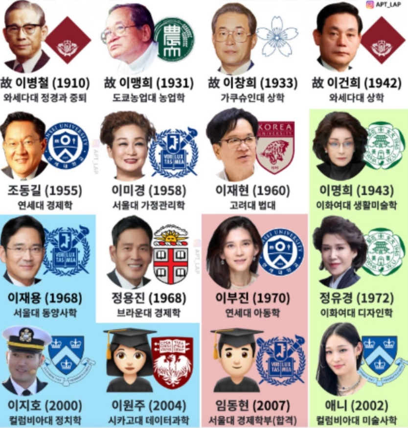

# 경영의 신이 된 3명의 실패자들
**Date:** 2026. 5. 23. 8:20
**Category:** 다이어리
**Original URL:** https://blog.naver.com/xpfkwh56/224294108222
---

**​**

**1. 한국 재벌은 왜 일본을 배웠나**

​

대한민국 최고의 기업이라는 수식어에는 이견이 있을 수 있겠으나, 한국을 대표하는 기업을 말하면서 삼성을 빼놓기는 어렵다. 창업주 이병철은 슬하에 세 아들을 두었고, 그 셋을 모두 일본으로 보냈다. 그 시절이라 한들 미국이 일본에 미치지 못할 나라도 아니었고, 넓고 멀리 보았다면 중국으로 보낼 수도 있었을 것인데, 어떤 연유로 그는 일본을 택했을까.

​

2026년을 사는 우리에게 자본을 숭상한다는 말은 별로 어색하지 않다. 다 먹고살자고 하는 일이고, 돈을 번다는 것이 죄악시되는 편이 오히려 낯설다. 지킬 것만 지킨다면 많은 부를 쌓았다는 것은 자랑스러운 일이고, 응당 선망받아 마땅한 일이다. 그러나 안타깝게도 한반도 반만년의 역사 안에서 또렷한 족적을 남긴 상인의 이야기는 찾기가 어렵다. 그나마 몇 있는 인물들조차 남은 내용이 많지 않다.

​

고조선 무렵 중개무역으로 돈을 벌다가 나라가 절단 났다는 소식이나, 책상에 코를 박고 과거 급제를 준비했다는 이야기는 자주 보이지만, 디지털 노마드라거나 영앤리치 청년 창업가를 꿈꿨다는 민중의 이력은 좀처럼 보이지 않는다. 그나마 흔적을 찾자면 조선 후기에 이르러 몇 명이 스쳐갈 뿐인데, 요즘 말로 관을 끼고 B2G 영업을 했다는 정도가 전부고, 내지통상을 당해 이권을 날려먹었다는 얘기쯤이다.

​

서울 지하철 노선도를 보면 끝음절이 포, 나루, 진으로 끝나는 지명이 있다. 마포, 영등포, 노량진, 광진 같은 곳들은 과거 교통의 요지였고 사람들의 유동이 찍히던 자리였다. 선비들이 모여 살던 남촌은 일제강점기 이후 일본인 중심의 상업 특구로 지정되었다가 이름이 명동으로 바뀌었다고 한다.

​

농본 중심의 성리학으로 돌아가던 중국과 조선에는 유명한 상인을 찾기 어려운 반면, 일찍이 일본에서는 봉건제를 중심으로 한 가문들이 마치 길드처럼 활동하다가 훗날 상인 가문이라는 이름으로 기록 밖으로 걸어 나왔다. 그 내용을 들여다보면 조직의 미쓰비시, 인본의 미쓰이, 결속의 스미토모라는 라이트노벨 같은 수식어가 붙곤 한다. 미쓰비시는 강력한 중앙집권적 통제와 철저한 상명하복의 엘리트 경영을, 미쓰이는 개별 구성원의 자율과 개성을 존중하는 딜메이킹 경영을, 스미토모는 결속과 전통을 중시하는 의리 경영을 했다는데, 얼핏 삼성과 현대와 SK와 LG의 얼굴이 겹쳐 보이기도 한다. 재벌 경영이 현대식 경영으로 바뀌면서 각 기업의 캐릭터성은 전보다 많이 옅어졌지만 말이다.

​

초기 재벌이 적산기업을 기반으로 나라가 밀어주는 버스를 운 좋게 잘 탄 것도 사실이다. 그러나 세상사 다 그렇듯, 오로지 운만으로 격변의 시대를 살아남았다고 하기에는 설명되지 않는 요소도 있다. 부모가 된 시점에서 자녀를 어떻게 키워야 하는가를 두고, 나는 늘 비슷한 대답에 도달한다. 자녀에게 무엇을 가르쳐야 좋을까. 학업이야 머리에 채우면 그만이고 재산이야 입에 물려주면 그만이라 고민이랄 것도 없지만, 기왕 하나를 반드시 새겨줄 수 있다면 그것은 태도라고 생각한다.

​

이룬 것을 비할 바는 아니겠으나, 그 역시 자녀를 둔 부모인 이상 나와 다른 마음은 아니었을 터. 스스로 가장 좋다고 여긴 길을 내밀었음은 분명하다. 비록 그의 자식 농사가 대단히 잘되었다고 보기는 어렵지만 말이다. 일본은 당시 우리나라에 가장 가까운 산업화 모델이었다. 식민지 시절 이미 제도와 회계와 금융과 유통의 구조가 연결되어 있었고, 직접 관찰 가능한 실전 자본주의 교과서에 가까웠다. 반면 미국은 너무 멀고 규모가 달랐으며, 중국은 혁명과 혼란의 한복판이라 상업과 산업의 시스템을 배우기에 적합하지 않았다. 그래서 근현대 한국 기업가들에게 일본은 따라잡을 수 있는 롤모델로 알맞았다.

​

이병철과 정주영이 한국 재계의 클래식이라면, 클래식의 클래식은 일본식 경영에 있는 셈이다. 우리에게 재벌이라 하면 이병철과 정주영 같은 영웅이 먼저 떠오르듯, 20세기 일본의 산업을 새로 쓴 경영인들이 있다. 마쓰시타 고노스케, 혼다 소이치로, 이나모리 가즈오. 이 세 사람이다.

​

**2. 마쓰시타 고노스케**

​

네 살에 무너진 집

​

와카야마현의 작은 지주 집안, 8남매의 막내였다. 동네에서 꽤 잘사는 축이었으나 그가 네 살 되던 해, 아버지 마사쿠스가 쌀 선물거래에 손을 댔다가 전 재산을 날렸다. 조상 대대로 내려온 땅과 집을 모두 팔아넘기고 와카야마 시내로 이사해 나막신 가게를 차렸으나 그마저 망했다. 결국 아버지는 홀로 오사카로 일하러 떠났다.

​

이 일은 마쓰시타가 평생 안고 간 트라우마가 되었다. 훗날 그는 회고했다. 아버지는 죽을 때까지 3엔만 손에 쥐면 또 쌀 시장에 갔다, 어떻게든 손실을 만회하려 한 거다, 어머니가 말리고 두 분이 자주 다투던 모습이 지금도 눈앞에 선하다, 투기와 도박을 내가 끔찍이 싫어하는 건 어릴 적 그 슬픈 기억이 살에 박혀 있기 때문이다. 훗날 마쓰시타전기 사칙 제45조, 곧 사원은 사주의 허락 없이 자기 영리를 목적으로 하는 상행위 또는 일체의 투기적 행위를 해서는 안 된다는 조항은 네 살의 그 기억에서 나온 한 줄이었다.

​

설상가상으로 가족이 하나씩 사라졌다. 가난과 결핵으로 큰형, 작은형, 누나가 차례로 일찍 죽었다. 열두 살에는 아버지마저 잃었고, 열한 살에 잠깐 만난 것이 마지막이었다. 어머니까지 일찍 보낸 뒤 자신도 청년기에 폐결핵 진단을 받아 평생을 비실비실 살았다. 그는 훗날 이렇게 말했다. 재산도 없고 학력도 없고 건강도 없고 양친도 형제자매도 거의 다 죽었다, 그야말로 없음 투성이에서 출발했다. 과장이 아니라 사실 그대로의 묘사였다.

​

아홉 살 견습생, 그리고 처세

​

소학교 4학년이던 아홉 살에 학교를 그만두고 홀로 오사카에 견습공으로 보내졌다. 첫 직장은 미야타 화로 가게였다. 주된 일은 청소와 주인집 아이 보기, 화로 닦기였다. 훗날 아흔한 살의 그에게 누군가 인생에서 가장 기뻤던 순간이 언제였느냐 물었을 때, 그의 답은 노벨상도 매출 1조 엔도 아닌 화로 가게에서 처음으로 5전짜리 백동화 한 닢을 받은 그 순간이었다. 견습 첫 며칠은 일이 그리 힘들지 않았는데, 밤에 잠자리에 들면 어머니 생각에 울음이 멈추지 않았다고 한다. 아홉 살짜리가 와카야마에서 오사카까지 홀로 보내져 매일 밤 몰래 우는 그림이다.

​

석 달 만에 자전거 상회 고다이로 옮겼는데, 여기에 묘한 인연이 있었다. 가게 주인의 친형은 열다섯에 시력을 완전히 잃은 뒤 안마사로 시작해 사업가로 성공하여 사립 오사카맹아원을 세운 사람이었고, 마쓰시타의 아버지 마사쿠스가 바로 그 맹아원의 사무직으로 일하고 있었던 것이다. 같은 오사카에 살게 된 부자가 시각장애인 자선사업을 통해 다시 연결된 우연이었다.

​

이 자전거 가게에서 그는 평생 가져갈 교훈 하나를 배운다. 손님들이 자주 담배 심부름을 시키자, 그는 한 번 갈 때 여러 갑을 미리 사두면 다음 주문에 즉시 응할 수 있고 묶음 구매라 단가도 싸진다는 데 생각이 미쳤다. 그 차액을 자기가 챙겼다. 손님은 빠른 서비스에 만족하고 본인은 푼돈을 모으니 윈윈 같았으나, 다른 견습공들이 자기만 챙긴다며 미워하기 시작했고 결국 주인이 그만두라 했다. 그는 그만두었다. 그리고 평생 이 일을 회고하며 말했다. 혼자 이기면 안 된다는 걸 그때 알았다. 아홉 살에서 열한 살 사이에 그는 자수성가의 머리와 함께 가는 처세의 마음을 모두 배운 셈이다.

​

사표, 그리고 다다미 두 칸

​

열두 살에 자전거 가게를 떠나 시멘트 공장을 잠시 거치던 중, 오사카 시내에 노면전차가 깔리는 것을 보고 충격을 받았다. 전기로 움직이는 시대가 온다. 곧장 오사카전등에 견습공으로 입사했고, 부지런하고 손재주가 좋아 스물둘에 검사원으로 승진했다. 현장을 도는 일은 하루 몇 시간이면 끝났고 안정적이며 존경받는 자리였다. 다른 검사원들은 모두 만족했으나 마쓰시타만은 우울했다. 이건 내 인생이 아니다.

​

그가 틈틈이 만들어둔 개량형 전구 소켓을 사장에게 보였더니 쓸모없다는 답이 돌아왔다. 보통 사람이라면 여기서 좌절했을 것이다. 그는 1917년 사표를 던졌다. 7년의 노력이 아깝지만 어쩔 수 없다, 회사를 그만두자. 퇴직금과 지인 차용금을 합한 약 200엔으로, 자기 집 다다미 두 칸을 흙바닥으로 개조해 작업장을 만들었다. 부인 무메노와 처남 이우에 도시오, 훗날 산요전기를 창업하는 그까지 셋이 첫 멤버였다. 처음엔 소켓이 팔리지 않아 부인이 결혼 패물을 전당포에 잡혔다.

​

생계가 막막하던 때 우연히 선풍기 회사에서 절연판 주문이 들어와 숨통이 트였고, 1918년 스물셋에 마쓰시타전기기구제작소를 정식으로 창업했다.

​

두 갈래 소켓에서 점등 마케팅까지

​

첫 빅히트는 후타마타 소켓, 곧 두 갈래 소켓이었다. 그 시절 가정에는 콘센트가 없어 천장 전구에서만 전기를 뺄 수 있었다. 전구를 빼면 다림질도 라디오도 못 썼는데, 마쓰시타는 천장에 전구와 가전제품을 동시에 꽂는 어댑터를 만들었다. 이 하나로 인생이 편해졌다며 일본 전역이 들썩였다.

​

1923년에는 더 기발한 것이 나왔다. 자전거용 포탄형 전지 램프였다. 자전거 가게 시절 야간 주행이 얼마나 불편한지 몸으로 알았던 그가 만든 물건이었다. 기존 램프 수명이 두세 시간인데 마쓰시타의 램프는 30시간에서 50시간, 미친 성능 차이였다. 그런데 정작 도매상들이 받아주지 않았다. 마쓰시타가 무슨 회사냐, 못 들어봤다는 무명 메이커 차별이었다. 여기서 그가 한 일이 압권이다. 전국 소매점에 무조건 한 개씩 무료로 뿌리며 말했다. 켜놓으세요, 손님이 직접 보고 사실 겁니다. 처음 듣는 점등 마케팅이었고 반응은 폭발적이었다. 지명도 영에서 시작한 이 램프가 훗날 내셔널 브랜드로 이어졌다.

​

협상의 정수를 보여준 일화도 이 무렵이다. 1927년 내셔널 램프를 정식 출시하며 견본 1만 개를 전국에 무료 배포하려 했는데, 그러려면 건전지 1만 개가 무료로 필요했다. 도쿄의 오카다 건전지를 찾아가 사장에게 말했다. 건전지 1만 개를 무료로 주십시오, 그냥 받자는 게 아닙니다, 지금 4월입니다, 연내에 귀사 건전지를 20만 개 사겠다고 약속합니다, 만약 못 팔면 그 1만 개 값도 제가 내겠습니다. 처음엔 어이없어하던 오카다 사장이 답했다. 장사를 한 이래 이런 제안은 처음 받소, 좋습니다, 한번 해보세요. 1천 개쯤 무료로 풀자마자 주문이 쇄도했고, 그해 12월 결산해보니 약속의 두 배가 넘는 47만 개를 매입했다. 오카다 사장이 정복을 차려입고 도쿄에서 오사카까지 일부러 인사하러 왔다. 상대가 거절해도 손해, 받아도 손해인데 받으면 같이 큰돈을 번다고 계산하게 만든 협상이었다. 자기 위험을 떠안고 상대의 마음을 움직이는 방식이었다.

​

1929년, 한 사람도 자르지 않는다

​

그러나 곧 대공황이 직격했다. 마쓰시타는 그때 병석에 누워 거동도 거의 못 하는 상태였다. 직원 약 300명에서 500명 규모에 매출이 두 달 만에 반토막 났고, 창고에는 재고가 산처럼 쌓여 더 둘 곳이 없었다. 두 간부가 침대 옆까지 와서 보고했다. 오야지상, 위기를 넘기려면 인원을 절반으로 줄이는 수밖에 없습니다. 해고자 명단 60여 명까지 이미 작성된 상태였다.

​

마쓰시타는 잠시 침묵하다 입을 열었다. 내 생각은 이렇다, 마쓰시타가 오늘 망할 거라면 자네들 말대로 해고해도 좋다, 그러나 나는 마쓰시타를 앞으로 더 크게 만들 생각이다, 그렇다면 한 사람도 자르면 안 된다, 회사 사정으로 사람을 뽑았다 잘랐다 하면 일하는 사람들이 불안해지지 않겠나, 큰일을 하려는 마쓰시타로서는 견딜 수 없는 일이다. 이렇게 하자, 생산은 즉시 절반으로 줄이고 공장은 반나절만 가동한다, 그러나 직원 급여는 전액 지급한다, 대신 영업직원은 전원 휴일을 반납하고 재고 판매에 전력을 다해라.

​

해고를 각오하고 있던 사람들이 그 자리에서 환호하고 흐느꼈다. 그리고 진짜는 그다음이었다. 두 달 만에 재고가 깨끗이 다 빠졌고, 공장은 반나절 가동을 그만두고 풀가동에 잔업까지 더해야 했다. 마쓰시타는 훗날 말했다. 이 경험으로 직원들 마음에 진짜 쇠심줄이 박혔다, 그리고 나도 경영자로서 방법은 얼마든지 있다는 큰 깨달음을 얻었다. 훗날 마쓰시타전기 노조가 GHQ에 회장님은 전범이 아닙니다라는 탄원서를 낸 것이 이 충성심의 결과였다.

​

댐을 만들겠다고 강하게 생각하라

​

일흔이 넘은 마쓰시타가 교토에서 강연을 했다. 주제는 댐식 경영이었다. 댐이 가뭄에 대비해 평소 물을 모아두듯, 회사도 자금과 인재와 기술과 재고에 평소 여유를 비축해야 한다는 것이었다. 청중 대부분이 중소기업 사장이었는데, 한 사장이 손을 들었다. 선생님, 말씀은 멋지지만 현실은 그게 안 됩니다, 어떻게 해야 댐식 경영이 됩니까, 구체적인 방법을 알려주십시오.

​

마쓰시타가 잠시 침묵하다 답했다. 그건 나도 모르겠습니다, 하지만 댐을 만들겠다고 강하게 생각하지 않으면 안 됩니다, 빌고 염원하는 게 가장 중요합니다. 객석 전체에 실소가 퍼졌다. 뭐야, 그게 답이야. 그러나 그 자리 뒷줄에 앉아 있던 한 30대 후반의 남자만은 몸에 전기가 흐르는 듯한 충격을 받았다. 막 교세라를 창업한 이나모리 가즈오였다. 이 한마디가 어떻게 한 사람의 인생을 갈랐는지는 뒤에서 다시 만나게 된다.

​

세 가지 천복

​

일흔이 넘은 마쓰시타에게 한 직원이 어떻게 이렇게 큰 성공을 거두셨습니까 물었을 때, 그의 답이 압권이었다. 나는 하늘로부터 세 가지 은혜를 받고 태어났다, 집이 가난했던 것, 몸이 약했던 것, 그리고 학교를 4학년까지밖에 못 다닌 것. 가난했기에 아홉 살부터 세상 일을 배웠고, 몸이 약했기에 남에게 부탁하고 위임하는 법을 배웠으며, 학력이 없었기에 평생 모든 사람에게 가르침을 청할 수 있었다는 것이다. 자기 약점을 자산으로 뒤집어 보는 그 시선이었다.

​

1989년 4월 27일, 아흔여섯에 사망했다. 유산은 약 2천450억 엔, 일본 역사상 개인 최고액이었다. 그러나 그는 죽기 전 사재 70억 엔을 들여 1979년 마쓰시타 정경숙을 세웠다. 21세기를 이끌 정치 지도자를 키운다는 목적이었고, 노다 요시히코와 마에하라 세이지를 비롯한 여러 총리가 이곳 출신이다. 그가 평생 한 말을 한 줄로 줄이면 이렇다. 장사는 결국 사람을 만드는 일이다, 마쓰시타전기는 사람을 만드는 회사이고 그 부산물로 가전제품을 만든다.

​

**3. 혼다 소이치로**

​

차에 홀린 아이

​

시즈오카현 작은 산골 마을, 대장장이의 장남으로 태어났다. 여덟 살에 처음 자동차를 보았다. 시골에 굉음을 내며 들어온 T형 포드였다. 일본에 자동차가 들어온 지 10여 년밖에 안 된 시절이었다. 강에서 놀던 아이가 그날 이후 차 뒤꽁무니를 따라다녔다. 비행사 아트 스미스의 곡예비행 쇼를 보겠다고 학교를 무단결석하고 어른 자전거를 삼각타기로 몰아 멀리까지 가기도 했다. 학교 공부는 끔찍이 못했다. 도장을 위조해 성적표를 고쳤고, 절의 정오 종을 30분 일찍 쳐 마을 전체가 일찍 도시락을 까먹게 만든 일화도 유명하다. 머리가 나쁜 게 아니라 기계와 장난 외에는 관심이 없었던 것이다.

​

1922년 열여섯에 고등소학교를 졸업하자마자 도쿄의 자동차 정비소 아트상회에 견습공으로 들어갔다. 그런데 막상 가보니 6개월간 사장 아이 보기와 청소뿐, 차에는 손도 못 댔다. 그는 스스로를 위로했다. 이렇게 자동차를 쳐다볼 수 있는 것만으로도 행복하다.

​

열일곱, 처음 운전대를 잡다

​

운명이 바뀐 순간은 1923년 9월 1일 관동대지진이었다. 정비소에 손님들이 맡겨둔 차들이 화재가 다가오는데 묶여 있었고, 선배들은 모두 도망갔으며 그 혼자 남았다. 평소엔 손도 못 대게 하던 차들을, 열일곱 견습이 처음으로 운전대를 잡고 차례로 안전한 곳으로 옮겼다. 이 한 번의 비상으로 운전과 정비를 한꺼번에 익혔다. 이후 어떤 고장도 빠르게 고치는 손재주로 이와테현 모리오카까지 홀로 출장 가 소방차를 고치고 오기도 했다.

​

6년 견습 끝에 1928년 스물둘, 사장 사카키바라는 여섯 견습 중 단 한 명, 혼다에게만 노렌와케를 주었다. 가게 이름을 떼어 분점을 내도 좋다는 허락이었다. 고향 하마마쓰로 돌아가 아트상회 하마마쓰 지점을 열었고, 5년 만에 종업원 50명을 거느린 대형 정비소로 키웠다. 수입이 당시 총리대신과 같은 수준까지 올랐다. 본인이 회상한 제1차 황금기였다.

​

잘하는 법은 잘하는 것이다

​

여기서 멈출 수 없었다. 스물여덟의 그는 말했다. 아무리 번창해도 수리는 수리에 불과하다, 나는 이 손으로 물건을 만들고 싶다. 피스톤링 제조를 결심했다. 당시 피스톤링은 너무 어려워 일본에 만드는 회사가 몇 안 됐고 단가가 비쌌다. 동료 전원이 결사반대했다. 할 거면 너 혼자 해라, 회사 끌어들이지 마. 충격받은 혼다는 진짜로 드러누워 일을 거부했고, 회사가 백기를 들고 별도 회사 형태로 허락했다.

​

기뻐서 잠도 안 자고 매달렸지만, 금속공학 지식이 전무한 정비공이 갑자기 만들 수 있을 리 없었다. 3만 개를 만들어 그중 50개를 엄선해 토요타에 납품했는데, 합격은 단 3개였다. 참담한 실패였다. 그러나 여기서 그의 진짜 진가가 드러났다. 이론을 기초부터 배워야 한다. 서른 넘은 사장이 하마마쓰 고등공업학교 기계과의 청강생으로 들어갔다. 학생복에 학생모를 쓰고 자식뻘 학생들 사이에 끼어 통학했다. 다만 이학 수업 외에는 일절 나가지 않았고, 3학년 때 학교 측 인내심이 폭발했다. 당신, 이러면 졸업증 못 줍니다.

​

혼다의 답이 그다웠다. 나는 일을 성공시키려고 학교에 들어온 거지 졸업증이라는 종이 한 장 받으려고 들어온 게 아닙니다, 졸업증은 영화관 입장권만도 못해요, 영화관은 표가 있어야 들어가지만 이 세상은 졸업증 없이도 살 수 있습니다. 졸업장을 받지 않고 떠났다. 그러나 그 청강 기간에 피스톤링 관련 특허 28건을 취득했고 끝내 대량생산에 성공했다. 학력의 무용함과 학습의 위대함을 동시에 증명한 셈이다.

​

인간 휴업, 그리고 바타바타

​

전쟁이 끝나자 그는 자기 회사 주식을 토요타에 45만 엔에 모두 넘기고 1년간 아무것도 하지 않았다. 본인이 이 시기를 인간 휴업이라 불렀다. 탁주를 직접 담가 마시고, 시멘트를 반죽해 부엌 옆에 세면대를 만들고, 드럼통을 잘라 욕탕을 만들고, 그걸로 낫토를 찌면서 망연자실하게 한 해를 흘려보냈다고 한다. 자수성가 영웅 서사에서 잘 나오지 않는 부분이지만, 거의 모든 큰 인물에게는 이런 공백기가 있다.

​

다시 시작한 그는 혼다 기술연구소를 세웠다. 그가 한 발견은 육군이 버리고 간 무전기용 발전기 엔진이었다. 그걸 자전거에 달면 어떻게 될까. 결과물이 그 유명한 바타바타, 또는 폰폰이었다. 시동 걸 때 나는 소리에서 따온 별명이다. 전후 휘발유는 부족하고 대중교통은 마비된 시기에 미친 듯이 팔렸다. 곧 군용 엔진 재고가 떨어지자 직접 엔진을 개발해 1947년 50시시 0.5마력의 A형 엔진을 출시했고, 1948년 자본금 100만 엔, 직원 20명으로 혼다기연공업을 정식 창립했다.

​

시즈오카 은행 사건

​

1949년 도쿄 진출 자금이 필요해 거래 은행인 시즈오카은행 하마마쓰 지점을 찾아갔다. 융자심사 부장이 그를 받았다. 혼다가 도쿄 진출 청사진을 한참 설명하자, 부장은 숫자를 들이대며 도쿄 진출이라니 당신 회사를 망칠 셈이오 하며 신흥 중소기업이 얼마나 어설픈지 하나하나 짚었다.

​

혼다가 폭발했다. 이놈아, 네가 내 뭘 안다고, 두 번 다시 너희한테 부탁 안 한다. 자리를 박차고 나왔고 그 자리에서 거래를 영구히 끊었다. 혼다 본사가 시즈오카에 있는데도 이후 75년이 지나도록 시즈오카은행과 거래를 한 번도 하지 않았다. 한번 마음이 떠나면 끝까지 돌아가지 않는 성격이었다.

​

기술은 혼다, 돈은 후지사와

​

혼다는 천재 기술자였지만 경영은 빵점이었다. 돈 관리도 영업도 인사도 못했다. 통산성 기관의 다케시마 히로시의 소개로, 도쿄 오기쿠보의 한 판잣집에서 만난 사람이 후지사와 다케오였다. 당시 서른여덟, 도쿄에서 제재소를 운영하던 사람이었다.

​

전설적인 첫 만남이었다. 둘은 단 몇 분 만에 의기투합했다. 후지사와는 회상했다. 혼다 씨 얘기를 듣고 있으면 미래에 대해 헤아릴 수 없는 게 줄줄이 나온다, 그걸 실행에 옮기는 레일을 깔아주면 혼다의 꿈은 그 위로 폭주해 갈 거다, 그렇게 생각했다. 그 자리에서 후지사와는 자기 제재소를 팔아치우기로 결심했다. 역할 분담도 즉결이었다. 기술은 혼다, 돈은 후지사와. 혼다는 자기 회사 인감을 후지사와에게 통째로 맡겼고, 그것이 25년간 이어졌다.

​

사장이냐, 기술자냐

​

이 일화가 두 사람 관계의 본질을 가장 잘 보여준다. 1969년, 혼다 첫 보통차 H1300 개발 때였다. 혼다는 공랭식 엔진에 비정상적으로 집착했다. 젊은 기술자들은 수냉식이 답이라고 봤지만, 사장이 매일 현장에 들어와 잔소리를 하니 다들 지쳐갔다.

​

후지사와는 25년간 기술 면에는 일절 입을 대지 않았다. 약속이었다. 그런데 이때 처음으로 그 약속을 깼다. 기술자들의 의견을 모아 혼다에게 말했다. 수냉식이 답입니다. 혼다가 반발했다. 공랭으로도 된다, 부사장이 아무리 설명해줘도 모르겠지만. 후지사와의 그 한마디가 나왔다. 당신은 혼다기연 사장의 길을 갈 거요, 아니면 기술자로 남을 거요, 둘 중 하나를 고르시오.

​

긴 침묵 끝에 혼다가 답했다. 사장으로 남아야겠지. 수냉식 채택이 결정됐다. 그 차가 시빅의 원형이 되고, 미국의 엄격한 배기가스 규제인 머스키법 시대에 혼다를 살린 CVCC 엔진으로 이어졌다. 자기 고집을 꺾고 회사 전체를 살린 한마디였다.

​

차별을 가장 싫어한 사람

​

혼다는 평생 차별을 모든 악의 근원이라 불렀다. 어릴 때 자기 집안에서 목욕 들어가는 순서가 정해져 있다는 걸 깨닫고부터라고 했다. 인종이나 가문이나 학력으로 사람을 판단하는 짓을 나는 평생 안 했다.

​

미에현 마쓰사카에서 회의가 열렸을 때, 한 간부가 그 유명한 마쓰사카 소고기 명소 와다킨에서 점심을 먹자고 제안했다. 혼다가 물었다. 50명이 한 방에 다 들어갈 수 있나. 못 들어가서 일부 관리직 외에는 도시락을 먹는다고 하자, 혼다는 즉답했다. 그럼 나도 도시락. 또 다른 일화도 있다. 1952년 람주포장을 받으러 황궁에 가는데, 본인이 기술자의 정장은 새하얀 작업복이라며 작업복을 입고 가려는 걸 주변이 다 말렸다. 결국 후지사와가 빌려준 모닝코트를 입고 갔는데, 본인 변명은 사실 모닝코트가 없었다는 것이었다.

​

23년간 비밀로 한 장학재단

​

이 일화가 특히 멋지다. 1961년 두 사람이 사재를 출연해 재단법인 작행회를 만들었다. 학생과 젊은 연구자에게 장학금을 주는데, 후지사와가 만든 다섯 가지 조건이 이랬다. 용도는 자유, 놀러 써도 되고 생활비로 써도 된다. 리포트는 받지 않는다. 진로도 자유다. 상환 의무도 없다. 그리고 누가 주는지 절대 밝히지 않는다.

​

23년간 받는 사람들은 누구의 돈인지조차 몰랐다. 1983년 재단 해산 기념 사은회에서 처음 공개됐다. 그 받은 사람들 중에는 일본인 최초 우주비행사 모리 마모루도 있었다. 학력 없는 정비공이 학자들에게 무조건적으로, 익명으로 돈을 보낸 것이다.

​

역사상 최고의 은퇴극

​

이 장면이 일본 경영사의 가장 멋진 한 장면으로 꼽힌다. 1973년 후지사와가 혼다에게 부사장 사임을 통보하자, 혼다는 듣자마자 나도다 한마디로 함께 사장 자리를 내놓았다. 둘 다 자기 자식은 회사에 넣지 않았고, 대학 출신 첫 평사원 입사자였던 마흔다섯의 가와시마 기요시에게 사장직을 넘겼다. 예순다섯과 예순하나, 아직 한창 일할 나이의 동시 은퇴였다.

​

당시 일본 언론은 이를 역사상 최고의 은퇴극, 산뜻한 바통 터치라 표현했다. 이후 두 사람은 회사 일에 일절 입을 대지 않았다. 후지사와의 변은 이랬다. 혼다를 일찍 그만둔 게 잘한 일이었다고 생각해요, 옛일을 좀 안다고 해서 한마디씩 끼어들면 결국 망신만 당해요, 비참한 짓이죠.

​

후지사와의 위패 앞에서

​

후지사와는 1988년 12월 세상을 떠났다. 그 이듬해 1989년, 혼다는 아시아인 최초로 미국 자동차 명예의 전당에 올랐다. 미국 시상식이 끝나자 그는 그 길로 일본행 비행기를 탔고, 공항에서 곧장 후지사와의 집으로 직행했다. 후지사와의 위패 앞에서 받은 메달을 위패에 걸고 한마디 했다. 이건 내가 받은 게 아니야, 당신이랑 둘이 받은 거야, 우리 둘 거다.

​

생전 두 사람은 사이가 나쁘다는 소문도 있었다. 혼다는 골프, 후지사와는 음악 감상으로 취향이 정반대였다. 그러나 혼다의 회고는 이랬다. 손을 잡고 항상 같이 있는 게 사이좋은 게 아니다, 우리는 떨어져 있어도 지금 이 순간 상대가 무슨 생각을 하고 어떻게 행동할지 손바닥 보듯 안다.

​

1991년 8월 5일, 여든넷에 간부전으로 사망했다. 유언이 그다웠다. 자동차 회사 창업자가 길 막히는 시끌벅적한 사장을 해서는 안 된다. 회사장 대신 가족장으로 조용히 보냈고, 회사 차원의 추모는 각 공장에서 직원들이 작은 감사의 모임을 여는 것으로 대신했다. 그가 평생 한 말을 한 줄로 줄이면 이렇다. 새로운 큰 일의 성공의 그늘에는 연구와 노력의 99퍼센트의 실패가 쌓여 있다. 일본판 에디슨이라 불렸지만, 그가 더 강조한 것은 기술보다 우선 가장 중요시해야 할 것은 인간의 사상이라는 말이었다.

​

**4. 이나모리 가즈오**

​

인쇄소 집의 울보

​

1932년 가고시마시의 작은 인쇄소 집, 7남매의 차남으로 태어났다. 아버지 가사이치는 묵묵하고 신중한 직인 기질, 어머니 기미는 밝고 사교적인 성격이었다. 어린 이나모리는 어머니가 일이 바빠 봐주지 않으면 세 시간씩 우는 응석받이였다. 그런데 초등학교에 들어가면서 갑자기 동네 골목대장으로 변모했다. 본인 회상은 이랬다. 주먹 힘만으로는 안 되고 기력과 패기가 중요하다, 풀로 훈장을 만들기도 하고 간식을 나눠주기도 했다, 무리를 어떻게 장악하느냐가 최대의 관심사였다. 훗날 경영자 이나모리의 원형이 여기서 보인다.

​

입시 실패와 결핵, 그리고 한 권의 책

​

열두 살, 명문 가고시마 제일중학교 입시에서 떨어졌다. 그가 처음 맛본 큰 좌절이었다. 그런데 그 직후 더 큰 일이 닥쳤다. 결핵이었다. 당시는 불치병이었고, 게다가 그의 집안은 작은아버지 둘과 작은어머니 한 명이 모두 결핵으로 죽은 결핵 가계였다. 어린 그는 떨었다. 나도 피를 토하고 곧 죽는 건가.

​

이 시기에 옆집 아주머니가 빌려준 한 권의 책이 그의 인생을 바꿨다. 다니구치 마사하루의 생명의 실상이었다. 신흥종교 생장의 가 창시자의 책으로, 핵심 사상은 마음에 그리는 것이 현실로 나타난다는 것이었다. 열두 살에게는 어려운 책이었지만 한 줄이 박혔다고 한다. 우리 마음에 끌어당기는 자석이 없으면 재앙은 다가오지 않는다. 결핵을 두려워해 형제 병자 옆에 가지 않으려 했던 자기 마음이 오히려 결핵을 끌어당겼다는 자각이었다. 마음의 자세가 인생을 결정한다는, 그가 평생 가져간 철학의 출발점이자 이후 모든 사상의 뿌리였다.

​

겨우 회복했더니 1945년 가고시마 대공습으로 집과 인쇄소가 불탔고 일가가 빈곤의 밑바닥으로 떨어졌다. 한참 뒤 다시 본 일중 입시에서 또 떨어졌다. 두 번째 실패였다. 결국 사립 가고시마중학교에 진학했다. 대학 입시에서도 오사카대학 의학부 약학과에 도전했다 실패하고, 어쩔 수 없이 신설대학이던 가고시마대학 공학부 응용화학과로 갔다. 본인 말로는 하고 싶다고 했던 건 단 한 번도 이뤄진 적이 없었다. 좌절의 연속이었다. 그런데 이 가고시마대 입학이 인생의 길을 바꿨다. 거기서 만난 시마다 교수가 그에게 무기화학과 세라믹스라는 새로운 분야를 가르쳤다.

​

망해가는 회사에 남다

​

1955년 졸업했지만 신설대 출신은 어디에도 받아주지 않았다. 도쿄의 대형 석유회사는 다 떨어졌다. 시마다 교수의 소개로 겨우 들어간 곳이 교토의 애자, 곧 송전선용 도자기 절연체를 만드는 마쓰카제 공업이었다. 가보니 노조 분쟁이 극심해 망해가는 회사였고 월급도 제때 나오지 않았다.

​

여기서 운명적인 우연이 있었다. 동기 신입 네 명 중 셋이 못 견디고 자위대 간부후보 시험으로 도망갈 계획을 세웠고 이나모리도 합격했다. 가족에게 호적등본을 보내달라 했는데, 형이 회사에 들어간 지 얼마나 됐다고 하며 보내주지 않았다. 이 한 가지 우연으로 그는 자위대로 못 가고 회사에 남았다. 본인이 훗날 형이 안 보내줘서 내 인생이 결정됐다고 했다.

​

여기서 그가 결심했다. 이렇게 된 이상 어차피 망해가는 회사를 잘 되게 만드는 수밖에 없다, 회사에 살자. 연구실에서 숙박하며 신소재 파인세라믹스 연구에 미친 듯이 매달렸다. 침구도 회사에 두고 잠도 거기서 잤다. 결과는 텔레비전용 브라운관 절연제 등 신제품을 개발해 회사를 흑자로 돌린 것이었다. 망해가던 회사를 직접 일으켜 세웠다.

​

부하 7명과 혈판장, 교세라

​

회사가 살아나자 새 경영진과 기술 방향에서 충돌했다. 이나모리가 데려온 멤버들이 그를 따라 사표를 던지겠다고 했고, 스물여섯의 그는 자기가 채용한 부하 일곱 명을 데리고 회사를 나왔다.

​

1959년 4월, 스물일곱에 교토의 한 가게 한 칸을 빌려 교토 세라믹, 약칭 교세라를 창업했다. 자본금은 300만 엔, 그가 마쓰카제에서 보여준 능력에 감명받은 외부 출자자가 대줬다. 창업 멤버 여덟 명이 한 의식을 치렀다. 맹세의 혈판장이었다. 진짜로 손가락을 베어 피를 묻혀 도장을 찍은 서약서로, 여덟 명이 평생 함께 가겠다는 결의였다. 이 혈판장은 지금도 교세라에 보관되어 있다.

​

가난한 신생회사에 신용도 없으니 주문이 올 리 없었다. 다른 회사들이 다 거절한, 양산이 어렵고 채산도 안 맞을 것 같은 안건만 일부러 받아와 어떻게든 해냈다. 직원들은 회사에서 숙박하며 작업했다.

​

IBM이라는 시험

​

대도약의 순간이 왔다. 미국 IBM이 차세대 메인프레임 시스템360용 집적회로 알루미나 기판을 발주하려는데 정밀도 기준이 미친 수준이었다. 일본 메이커들이 다 못 한다고 거절한 그 일이 창업 한참 안 된 교세라에 떨어졌다. 이나모리가 직접 미국까지 가서 수주를 따냈고, 그리고 해냈다. 이를 계기로 교세라가 세계급 부품회사로 도약했다. 메이지 이후 일본 제조업이 세계 시장에 본격 진입한 상징적 사건이었다.

​

아메바 경영의 탄생

​

회사가 커지면서 새로운 고민이 생겼다. 직원들이 그가 바라는 만큼 절실하게 일하지 않았다. 사장처럼 생각해주지 않았다. 그가 만든 답이 아메바 경영이었다. 회사를 다섯에서 열 명짜리 작은 단위인 아메바로 쪼개고, 각 아메바가 매월 자기 부서의 채산표를 직접 작성하게 했다. 모두를 작은 사장으로 만든 것이다. 이것이 훗날 경영학 교과서에까지 들어가는 일본식 경영의 정수가 되었다. 마쓰시타가 보여준 현장의 자율을 회계 시스템으로 구현한 셈이었다.

​

전기가 흐른 그 한 마디

​

여기서 마쓰시타와 다시 만난다. 1960년대 중반, 30대 중반의 이나모리가 마쓰시타 고노스케의 강연을 들으러 갔다. 주제는 앞서 마쓰시타 편에서 다뤘던 댐식 경영이었다. 청중 한 명이 구체적으로 어떻게 하면 됩니까 물었을 때 마쓰시타의 답은 댐을 만들겠다고 강하게 생각하지 않으면 안 됩니다였고, 객석 전체에 실소가 퍼졌다.

​

이나모리만은 그 자리에서 몸에 전기가 흐르는 듯한 충격을 받았다. 그의 회상이다. 그제야 깨달았다, 나는 경영을 잘하고 싶다고 막연히 바라기만 했지 빌고 염원할 정도의 절실함은 없었다, 그렇게 되고 싶다고 강하게 끊임없이 생각하는 것 그것이 출발점이다, 마쓰시타 씨는 그 말을 하고 있었던 것이다. 이날 이후 그가 평생 강조한 말이 강하게 염원하는 것이 우주의 의지를 움직인다였다. 마쓰시타가 평생 가르친 것을 가장 깊이 받아들인 단 한 사람이 이나모리였다.

​

동기는 선한가, 사심은 없는가

​

1984년 NTT, 곧 전전공사 민영화로 통신이 자유화됐다. 이나모리는 통신요금이 너무 비싸 일본 국민에게 손해라는 문제의식으로 제2전전 DDI 창업을 결심했다. 그러나 NTT는 거대 독점 공기업이었다. 신생 회사가 어떻게 이긴단 말인가, 게다가 본업인 교세라도 한창인데.

​

여기서 그가 한 일이 그다웠다. 반년간 매일 밤 자기 자신에게 물었다. 동기는 선한가, 사심은 없는가. 그의 가장 유명한 자기검증 질문이다. 단순히 돈을 벌려는 건가, 명예를 바라는 건가, 아니면 정말 국민의 통신요금을 낮추려는 건가. 반년의 자문 끝에 이건 진짜 공익을 위한 거다라는 확신이 서자 시작했다.

​

그에게는 두 가지 신조가 있었다. 동기가 선하고 실행 과정이 선하면 결과는 묻지 않아도 반드시 성공한다는 것이다. 결과는 후발주자 중 가장 작았던 DDI가 결국 KDD, IDO와 합병해 현재의 KDDI, 곧 일본 2위 통신사가 된 것이었다. 일본 국민의 통신요금은 그가 진입한 뒤로 크게 떨어졌다. 약속 그대로였다.

​

예순다섯의 출가와 세이와주쿠

​

1997년 예순다섯에 회장직에서 명예회장으로 물러나면서 한 일이 또 그다웠다. 임제종 묘심사파 엔푸쿠지에서 정식으로 출가했다. 진짜로 머리를 깎고 승복을 입은 승려가 되었고, 법명은 다이와였다. 탁발 수행도 했다. 어느 날 한 노부인이 100엔짜리 동전을 건네주었는데, 그 만감이 교차하는 마음을 책에 적었다. 수십 년간 수천억 엔의 회사를 굴려본 내가 한 노부인의 100엔에 이렇게 가슴이 뜨거워질 줄 몰랐다.

​

회사 일에서는 물러섰지만 이 시기에 더 강하게 밀고 나간 일이 있었다. 1983년부터 시작한 젊은 경영자 무료 멘토링 모임 세이와주쿠였다. 전 세계로 확장되어 한때 회원이 약 1만 5천 명에 이르렀고, 그는 무보수로 30년 넘게 강의했다. 한국과 중국과 미국과 브라질까지 지부가 생겼고, 중국에서 그의 책은 누계 1천만 부 넘게 팔렸다. 본인은 내가 죽으면 끝낸다는 약속 그대로 2019년에 세이와주쿠를 닫았다.

​

일흔여덟, 최후의 전투 JAL

​

2010년 1월, 일본항공 JAL이 경영 파탄에 빠졌다. 부채 약 2조 3천억 엔, 전후 최대 도산이었다. 정부가 이나모리에게 회장직을 부탁했다. 일흔여덟에 항공업 경험은 제로, 본인 회상으로도 확신도 자신도 아무것도 없었다. 주변 모두가 만류했다. 저 거대한 조직을 살리는 건 불가능합니다, 말년에 명성에 흠집만 납니다. 본인도 거듭 거절했다.

​

그런데 결국 받아들였다. 그가 세 가지 대의라 부른 이유 때문이었다. 남은 3만 2천 명 직원의 고용을 지킬 수 있다는 것, 일본 경제 전체의 충격을 막을 수 있다는 것, 그리고 ANA와의 정상적 경쟁 환경을 유지해 국민 편익을 보장할 수 있다는 것이었다. 조건은 자기가 정했다. 무보수, 주 3일, 3년. 받아들인 그날조차 본인은 하와이 세이와주쿠 개숙식에 가 있어 측근이 메시지를 대독했다. 선약이 우선이라는 것이었다.

​

JAL 본사에 들어간 이나모리를, 도쿄대와 교토대 출신 엘리트 간부들은 처음에 시골 대학 나온 무지한 기술쟁이 노인이 갑자기 와서 말도 안 되는 소리를 한다는 표정으로 봤다. 명백한 면종복배였다. 해외 컨설턴트 네다섯 개 회사가 화려한 회생안을 들이밀었지만 이나모리는 전부 거절했다. 그가 한 일은 단순했다. 모든 간부에게 매월 결산표를 가져와라, 회계의 숫자를 봐야 경영을 한다고 했다. 비행기에는 계기판이 가득한데 그걸 안 보고 어떻게 안전하게 날 수 있냐는 비유로 매일같이 야단쳤다. 본인 말로는 매일 야단치다 보니 상당히 박력이 있었던 모양이었다.

​

그는 세 축으로 밀고 나갔다. 간부 50여 명에게 직접 매주 강의하는 리더 교육, 교세라 필로소피를 항공업에 맞게 재편집해 모든 직원이 휴대하게 한 JAL 필로소피 책자, 그리고 아메바 경영의 항공판인 부문별 채산제였다. 그리고 일관되게 보여준 모습이 있었다. 부하들에게 술을 따르지 못하게 했다. 다들 손대지 마, 열심히 일하는 건 너희들이야, 내가 따라야지. 카운터 여직원이 회의에서 월 2천 엔 절약 효과를 발표했을 때 모두가 액수가 작아 당황했는데, 이나모리만은 그런 노력이 가장 중요한 거다라며 크게 칭찬했고 그 일이 회사 전체에 메일로 퍼졌다. 출장을 가도 퍼스트클래스에서 넥타이를 풀지 않았고, 작업복으로 출근했다.

​

2년 8개월의 기적

​

회사갱생법 신청에서 불과 2년 8개월 만에 영업이익 2천억 엔을 내고 도쿄증권에 재상장했다. 항공업 사상 최단 회생, 누가 봐도 기적이었다. 성공 후 그가 한 일은 약속대로 1엔도 받지 않고 떠난 것이었다. 회장직도 즉시 사임했다.

​

이 시기의 한 장면이 그를 가장 잘 보여준다. 재상장 그해 연말, 처음엔 강하게 반발했던 JAL 직원들이 감사 영상 메시지를 모아 이나모리에게 보여줬다. 그가 그 영상을 보고 소리 내며 울었다. 한참을 운 뒤 오늘은 좋았다고 중얼거렸다고 측근이 회고했다.

​

사고방식 곱하기 열의 곱하기 능력

​

그의 평생 신조를 한 문장으로 줄이면 생각에 사심 없음이었다. 그리고 그의 유명한 공식이 있다. 인생과 일의 결과는 사고방식과 열의와 능력의 곱이라는 것이다. 능력과 열의는 0점에서 100점이지만, 사고방식은 마이너스 100점에서 플러스 100점까지다. 사고방식이 마이너스이면 능력과 열의가 클수록 결과는 더 큰 마이너스가 된다. 능력 있는 자가 어떻게 살아야 하는가에 대한 그의 해답이었다.

​

그의 일상은 평생 작업복 출근에 경차를 탔고 임차 주택에 살았다. 사람을 접대하러 나갈 때도 규동집을 자주 썼는데, 거물도 거기로 데려갔다. 품질이 안정되고 좋다는 이유였다. 1984년에는 사재 200억 엔을 출연해 이나모리 재단을 세우고 교토상을 제정했다. 노벨상이 다루지 않는 첨단기술과 기초과학, 사상예술 분야에 매년 시상하는 상이다.

​

2022년 8월 24일, 아흔에 자택에서 노쇠로 사망했다. 중국 외교부가 정례 회견에서 직접 애도 성명을 냈는데, 외국 경영자에게는 이례적인 일이었다. 그의 마지막 가르침은 이랬다. 인간으로서 무엇이 옳은가, 그 순수한 한 점만 보고 살면 된다. 그가 자기 인생을 한 줄로 요약한 책 제목이 그대로 사는 방법이었다.

​

일본에서만 120만 부, 전 세계 누계 1천만 부 넘게 팔린 책이고, 그의 마지막 메시지가 들어 있다고 한다.

**​**

**5. 세 사람이 남긴 것**

​

세 사람의 출발점은 놀랍도록 닮아 있다. 마쓰시타는 가난과 병약과 무학을 천복이라 불렀고, 혼다는 졸업장을 영화관 입장권만도 못하다 했으며, 이나모리는 하고 싶다고 한 건 한 번도 이뤄진 적이 없다는 좌절의 연속에서 시작했다. 셋 다 가진 것 없이 출발해, 가지지 못한 것을 자산으로 뒤집어 본 사람들이었다.

​

그리고 셋 다 결국 같은 곳에 도착했다. 마쓰시타는 장사는 사람을 만드는 일이라 했고, 혼다는 기술보다 인간의 사상이 먼저라 했으며, 이나모리는 인간으로서 무엇이 옳은가만 보라 했다. 제품이나 돈이 아니라 사람과 마음이 경영의 처음이자 끝이라는 것. 마쓰시타의 댐식 경영 강연 한마디가 이나모리에게 전기처럼 흘러 들어간 장면은, 이 철학이 한 세대에서 다음 세대로 어떻게 건너갔는지를 그대로 보여준다.

​

다시 처음의 질문으로 돌아가 본다. 이병철은 왜 세 아들을 일본으로 보냈을까. 일본이 가장 가까운 산업화 모델이었다는 현실적 이유 위에, 어쩌면 더 근본적인 무엇이 있었을지 모른다. 학업은 머리에 채우면 그만이고 재산은 입에 물려주면 그만이지만, 기어이 하나를 새겨준다면 그것은 태도다. 한국 재계의 클래식이 이병철과 정주영이라면 그 클래식의 클래식은 일본식 경영에 있고, 그 일본식 경영의 핵심에 이 세 사람이 평생을 걸고 증명한 한 가지, 곧 결국 모든 것은 사람과 그 마음의 태도에서 시작된다는 명제가 놓여 있다.