# 중국 vs 미국 인공지능 패권 전쟁
**Date:** 2026. 5. 23. 23:29
**Category:** 다이어리
**Original URL:** https://blog.naver.com/xpfkwh56/224294678877
---

[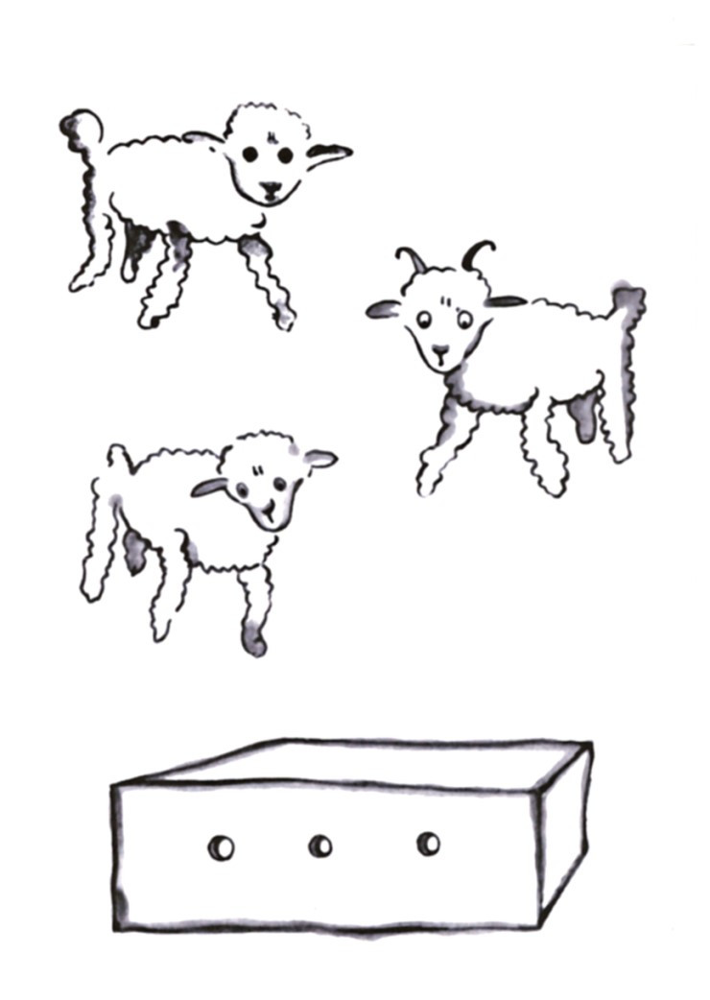](#)

​

1. **'TRPG'** 라는 게임 장르가 있음

​

이 게임은 오늘 당장도 할 수 있는데,

공책과 필기구, 사람만 있으면 가능함

​

당신은 전사입니다

괴물을 물리치러 가야 됩니다

​

라고 게임을 주관하는 마스터가

말을 하기만 하면 그게 게임인 것임

​

진짜 사람이 얼음이 되는 것은 아니지만,

​

**'얼음'** 이라고 말하면 얼음이라 못 건들고

**'땡'** 하면 얼음이 깨진다는 룰을 상상하듯,

​

그리고 그 얼음이란 것이 깨지든, 녹든

​

얼음이 풀린다는 그 자체만으로

서로 게임을 즐길 수 있는 것처럼

​

이런 문화를 좋아하는 사람이 많았음

​

2. **'상상력'** 이 게임의 핵심 엔진이라,

​

몰입하면 아주 재밌게 즐길 수 있었지만

**함께 하는 작업** 이라서 규칙이 필요했음

​

물총, 리모콘 같은 개념이 있느냐 없느냐,

있다면 횟수는 몇 번으로 정할 것 인가?

​

같은 규칙을 자기들끼리 결정하기 시작함

​

모험가가 상자를 열었는데, 보상이 나올지

아니면 알고 보니 상자가 둔갑한 괴물이었는지

같은 **'랜덤 요소'** 도 제어할 필요가 있었음

​

사람을 믿을 수가 없으니,

공평하게 **주사위** 를 만들게 됨

​

[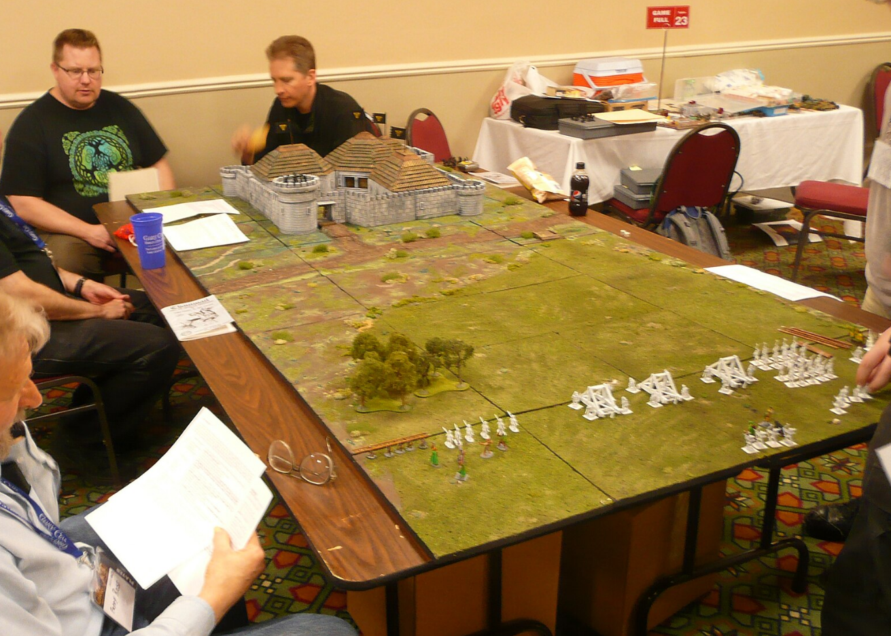](#)

​

당시에 유럽 에서는 **'워게임'** 이라는

모의 전쟁 시뮬레이션 게임이 있었음

​

어떤 양덕이, 나는 **'현대전은 별론데?'**

라면서 워게임에 있는 요소를 가져옴

​

투석기가 던지는 **돌** 은,

마법사가 던지는 **메테오** 로

​

재장전 시간은,

캐스팅 준비 시간으로

​

소총수는 궁수로,

지뢰는 덫으로,

​

바꾸니까 **'더'** 재미가 있었음

​

3. 게임의 룰이 견고하고, 복잡해질수록

사람이 **'전부'** 기억하는 것이 어려워졌고,

​

누군가 이걸

​

> 컴퓨터로 하면 어떨까?

​

라는 생각을 하게 됨

​

테이블 RPG, TRPG 가

컴퓨터 RPG, **CRPG** 로 바뀜

​

상상할 수 있는 자유는 특권이지만,

그와 동시에 **족쇄** 이기도 했음

​

[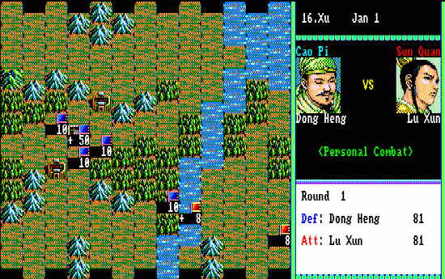](#)

​

이런 게임을 하고 있다보면,

​

색깔이나, 숫자로 단순하게

구분된 전쟁이 아니라,

​

[](#)

​

**'진짜'** 하나 하나 살아있는 전쟁을

해보고 싶다는 생각이 들게 될 것 임

​

지금은 게임 그래픽 기술이 구리지만,

​

**근 미래에는 개인용 컴퓨터 에서는**

**고사양 그래픽 카드를 넣어서**

**실감 나는 게임을 하는 날이 올 것이다**

​

라고 비전을 가진 세 명이 모였고,

​

알바를 하고 있던 식당 구석자리 에서

3D PC 부품 사업을 하기로 결정함

​

CPU 부터 시작하지 않은 것은,

​

기술 성숙도 면에서 GPU 에 비해

너무 대기업 영역이었기 때문이었음

​

글카는 피차 고만고만한 놈들 경쟁터고,

먹을 것은 많고, 앞날도 괜찮게 느껴짐

​

우리 → 게임 좋아함

게임 → 앞으로 더 발전됨

GPU → 쓸 일 많음

​

사업을 안 할 이유가 없네?

​

창업 자금으로 쌈짓돈 200달러를 넣음

​

" 회사 이름은 뭘로 할래? "

" 이름이 뭐가 중요해? "

​

" 맞아, 일단 자리를 잡고 돈 벌고

시작해도 이름 짓는 것은 안 늦어 "

​

" 라틴어로 **invidia** 가 질투인데,

누가 봐도 대놓고 질투하고,

시기할 수 있는 회사 라는 의미야

​

여기에 Next Vision 을 따와서

**NVIDIA** 라고 이름 지으면 어때? "

​

" 맘대로 해 "

​

겜돌이 셋은 그 길로 **GPU** 를

만들기 시작했고, 첫 제품이 나옴

​

​

**망함**

​

[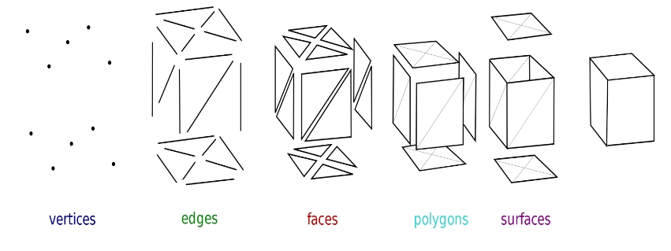](#)

​

지금도 3D 게임 그래픽을 구현할 때는,

​

한 번에 전체를 그리는 것이 아니고

부분을 조합해서 형태를 만들어야 됨

​

당시 그래픽 하드웨어 SW 업계는

3차원 그래픽을 구현할 때,

​

여러 다각형을 붙여서 더 큰 입방체를

만드는 폴리곤 메시 방식을 사용했는데

​

그 다각형을 **'무슨 다각형'** 으로 하는 것이

가장 좋은 것인지? 에 대한 표준이 **없었음**

​

만약 **'원이나 곡면'** 을 표현한다고 가정함

​

삼각형과 사각형 중, 뭐가 더 **'미학적'** 일까?

​

둥근 물체를 삼각형으로 표현하려면

수많은 작은 삼각형이 필요한데,

​

사각 기반 곡면 패치는 적은 데이터로

매끄러운 곡면을 직접 그릴 수 있음

​

즉 **'이론상'**, **'더 예쁘게 나옴'**

​

문제는 어렵고, 복잡하고,

구현이 굉장히 비쌀 수 있음

​

**당시에는 더 심했음**

​

[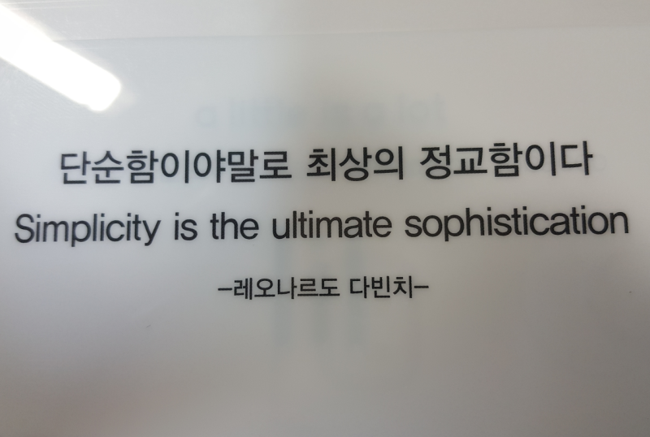](#)

​

삼각형은 다각형의 가장 기본 단위로,

​

그 어떤 복잡한 다각형도 결국

삼각형의 조합으로 분해할 수 있음

​

3D 입체 공간에서 점 3개를 아무렇게나 찍어도

그 셋을 지나는 평평한 면은 하나로 유일함

​

평면 보장, 최소 단위, 계산 단순 이라는

세 박자가 맞아서 게임 개발자들은

더 쉬운 삼각형 기반 개발을 선호했고,

​

결정적으로 MS 가 다이렉트 X 를

삼각형 기반으로 표준화 하면서,

​

엔비디아의 첫 제품은

생태계에서**고립** 당하게 됨

​

**'다시 처음부터 해야 된다'**

​

독자노선을 접고, 산업 표준을 수용해

기술적으로 옳은 것보다 생태계 표준을

따르는 것이 중요하다는 **교훈** 을 얻음

​

값싸고 당장 써먹기 좋은

**'팔리는'** GPU 에 몰두했고,

​

시장의 변화를 적응하지 못하는

경쟁자들을 파산 시키면서

​

급속도로 점유율을 먹어치움

​

그건 마치 먼저 매를

맞아본 놈들의 **특권** 이었음

​

4. 젠슨황은 고객 발굴에 빠꾸가 없었음

​

[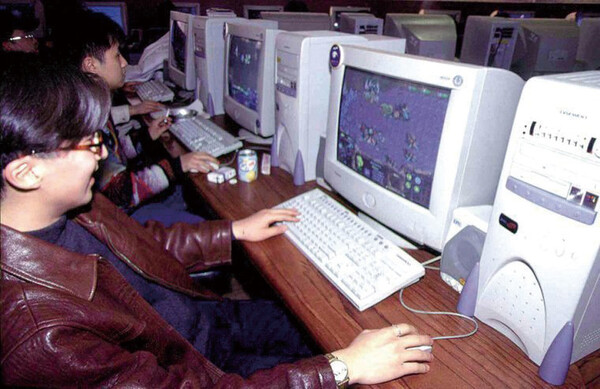](#)

​

마땅한 오락거리가 없는 남조선은,

​

**당구장/만화방/오락실** 3대장이

놀기 좋은 취미로 지배적이었는데

​

PC방의 등장으로 문화가 바뀌었고,

​

PC방 사장들은 일반 소비자들이

컴퓨터 1-2대 사고 있을 때,

​

한 방에 20대, 50대

프랜차이즈 범위로 가면

​

몇 천대도 팔아먹을 수 있으니,

​

**'B2C'** 보다 **'B2B'** 를

하는 것이 효율이 좋았음

​

[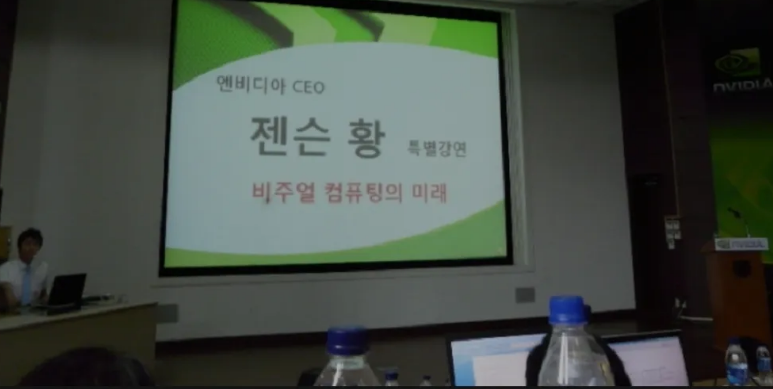](#)

[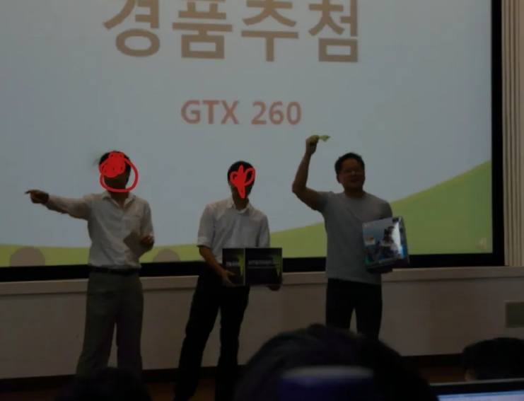](#)

​

" 댁이 어디서 온 누구 시라고요? "

​

" 엔비디아 젠슨황 입니다

서울대에서 강연도 한 적 있어요 "

​

**" 와? 서울대요?! "**

​

용산 선인상가를 다니면서

부품 업체들에 명함을 돌리고,

​

그렇게 점점 **'거물'** 이 되어갔음

​

게임을 즐기기 위해, 컴퓨터 부품을

사는 것은 속성적으로 **'소비'** 에 속함

​

**1억을 대출 받아서 생활비로 쓴다**

**vs 1억을 대출 받아서 투자금에 쓴다**

​

같은 1억 이지만, 이건 **'라벨'** 이 다름

​

쓰면 없어지는 생활비는 상한이 있지만,

돈 벌기 위해 쓰는 투자금은 상한이 **없음**

​

[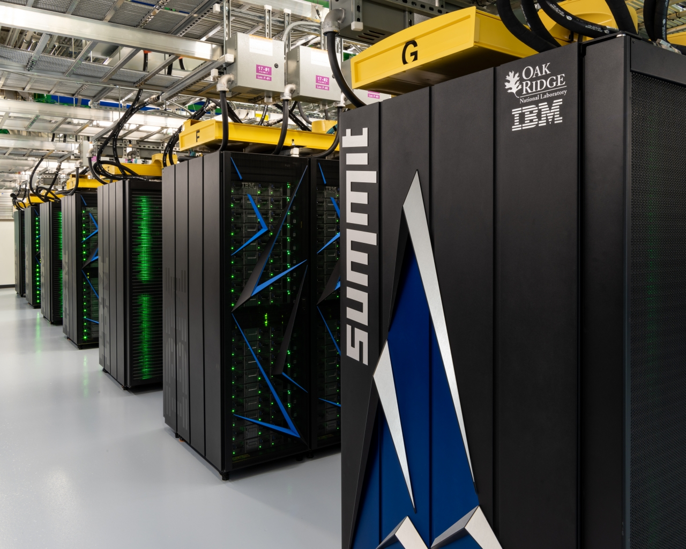](#)

​

**슈퍼 컴퓨터** 라는 것이 있음

​

기상 예측과 같은 거대한 연산을

처리하려면 이런 기계가 있어야 됨

​

그러나, 가난한 연구실 들에서는

저런 설비를 갖출 수 없기 때문에

​

**'어떻게든'** 방법을 찾아내야만 했음

​

그러다 찾아낸 **'시크릿 꿀통'** 이 GPU 임

​

[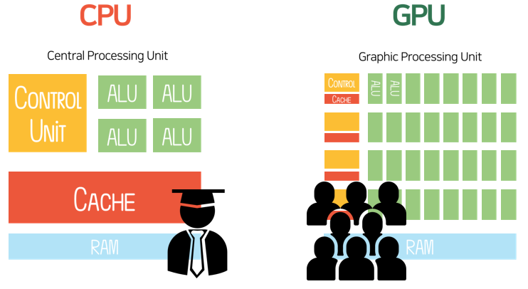](#)

​

CPU 는 똑똑한 사람

몇 명이 어려운 문제를

차례차례 푸는 구조임

​

복잡한 논리 를 갖고,

순차적인 의사 결정을 하는

일에 가장 최적인 부품 임

​

반면에 GPU 는 단순한 일을

한꺼번에 처리하도록 설계됨

​

게임에서 유체의 움직임을

어떻게 표현 해낼 것인가?

​

뾰족한 방법이 없음

그냥 **노가다** 로 하는 것 임

​

단순 노동자 수천 명이 똑같은 작업을

동시에 하는 구조를 갖고 있다는 것이,

​

GPU 가 갖고 있는 가장 큰 특징인데

​

과학/공학 계산 중에 똑같은 단순 연산을

어마어마하게 많이 반복하는 종류의 것이

많다는 점에 착안해서 쓰는 경우가 있었음

​

또한 당시는 CPU 의 성능 경쟁이

발열, 전력 문제로 벽에 부딪혀서

​

예전처럼 2배, 10배 이렇게 쭉쭉

올리는 것이 불가능 했기 때문에,

​

듀얼코어/멀티코어 같은 개념으로

방법을 찾고 있던 중이기도 했음

​

**5. 그럼 그냥 팔던 GPU 를**

**마케팅 해서 팔면 되겠네?**

​

님드라 이렇게도 쓸 수 있습니다, 하고

걔네한테도 판촉하면 되는 것 아닌가?

​

만약 어떤 과학자가 거대한

숫자 배열을 계산하고 싶으면,

​

그 숫자들을 가짜 텍스처의 픽셀값으로

대입하고, 그 계산을 셰이더 라고 하는

아주 어려운 것을 사용해 위장시킨 다음,

​

결과로 도출된 이미지의 **'색상값'** 을

숫자로 치환해서 다시 꺼내 읽어야 했음

​

끔찍하게 번거로운 작업이었고,

진입장벽이 살인적이었기 때문에

​

돈은 들지 않았지만, 돈이 없어도

그걸 **'할 수 있는 애들만'** 가능 했음

​

엔비디아는 이 진입장벽을 **'낮추겠다'**

라는 전략을 잡았고, **'CUDA'** 를 개발함

​

월가에서는 난리가 났음

​

니들 잘 하는 게임 그래픽 카드 하면 되잖아?

​

왜 겜돌이들한테 팔 칩에 아무도 안 쓰는

과학 계산 기능을 쑤셔넣어서 원가를 올리고,

거기다 소프트웨어 개발비까지 태우냐?

​

도대체 그걸 **'누가 쓴다고!'**

​

젠슨황과 엔비디아는

**'소프트웨어 생태계 표준'** 의 가치를

아주 비싼 수업료를 내고 배운 바 있음

​

CUDA 를 모든 카드에 기본 탑재해서 뿌리면,

​

전 세계에 있는 사람들이 자연스럽게 CUDA로

GPU 프로그래밍을 접하게 되고,

​

이 사이클이 몇 바퀴만 돌아도,

​

GPU 병렬 계산을 하려면

CUDA를 써야 된다

​

라는 것이 **'표준'** 이 됨

​

경쟁사가 아무리 좋은 칩을 만들어도,

​

전 세계에 쌓인 CUDA 코드와

연구 생태계는 베낄 수 없으니까,

​

따라올 수 없는 해자에

돈을 태우고 있었던 것 임

​

미래는 예측하는 것이다? (x)

미래는 만들고 제안하는 것이다 (o)

​

엔비디아는 AI 시대가

올 것인지 예측한 것이 아니고,

​

지금 하는 GPU 의 병렬 연산이

언젠가 그래픽 시장 밖에서도

​

중요해질 것이라는 막연한 믿음으로

인디언 기우제를 하고 있던 것임

​

망했으면, **그럼 그렇지** 인데

여기서 **'행운과 재능'** 이 터짐

​

​

6. 2008년, 리먼 브라더스 사태로

​

**'자본주의가 망할 수 있다는'**

공포가 급속도로 확산 되었음

​

[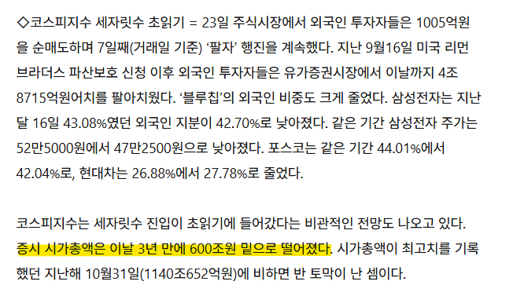](#)

​

국내 증시 시가총액 **'전체'** 가

600조 이하까지 내리 꽂았고,

​

**\* 600조 일시불 내면,**

**대한민국 증시 구매 가능**

​

삼성전자 시총은

**40-50조** 까지 떨어짐

​

[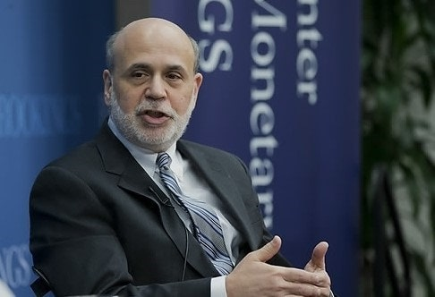](#)

​

당시 연준의장은 버냉키 였음

​

" 어떻게 이 문제를 해결 할까요? "

" 양적완화 하죠? "

​

" 양적완화가 뭔데요? "

**" 돈 뿌리자구요 "**

​

중앙은행의 역할은 시장의 패닉을

진정시키기 위해 최종대부자로서

대출 프로그램을 제공하는 것이다

​

자산 붕괴에 대한 공포가

시장에 만연할 때는,

​

**예상을 뛰어넘는 수준** 의

**과감한 경기부양책** 을

**지체없이** 투입해야 한다

​

[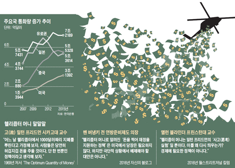](#)

​

**헬리콥터 머니** 가 투하되었고,

저금리 유동성 파티가 시작 됨

​

> 돈을 그대로 들고 있으면 쓰레기다
>
> 저축은 구매력을 지키는 것 조차 어렵다

​

돈이 있으면 좋긴 한데,

어딘지 모를 **찜찜함** 이 생김

​

세계에서 제일 믿을 수 있는,

안전한 금융은 어디에 있는가?

​

**미국** 에 있다,

​

미국을 대체할 수 있는 국가는? 없다

​

**그런데 당장 미국도 리먼 한 방에**

**저렇게 무너질 뻔 하지 않았는가?**

​

기존의 금융 질서 에서 벗어나,

새로운 신용 자산으로

자리할 수 있는 뭐가 없을까?

​

[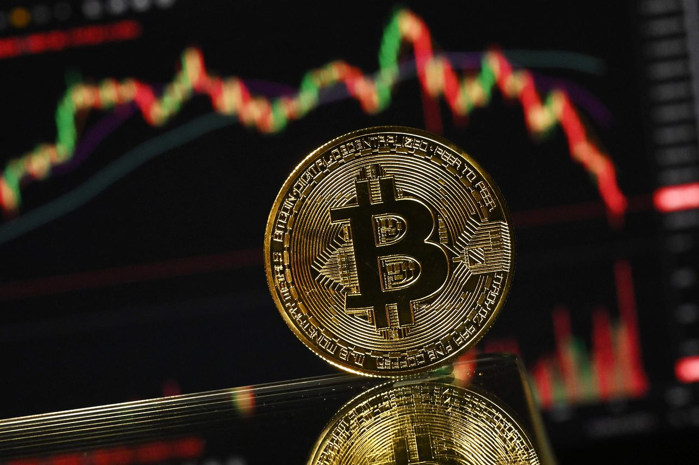](#)

​

디지털 금, **비트코인** 이 나옴

​

비트코인의 가장 큰 특징은?

총 발행량아 **'고정'** 되어 있다

​

비트코인이 **'생성'** 되려면,

**'해시'** 라는 것을 계산해야 됨

​

그 채굴 과정은, 단순한 병렬 계산을

빠르게 반복적으로 수행할 뿐이었는데

​

[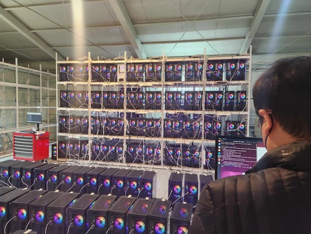](#)

​

여기서 가상화폐를 채굴할 수 있다는

GPU 의 새로운 쓰임과 수요가 발견 됨

​

7. 2012년, 이미지 넷이라는

이미지 인식 대회 가 있었음

​

컴퓨터에게 사진 수백, 수천만장을 주고

이게 고양이냐, 개냐 같은 문제를

얼마나 정확히 맞추는지 겨루는 대회 임

​

당시 최고 기록의 오류율은 약 25% 였는데

1%, 2% 개선하는 것도 **'굉장한'** 진보 였음

​

토론토 대학의 연구팀이 내놓은

알렉스넷 이라는 모델이 나왔는데,

​

그 모델이 오류율을 **'10%P'** 감소 시킴

​

" 니들 대체 어떻게 한거야? "

​

**" CUDA 씀 "**

​

오늘날, AI 의 역사를

시작했다고 과언이 아닌

​

알렉스넷은 세 사람이 만든 결과물인데,

​

알렉스넷 학습은 크리체프스키 부모님 집 침실에서

GTX 580 엔비디아 카드 두 장이 꽂힌 컴퓨터로 이뤄짐

​

1년에 걸쳐, 크리체프스키는 신경망 파라미터를

끊임없이 손보고 재학습 시키는 노가다를 반복했음

​

제프리 힌턴은 24년에

노벨 물리학상을 받았고,

​

일리아 수츠케버는 오픈AI 를

공동 창업하고 수석 과학자가 됨

챗 GPT가 얘가 만든 물건 임

​

**알렉스** 크리체프스키,

모델에 자기 이름을 남긴 당사자인데

​

다들 그렇듯, 컴퓨터 천재고 구글에서 일을 하다가

고향으로 돌아가 조용하게 잘 살고 있다고 알려짐

​

기자가 제프리 힌턴에게

당신이 한 일을 설명해달라고 묻자,

​

일리아는 하자고 했고,

알렉스는 되게 만들었고,

나는 노벨상을 받았다

​

라고 대답 함

​

혹시 신경망이나, 학습 관련으로

데이터셋 보셨으면 나오는

CIFAR 데이터셋이 **'알렉스 작품'** 임

​

과학, 기술, 금융, 어디라고 딱 잡아서

말하기 어려울 정도로 인공지능 기술은

전부 붙여다 쓸 수 있는 **확장성**이 생겼고,

​

​

누가 더 **'강한지'** 종래의 방식대로

수치적으로 겨루는 것이 아닌

​

**'있냐, 없냐'** 차이로 결정되는

경쟁의 **패러다임** 을 전환 시킴

​

세계 군사력이 10위든, 100위든

핵무기 죽창 한 방이면 끝나는 것처럼

​

**'전략 자원, 전략 기술'** 로

슬슬 주목받기 시작한 것임

​

**8. 선조가 이순신을 의심한 이유**

​

[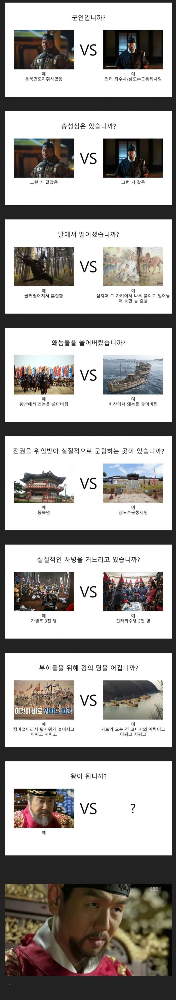](#)

​

구태어, 자세히 다루지는 않겠지만

**국민당 vs 공산당** 의 역사를 살펴보면,

​

대만이 왜 쫓겨났는지

**'납득 하기 힘들 정도'** 임

​

여하튼, 결과만 놓고 보면 마오쩌둥이

**'잘'** 해서 **'잘'** 되었음은 부정하기 어려움

​

​

다만 **'건국'** 에 필요한 능력 과

​

국가를 **'이끌어 나가는'** 능력은

당연히 차이가 있을 수 밖에 없음

​

인구는 말할 것도 없는 여러가지 자원을

잘 활용해서, 고깃국에 쌀밥을 먹으려다가

​

결국 **'산업화'** 에 실패해, 몰락하게 되었음

​

> 미제 승냥이들의 방식을 따르지 않겠다!

​

시장주의 준칙을 벗어나, 정부 주도의

전근대적인 경제 정책이 남발하게 되는데

​

그 와중에도, **'수확'** 이 없던 것은 아님

​

[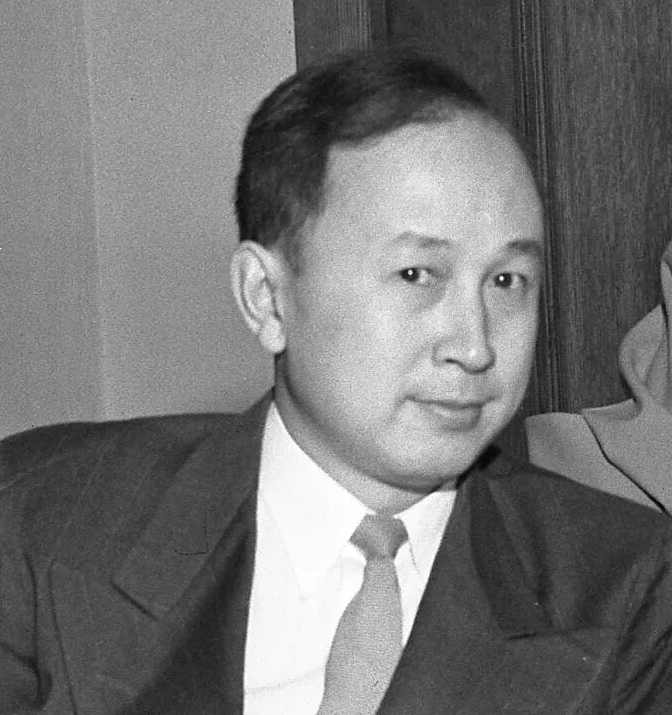](#)

​

췐쉐썬,

​

**매사추세츠 공과대학교 (항공공학 석사)**

**캘리포니아 공과대학교 (항공공학&수학, 박사)**

**NASA 제트추진연구소 공동설립자**

**MIT 교수, 칼텍 교수**

**​**

**\* 무협 소설가 김용의 사촌동생**

**​**

1950년대, 미국의 매카시즘 열풍으로

중국인 과학자들의 대우는 풍전등화 였고,

​

마침내 극적으로 200명의 과학자들이

조국으로 돌아갈 수 있는 기회를 얻게 됨

​

일부에서는, 중국으로 보내면 안 된다

​

지금 가는 과학자들은 1명, 1명이

미군 해병대 사단 5개와 맞먹는다며

​

적국으로 보낼 바에는

죽여야 된다고 했지만,

​

당시 미국측은 중국인 학자들의

역량을 과소평가 하고 있었고,

​

결국 **'최첨단, 최신 과학 기술'** 은

​

오로지 미국에서만 다루어질 수 있으므로

걱정하지 않아도 된다는 결론을 내리게 됨

​

소련이 인공위성을 쏘면서,

미국을 우주 과학에서 앞지른 것을 본

​

마오쩌둥은 췐쉐썬에게

우리도 할 수 있냐고 물어봄

​

가능? **가능**

**​**

그리고 조건을 뒤에 붙였음

​

처음 5년은 공교육을 정비하여 기초학문을 가르친다

→ 그 다음 5년간 응용학문을 가르친다

→ 그 다음 기계 설계와 제작에 들어가서 5년 내로 발사

​

단, 돈 이고 인민 이고 있는 대로 퍼부어 주셔야겠고,

이 15년 동안 성과가 있냐고 중간에 물어보지 말아야 한다

​

그래야 성공할 수 있다

​

**다 해줬는데, 니가 실패 하면?**

​

​

그렇게 중국은 세계에서 5번째로

인공위성을 발사하는 국가가 되었고,

​

원자폭탄을 개발한 후,

수소폭탄도 만들어 냈음

​

인민 영웅의 등장으로 이공계 꿈나무들이

그의 그림자를 쫓아 투신하게 되었고,

​

결과적으로 중국 과학/기술 발전에 있어,

상당한 공헌을 하는 인물로 남겨져 있음

​

삽질도 있었고, 잘 된 것도 있었지만,

​

우리가 익히 아는 **'따거식 문제해결'** 은

중국이 이미 생길 때 부터 있던 방식 이었음

​

[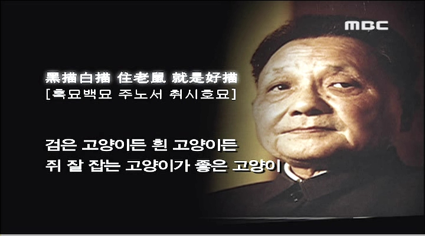](#)

​

시간이 흐르며 마오가 정권을 잃고,

​

등소평이 실권을 잡게 되면서,

중국의 **개혁개방** 이 시작되게 됨

​

[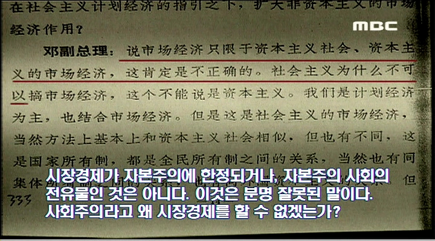](#)

​

등소평은 **'합리주의자'** 로 평가 받음

​

[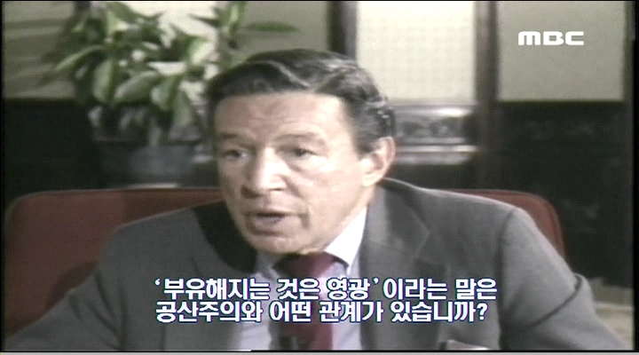](#)

​

" 공산주의는 사유 재산이 없지 않습니까?

근데 어떻게 부유를 논할 수 있습니까? "

​

[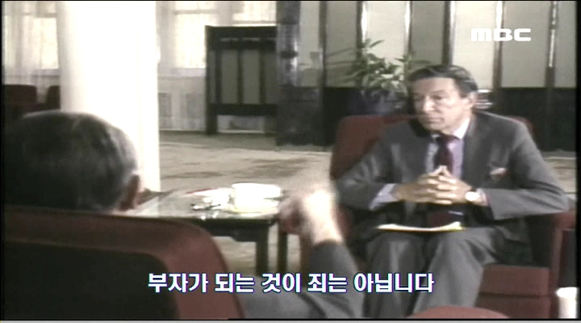](#)

​

인민의 가난이 죄가 아니듯,

부자가 되는 것이 죄가 아니다

​

[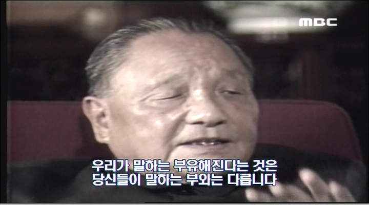](#)

[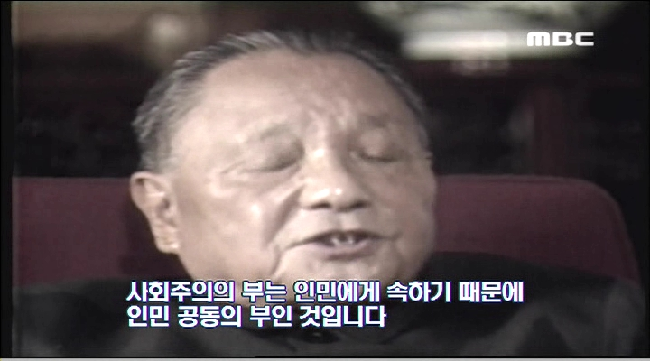](#)

[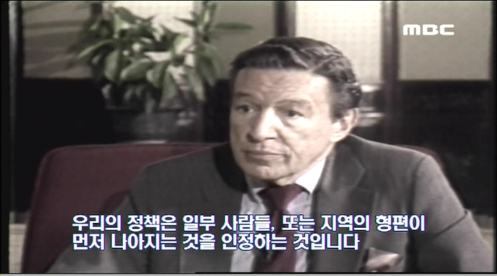](#)

​

**선부론**, 되는 놈이 먼저 부자가 돼라

그리고 그 부를 사회에 환원하고 뿌려라

​

자본주의고, 공산주의고, 타령 한다고

먹고사니즘 에 영향이 있는 것도 아니다

​

이념이 있고, 사람이 있는 것이 아니고,

사람이 살아야 이념도 있는 것이다

​

중국은 1980년대 개혁개방 이후,

값싼 노동력을 무기로 세계의 공장이 되며

국제 사회에 **엄청난** 영향을 미쳤음

​

경제는 **어쨌건**, 잘 발달하기는 했는데

밀레니엄 들어 슬슬 한계가 나타나게 됨

​

[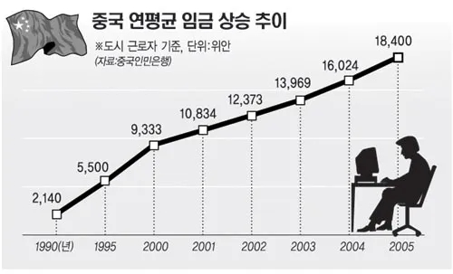](#)

​

**'중국'** 하면 딱 생각나는 것은?

​

쌈마이, 값싼 인건비

​

비싼 돈을 주고 산다고 다 좋진 않지만,

**'대개'** 싼 것에는 싼 이유가 있기 마련 임

​

경제가 성장하면서

노동자 임금이 크게 오름

​

그러다, 베트남/인도/방글라데시 같은

더 인건비가 저렴한 국가들에 의해서,

​

저가 제조업 지분을 빼앗기기 시작함

​

또한 핵심 기술이나,

성숙된 산업 생태계가 없어

​

고생을 해서 같은 일을 하더라도,

**'부가가치'** 가 낮아 이윤이 적었음

​

[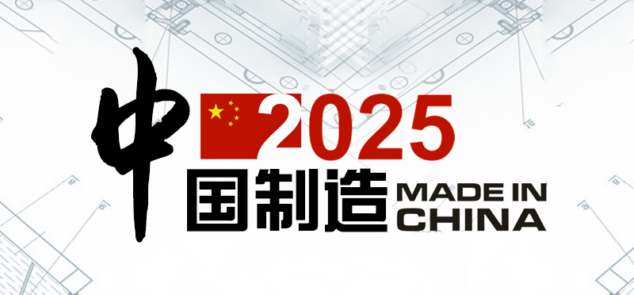](#)

​

2015년 **중국 제조 2025** 를 발표하고,

그로부터 2년 뒤, 알파고가 바둑을 재패함

​

> 저거다

​

저부가가치 탈피,

핵심 기술의 대외 의존 극복,

미래 산업에서의 추월,

​

이 모든 것들 하려면

​

**'압도적인 수준의 질적,**

**양적 생산성'** 이 필요했고,

​

**'총력전'** 레벨에서 국가적 자원을

전부 투자해, 경쟁력을 쌓기 시작함

​

[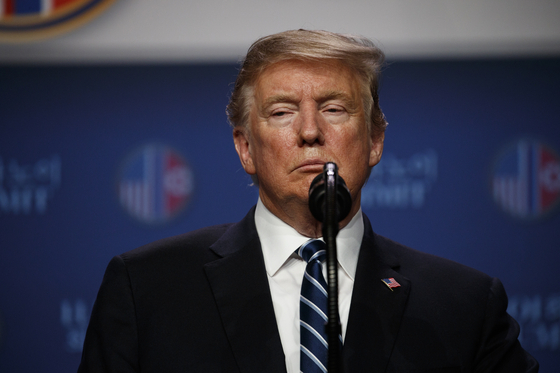](#)

​

**" 이건 아니지 않아? 나만 불편해? "**

​

따거식 경쟁은 기업과 기업의

공정한 경쟁과는 **명백히** 다름

​

**'적자'** 가 나도, **'나라에서 보조'** 를 함

​

내가 짜장면을 8천원에 팔고 있는데,

바로 옆에서 7천원에 부부가 하고 있음

​

천원 마진은, 자기들 인건비로 깐다?

이런 것은 용납을 해줄 수 있다 이거임

​

그 옆에서는 5천원에 팔고 있음

​

너 뭔데? 나 건물주 다

이러면 또 납득이 간다 이거임

​

근데 국가에서 정부 보조금 받아가면서,

짜장면 100원, 200원 이렇게 팔고 있으면

이게 **'상도'** 에 맞는지, 문제 의식이 생김

​

중국은 이거도 **'실력'** 이라고 했고,

미국은 이건 **'실력'** 이 아니라고 했음

​

9. 우리가 쓰고 있는 과학, 기술, 체계는

타이트하게는 19세기, 길게 잡아봤자

20세기 무렵에는 거의 **'완성된'** 상태임

​

지니고 있는 지적 능력이 무엇이든 간에,

​

만약 1천년, 1만년 전에 태어났다면

역사에 남을 위인이 될 사람들 조차도,

​

**'거인의 어깨'** 에 오를 수 있다는 장점 과

자신의 **'영역'** 을 찾아야 된다는 단점 을

​

동시에 감내하면서 살아갈 수 밖에는 없음

​

초기 신문은, 주간지 심하면 **월간지** 였음

​

생계에 걱정 없는 지식인들이나 귀족이

느긋하게 세상 돌아가는 소식을 듣곤 하는

일종의 **'사치품'** 으로 기능하고 있었음

​

19세기 중반, 전신/윤전기로

통신과 인쇄가 발달하게 되었고

​

**'노동'** 만으로도 부를 축적할 수 있는

사회 계층이 소비 집단으로 대두 됨

​

출근하고, 퇴근하고 집에 와서

세상 돌아가는 소식을 보고 싶은데,

​

1개월 짜리 정보는? **'죽은'** 이슈 임

​

당시 런던 타임즈가 이 수요를 보고,

​

원래는 교양/정보지 정도 수준에 머무르던

신문을 속보, 여론 매체의 성격으로 전환시킴

​

1세기 후, Time 은 한발 더 나아가

정보 과잉 시대에 바쁜 독자를 위해

​

핵심만 요약해주는 현대적인 언론 모델을

제시하는 것에 성공하고, 인터넷 시대가 와도

**'여전히'** 그 본질은 큰 변화가 없는 상태 임

​

[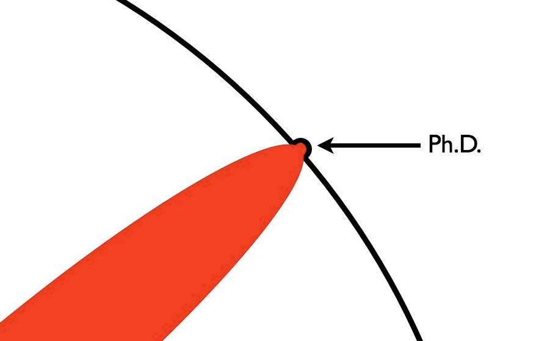](#)

​

**'박사'** 라는 사람들이 하는 일이 이런 것 임

​

지성을 극한까지 깎아낸

천재들의 무덤을 밟고,

​

**인류의 지평을 조금 더 늘리는 것**

​

소수의 천재들이

시대를 바꾸던 세상에서,

​

다수의 **'인프라, 네트워크'** 가

시대를 바꾸는 사회로 바뀐 것 임

​

최첨단 과학/기술,

고부가 가치 산업은

​

단순히 한 기업의 흥망 뿐만 아니라

​

한 사회의, 국가의, 시대의 막대한

변화를 초래하는 일이 되어 버렸고,

​

​

**'초국가적'** 기업 집단이 등장하게 됨

​

미국 주요 빅테크 기업의

연간 AI 투자액은 약 1천조 정도로,

​

**한국 정부의 1년 예산** 을 초과하며,

**수도권 GDP 정도의 규모** 임

​

서울, 경기, 인천, 등지에 사는

모든 사람들이 만드는 생산량 만큼

​

매년 AI 투자에 쓰고 있다는 소리 임

​

**정확히 그걸로 뭘 하는 줄은 모르겠지만**,

​

뿌려서 절반만 남긴들 세계 10위권 따리

경제력을 가진 국가도 넘보기 어려운 일임

​

동네에 있는 전파사들이, 삼성 서비스

엘지 서비스 센터로 싸그리 바뀐 것처럼

​

산업이 점점 **'선진화'** 될수록,

승자가 독식할 수 있는 환경이 강화됨

​

몇 세대 앞선 투자를 이미 다 끝내고,

거기를 견고하게 지키고 있어버린다면

​

후발주자는 **영영** 그걸 따라갈 수 없음

​

10. 그렇다면, 과연 **'어떻게 해야'**

이런 국가적 경쟁에서 경쟁 국가의

**'산업망'** 을 **'망가뜨릴 수 있을까?'**

​

> 1) 고객이 이용할 수 없도록 만들고,
>
> 2) 기업 가치를 개선할 수 없게 하면 됨

​

어떻게 이용할 수 없게 하는데?

​

[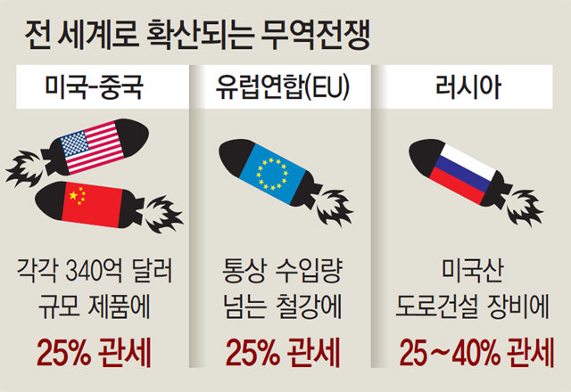](#)

​

**가격을 올려서 못 사게 만들고,**

**팔아도 마진이 안 남게 하면 됨**

**​**

어떻게 개선할 수 없게 하는데?

​

[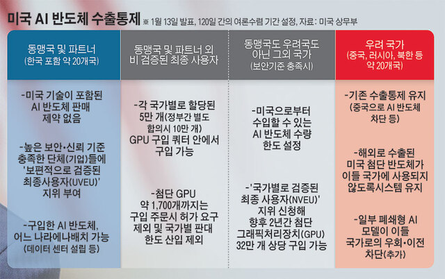](#)

​

**핵심 자원을 끊어버리면 됨**

​

미국, 더 정확히 **'트럼프의 전략'** 은

실제로 중국에 제법 큰 타격을 안겼음

​

**그럼 된 것 아닌가?**

​

살림 하는 미운 마누라 생활비를 끊으면,

남편한테 싹싹 빌고 접어주는 것이 아니라

​

**밖에 나가서 일자리를**

**알아보기 시작하는 법** 임

​

보험, 재택 부업을 할지, 경매를 할지,

주식을 할지, 코인을 할진 아무도 모름

​

한발 더 나아가,

생활비를 다시 준다고 해도

​

경제적으로 자립해야 겠다는 **'마음'** 에

비상금을 모으거나 대안을 모색할 수 있음

​

이게 관계의 **'비가역성'** 임

​

11. 인공지능에 GPU 가 **'왜'** 필요할까?

​

AI 가 하는 작업은

크게 둘로 구분할 수 있음

​

배우는 작업이 **'학습'** 이고,

배운 것을 써먹는 것이 **'추론'** 임

​

밖에서 열심히 까불거리고 있는데,

​

엄마가 **'너 집에 가서 봐'** 라고 하면

우리는 무슨 일이 생길 것인지 **예측** 됨

​

엄마의 어조, 눈빛, 분위기, 그리고

그 모든 것을 구성하는 전반적 맥락이

​

어떤 부정적인 시그널로 작용하게 되고,

결과적으로 어찌 될 것 같다 라는 추측은

​

아주 빠르게 일어나고, **'대개'** 유연하고

정확한 형태로 들어맞는 경우가 많을 것임

​

고양이 사진을 보여주고,

​

이건 고양이야 라고 하면 인공지능은

**'고양이'** 를 구성하는 요소들을 파악하고

​

고양이인 것과 고양이가 아닌 것을

구분하려고 최선을 다 해서 배우게 됨

​

1+1 = 2, 1+1 = 2, 1+1 = 2, 1+1 = 2 ...

​

AI 는 **'더하기'** 가 무엇인지 몰라도,

​

a+b = a+b 꼴을 지속적으로 노출하면

이게 **'더하는 행위'** 임을 도출할 수 있음

​

데이터에, 1+1=3, 1+1=4 같은 정보가

있을 때 그 확률값을 **'덜'** 가중하게 되면서,

​

1+1=2 일 확률, 99.99999...%

1+1=3 일 확률, 0.0000000...%

​

그러므로, 2를 정답으로 뱉자

같은 식으로 굴러간다는 것 임

​

인공지능은 **'답'** 을 내리는 것이 아니다

​

**명시적으로 안 배운 상황도**

**통밥으로 빠르게 때려 맞힌다**

​

여기에 무궁무진한 가치가 있는 것 임

​

그래서 수학, 과학 석박사들이 푸는

아주 어려운 문제는 손쉽게 풀더라도,

​

**\* 많이 봤으니까**

​

간단한 문제는 **어이없게** 틀릴 수도 있음

​

**\* 이런 기술은 추가적으로 보정을 함**

​

한 아이가 걷기 위해선,

천 번을 넘어져야 된다고 함

​

​

**'0'** 과 **'1'** 밖에 모르는 프로그램 이

이게 고양이 인지, 사람 인지 아니면

​

그 외의 새로운 어떤 존재인지 배우려면

**'도대체 얼마나 많은 넘어짐이 필요할까?'**

​

100장의 이미지가 있다고 가정하겠음

​

나는 이미지 100장을 전수비교 하고 싶음

​

간단한 조합 문제를 풀면 되는데,

(99\*100)/2 = 약 5천 정도가 나옴

​

근데 데이터가 10배 늘어서,

이제 1만장을 해야 됨

​

그럼 몇 번이 필요하냐?

**5천만번의 연산** 이 요구됨

​

데이터는 10배 늘었는데,

작업량은 100배 늘었음

​

5만장이라고 하면 횟수만

무려 **12억번** 이 넘어가게 됨

​

10억번 연산한다고 가정할 때,

​

30초 걸리면 951년 걸리고

1초 걸리면 약 30년 정도 걸리고,

1밀리초 걸리면 12일 걸림

​

**무슨 말이냐?**

​

쓰는 GPU 가 구리면,

**'할 수 없는 작업들'** 이 있다

​

데이터가 많이 필요하면 많이 필요할수록,

**'일단'** 더 빠르고 더 원활한 GPU 가 좋다

​

라는 것 임

​

[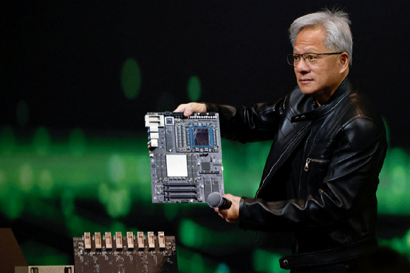](#)

​

12. 이걸 지금 제일 잘 뽑는 회사가 **엔비디아** 임

​

사족이지만 **'파일'** 을

저장 장치 내에서 옮겨야 될 때,

​

SSD 성능에 따라도 속도가 다른데

일상적인 작업에는 큰 의미가 없지만

​

GB, TB 같은 큰 단위로 이동 시켜야 된다면

여기에서도 속도 차이가 크게 생길 수 있음

​

SATA 3는 1초에 **500MB** 를 옮기는데,

​

삼성에서 만든 최신형 SSD는

1초에 **15GB** 정도를 옮김

​

**\* 실측 차이 있을 수 있음**

​

같은 작업 기능을 하는데, 속도 면에서

**'30배'** 의 차이가 발생하니까

작업 속도도 당연히 차이가 생기게 됨

​

**좋은 GPU, 좋은 컴퓨터 부품이,**

**좋은 반도체가 없으면 어찌 되냐?**

​

같은 일을 비현실적으로 느리게 하거나,

하드웨어 이슈 때문에 **'할 수가 없어짐'**

​

**22년 반도체 규제** 를 겪으면서,

중국은 AI 첨단 생태계에서 **고립** 됐고

​

막대한 데이터를 기반으로 하는

학습도, 추론도 해볼 수 없게 되었음

​

데이터가 없으면 재료가 없으니,

모델 성능이 나빠지고, 상용화는 커녕

​

실험과 연구도 자유롭게 할 수 없으니

자체적인 역량은 **더더욱** 기를 수 없게 됨

​

13. 이 시점을 기점으로, 중국은 소프트웨어 분야에

전과 달리 **'매우'** 적극적으로 뛰어들기 시작했음

​

**마찬가지로 100장의 이미지가 있음**

​

하나씩 전수 비교하면, 많은 작업이 필요하다

라는 것은 이미 우리가 알고 있는 것들 임

​

그렇다면, **'할 수 없는 일'** 일까?

​

먼저 100장의 이미지를 추출한 다음에

각 이미지별로 **'특징'** 을 잡아낼 수 있음

​

100장 읽어보니까, 10장은 토마토고

20장은 사람이고, 10장은 동물이네 등등

​

처럼 각 이미지 정보를 찾았다고 가정함

​

그리고 이 이미지들을 **'클러스터'** 로 분류해,

**'비슷한 그룹'** 끼리 묶는다면 어떻게 될까?

​

100장이 들어오든, 1000장이 들어오든,

​

하나씩 전수 비교를 하는 방식을 안 써도

얼마든지 **확장해서** 문제를 풀어낼 수 있어짐

​

이미지를 본다 → 고양이네 → 끝

or → 고양이가 아니네 → 토마토인가?

​

라는 식으로 하면, 동일한 목적을 위해서

처리하면서도 훨씬 효율적이게 할 수 있음

​

중국은 **'하드웨어'** 가 없기 때문에,

이런 **'기발한 접근'** 들을 많이 하게 됨

​

14. 22년 11월 말, GPT-3.5 가 공개됨

​

GPT 가 나오기 전까지는

**'인공지능'** 을 쓴다는 것 자체가

비일반적인 케이스들 이었음

​

1750억 개의 매개변수(175B) 로

최신 기술을 접목해 나온 모델이었고,

​

오픈AI 에서 제공하는 것이 아니면

​

GPT 또는 그에 준하는 서비스를

일반 대중이 쓰는 것은 **'불가능'** 했음

​

몇 가지 불편이나, 결점이 있긴 했지만

​

**'심심이 수준이 아니잖아?'** 라는 평가는

나올 수 있을 정도 였고, 적어도 대중적으로

​

개인이 일상에서 **'인공지능'** 을

사용할 수 있음 만큼은 잘 알려줬음

​

23년 4월, 반년이 채 지나지 않아

중국에서 **QWEN** 이라는 모델이 나옴

​

그해 9월, 자국 규제를 통과해서

​

**23년 8월** 에는 7B,

**9월** 에는 14B,

​

**11월** 에는 1.8B,

72B 모델을 출시함

​

가장 큰 모델이 72B 모델이었는데,

​

GPT 패러미터의 **1/2** 도 안 되었고

체감 성능이든, 실사용 성능이든

​

프론티어 유료 모델에

근접하는 퍼포먼스가 나옴

​

> 중국에서 발표하는 자료를 어떻게 믿어?

​

라는 생각이, **'지배적'** 이었음

​

AI 반도체, GPU 이야기에서

늘 나오는 VRAM 이라는 것이 있음

​

AI 모델이 만들어지려면,

거대한 숫자 덩어리 조합이 필요한데

​

그 숫자들을 전부 메모리에

올려놔야만 연산을 해볼 수 있음

​

VRAM 은 **'책상'** 이고, 모델은

그 안에 **'들어갈 자료들'** 임

​

책상이 넓으면 어쨌거나

자료 더미를 잔뜩 펼쳐놓은 후,

​

바로바로 참고할 수 있지만

책상이 좁으면 경우에 따라

아예 올려놓을 수도 없거나,

​

다른 곳에 자료를 보관해,

​

필요할 때마다 다시 찾아

꺼내야 하므로 느려질 수 있음

​

여러가지가 다 있어야 하지만,

VRAM 은 **'특히'** 어려운 자원인데

​

패러미터가 작다는 것은,

​

더 **'저렴한'** GPU 를 써도

모델을 굴릴 수 있다는 뜻이고

​

[](#)

​

1B, 0.5B 모델 같은 경우에는

​

컴퓨터가 아니라, **'휴대폰'** 에서도

**심하면** 액정 달린 냉장고에서도 됨

​

모델이 극단적으로 가벼워지면,

​

임테기 에서도 **'둠'** 같은

게임을 가동할 수 있듯이 말임

​

중국에서 오픈 소스 모델이

잘 나온다더라, 정도만

​

알음알음 알려지고 있던 차,

​

[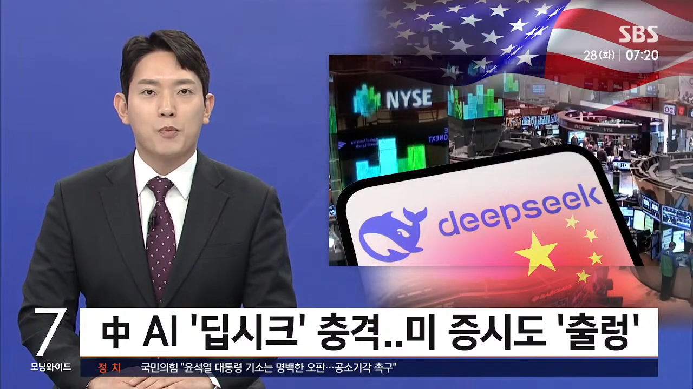](#)

​

중국에 있는 **'투자 회사'** 에서

**'2개월'** 만에 만든 딥시크 모델이

​

당대 내놓으라 하는 **최첨단 LLM 성능** 을

**싸그리 올킬하는** 벤치마크 점수가 나옴

​

[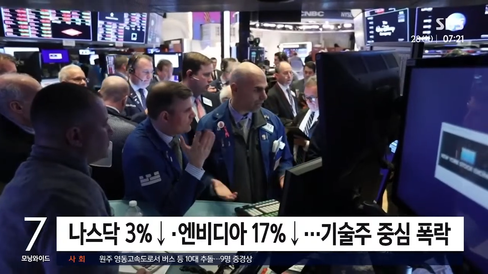](#)

​

AI 투자를 많이 해야 되는 이유

→ 기술 선점 하려면 좋은 기술 필요

→ 좋은 기술 있으려면 돈 많이 필요

​

but, 돈 많이 없어도 되던데?

라는 정보가 나오니 혼란에 빠짐

​

왜 이런 결과가 나오는 줄은 모르겠지만,

입력을 하면 티키타카가 되니까 쓰고 있던

​

**'상당히 많은'** 사람들이 관심을 보였고,

​

**무료, 경량, 오픈소스** 라는 특성 때문에

​

정보가 빠르게 생성, 가공, 확산 되면서

하루가 멀다하고 모델들이 **쏟아져** 나옴

​

파인튜닝, 양자화, 모델 서빙,

학습, 추론 최적화 같은

​

과거에는 접할 수도 없던

**'최고급'** AI 지식들이

​

디스코드 같은 메신저나, 커뮤니티를

통해서 유포되고, 연구되기 시작했고,

​

사실 개발자가 아니면

구경만 할 수 밖에 없던

​

코딩 같은 것도 누구나 간단히

손쉽게 할 수 있는 시대가 되었음

​

이걸 **'공짜로'** 가만히 쓰고 있자면,

자연스럽게 드는 생각이 이런 것 임

​

> GPT, 제미나이, 클로드를
>
> 내가 왜 써야 하지?

​

15. Kimi, Deepseek, Qwen,

GLM, Minimax 등,

​

하나의 단일 모델만 있는 것도 아니고,

심지어 모델 단위로 **'목적별로, 기능별로'**

​

최적화 해서 하루가 다르게 배포 되니까,

​

이걸 **'돈을 내고 써야 되는 건가?'**

라는 생각이 들 정도의 마음도 들게 됨

​

딥시크의 경우, API 호출 단가 기준으로

​

클로드에 비했을 때 최소 **20배**,

**많으면 50배 이상** 차이가 나는데

​

클로드로 100만원 써야 되는 작업이

딥시크로 맡기면 **5만원 언더** 라는 것 임

​

[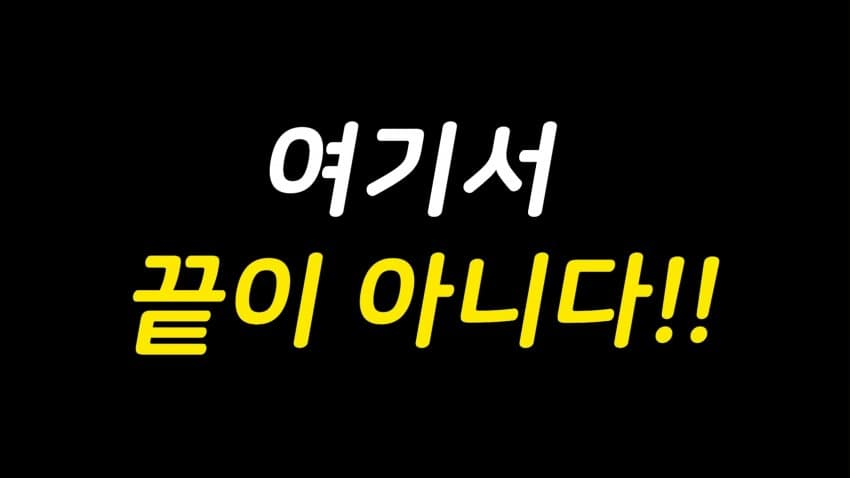](#)

​

모델만 하나 달랑 나오는 것이 아니라,

​

깃허브/허깅 페이스 같은 커뮤니티에서

피드백을 받고 **'개발자들이 반영'** 한다

​

공짜인데, 유지보수 까지 되는 것도 놀랍다

​

더 놀라운 점은, 이들이 프론티어 모델에서

**'가장 알짜인 기술'** 만 **배워다가** 무료 모델에

접목시켜, **다시 시장에 유포한다는 점** 이다

​

여기 2명의 창작자 가 있다,

​

한 사람은 작업물을 만들기 위해서

스스로 연구하고, 고민하고, 생각하고

마침내 작품을 빚듯 하나를 만든다

​

다른 한 사람은 잘난 애들이 열심히

하고 있는 것을 옆에서 보고 있다가,

​

**오, 좋은데?** 하고 그대로 따라한다

​

그냥 따라하는 것도 아니고,

**'제일 좋은 것만'** 골라다가 섞어서

​

​

앤트로픽 같은 회사 입장에서는

​

**" 정도껏 해! "**

소리가 나올 만 했음

​

근데 엔트로픽을 보는 개발자들도

똑같은 소리를 하고 있었을 것임

​

개발자만 그럴까, 디자이너들도,

​

AI 에 **'공급 대체 되는'** 사람들도

그 입장의 차이가 있진 않을 것임

​

[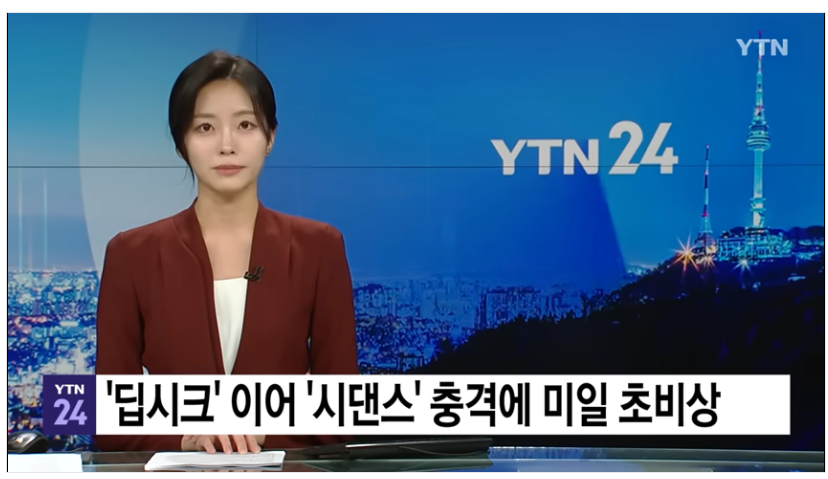](#)

​

이미지, 영상, 3D 모델링 같은 작업은

숙련직의 몸값이 **'은근히'** 비싼 시장 임

​

일은 일대로 고되고, 버거우면서도

또 아무나 시킬 수 없단 점이 그런데,

​

**\* 넓게 보면 코딩/개발도 그럴 것이고**

​

즐겁게 사용하는 사람들이면 몰라도

이걸 **'산업 수요'** 와 연결 짓는 경우거나

​

본인의 생산성에 활용하는 사람 이라면

중국산 오픈소스가 주는 **'가성비', '확장성'**

두 요소만 놓고 보더라도 안 쓸 수가 없음

​

코딩으로 뭐 만든다는 이야기도 들었는데,

영상, 이미지 쪽도 **'퍼포먼스'** 가 큰가요?

​

그냥 쇼핑몰 상세 페이지 정도 만들고,

홈페이지 디자인 시안 따주는 정도 아님?

​

**겁.나.큽.니.다**

​

<https://youtu.be/O7nqWm2lVLg?si=KXmn3gxZzuDJ3SOy>

​

기술 하나 하나가 경제적 가치가 **크니까**

다들 입 밖에 잘 안 내고 있는 것 뿐이지요

​

1인 미디어, 1인 영상제작, 1인 영화제작,

이런 것들이 **'지금'** 기술로도 **충분히 됨** 요

​

[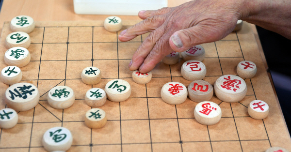](#)

​

16. 무역전쟁을 필두로 하는

미중 패권 전쟁의 **장군** 이

반도체 수출 규제 였다면,

​

**멍군** 은 경량 하드웨어로도 되는

소프트웨어 최적화 제공 이었음

​

좋은 GPU 가 있어야 하고,

좋은 반도체가 있어야 된다,

​

라고 할 때, 중국은 **그거 없어도**

목적 이루는 것에는 문제가 안 됨

​

이라는 그림을 그려놓은 상태 임

​

**앞으로 결과는 어떻게 흘러갈까?**

​

내 소박한 좋소 야생 경험에 의하면

똑똑한 애들 10명 모여 있는 곳보다,

​

9명의 덜 똑똑한 애들이

1명의 똑똑이를 **'무한정'** 믿고,

따라갈 때, 보통 결과가 좋음

​

그게 옳냐, 틀리냐를 떠나서

​

결과만 놓고 보면

그럴 때가 많았다는 것임

​

[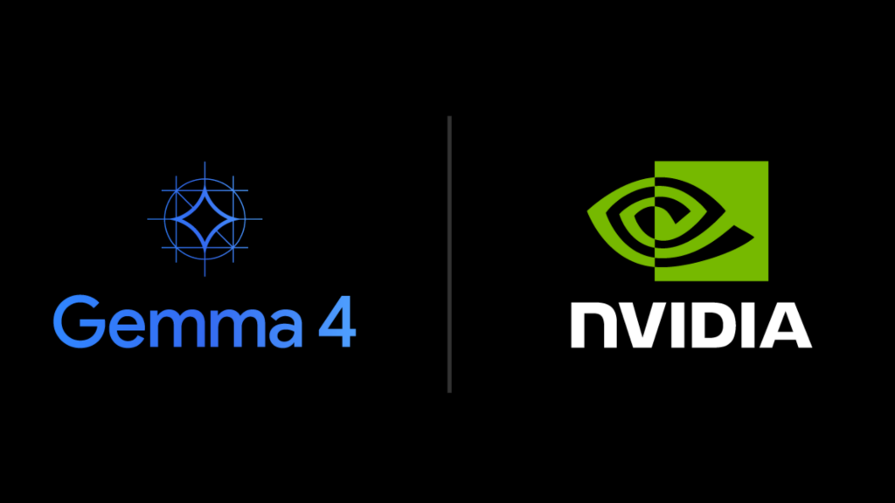](#)

​

구글에서도 젬마4 를 경량 모델로 출시하고,

**온 디바이스 시장** 의 가치를 보고 있는 중이고

​

[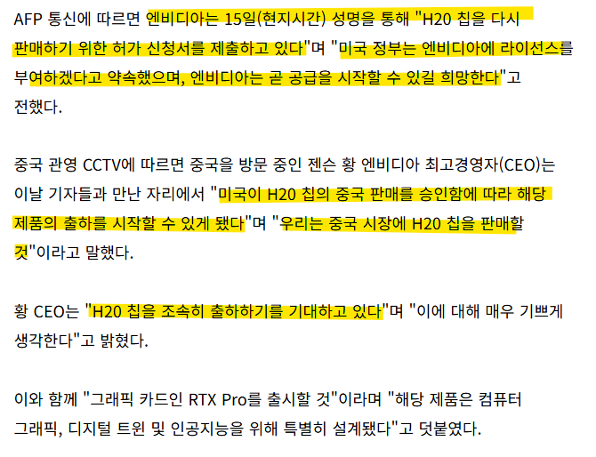](#)

​

황사장님은 중국에 **'죽도록'** 팔고 싶어하고,

​

**\*** **중국이 엔비디아 없이 사는 법을 배우면 어쩌지?**

**화웨이가 CUDA 생태계 떠나서 자립하면 어쩌지?**

​

[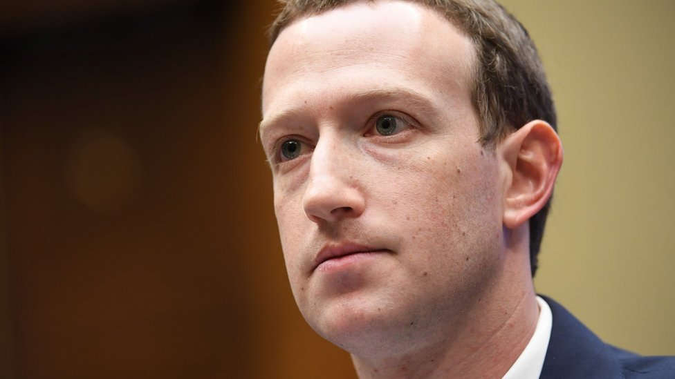](#)

​

인스타 하던 애들, 도우인/샤오홍슈/틱톡으로

빨려나가는 것은 아닌가 걱정하는 분도 계시고,

​

구글, 아마존, MS 같은 경우는,

엔비디아 GPU 가 워낙 비싸니까

​

우리가 직접 만들어서 쓰는 것이 좋을 듯?

하면서 **적과의 동침** 을 지속하고 있는 중 임

​

이게 **'구조적으로'** 경쟁이 될 게임이긴 할까?

​

17. 중국의 **'인적자원 생태계'** 를 보자,

​

[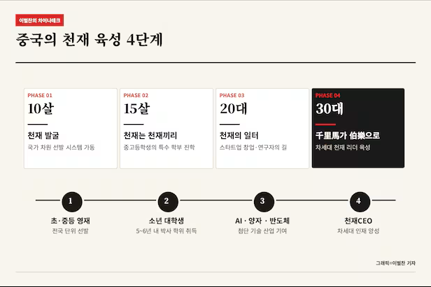](#)

​

10살이 되면, 초중등 단계에서

'중국 전체 전국 단위' 영재를 선발

​

20살이 되면, **'박사'** 를 마치고

​

[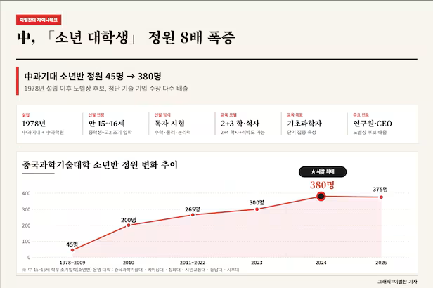](#)

​

학계에서 연구원 진로를 가거나,

취업을 하거나 CEO 가 된다

​

허깅 페이스에 보면, 얘는 도대체

뭐 하는 앤데 이런 걸 만들어?

​

라는 애들 보면, 대학생 이거나

토이 프로젝트 돌리는 애들이다

​

[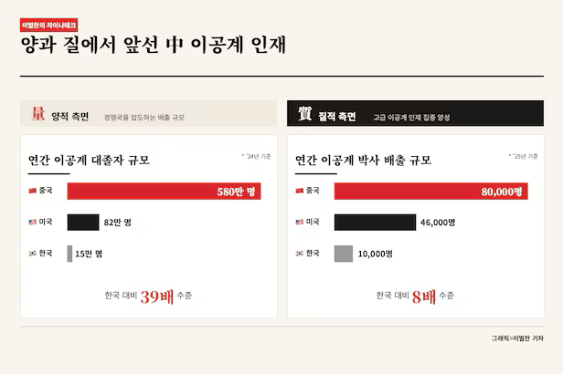](#)

​

저 인력이, 노동 시장에 공급되고

창업 시장에 유입되면서 경쟁을 하고,

​

**'그 경쟁'** 을 넘은 애들이

**'글로벌'** 메이저리그로 나간다

​

[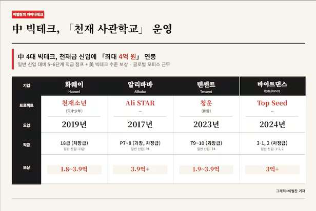](#)

​

제품이랑, 서비스가 **'팔리니까'**

기업은 당연히 보상을 하기 쉽고,

​

수요가 **계속** 따라오니까

고용을 하고, 취직 했던 애들이

​

밖에 나가서, 작게 또 사업을 차리고

그 사업이 또 다른 사업을 낳는 등,

​

책에서만 보던 **'혁신 창업 클러스터'** 가

자리 잡아서 돌아갈 수 있는 구조 가 있음

​

**당연히** 하루 아침에 된 작업도 아니고,

​

올해로 거의 20년 가까이 두드리던 것이

**이제야** 결실을 보인 상태라고 보여지는데

​

결과만 보고, 이럴걸, 저럴걸,

이랬어야 저랬어야,

하고 있을 때는 아닌 것 같다

​

[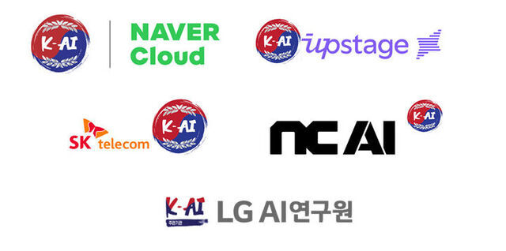](#)

​

금년 말이면, **소버린(sovereign) AI** 라고

자체 기술력을 사용해서 프론티어 모델에

준하는 **'무료 공공 AI'** 를 출시한다고 한다

​

**'솔직히'** 내가 드는 첫 생각은 이거다,

​

할당을 어떻게 해줄 것인지는 모르겠지만

국민이기만 하면 다 공짜로 쓰게 해준다면은

​

엄마, 아빠, 나, 오빠, 남편, 자식 가입해서

그대로 **'원가 0원'** 짜리 서비스 론칭 되겠다

​

일단 서버만 소버린에 물려준 다음에,

서비스 내가 **뭐를 얹든** 될 테니 말이다

​

당연히 똑똑한 분들이 잘 하고 계시지만

하이퍼 스케일러나, 풀 스크래칭 같은 것이

지금 시점에, 우리 상황에 맞나도 모르겠다

​

**\* 몇 B 모델이 중요한 것이 아니고,**

**작업 안정성, 완성도, 품질이 더 중요**

**​**

**파라미터 큰 대형 모델에 의미 두는 것은**

**아무리 곱게 봐도 2년 전에 지난 얘기다**

**​**

**GPU 만 해도, 비트코인 채굴 할 때는**

**범용 GPU 보다 특화 인프라가 중요하듯**

**TPU 니 뭐니 하고 있는 마당 인데 말이다**

​

한편 프롬 스크래칭, 신토불이 독자 AI 는

무슨 의도인지, 소린지도 모르겠는데

​

**\* 프롬 스크래칭 = 아예 처음부터 우리꺼,**

**외부 기술 쓰면 안 된다는 의미로 사용 됨**

​

마치 피타고라스 공식이 그리스산 이라고

우리가 새로 개발해야 된단 말처럼 들린다

​

피차 패권 다툼이야,

​

체급이나 깜이 다르니

**한다고 될 일**도 아니고,

​

[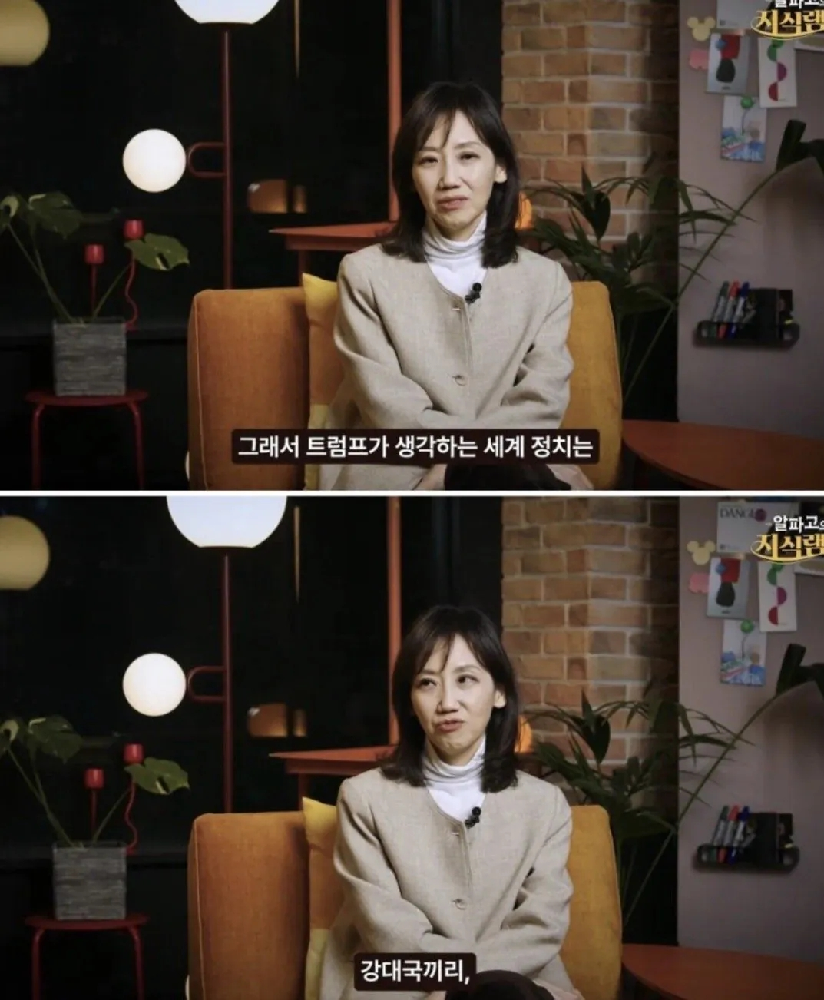](#)

[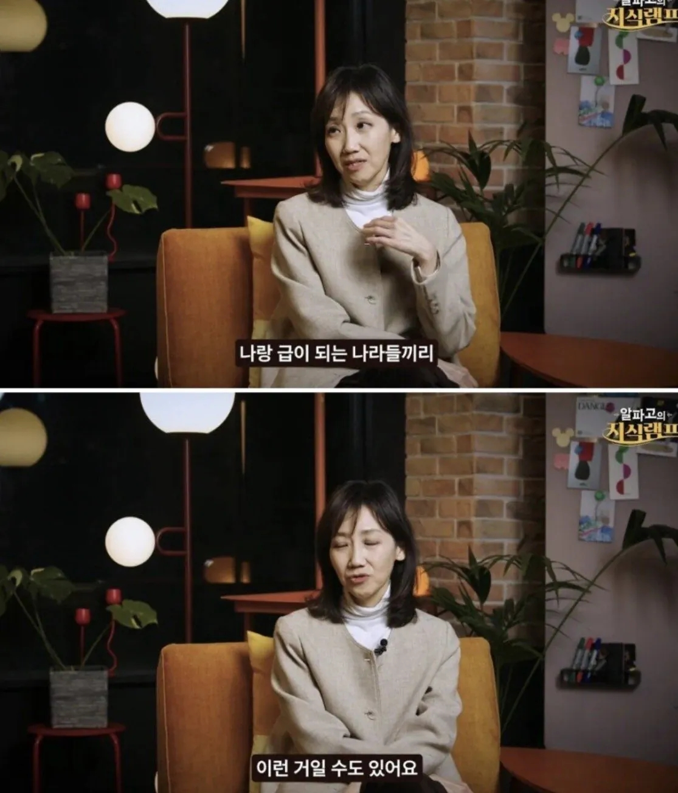](#)

​

우리야 중국은 못 믿겠고,

​

1세계에서 굳이 손을 잡아야 되면

얘네랑 일을 해야겠다 정도가

​

합리적으로 취할 포지션인 듯 한데

너무 **거시적인** 흐름만 쫓는 것 같음