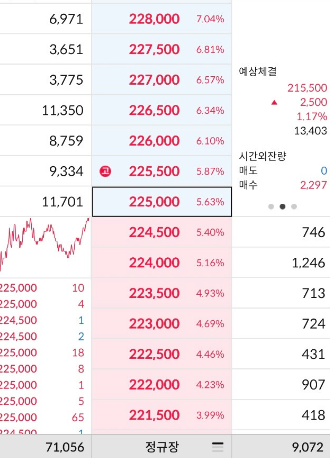

# 파생 트레이딩과 벨류에이션 감각
**Date:** 2026. 5. 25. 7:26
**Category:** 다이어리
**Original URL:** https://blog.naver.com/xpfkwh56/224295579898
---

<https://blog.naver.com/xpfkwh56/223605512647>

[**상위 1% 파생 트레이더**

전체가 몇 명이 하는 줄은 모르겠구요 국세 통계 기준, 무조건 1% 안에 듭니다 \* 어떻게 기준 잡아도 상위 ...

blog.naver.com](https://blog.naver.com/xpfkwh56/223605512647)

​

1. 트레이딩 이야기는

언제부턴가 잘 안 쓰는 편이다.

​

2. 일단 오늘 당장 시작하기가 너무 쉽고

문제가 생겼을 때, 매우 치명적일 수 있으며,

​

무엇보다 발을 빼는 것이 **'굉장히'** 어렵다.

​

3. 지금도 **'열심히'** 찾으면 예전에 매매했던

이력이나, 내용들을 찾아볼 수야 있긴 있는데,

​

따로 연재했던 글들은 전부 삭제했고,

본다고 해도 대단한 얘기들도 아니다.

​

4. 잘 안 적게 된 이유들은 다음과 같다.

​

**1) 내가 지금 시장을 모른다.**

​

현물로 예를 들어, 10년 전, 20년 전에

​

인사이트 펀드가 묻지마로 가입되고,

현금 없는 사회 같은 테마가 돌고,

면세점 주식을 사면 돈을 벌던 시대에

​

매매했던 사람이 오늘 시장에 참가하면

그 사람은 **'아무것도 모르는 사람'** 과 같다.

​

가락이 있으니, 툭 찌르면

무슨 말이든 나오기야 하겠지만

​

그게 쓸모 있는 얘기라는 보장도 없고,

경우에 따라 모르는 것이 나을 때도 많다

​

**2) 댓글로 막막한 사연을 너무 많이 봤다.**

​

다소 어두운 이야기인데, 전업 투자를 원하거나

트레이더가 되고 싶은 사람들이 **대체적으로**,

​

그리 긍정적인 환경에 있지 않은 경우가 많다.

​

현물이야 돈 만원만 있어도 계좌만 파면 되고,

​

그 무섭다는 파생도 돈 오백, 1천만원만 있으면

딸깍 딸깍 버튼 눌러가면서 5만원, 10만원 따고,

​

그러다 재미 들리면 고레버릿지로 넘어가서,

일가친척 사돈의 팔촌까지 신세 조지게 되는데

​

물론 전설적인 트레이더가 되실 수도 있고,

​

따면 그만이라지만 마땅히 시간적인 여유나

일자리가 없는 경우에 저런 노름에 빠지게 되면

다시는 돌아올 수 없는 경우가 **'많이'** 생긴다.

​

그럼 넌 뭐냐?

​

내가 파생을 했을 때, 썼던 시드는

최대로 잡아도 **5억 이내** 였고

​

**\* 통상 맥스로 태워도 1-3억**

​

그 시기에 나는 월 몇 천만원씩 이미

**본업에서** 수익이 나고 있는 상태 였다.

​

많이 잃으면 하루에 5-6천도 잃었는데,

​

난 별로 돈을 쓰고 다니는 편이 아니라서

그 2배를 잃는다고 해도, 매매를 쉬다가

​

반 년 정도만 돈 모아서 다시 시장에 오면

같은 지점에서 매매를 하는 것이 가능했다.

​

초기 내 파생 레코드를 확인한다면,

-2천만원이 물린 시점에도 거래 없이

​

그냥 **계속** 시장만 추적하면서 기다렸는데

그럴만한 것이 오다 하나만 잘 잡거나,

​

본업에서 벌어오는 **엔진만 안 꺼지면**,

그 손실이 나한테 **전혀** 기스를 안 줬다.

​

**3) 배운다고 안 된다는 믿음이 매우 크다.**

​

입장을 바꿔서 생각을 해보자,

​

당신은 통계적 관점에서 판단할 때,

성공적인 매매를 하는 트레이더 다

​

매 진입 손익비가 1.xx 가 넘고,

승률은 무조건 50% 는 넘고 시계열을

어찌 잡냐 차이는 있어도 자가 진단으로

​

일단 들어가면 10회 중, 7번 이상의

매매를 항상 **'수익'** 으로 나올 수 있다.

​

나는 이게 **'된다'** 라는 확신이 들었을 때,

바로 오라비를 불러다 가르치기 시작했다.

​

결과는?

​

**'회로'** 자체가 다르다,

라는 결론에 닿았다.

​

이 사람은 내가 보는 것을 못 본다.

​

나한테 너무나도 당연한 것이

이 사람한텐 조금도 당연하지 않다.

​

일례로 포지션을 잡고 있는 순간이

재밌는 것이 아니고,

​

포지션을 노리고 있을 때가 재밌는 건데,

왔다 갔다 차트가 튀면 **'그거만'** 보이지

​

시시각각 움직이는 변화들은

**'노이즈'** 로 조차 보지 않았었다.

​

내 오라비들은 **'유전적'** 으로 접근할 때,

​

적어도 남들보다는 나와

비교도 할 수 없게 가깝다.

​

후천적으로는 매일 비슷한 방식으로,

거래를 하는 사람이 **바로 옆에** 존재한다.

​

성적표는 **'내가'** 주는 것이 아니고,

**'시장'** 이 주는 것인데, 대화를 하면 할수록

​

마치 **'내가 내는 문제를 맞추면'**,

매매 수익이 나온다는 것처럼 여겼다.

​

전혀 관계가 없는데도 말이다.

​

5. 우리 집안 식구들이야,

나만 딴 짓 거리 하는 것이지

​

적금 붓고, 주택 원리금 받고,

월급 받는 것을 선호하는 편이다

​

그래서 마이크로 매매 나 깔짝 거리다,

본인이 흥 떨어지면 알아 그만 두었고

​

일을 해서 버는 것이 더 낫다 했는데,

​

행여 괜히 도파민이 이상하게 꽂히면

​

물질적 보상을 **'기대하는 것'** 외에는

어떤 것도 못 하는 사람이 될 수도 있다.

​

장사든, 투자든 할 때,

​

**'자기기만'** 을 해서라도 **'돈'** 을

잊으라고 하는 이유가 이거다.

​

물론 하란다고, 하고 싶다고

그게 되느냐는 다른 문제지만.

​

6. 지금 내 생각에 가장 좋은 **'투자'** 는

​

부지런하게 잉공지능 공부해가지고,

​

**'본인의 가치'** 를 증진시키거나

새롭게 찾아내는 것이라 보는데,

​

**\* 당장 쓰는 비용을 줄이거나,**

**만드는 가치를 늘리는 방향으로**

​

만에 하나라도, 나는 **'이거 밖에'**

답이 없다 라고 생각하는 상태라면,

​

그게 아닐 가능성이 **'상당히'** 높으니,

다시 재고 해보는 것이 좋을 것 같다.

​

7. 쓸모가 있을 이야기인지는 모르겠지만,

전에 적은 몇 몇 내용은 이런 것들이 있었다.

​

각자 사람들은 누구나 자신이

**'옳다고'** 믿는 것들이 있다.

​

지금 화면을 보고 있다면

바탕이 **'하얀색'** 배경일 건데,

​

누군가 옆에 와가지고 **까맣네?**

라고 말을 하면 어떨까?

​

1) 그래 니가 맞아, 하고 치우든

2) 하얗다고 말을 하게 될 것이다

​

내가 손 2개 달리고, 손가락을

10개 달고 있는 사람인데

​

누가 와서 너 손 하나다,

손가락 3개다 해도 마찬가지다.

​

그럼 **'소재'** 를 바꿔보자,

​

정치, 종교, 젠더 같은 **'복잡한'**

가치 평가가 들어간다면 어떤가?

​

사회는 응당, **'이렇게 돼야 한다'**

신앙이란, **'이런 것이다'**

​

가치가 결합된, 진리/비진리 논의는

옳고, 그름에 있어 **'촉발될'** 확률이 높다.

​

​

그 상태 그대로,

호가창을 바라보자.

​

**뭐가 보임?**

​

이 물건은 228,000 이야

이 물건은 226,000 이야

이 물건은 224,000 이야

이 물건은 222,000 이야

​

나는 내 말이 맞아, 니 말이 맞아,

떠들썩한 **'시장통'** 처럼 보인다.

​

두 사람이 격한 논쟁을 한다고 치자,

​

이건 이래서 옳고, 저래서 넌 틀렸고,

아니고 이건 이래서 맞고, 아니고,

​

**'주장'** 하는 사람들도 있고,

**'관찰'** 하는 사람들도 있다.

​

추론이 타당한 것과,

전제가 건전한 것은 다르다.

​

사람은 누구나 죽는다

→ 소크라테스는 사람이다

→ 소크라테스는 죽는다.

​

도 **'맞는 말'** 이고,

​

사람은 누구나 안 죽는다

→ 소크라테스는 사람이다

→ 소크라테스는 안 죽는다.

​

도 **'맞는 말'** 이다.

​

거래 환경에서 많은 사람들은,

​

추론이 타당하면 그걸 구성하는

전제도 건전하다고 **짐작** 하는데

​

물론, **'그리 해서도 되는'**

재능러들도 있긴 하겠지만

​

내 경우, 만약 그렇게 한다면

스스로 중심을 잃을 것 같았다.

​

​

8. 장원영의 **'1시간'** 은 얼마 일까?

​

질문을 좁힐 필요성이 있을 것이다.

​

장원영을 1시간 동안, 특정 장소에서

얼굴을 비추게 하는 가격은 얼마일까?

​

장원영이 그 장소에서 무얼 하고,

​

어떠한 결과를 만들어낼 것인지,

구성하느냐에 따라 달라질 것이다.

​

내가 유튜버인데, 장원영의 인지도,

따라오는 브랜드 가치를 활용 해서

​

트래픽이나, 구독자를 늘린다고 치자

​

이렇게 되면 장원영의 **'집객력'** 이,

내가 **실제 지불해** 구매하는 것이 되고,

​

즉각적으로 발생하는 유입 규모와

유입된 트래픽이 **'락인'** 되는 기대치,

​

전환으로 내가 얻게 될 수 있는

부가 가치의 결과값 등을 생각하면

​

이게 **'좋은 거래인지, 나쁜 거래'** 인지

스스로 분간할 수 있는 기준이 생긴다.

​

9. 같은 방식으로 **다른 것도** 해보자.

​

통상적으로 학군지에 거주하는

하드코어 유저들을 기준으로 할 때,

​

월 초등학생 200만원, 중학생 250만원,

고등학생 300-400만원에 이르는

학비가 지출 된다고 알려져 있다.

​

정성적인 요소는 **'계량'** 불가하므로,

정량적인 가치만 가정 해보자면,

​

200\*12\*6 = 14,400만원

250\*12\*3 = 9,000만원

350\*12\*3 = 12,600만원

​

약 3-4억 정도 되는 금액이 나온다.

​

**\* 계산 편의상, 유치원 이나**

**재수 비용 같은 것은 배제 했고,**

**카더라 자료 밖에 없어 뇌피셜**

**​**

적어도 26년을 기준으로 할 때,

​

의대가 가장 상단에 있음은

현실적으로 부정키 어렵고,

​

최대한 **'객관적으로'** 본다면,

​

여러 가지 요소가 많겠지만 종국에

그 직업으로 얻게 될 **기대 소득** 이

반영 되었다고 볼 수 있을 것이다.

​

그럼 두 가지 가정을 넣어보자,

​

1) 개원의 비율이 봉직의 비율보다

높다고 가정할 때, 당연하게도 업종별

상황별 다양한 차이는 있겠지만 통상,

​

**'아마'** 8억 내외 정도의 매출이 생기면

NET 1천만원 쯤 가져갈 수 있을 듯하다.

​

2) 수익 통계치는 매우 불확실하지만,

​

뇌피셜이나 자사 이익 단체인 의협발

자료를 찾아보면, 보수적으로 잡을 때,

​

오락가락 감안하고, **실수령 1500** 정도는

부담스럽지 않게 가져간다 볼 수 있다.

​

30년 근무시, 의사 기대 생애소득은

**약 54억 정도** 추산해 볼 수 있을 것이다.

​

드라이 하게 정리하면, 3-4억 정도 넣고

평생에 걸쳐 20배 쯤 따는 게임인 셈이다.

​

10. 학군지에서 좋은 교육을 받는 것은

​

인프라/네트워크 환경에 진입함 으로써,

직업을 얻을 기회에 노출되는 것과 유사하다.

​

그럼 자녀가 교육 서비스를 구매해서,

원하는 직업을 얻을 확률을 X 라 가정하자.

​

간단히 모델링 하면 다음과 같다.

​

I = 교육 투자비

X = 원하는 직업(의사)을 얻을 확률

G = 성공 시 생애 소득의 현재가치

​

L = 실패 시 추가소득

​

**\* 단순화 위해 L ≒ 0,**

**기타 변수는 없다고 가정**

**​**

**현실적으로는 L 값이 타 전문직,**

**또는 대기업 으로 빠지게 될 것**

​

NPV = X\*G+(1−X)L−I

​

= X\*G−I

X = I/G

​

편의상 단순화 하면, 3.5억/54억 = 6.48%

​

의대 정원이 약 3500명이라 할 때,

무작위로 입학할 확률은 0.78% 인데

​

**\* 현 정원 기준, 현 입시생 기준**

**​**

i∑ Xi = S ⇒ Xˉ = S/N

​

이 격차를 메우려고 쓰는 돈을

**투자** 라고 정의할 수 있을 것이다

​

**\* (그 돈 쓰면 따라 올라간 문턱) − (원래 확률)**

​

그렇다면, 교육비 I 는 합격 확률 자체를

끌어올리는 비용이고, 함수로 정리하면

​

X = X\_0+f(I), f′>0

​

부모는 돈을 내고(I),

사교육 및 입시 시스템이 돈을 받으며,

​

그 대가로 파는 상품은 물건이 아니라

확률 X(ΔX) 라는 결론에 도달하게 된다

​

**\* 더 정확하게 전개할 수는 있겠지만,**

**논증 전체의 아이디어에는 차이가 없음**

​

좌석이 늘면 당첨 확률(X̄)은 오르지만

상품의 가치(G)는 희석되고,

​

NPV = X \* G − I 가 음수로 돌아서는 순간,

**'교육'** 은 투자처로서 가치를 잃게 된다.

​

**\* f`(I^\*)=1/G**

​

원래 확률 0.78% 에서

6.48%까지 도약하기 위한 값인,

​

5.7% 이상 증가시킬 수 있을 때,

​

이 투자는 정당화될 수 있고,

​

최종 확률이 최소 6.48% 이상 일 때,

투자로 얻는 이익을 산출할 수 있다.

​

**\* 투자를 안 해도 누구나 0.78%를**

**실제로 누릴 수 있다고 편의상, 전제**

**​**

**애초에 사교육이 없으면 의대를**

**절대 갈 수 없다 라고 조건을 바꾸면**

**주어진 모든 계산이 전부 달라짐**

**​**

극단적으로 단순한 모델이지만,

​

위 산식을 따르면 자녀가 의대를

갈 확률이 1% 증가할 때마다,

​

약 5천만원씩 쓰는

거래를 하는 셈이다.

​

11. 만약 더 정확한 값을 알고 싶으면,

​

통밥으로 잡은 조건들을 더 정확히 잡고

구체적인 상황적 가정들을 추가하면 된다.

​

결론적으로, 위 모델을

그대로 따른다고 할 때,

​

5천만원 쓰면 1% 올라간다 라고 믿는 부모가

이 게임에 참여한다면 이 거래는 합리적이다.

​

그러나 더 많은 돈이 필요하거나,

더 낮은 확률만 올릴 수 있다고

​

믿는 부모라면 이 게임은

참여하면 안 되는 게임이다.

​

또한, **'될 아이'** 였거나 **'되는'** 아이 일수록

투자로 얻을 수 있는 효율이 증가하게 된다.

​

만약 아이가 아무런 투자가 없을 때도,

​

6.48% 이상,**심지어** 20%, 50% 가

넘는 확률을 지니고 있는 경우를 본다면

​

이는 **'투자'** 라기보다 **'보험'** 에 가까워진다.

​

**\* cf. 빅테크가 엄청난 돈을 투자하는 이유**

​

12. 그럼 다시 원래 질문으로 돌아가보자,

​

당신은 왜 특정한 보수/진보 후보가

대통령이 되어야 된다고 생각합니까?

​

당신은 왜 신이 있다고 생각합니까?

​

거기에서 혹여나 놓친 전제,

가정, 조건은 없나요?

​

라는 자문이 끝난 다음에,

​

내가 이 거래로 얻을 수 있는

이익 을 추산할 수 있다면,

​

**'내가 무얼 하는지 알고, 하는 것'** 이다.

​

엑셀에 뚝딱 넣으면

계산 나오지 않나요?

​

물론 엑셀이 계산은

대신 해줄 수 있겠지만,

​

생애 소득의 현재 가치 할인율이나,

​

처음 1% 를 올리기 위해 필요한 비용과

나중에 1% 를 올리기 위한 비용 간의

관계 까지 알아서 계산해 주진 않을 것이다.

​

​

다시 호가창을 보자,

​

이 거래에 **'얼마'** 로

참여하는 것이

**'내게'**, **'이익'** 일까?

​

어디까지가 오버 엔지니어링 인지,

어디가 옵티멀 인지는 **아무도** 모른다.

​

신이 아닌 이상, 틀리는 것은 **당연하고**,

​

허우적거리면서 정답에

가까워지는 과정 안에서,

​

**'나도 틀렸지만, 나보다 더 틀린'**

누군가가, **'틀렸음'** 을 지속적으로

증명해 나가는 과정인 셈이다.

​

가격에 확신이 없으면

거래를 할 정당성이 없고,

​

가격에 강한 확신이 있으면 모델을

재검 해볼 필요가 있을 것이다.

​

만약, **'내 판단'** 에 **'굳이'**

상대랑 싸울 필요가 없다면?

​

거래에 참여한 이상, 좋든 싫든

그걸 하고 있는 것이기 때문에

​

그렇게 생각하고 있는 상황이라면,

**​**

**'내가 무얼 하는지 모르고 있을 확률'**

이 매우 크다고 볼 수 있을 것이다.

​

내가 아는 한, 이 게임은 싸게 사서,

비싸게 파는 게임이 아니다.

​

내 가격을 시장의 다른 구성원들에게

조용히 **'설득'** 하는 게임에 가깝다.

​

이는 내가 특정 시점 이후로,

매매에 참여하지 않는 이유와 같은데

​

배경을 흰 색이라고 하든,

검은색이라고 하든, 나로서는

이제 할 말이 없었기 때문이다.