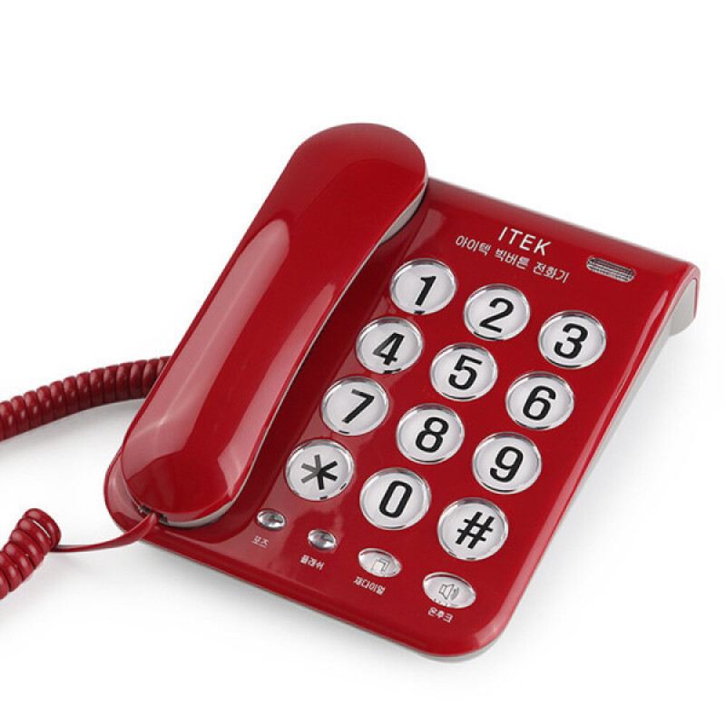
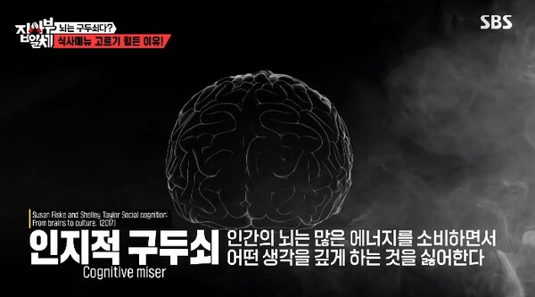
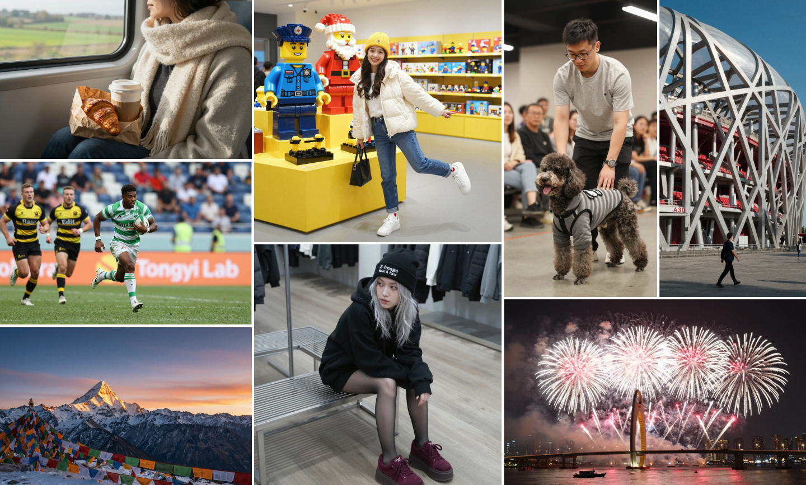
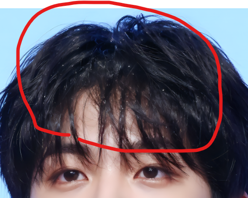
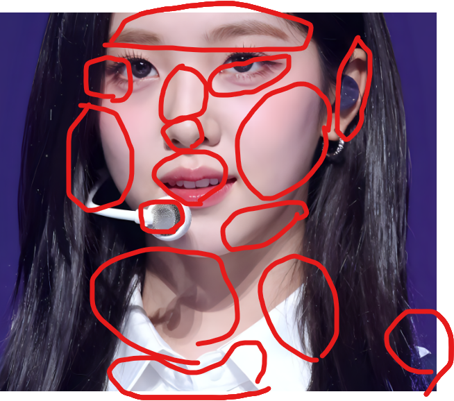
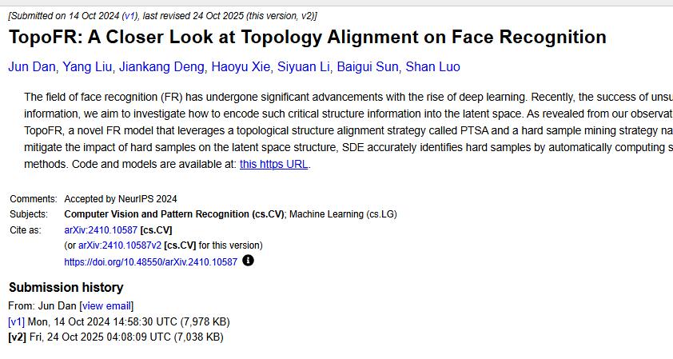
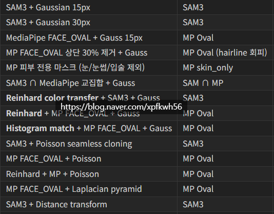
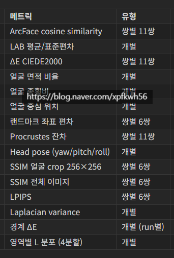

# 설레발2
**Date:** 2026. 5. 31. 0:05
**Category:** 다이어리
**Original URL:** https://blog.naver.com/xpfkwh56/224301280361
---

1. 대통령 욕을 하면 진짜 **'죽을 수도'** 있다

​

정상적인 내 또래는 밈인가? 싶지만

​

같은 시대를 사는 사람의 **'상당수'** 는

정말 그랬던 시대를 살았던 적이 있음

​

경제학 교과서에는 완전경쟁시장 에서의

예시를 들 때, 주로 **'쌀'** 을 들어서 말을 함

​

쌀 시장은 모든 시장이

공급자이자, 수요자니까

​

그럼 98년생, 혹은 왔다갔다 세대한테

**'쌀'** 에 대한 비유는 잘 와닿을까?

​

수학 교과서에서 함수를 가르칠 때,

​

공이 떨어지는 현상이 함수다 라고

하는 만큼이나 **'이론을 위한 이론'** 처럼

들릴 가능성이 높다고 생각함

​

​

어머니 안녕하세요 저는

누구누구 친구입니다

​

혹시 집에 누구누구 있으면

전화 바꿔주실 수 있으세요?

​

내가 초등학교를 다닐 때 배웠던

기본적인 전화 **'예절'** 인데,

​

1호기한테 **'저런 빨간 전화기'** 가

예전에 집집 마다 있었다고 한다면

​

**'?'** 하는 반응을 보일 확률이 더 높음

그들에게 있어, **전화기 = 스마트폰** 임

​

현대 사회에서 그럼 **'쌀'** 에 비견하는,

**'완전 경쟁시장적 요소'** 가 있는건 뭘까?

​

우리에게 가장 친숙한 것을 말하자면

**온라인 정보 콘텐츠** 가 대표적일 것 임

​

이게 **'점'** 을 **'선'** 으로

**'선'** 을 **'면'** 으로 잇는 핵심임

​

2. 노령층이 일원화 창구를 선호하는 이유는

​

그들이 **'농업 → 산업 → 정보 → 4차 산업'**

이라는 인류 역사를 온몸 으로 통과해서 임

​

농업은 그 지역을 떠나지 않아도 됨

​

산업은 그 지역을 떠나, 공장이 많고

노동 수요가 많은 곳으로 이동해야 됨

​

정보는 지역의 개념이 없어짐

4차는 지금 **'무엇이다'** 정의조차 안 됨

​

각 시대에서 요구하는 **'가치'** 들이 있는데,

​

남조선 기준으로는 **'농업'** 형 **'신정사회'** 다

라는 것이 내가 살아봤을 때, 얻은 **'결론'** 임

​

판 밖에 있으면, 판 안을 볼 수 있음

​

4차 산업 이후의 시대가 된 뒤에야 비로소,

우리는 우리가 어떤 시대를 살아왔는가

​

평가하고 조망해낼 수 있을 것임

​

도시 토박이들은 **'절대'** 알 수 없는 지점인데,

​

시골에서는 누가 나의 이름을 기억하고 있냐

라는 것이 **'짐'** 이 되기도 하지만,

​

그게 곧 **'나의 존재 가치'** 와 직결되기도 함

​

서울에서는 내가 뭘 하고 살든, **'자유'** 로움

​

그러나 시골에서는 **'나의 모든 외부적 활동'** 이

한 다리만 건너도 모두가 아는 행위가 되므로,

​

내 **'평판'** 과 직결될 수 있음

​

이사가면 되잖아요?

​

시골로 본인이 **'외지인'** 신분을 달고,

​

다른 지역으로 갔을 때 생기는 일을

자기들이 누구보다 잘 알고 있을 것 임

​

당장 나만 해도, 내 블로그 안에서는

리아님 리아님 소리 듣고 사는 사람이나,

​

내가 **'나를 아무도 모르는 지역'** 에 가면?

베프없이 여고에 고립된 여중생처럼 됨

​

창구가 바뀐다는 것은 계속 **'새로운'** 설명으로

**'새로운 시도'** 를 해야 되는 부담을 주기 때문에,

​

​

가능하면 **'움직이지 않으려는'** 이유를

찾는 노인들의 행동 비용을 올릴 확률이 높고,

​

이는 곧 그들의 **'거절'** 과 직결됨

​

인공지능적 관점에서는

​

**'사용자 맞춤형 컨텍스트 큐레이션'** 이 있어도

​

**'입력하는 비용'** 자체가 부담스러워서

그 시도 자체를 하지 않는 것과 유사한 셈임

​

아마 이건 **'노인'** 만 그런 것이 아닐 것임

​

**왜 why?**

​

인간의 **하드웨어** 와 **소프트웨어** 는

​

아주 오랜 시간, **'원시 시대'** 를 기준으로

생존에 가장 특화된 것만 남긴 상태고

​

시대에 맞게 빨리 OS 업데이트를 했지만,

​

여기에는 **'노력'** 이라고 말하는

**'부자연스러운 시도'** 가 **'매우'** 요구됨

​

어쩌면 현대 사회는 **'평범하다는 것'**

그 자체가 **'죄'** 가 되버린 사회이기도 함

​

3. 때는 지금으로부터 약 6개월 전,

​

나 또한 다른 사람들이 그런 것처럼

갓 한국에서 GPT 가 나오기 시작했을 때,

​

심심이 고급버전 정도로 이용했던 적 있음

​

몇 번 대화를 나눠보고, **'가치가 없다'**

라고 생각했고 추후 기회가 생길 때 되면

​

온라인으로 정보를 접하는 그 정도 였음

​

간간하게 세상 돌아가는 소식이 들릴 때면,

​

미래에는 해저 도시도 있다는구먼

우주 달나라로 수학 여행을 갈 수 있다드라

​

같은 정도의 느낌으로만 듣고 살고 있었음

​

그리고 25년 12월,

​

​

**Z-image Turbo 모델이 나옴**

​

최소 요구 VRAM은 6GB

중고로 사서 거의 10년 가까이 썼던

​

내 한성 보스몬스터

GTX 1660 TI 이 6GB 임

​

**\* 현재 중고가 기준 약 40만원 전후**

​

25년 12월은 로컬 AI 에 대한 화제가

온라인 커뮤니티에**'은은하게'**있던 때라

​

SD 모델(구형 이미지 생성 모델)이나,

​

중국에서 나온 신기한 서비스들을

갖고 노는 것 정도가 가능했을 시절인데

​

**'하루 아침'** 에 우주선 로켓트가 나와버림

그리고 그 비용이 **'제주도 쯤 갈 가격'** 이었음

​

23년 무렵, 안드로이드 앱스토어 시장에서

**'키우기 게임'** 이라는 타이틀만 찍어서 팔면

돈이 쏟아진다는 정보를 나는 알고 있었는데,

​

여기서 한층 더 나아가, **'그래픽 소스'** 를

​

인디게임 판에서 **'아주 갈급해한다는 것'** 을

예전에 있던 도메인 지식을 통해 연결 했었음

​

그래서 SD, 달리, 미드저니 같은 서비스로

중간 매개형 소스를 만들어서 유니티 리소스를

​

제공하면 쏠쏠하겠다는 **'기획'** 을 실현화 할 겸,

겸사겸사 그게 번잡하더라면 요즘 유명하다니까

​

나중에 **'인터넷 못 하는 아줌마'** 처럼 되기 싫어서

그 외 여러 이유로 깔짝 거리고만 있었던 것 인데,

​

**이거는 딱 봐도 사이즈가 달랐음**

​

​

그와 동시에, 개선점들이 보였음

​

​

SD 에서 **'이론적으로'** 한계가 있다

라는 부분을 ZIT 는 해결할 수 있었고,

​

6개월 동안 깔짝 거렸던 것들이

기술 진입 해자에 하락으로 인해서,

​

빠르게 배울 수 있는 기회로 작용 했음

​

내가 제일 먼저 목표를 찾은 것은

**'쇼핑몰 모델 대체'** 였음

​

내가 예전에 옷 장사를 했을 때, 느낀 **불편** 은

모델을 구하는 것이 **'아주'** 어렵다는 점 이었음

​

그래서 에이전시에서 뿌리는 팸플릿에 있는

이미지를 그대로 긁어다가 쓰는 일이 많은데,

​

그렇게 하면 구매자 입장에서 **'차별화'** 가 안 됨

​

디테일한 이야기지만, **'이미지는 같아도'**

상품은 다른 경우도 실제로 있지만 이미지를

구성할 수 있는 여력이 없는 입장에서는

​

오히려 **'원가율'** 이 비싼 상품을 제공해도

설명할 수 없어도 손해보는 일이 했기도 했음

​

다르다고 설명하는 비용 > 기대되는 편익

이럴 바에는? 그냥 나도 똑같이 염가로 판다

​

근데 이거는 **'역으로'** 오히려 가장이 가능했음

​

1660ti 기준으로 이미지 1장을 뽑으려면,

​

**'신기에 가까운 노가다'** 를 해야,

간신히 2분에 1장 정도 뽑을 수 있는데

​

ZIT 는 코랩만 사용해도 그 반도 안 되는

속도로 비교할 수 없는 퀄리티 이미지가 떴음

​

**\* 코랩은 4080 정도 스펙임**

​

ZIT 로 **'최소한의 상업적 스펙'** 이미지를 찍고,

예전에 쇼핑몰 하던 분들한테 공짜로 뿌렸음

​

지금 사이트에 있는 이미지 마음에 안 드시면

이거로 교체해서 쓰시면 된다는 식으로 넘겼음

​

대부분은 내가 **'귀찮지 않은'** 범위 내에서

휘발적으로 도와주고 끝나는 것으로 끝났고,

​

크게 손이 가지 않으면, 상세 페이지 내지

홈페이지 웹디까지 턴키로 가능하냐고 해서

​

마케팅 법인이랑 연결하고, 시스템을 깔았음

​

**'자료'** 는 내가 제공하고, **'서빙'** 은

회사에서 하는 형태로 했음

​

그리고 하다보니, 이게 **'활용가치'** 가

무궁무진 하다는 것을 점점 깨닫게 되었음

​

**4. 기술적 한계**

​

생성형 이미지 모델 분야에서 도대체 왜,

중국산 모델들이 서양 모델을 **'압도'** 할까?

​

이 질문은 **'반'** 만 맞는 말임

​

영어로 된 데이터가 많으니까 영어로 질문하면

​

답변의 품질이 좋은 것처럼, 기본적으로 서구에서

나온 모델은 **'서양인 데이터'** 로 학습을 돌리게 됨

​

애니, 하면 일본식 양산형 디자인 나오는 것처럼

인간, 하면 **'서양인'** 이 **'디폴트'** 라는 것 임

​

**이 말을 바꿔서 하면 뭘까?**

​

**'동양인 대상의 리얼리즘 이미지**

**생성 모델은 무주공산이다'** 라는 말임

​

당시 국내 AI 커뮤니티에서 가장

인기있던 주제는 **'페이스 스왑'** 이었음

​

마법의 프롬프트를 찾아내면,

A 의 얼굴을 B 로 바꿀 수 있다

​

이거로 **'AI 인플루언서'** 를 만들 수 있다

라는 기술이 **'가장'** 주목 받고 있었음

​

문제는 일관성이 떨어지고, 퀄이 낮고,

**'실제'** 해보려고 하면 **'매우'** 어려웠단 건데

​

그건 실제 기술이 어렵다기보다는,

**'알고자 하는 의지'** 가 없어서 그랬음

​

먼저 이미지 생성 모델에는

샘플러와 스케줄러 라는 개념이 있음

​

샘플러 = 그리는 화가

스케줄러 = 그리는 시간 및 조건

​

아주 거칠게 비유하면 이거임

​

샘플러의 종류도 수십, 수백

스케줄러의 종류도 수십, 수백임

​

그리고 생성형 이미지는 **'랜덤'** 이라,

다중 매개 변수를 전부 다뤄서 해야 됨

​

그럼 어떤 일이 일어나냐?

​

**'직접'** 돌릴 엄두가 안 나기 때문에,

최적의 국룰을 사람들이 **다 똑같이** 함

​

모델 = 샘플러 = 스케줄러

​

이 모든 것들이 **'한 박자'** 로 맞는

절대 황금값이 세상 어딘 있겠지만

​

찾는다고 **'확률'** 이 더 높을 뿐이지,

그거만 안다고 답이 나오는 것도 아님

​

내가 제일 먼저 했던 것은

**'기준'** 찾기 였음

​

**'예쁜'** 이라는 추상어가 아니라,

​

컴퓨터와 내가 알 수 있는 공통의

어떤 기준이 있어야 가능하다 여김

​

​

그리고 따거들이 만든 논문을 찾던 중,

내가 쓸 법한 아이디어가 있는 것을 발견함

​

실제로 해봤음

​

East Asian (MFR-Ongoing) 에서

97.10% 나왔고 오차율도 거의 없었음

​

IJB-C FAR=1e-5 (Glint360K) 94.75%

IJB-C FAR=1e-4 (Glint360K) 96.71%

​

**\* 백본 ResNet-200 (CNN)**

**학습 데이터 Glint360K (17.1M장, 360K ID)**

​

추론 파이프 라인은 다음과 같음

​

이미지 로드

→ MTCNN (facenet-pytorch) 얼굴 검출

→ 112×112 crop + 정규화 (mean=0.5, std=0.5)

→ TopoFR R200 forward → 512-dim embedding

→ cosine similarity (소스 vs 결과)

→ threshold 비교 (FAR=1e-5 기준)

​

동양인 베이스로 쓸 수 있는, 가장

기본적인 모델이 이거라는 것을 알았고

​

facenet-pytorch 2.5.3

opencv-python 4.13.0.92

numpy 2.3.5

scipy 1.17.1 를 사용해서,

​

TopoFR R200 기반으로

얼굴 ID 유사도 측정기를 썼음

​

그리고 같은 원리로, 국내에서 가져와서

사용할 수 있는 **'최대한의'** 이미지를 긁음

​

여기서 공적 데이터의 도움이 있었음

​

한국에서는 데이터의 수량이 많지는 않지만

AI 데이터 모델링을 위해서, 공개적으로

제공하는 **'공식적인 인간 생체 정보'** 가 있음

​

수량이 적긴 했지만, 동일한 시멘틱 값에서

확장하는 것 정도는 전체적인 노이즈에서

크게 문제를 발생 시키지 않을 것으로 봤고,

​

경량 모델 이라는 특성을 대폭 살려서,

다중 생성으로 데이터를 뽑기 시작했음

​

​

초기에 사용했던 **메트릭** 임

​

필요한 노드는 직접 개발해서 사용했고,

​

컴피에 호환되지 않는 경우는

내가 따로 빼서 파이프라인 구축함

​

그리고 20, 30대 남자도

​

보이스피싱으로 속을 정도의

퀄리티로 사람을 뽑는데 성공함

​

이 과정이 간략하게 말했지만,

아주 길고 복잡한 것들이 많았음

​

**대표적으로**,

​

직관과 달리 장원영, 카리나 얼굴을

많이 많이 넣는다고 미녀가 안 나옴

​

서로 다른 인간이 들어가면 들어갈수록,

**'하나의 형태'** 로 영원히 수렴될 뿐임

​

한국인 20대 여자 예쁜, 존나 예쁜,

존나존나존존노노논ㄴ나 예쁜

​

이렇게 프롬프트 넣는다고 안 나옴

​

텍스트 인코더를 분해해서, 각 토큰값이

어떤 레이어에 매칭되고, 특정 조건 내에서

​

어떻게 발현하고, 그 통계값이 어디인가

같은 것을 스스로 찾아내는 것 말곤 없음

​

마찬가지로 레이어 단위를 어디에 넣고,

어디를 튜닝 해야 되는가도 차이가 있음

​

국내에는 **'이런 기술'** 에 관심이 있는

사람을 도저히 찾을 수 없었기 때문에,

​

따거들의 존재가 많은 곳으로 이동했고

디코에서 소개를 받아,

​

평소에 내가 만든 로라로 서류 패스하고

체크포인트 개발진으로 디코방 들어감

​

**'그게 뭐여?'** 싶은데,

​

취업이 안 되는 디지털 노마드가

한국보다 100배는 많은 중국의 경우,

​

온라인 SNS, 생성형 AI 산업 시장에서

​

**'유료 로라, 유료 체크포인트'** 를

상업적으로 판매하는 산업이 존재함

​

사진관에 가서 사진을 찍는 것이 아니라,

​

본인 이미지 보내주면 그걸 바탕으로

**'평생 쓸 수 있는 엔진'** 을 만들어줘버림

​

어떤 의미로는 불법과 합법의 어딘가,

회색 영역에서 움직이는 분야이기도 하고

​

심지어 **'잘못된 일이 해당 업계에서'**

발생하지 않는다고도 말은 못 하겠지만

​

문제가 될 짓은 안했다, 정도로 설명하겠음

​

<계속>