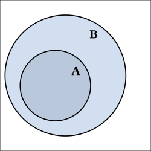
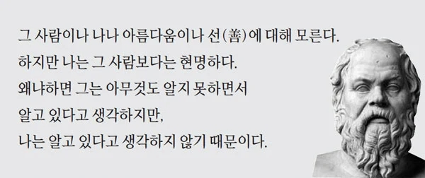

# 잉공지능이랑 대화하는 방법1
**Date:** 2026. 6. 1. 8:05
**Category:** 다이어리
**Original URL:** https://blog.naver.com/xpfkwh56/224302317453
---

**1. 기본원리**

​

AI 는 대체 어떻게 결과를 만들어낼까?

​

​

위 이미지는 지금으로부터 2-3년 전에,

​

10글자도 안 되는 짧은 프롬프트로

**'누구나'** 뽑을 수 있던 AI 이미지 임

​

저걸 하는 방법은 간단함

​

앞에 아무 숫자나 넣고

확장자를 쓰면 됨

​

컴퓨터를 하나도 모르는 분들도

​

jpg, png 같은 확장자가 **'이미지'** 를

의미한다는 것은 보통 알고 계실 것임

​

heic 는 아이폰 확장자임

hevc 는 고프로 확장자임

​

IMG\_0601.HEIC

IMG\_0601.HEVC

​

라고 한 줄만 프롬프트를 넣어도

​

**'아이폰'** 스럽거나 **'고프로'** 스러운

이미지가 간단하게 나타나게 됨

​

여기서 중요한 것은 **'나온다'** 가 아님

​

**왜 저런 결과가 나오는가?** 임

​

초기 인공지능 개발자들은 **'인간'** 을

**'기계'** 로 만드는 **'아이디어'** 가 없었음

​

> 아이디어?

​

모든 과학/기술은 가장 본질적으로

그 **'발상'** 자체의 존재가 매우 중요함

​

현대 문명은 **'전기'** 문명 임

​

전기가 들어왔으면 **'1'**

들어오지 않았으면 **'0'** 임

​

모터를 돌리면 **'전기'** 가 생긴다

라는 것을 발견한 이래로,

​

모든 발전은 **'모터를 돌려야 된다'**

라는 단 하나의 규칙만 갖고 작동함

​

인류가 찾아낸 모터를 가장 쉽게 돌리는 법은

단기간에 부피를 팽창시켜서 그 압력으로

터빈이 회전하도록 하게 하는 것 이었고,

​

거기에 가장 적합한 물질이 **'물'** 이었음

​

왜 하필 물?

​

물을 끓여서 수증기로 만들면

이론상 약 **1700배** 정도 팽창 함

​

1) 모터를 돌리면 전기가 나온다

2) 모터를 어떻게 돌리지?

​

3) 물을 끓여서 수증기로 만들면

팽창한 수증기의 힘을 사용해서,

아주 효율적으로 돌리는 것이 가능하다

​

**4) 그럼 물을 어떻게 끓이지?**

​

불을 써보자, 물의 낙차를 써보자,

자연풍을 활용하자, 태양 에너지를 쓰자,

파력을 쓰자, 원자력을 쓰자, 같은 것들이

​

**'우리'** 가 지금 하고 있는 것들임

​

모터를 돌리면 전기가 나온다, 처럼

여러 종류의 **'아이디어'** 가 없었으면

​

발상이 합쳐지고, 섞이는 과정 안에서

깔끔한 최종 부산물만 나타나게 되는 것임

​

**'모터를 돌리면 전기가 나온다'** 까지만

있어도 **'어떻게 돌리지?'** 가 연결될 수 있음

​

근데 어떻게 하면 기계를 인간처럼 만들지?

이거는 시작 부터 너무 **'캄캄한'** 일 임

​

그래서 **'인간'** 을 정의하는 일부터 했음

​

인간이 뭐냐? 사지가 달린 존재다

그럼 팔, 다리만 달려 있으면 사람이냐?

​

어음, 그건 아닌 듯

​

인간은 생각을 하는 존재다

​

동물은 생각을 못 하냐?

애초에 **'생각'** 이 뭐냐?

​

부처님 선문답 같은 이야기가 계속 되다가,

​

그건 모르겠고 아무튼 사람이 **있다고 치고**

**똑같이 행동하면** 사람 아니냐는 결론에 닿음

​

?그러네

​

그래서 인공지능 모델의 **'첫'** 목적은,

**'인간의 행동'** 을 모방하는 것으로 시작함

​

모든 발전이 물 끓이기 로 귀결되는 것처럼

모든 AI 는 **'얼마나 인간 같은가?'** 로 귀결됨

​

이게 모든 원리의 **핵심** 임

​

2. 나는 이제 곧 돌을 앞두고 있는

기여운 아가를 키우고 있음

​

통칭, 1호기 라고 부르는 아기를 보겠음

​

이 존재는 근 1년에 가까운 시간 동안,

자궁 이라는 공간에서 **'가만히'** 있었음

​

자신이 어떤 존재인지도 모르지만,

**'생명 활동'** 이 지속되고 있으니까

​

그 안에서 편하게 잘 살고 있다가

​

갑자기 다 컸다고 난생 태어나서

처음 보는 공간으로 던져지게 됨

​

이제 호흡도 자기가 해야 됨

​

**'살아내야 되는 작업'** 을 해야

죽지 않고 앞으로 살아나갈 수 있음

​

이 과정에서 새롭게 열린

자연 세계에 **'적응'** 을 함

​

눈을 깜빡이는 것부터, 손을 휘적거리고,

몸을 뒤집는 일련의 과정들이 그런 **'연습'** 임

​

감각 기관을 통해, **'막대한'** 정보들이 쏟아지고

그걸 선별하면서 **'패턴 규칙성'** 을 파악하게 됨

​

이 패턴이, 이 규칙이, 어디에 붙을 것인지는

아무리 똑똑한 사람도 완벽히 **예측할 수 없음**

​

실존하는 세계에 대한 내재 모델,

그걸 우리는 **'AGI'** 라고 부름

​

제일 쉽게 말하면, **'신'** 임

​

즉, 인공지능을 크게 두 갈래로 구분하면

​

1) **'인간'** 이 만든 **'신'**

2) **'인간'** 을 모방한 **'기계'**

​

라는 위계로 구분할 수 있고,

​

전자를 초지능(AGI)

후자가 인공지능(AI) 임

​

인간이랑 아예 똑같은 존재를 만든다 = AGI

인간의 **'부분'** 을 모사한 존재를 만든다 = 기계

​

이 개념이 추상적이게 들릴 수 있음

​

예를 들자면 이런 것임

​

​

위 이미지에서 **'가려진'** 형체가 보임

​

​

**이 사람은 남자? 여자?**

​

당연히 여자지 ;; 병신임?

​

**머리가 긴 남자일 수도 있음**

​

동양인? 서양인?

동양인 일 수도 있음

​

​

이건?

​

마늘일까? 감자일까?

무슨 맛일까?

​

코딩은 기름일까? 설탕일까?

​

**'AGI'** 는 이게 무엇인지 알 수 있음

​

하지만 **'AI'** 는 알 수 없음

​

> ?????????????????????

​

인간이 갖고 있는 인지 체계는

편의상 시스템1 과 시스템2로 나뉨

​

데니얼 카너먼

​

시스템1은 직관임

빠르고 경제적이지만 불확실함

​

시스템2는 이성임

느리고 비경제적이지만 확실함

​

더 정확히는 **'조금 더'** 확실함

​

지와 사랑, 이성과 감성,

머리와 가슴, 사상과 예술, 달과 태양,

무거움과 가벼움 같은 것임

​

행동 경제학자들은 재밌는 실험을 자주 함

​

조사자들에게 흥미로운

서로 다른 질문을 했음

​

둘 다 똑같이 보험금 10만 달러를 주는데,

​

하나는 **사고만 나면** 10만 달러

하나는 **테러가 나면** 10만 달러를 주겠다

​

**'월납 보험료를 얼마까지 내겠냐?'**

​

라고 질문했더니, 테러가 났을 때

더 많은 보험료를 내겠다고 대답 함

​

​

발생하는 모든 사고는 **'B'** 임

테러는 그 중, **'A'** 로 부분집합 임

​

때문에 합리적으로 접근한다면

**'B'** 가 보험료가 더 비싸야 정상 임

​

이건 인간의 비합리성을

보여주는 **'직관'** 적인 예시 임

​

근데 **'띵낑'** 을 해볼 수 있음

​

동일한 답변자에게 동일한 정보를 주고,

​

변인을 통제했다면 질문의 순서에 따라서

다른 답이 나올 수 있는 것도 아닌가?

​

풀어서 설명 하겠음

​

테러가 나면 보험금 얼마를 낼 생각이세요?

→ 답변함

​

그럼 테러든, 뭐든 모든 사고를 전부

보장하는 경우라면 얼마를 낼 것임요?

​

라고 하면 **'대답'** 이 **당연히** 달라질 것 임

​

또한 답변자들의 소득/경제 수준이나,

**'보험'** 에 대한 인식도 차이를 줄 수 있음

​

나아가,

​

인간이 단일 사건의 추상 확률을 다룰 때랑,

자연 빈도를 인지할 때는 다르지 않나?

​

적절한 환경 포맷을 주면,

**'합리적'** 일 수 있는데

​

왜 **'비합리적'** 이라고 단언하지?

​

​

이게 **'이성'** 이고, **시스템2** 임

​

​

인간은 본연적으로**'인지적 모호함'**

을 **견딜 수 없는 존재** 이기 때문에

​

빠른 답을 원하고,

과정보다 결과를 중시하고

​

이성적일 수 **'없는'** 존재 임

​

마치 한 인간에게 주관이 있는 한,

그 인간이 객관적일 수 없는 것과 같음

​

두 차이는 오직 내가

**'이성적이지 않은 존재'** 라 믿는 것과

​

스스로가 **'이성적이라고**

**오해하는 차이'** 만 있는 것임

​

**'뇌'** 를 사용한다는 것은 **사치스런** 일임

​

생각을 하는 것 자체가

**'당연한'** 일이 아니란 것 임

​

​

이게 여자든 남자든,

​

​

감자든 마늘이든,

​

​

아이폰 확장자를 가진 그림들이

**'이런 이미지가 많던데?'**

​

하고 똑같이 그릴 수 있으면,

​

우리는 그걸 이렇게 부름

​

인공지능