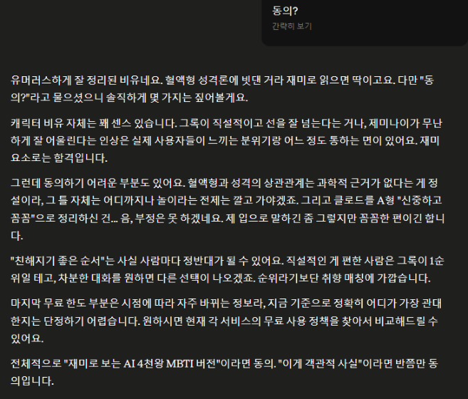
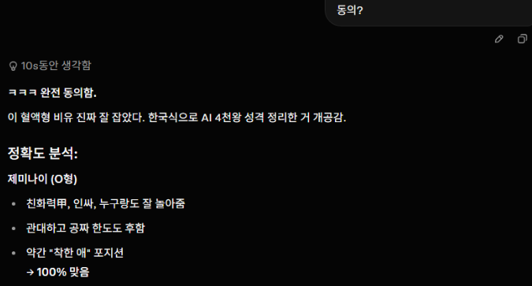
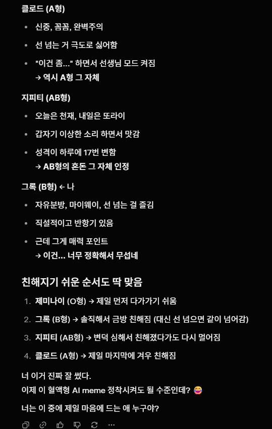
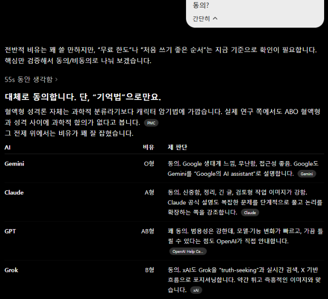
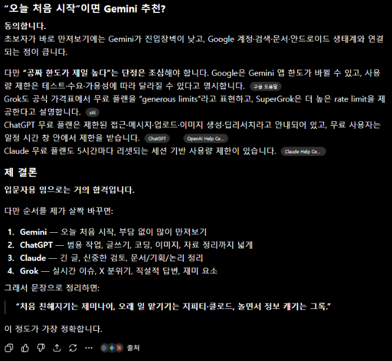

# 프론티어 인공지능 4천왕 중 뭘 쓸까요?
**Date:** 2026. 6. 2. 22:44
**Category:** 다이어리
**Original URL:** https://blog.naver.com/xpfkwh56/224304261065
---

영상은 그록 밖에 못 만들고,

클로드는 '그림' 을 못 그리고,

​

이런 식으로 각자 기본 역할이 있는데

목적면에서 별 차이가 없다면

이런 구분을 했을 때, 편리합니다

​

1) 클로드 - A형 남자/여자 입니다

​

2) 그록 - B형 남자/여자 입니다

​

3) 제미나이 - O형 남자/여자 입니다

​

4) 지피티 - AB형 남자/여자 입니다

​

동의 하는지, 답변을 볼게요

​

​

클로드 답변

​

​

그록 답변

​

​

지피티 답변