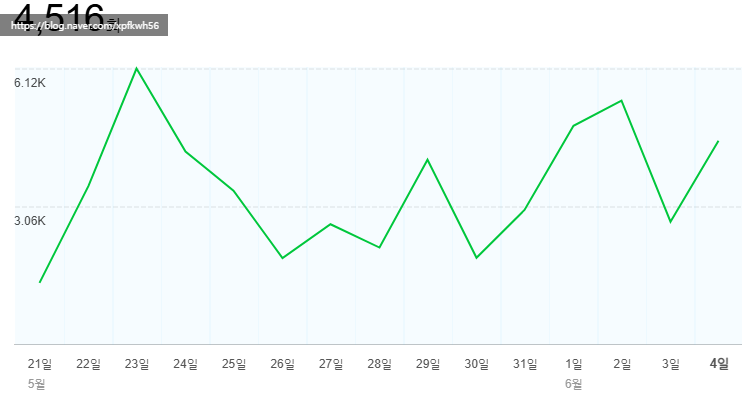
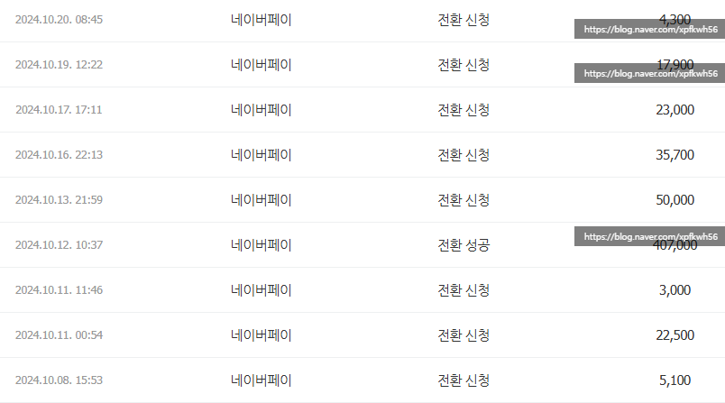

# 네이버 공무원이 무슨 말 인가요?
**Date:** 2026. 6. 5. 17:53
**Category:** 다이어리
**Original URL:** https://blog.naver.com/xpfkwh56/224307067300
---

1. 근래 대단히 공감했던 말이 있는데,

네이버는 **'공산주의'** ​라는 이야기 임

​

이데올로기에 대한 오해가 있지만,

그걸 하나하나 다 얘기하기는 그렇고

​

필요한 것만 핀 포인트로 잡아보겠음

​

2. 네이버는 기본적으로 **'플랫폼'** 임

​

직접 서비스를 하는 곳이 아니고,

깃발 들고 다니면서 관리하는 쪽 임

​

얘네를 대신해서 **'일'** 을 할 애들이 필요함

​

내 블로그를 보겠음

​

​

하루에 3천명 이상? 방문하고,

와서 짧으면 4분, 길면 7분 봄

​

나는 네이버에게 하루 통상

275시간의 시간을 제공하고,

​

네이버는 나로 하여금 얻은 시간을

자사의 가치로 잘 활용할 수 있음

​

약관에 보면, 내가 블로그에 쓴 글

이런 것들도 학습에 쓰거나, 이런저런

다양한 곳으로 이용하고 있다고 함

​

​

24년이 애포 마지막인데, 내 경우

적으면 30~ 많으면 60-80 정도 임

​

**\* 하기 나름이겠지만 직업처럼?**

**한다면 월 50-100은 찍힐 듯함**

**​**

크다면 크고, 적다면 적은 돈이지만

주니까 받지 받으려고 할 일은 아님

​

다만 내 계획대로면, 다계정들

애포가 붙기 시작할 무렵부터

​

계정당 최소 50? 많으면 100?

정도는 견줘볼 수 있으리라 보는데

​

**\* 만들자마자 못 붙임 + 추정값**

**​**

내 입장에서는 나쁘지 않은 장사 임

​

**\* 이 계정을 제외하고 인공지능**

**계정 5개 운영시, 50\*5 = 250**

​

3. 여튼 이렇게 블로그 활동을 하면서

얻는 무형적 가치를 네이버는 나눠줌

​

언제까지? 내가 안 할 때까지

​

좋소는 정규직과 계약직 의미가 없음

​

65세 정년까지 근로를 할 수 있어도,

그보다 빨리 회사가 없어질 수 있기 때문임

​

그러나, 대기업은 **여간하면** 잘 안 망함

그래서 실상 **'공무원'** 처럼 일 할 수 있음

​

지금도 네이버에서 자리를 잡은

꽤 많은 사람들은 적게는 수백,

많게는 천 따리 이상을 벌고 있음

​

**\* 물론 그들이 다른 시장으로 가면**

**그 수익의 몇 배, 십 몇 배를 벌어낼 것**

**동일한 경쟁력을 유지한단 전제 하에**

​

나는 온라인에 글을 써가지고,

10억, 100억 버는 것이 말이 됨?

​

했는데, 오랜 추적 끝에 **'실증적'** 으로

그게 사실 이라는 결론에 닿기도 했음

​

4. 그럼 여기서 궁금한 지점이 있음

​

똑같은 글을 써서 **'파는데'**

왜 네이버는 적게 버는가?

​

구글은 내가 직접 창업하는 것이고,

네이버는 **'가맹'** 사업에 들어가는 것임

​

네이버 가맹점은 독특한 특징이 있는데,

단 하나의 업장이 **독점하게** 하지 않음

​

A 라는 사람이 있고, 1억을 벌고 있음

그럼 9명의 경쟁자를 붙인 다음에,

각자 1천씩 나눠서 평화롭게 유지함

​

**왜 why?**

​

내가 블로그 열심히 잘 해가지고

네이버에 **'중추적'** 거래처가 되었는데

​

내일 당장 귀찮다고 때려치운다면

네이버는 치명적인 타격이 생기게 됨

​

반면에, 여기저기 다 걸쳐놓고 있고

심지어 **'신규'** 공급을 열어놓는다면,

​

가맹주들은 서로 경쟁하게 될 것이고,

이 비쥬니스는 계속 유지될 수 있음

​

5. 그 **'이익을 공유한다'** 라는 부분을

공산주의적 이라고 이야기하는 것 같음

​

렛씨,

​

일전에 홈판에 올라가는 계정들이

**'레벨'** 이 있다고 가설을 말한 적 있음

​

메이저 계정은 홈판에 오르게 되면,

​

하루 트래픽이 적게는 수십만,

많을 때는 100-200만이 발생함

​

거기서 나오는 수익은 적게는 20만,

많으면 100만, 300만 이렇기도 함

**​**

**\* 하루 만에**

​

네이버는 많은 이용자를 묶었음

그런데 **보여줄 것** 이 없음

​

그래서 거기 **'보여질'** 것을

납품하는 납품 공급처들에게

​

보상을 약속하는 구조를 짠거고,

​

일정 **'그룹'** 이 생기고, 그들이 만약

계속 자리에 머물러 유지하고 있다면

​

네이버가 망하지 않는 한,

공무원 **처럼** 일을 할 수 있음

​

6. 그럼 홈판이 답이네?

한편 꼭 그렇기만 한 것도 아님

​

**왜 why?**

​

근래는 많이 줄었는데, 내 기억대로면

3-4천블 정도 찍히기 시작했을 때

​

이메일로 원고 제휴 부터 시작해서

이거 해보자, 저거 해보자 얘기 많음

​

**\* 매크로 광고도 있고**

**사람이 문의하는 것도 있고**

​

원고당 가격은, 적으면 20만,

많으면 80만에서 100 넘기도 함

​

아마도 안 가리고 받으면 500? 정도는

어렵지 않게 닿을 수 있는 구조 일 것임

​

레퍼럴도 있고, 대여 계좌도 있고 등등

​

월에 글 10개 언더만 써도 협찬 제휴로

200만을 버는데, 굳이 안달복달 하면서

​

인플고시, 홈판고시에 목맬 이유가?

​

그리고 네이버 계정 키우는 노력으로

똑같은 광고 달아서 운영한다고 가정하면

​

통계치 기준, 그리? 어렵지 않게 키워도

1개당 월 10만원씩 벌어오게 할 수 있음

​

**\* 구글에서 보는 ai 처리를 모르겠지만**

**​**

그렇다면 부하 조금 줄여서 그거 20개고,

50개고 다계정 만들어서 뿌리는 것이 나음

​

여튼, 콘텐츠 를 갖고 움직이는 시장이

​

무시할 수 없을 정도로 **'거대하고'**

성숙화된 상태라는 것만은 확실하고,

​

**할 수 있으면** 요령껏 잘 해봤을 때

괜찮은 아웃풋이 나올 수 있다는 것임

​

7. 저도 해볼까요?

​

네

​

그럼 지금이라도 **'배워'** 볼까요?

​

아뇨

​

제가 물론 **'대기업'** 키워본 적은 없지만

그 잠깐 사이에도 **'끊임없이'** 바뀝니다

​

**\* 정보의 가치가 굉장히 비싼데,**

**감가도 빛처럼 빠름**

​

배운다고 해도, 매우 호의적으로

봤을 때 **'출발선'** 서는 정도지

​

배운 것을 **'써먹는다'** 와 거리가 큼

​

입장을 바꾸어 생각을 해보십시다

​

제가 **'기술'** 이 있다고 칩시다

​

그럼 님이 저라면 사람 가르칠래요?

​

아니면 gpu 1장 더 사서

집에서 컴퓨터 돌릴래요?

​

그런 것이죠

​

기왕 배울 것이면 전문직도 있고,

자격증도 있고 좋은 것들 많으니까

​

그런 쪽으로 알아보는 것이 낫다고 봄