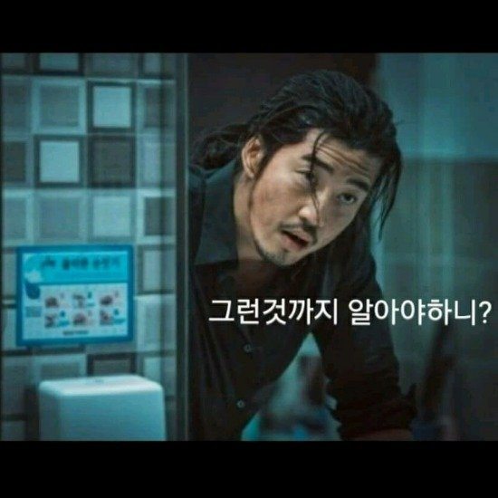
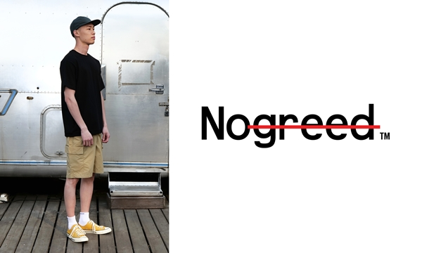
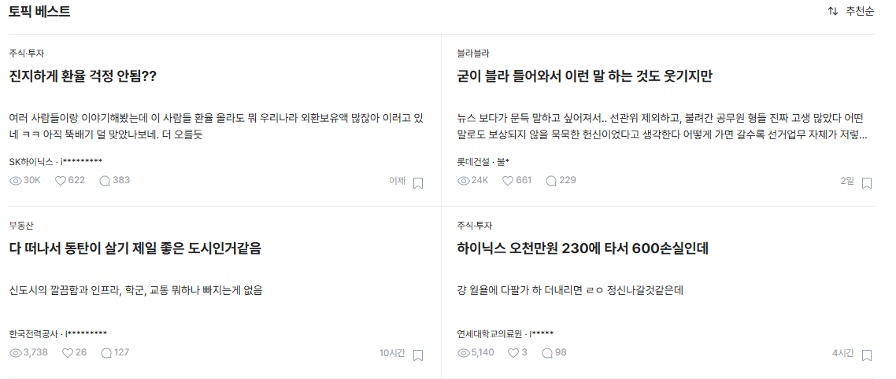
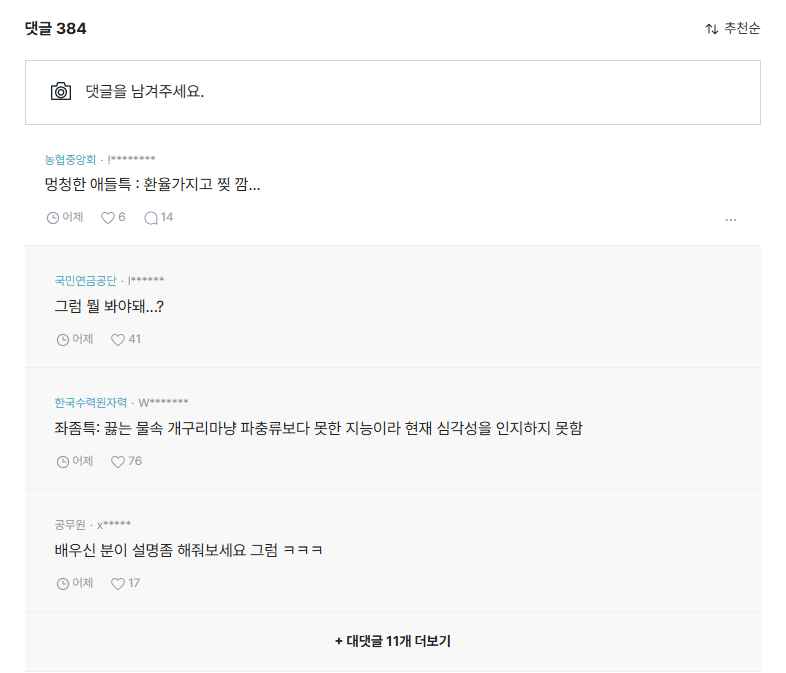
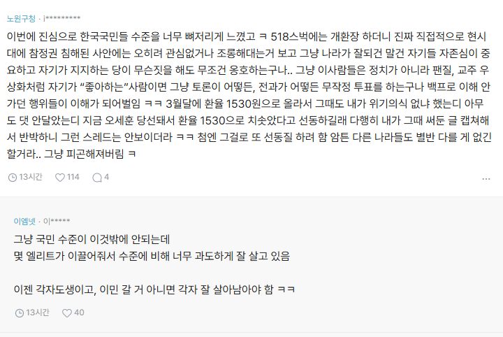

# 블로그 주인장은 왜 노하우를 안 알려줄까?
**Date:** 2026. 6. 6. 16:13
**Category:** 일기장
**Original URL:** https://blog.naver.com/xpfkwh56/224307840814
---

**1. 온실과 야생의 차이**

​

김리아 8세, 초등학교 입학

​

덧셈 뺄셈 배우고 한글 배우면서

학교를 다니면서 **'사회화'** 가 심화

​

**'매일'** 출석을 해야 된단 것을 배움

​

학교는 왜 가야 된다?

왜 가 아니고, **'가야'** 되는 것이다

​

김리아 13-14세, 초등학교 졸업

​

나는 다 큰 것 같음

​

막연하지만 나중에 내가 어떤 어른으로

무슨 일을 하고 싶다는 생각을 갖게 됨

​

김리아 14세 처음 시험 같은 시험을 봄

​

장래희망을 쓰라고 하는데,

부모님 + 친구들이 무슨 직업 좋다고 함

​

그렇게 살아야 **'좋다는 것'** 을 학습함

​

김리아 16세, 학교/학원을 열심히 다니며

본격적인 사회인 교양을 습득하기 시작함

​

김리아 17세, 이제 고등학생 이니까

대학을 가서 스펙을 만들어야겠다 싶음

​

스카이를 가면 좋다, 유튜버를 하면 좋다,

연예인을 하면 좋다, 스포츠 스타 좋다,

의사를 하면 좋다, 변호사 하면 좋다,

​

무엇이 좋고, 나쁘고,

어떤 것이 돈을 많이 벌고

대우가 좋고, 전망이 밝고

​

**'정답'** 에 대한 정오표가 있음

​

김리아 19세, 의사 하는 법

의대를 간다

​

변호사 하는 법

로스쿨을 졸업한다

​

공무원 하는 법

공시에 합격한다

​

대기업 가는 법

좋은 공대를 졸업한다

​

과정을 알기 때문에, 그 과정을

**얼마나 내가 잘 이수하냐?** 가

​

본인의 성공 **'공식'** 이 됨

​

실패 라는 개념이 **'내재화'** 됨

​

실패가 무엇이냐?

​

성적이 안 나오고, 자격 시험에서

요건에 부합하지 않는 것이 실패 임

​

즉, **'정해진 특정한 어떤 공식'** 이 있고

그 공식을 그대로 따르면 결과가 나옴

​

내가 성적이 안 나오는 이유는

노-오력이 부족해서 그런 것이고,

​

**'길'** 은 다 있기 때문에, 있는 책을 보고

있는 제도를 익히고, 있는 방법론들을

​

얼마나 열심히 **'끝내느냐'** 에 달려있음

​

너가 중학생인데 고등학교 끝냈어?

그럼 나는 대학까지 끝내

​

누가누가 더 **'많이'**,

​

**이 책의 마지막 페이지를 읽느냐?**

라는 것이 이 게임의 핵심 이고,

​

어떤 자격을 **'이수'** 한다는 것은

이 작업을 **'완수'** 한다는 것과 같음

​

**제도권에서 실패자란 무엇이냐?**

**​**

멈춘 사람, 하지 않는 사람,

본인이 배우고자 하는 영역에서

​

**'제일 끝 페이지를 안 읽은 사람'**

​

그게 **실패자** 임

​

공부 어떻게 해요?

​

개념서 읽고, 유형 문제집 풀고,

기출 분석 한 다음에, 파이널 모고로

실제 시험 연습 삼아서 많이 하세요

​

**개념은 어디 있어요?**

​

설명은 A가 좋고, 심화는 B가 좋고,

선생님은 C 하시면 되고, 블라블라

​

길이 다 있네? **하기만 하면 됨**

​

근데 재미가 없고, 머리에 안 들어오고,

하기가 싫고, 다른 더 재밌는 것들이 있고

​

**'그래서'** 내가 잘 안 된다 를 학습하게 됨

​

**2. 야생과 비제도권**

​

대학에서 가르치는 것을

**'고등지식'** 이라고 함

​

백만 수포자의 세계에서 수학은

아주 어려운 과목으로 여겨지고 있음

​

그러나, 고등학교 이하에서 가르치는

**'중등지식'** 내의 수학은 **'구구단'** 임

​

1단부터 9단, 10단부터 100단까지

외우는 것은 골치가 아프지만, **'깔끔'**

​

**고등지식에서 다루는 수학은?**

​

일단 미분이 안 됨

​

**과학은?**

​

​

따지는 디테일을 보니, **답이 없음**

​

카이스트윤은 여기서 **스터디** 와

**리서치** 라는 개념으로 구분하던데,

​

**'있는 공부'** 를 하는 것과

**'만드는 공부'** 를 하는 것,

​

그러니까 **'직업'** 이 학생인 프로가

**'지식의 생산자'** 가 되는 과정과

​

직업이 **'아마추어'** 인 학생이

**'지식의 소비자'** 로 살아가는 것을

​

구분하는 것에 대해서 말한 바 있음

​

방금 내가 한 것처럼, **'전례'** 를 인용해

내가 지금 어떤 경로를 밟아왔고

​

누구의 후속 연구를 이어 받고 있으며,

내 견해는 어디에서 왔고, 어디로 간다

​

라는 것을 밝히는 것이 여기서 중요함

​

​

아예 다른 축의 세계가 있음, 그게 **'야생'** 임

​

탕후루 가게를 차리면 돈이 된다,

그럼 어떻게 하면 그걸 차리냐?

​

프랜차이즈에 가입을 하면 된다

올커니 얼마를 넣으면 되느냐?

​

얼마를 넣으면 얼마가 나온다

​

탕후루 시장에서 개인에게 기대되는

종합적인 이익 파이는 10억,

**​**

**혼자 먹으면 10억,**

**둘이 나누면 5억,**

**열이 나누면 두당 1억**

​

시행착오는 **'비싼'** 시도이기 때문에,

검증된 답을 찾고, 검증된 가정을 통해

​

검증된 결과를 얻는 것이 **'제도적'** 으로

익숙할 확률이 높음, 그게 **온실의 문법** 임

​

사람 100명, 1000명, 1000만명을

시장에 던져놓으면 누구 하나 운 좋은 놈,

​

재능이 있는 놈이, **0 → 1 에 성공하게 됨**

​

홈판에서 **선풍적인** 인기를 끌었던 블라거는

​

하루에 적어도 수백, 달 단위로 들어가면

수천만원 수익을 벌었을 것으로 **'추측됨'**

​

야생에서는 자기 **'기술'** 과 **'무기'** 가 있는

년놈들이 수도 없이 많이 존재 하는데,

​

선진국에서 느긋하게 R&D 하면서 키우는

그걸 따라잡기 어렵기 때문에, 중진국에서는

​

**0 에서 1 로 만들어, 결과가 나타나게 되면**

**빠르게 1 부터 100 까지 찍는 애들이 나옴**

​

ㄴㄱㄹㄷ가 만든 홈판 **'표준'** 은 다음과 같음

​

​

블라인드 같은 유명 커뮤니티 들어감

​

지금 가장 **'핫한'** 이슈를 피킹함

​

​

댓글에서 나오는 **'갈등'** 을 소재 삼음

​

여기에 어그로 조미료를 살짝 부어서,

**황색 언론** 비슷하게 콘텐츠를 만들어 뿌림

​

**짧게는 유튜브 쇼츠, 블로그 버전** 이고

더 깊게 들어가면, **'NEWS'** 그 자체 임

​

탕후루 가게를 차리면 돈을 번다는 것이

알려지자, 경쟁자들이 **우후죽순** 생겨남

​

개별 파이가 **급격하게** 줄어들기 시작하고,

점점 더 **'선'** 을 넘는 사람들이 나타나게 됨

​

**왜 why?**

​

> 아무튼 클릭만 하면 된다 이거지?

​

답의 **'경로'** 가 공개되었기 때문 임

​

온실에서는 내가 초등학생 인데,

대학 과정을 밟았다고 해서 차이가 없음

​

**'할 수 있으면 해라'** 인 것 임

​

다만 고쓰리가 많아야 10-20만명 정도,

그래봤자 지 또래 근처에서 경쟁을 한다면

​

**'자본'** 이 엮이는 곳은 **'경쟁의 모수'** 가 다름

​

그리고 경쟁하는 사람들의 숫자**'만'**

다른 것이 아니고, **'도메인'** 레벨도 다름

​

ㄴㄱㄹㄷ가 사용했던 표준은,

하루 아침에 생긴 것이 아니고

​

다른 카테고리에서 **'성공'** 한 공식 임

​

발뮤다가 잘 나가다가, 휴대폰 장사 한다고

대뜸 고꾸라져 망해버린 것과 같이

​

**'사고'** 가 배제된 **극단적 목적성** 이

시장 전체를 훼손하게 되었고,

​

네이버 에서는 이제 더 이상,

어그로 콘텐츠를 **메인에 안 띄움**

​

규칙이 바뀌면서, **'예전에 있던 정보'** 는

그런 일도 있었습니다 라는 **'역사'** 가 됨

​

**3. 야생에서 살아남는 방법**

​

> 알아도 못 따라하는 것을 만들어내야 된다
>
> 심지어 그런다고, 못 따라하는 것도 아니다

​

어떤 **'지식'** 이 유포되었을 때,

그 지식의 **'생리'** 를 고려해야 됨

​

모든 사람들이 가위만 내고 있다면?

바위를 내는 것이 **'최상'** 공식 이지만

​

다른 사람들이 바위를 내기 시작한다,

​

라는 것이 알려지면 **'보'** 를 내는 인간들이

생겨날 것이고, 계속 이렇게 **'상호작용'** 함

​

인터렉션에 대한 이해가 있어야 살아남지,

그게 없으면 **'죽을 때 까지'** 찾아다녀야 됨

​

**그럼 그런다고 답이 나오냐?**

​

내가 오늘 어떤 것을 **'알게 된 즉시'**,

그래서 이 다음은 뭐지? 가 **떠올라야** 됨

​

아니면 최소한 떠올려야 된다, 라는

**'자각'** 정도는 있어야 밥 먹고 살 수 있음

​

온실이 **'끝 페이지'** 를 깊게, 많이 본다 라면

​

야생은 시작과 끝을 **'빠르게'** 읽고

**끝 페이지의 다음을** 봐야 되는 게임 임

​

**\* 안 보여? = 모르면 맞아야지**

**​**

그래서 반도체 슈퍼 사이클?

sk 하이닉스, 삼성전자! 매일 사자!

​

라는 생각이 들면 **'펀드'** 하시란 거고,

​

**돈 버는 법 궁금해요**, 라는 생각이 들면

회사를 들어가시라는 것임

​

이 게임은 **'나 혼자'** 하는 것이 아니고,

​

5년, 10년, 이미 시장에 있던 고인물들

그리고 시장과 **'인터렉션'** 하는 경쟁자들

​

자기 체계의 가설을 시장에 도입하면서,

**'넓혀가는'** 인간들이랑 **'같이'** 하는 거니까

​

4. 시동만 걸어주면 운전은 내가 하겠는데,

시동이 안 걸려서 못 하고 있어서 문제 임

​

**'시동'** 을 거는 것이 **'본인이 알아야 되는 것'** 임

​

시동만 걸리면 **'운전'** 이 된다 가 아님

​

시동이 **3시간 마다** 꺼지는 것이 문제인 것이지,

운전이 어려워서 운전을 못 하는 것이 아니란 것

​

**'안'** 알려주는 것이 아니고,

**'못'** 가르치는 겁니다