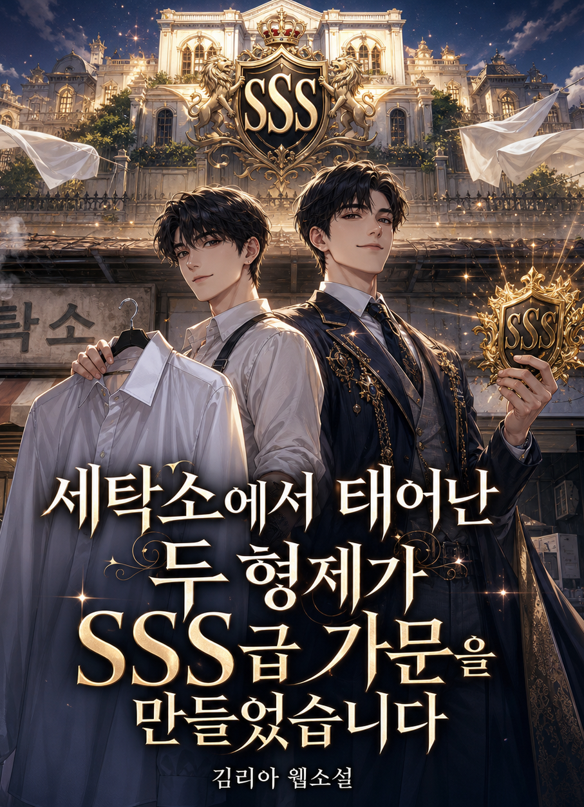

# 세탁소에서 태어난 두 형제가 SSS급 가문을 만들었습니다
**Date:** 2026. 6. 6. 16:53
**Category:** 행운과 재능
**Original URL:** https://blog.naver.com/xpfkwh56/224307867904
---

​

1. 우리는 보통 적을 없애야 할 것으로 여긴다. 경쟁자가 사라지면 시장을 독차지하고, 더 편하게 더 많이 벌 수 있을 것 같다. 그래서 많은 기업이 경쟁자를 짓밟거나 인수하거나 고사시키려 한다.

​

그런데 기업의 역사를 관찰하면 다른 내용이 보인다. 가장 강한 회사 옆에는 거의 언제나 가장 강한 라이벌이 있었다는 것이다. 코카콜라 옆엔 펩시가, 맥도날드 옆엔 버거킹이, 그리고 아디다스 옆엔 푸마가 있었다.

​

그 라이벌은 서로를 잠 못 들게 만들었고, 바로 그 잠을 이룰 수 없는 불면이 양쪽을 세계적인 기업으로 키웠다.

​

적이 나를 죽이려 달려드는 그 압박이, 역설적으로 나를 가장 빠르게 성장시킨 엔진이었던 것이다.

​

한 어머니의 세탁소에서 함께 시작한 두 형제가 있었다. 이 형제는 강 하나를 사이에 두고 60년간 서로를 적으로 삼아 두 개의 제국을 세웠다.

​

**2. 한 세탁소에서 시작된 두 제국**

​

독일 바이에른의 작은 마을 헤르초게나우라흐. 인구 몇만의 이 시골 마을에, 신발공장에서 일하는 아버지와 세탁소를 하는 어머니 밑에서 네 남매가 자랐다. 그중 셋째 루돌프(루디)와 넷째 아돌프(아디)의 사이가 유독 각별했다.

​

성격은 정반대였다. 형 루디는 외향적이고 말솜씨가 좋은 타고난 영업가였고, 동생 아디는 과묵하고 손재주가 뛰어난 기술자였다. 그래서 둘은 완벽한 한 쌍처럼 보였다.

​

1924년, 형제는 의기투합해 어머니의 세탁소 부엌에서 '다슬러 형제 신발공장'을 세웠다. 밤새워 동생이 만들면, 형이 나가서 목숨을 걸고 팔았다.

​

이 환상의 조합은 곧 빛을 봤다. 스포츠를 좋아하던 동생 아디는 선수들이 달리다 멈출 때 발이 미끄러지는 문제에 주목해, 밑창에 징을 박은 스파이크화를 개발했다.

​

1928년 암스테르담 올림픽에서 한 선수가 이 신발을 신고 세계신기록으로 금메달을 땄다. 1936년 베를린 올림픽에서는 전설적인 육상 선수 제시 오언스가 다슬러의 신발을 신고 4관왕에 올랐다.

​

최고는 항상 최고를 찾는 법이다. 형제의 신발은 세계 최고의 운동선수들이 신는 물건이 됐다. 모든 것이 완벽해 보였다.

​

그러나 전쟁이 모든 것을 바꿨다. 제2차 세계대전을 거치며 형제 사이엔 오해와 앙금이 쌓였다. 사업의 주도권 다툼, 정치적 입장 차이, 그리고 결정적으로 서로를 향한 깊은 불신이 겹쳤다.

​

전쟁 막바지엔 형이 동생을 나치 협력자로 미군에 밀고하는 일까지 벌어졌다. 형은 동생이 나치라고 했고, 동생은 형이 나치라고 했다.

​

돈 때문이야? 너가 어떻게 나한테 이럴 수 있어? 누가 할 말인데? 어차피 못 팔면 재고로 남을 뿐인데, 누구 덕에 이 회사가 성공한 것 같아? 애초에 내 물건은 워낙 좋아서 누구나 팔 수 있는데?

​

형제는 끝도 모르고 서로를 증오했다.

​

1948년, 형제는 끝내 회사를 둘로 쪼갰다. 그리고 직원들에게 통보했다.

​

" 누구를 따를 것인지, 각자 알아서 결정하세요. "

​

직원들은 이혼하는 부모님을 보는 자식 같은 느낌이었을 것이다.

​

동생 아디는 자기 애칭 '아디'와 성 '다슬러'를 합쳐 아디다스(adidas)라는 이름을 지었다. 형 루디는 자신의 회사를 푸마(PUMA)라고 불렀다. 다슬러 형제 신발공장이란 이름은 흔적도 찾을 수 없었다.

​

한 핏줄에서, 세계 스포츠 시장을 양분할 두 거인이 동시에 태어난 순간이었다.

​

**3. 제국의 분열**

​

형제의 싸움은 두 사람만의 일로 끝나지 않았다. 마을 전체가 둘로 쪼개졌다.

​

동생의 아디다스 공장은 마을을 가로지르는 작은 강의 북쪽에, 형의 푸마 공장은 남쪽에 자리 잡았다. 그리고 이 두 회사는 마을 최대의 고용주였다. 즉, 마을 사람 대부분이 둘 중 한 곳에서 일했고, 따라서 모두가 둘 중 한 편에 속할 수밖에 없었다. 마을은 '아디파'와 '루디파'로 갈렸다.

​

그 갈라짐은 증오를 낳았다. 사람들은 반대편 회사 직원과 말을 섞지 않았다. 빵집도, 술집도, 정육점도 어느 편인지에 따라 나뉘었다. 푸마 사람은 푸마 단골 술집에만 가고, 아디다스 사람은 아디다스 술집에만 갔다. 결혼도 같은 편끼리만 했다. 마을 축구팀마저 둘로 쪼개졌다.

​

축구 경기조차 단순한 스포츠가 아니었다. 두 형제의 대리전이었다.

​

마을 사람들은 길에서 누군가를 만나면, 먼저 상대의 발을 내려다봤다. 저 사람이 신은 게 아디다스인가 푸마인가. 그것을 확인한 뒤에야 인사를 건넬지 말지를 정했다.

​

그래서 이 마을엔 고개 숙인 사람들의 마을(town of bent necks ) 이라는 별명까지 붙었다. 사람들은 이 작은 독일 마을을, 둘로 갈라진 동독과 서독, 혹은 베를린 장벽의 축소판이라고 불렀다.

​

역설적으로 이런 지독한 증오가, 두 회사를 멈추지 않게 만들었다. 강 건너에 있는 게 모르는 경쟁사가 아니라 미워하는 형제였기에, 둘은 결코 질 수 없었다. 푸마가 신제품을 내면 아디다스는 잠을 못 잤고, 아디다스가 올림픽을 잡으면 푸마는 이를 갈았다.

​

스포츠 스타가 아디다스의 광고 모델이 되면 푸마는 몇 배나 되는 돈을 더 주고, 빼앗아 왔다. 어설픈 스타가 나오면 훨씬 많은 자본으로 유소년 스타를 육성 시켰다.

​

이 경쟁은 스포츠 마케팅의 역사를 새로 썼다. 선수에게 돈을 주고 자사 신발을 신기는 '스폰서십' 이라는 개념을 사실상 이 두 회사가 치고받으며 만들어낸다.

​

월드컵 결승전 무대에서, 올림픽 트랙에서, 두 형제의 신발은 대리전을 치렀다.

​

만약 다슬러 형제가 사이좋게 한 회사를 유지했다면, 과연 그렇게까지 필사적으로 혁신했을까. 아마 아니었을 것이다. 미움이라는 연료가 없었다면, 세계는 아디다스도 푸마도 지금의 모습으로는 갖지 못했을지 모른다. 적이 둘을 키운 것이다.

​

4. 형제는 끝내 살아생전 화해하지 못했다. 두 사람은 같은 마을 공동묘지에 묻혔는데, 그 묘조차 서로 가장 멀리 떨어진 양 끝에 자리 잡았다. 죽어서도 가까이 하기 싫다는 듯 말이다.

​

2009년, 두 회사가 갈라선 지 60여 년이 지난 어느 날. '세계 평화의 날'을 맞아, 아디다스와 푸마의 직원들이 함께 친선 축구 경기를 열었다.

​

강 북쪽과 남쪽의 사람들이, 평생 발끝을 확인하며 인사 여부를 정하던 그 사람들이, 한 운동장에서 같은 공을 찼다.

​

흥미롭게도 그날 경기에서는 팀을 회사별로 나누지 않았다. 아디다스 직원과 푸마 직원을 일부러 섞어 두 팀을 만들었다. 60년의 분단을 푸는 데 필요한 건, 거창한 협정이 아니라 여가 활동에 불과했다. 서로 함께 할 수 있는.

​

코카콜라와 펩시는 100년이 넘도록 단 하루도 쉬지 않고 싸우고 있다.

​

그러나 그 둘 역시 서로를 죽이지는 못했고, 죽일 생각도 없다. 펩시가 없는 코카콜라, 코카콜라가 없는 펩시는 오히려 더 약해질 것이기 때문이다. 상대가 끊임없이 긴장시켜주는 덕에 둘 다 게을러지지 않는다.

​

라이벌은 거울이다. 내가 어디까지 왔고 어디서 멈췄는지를, 적이 가장 정확하게 비춰준다.

​

5. 다슬러 형제의 이야기는 두 가지를 동시에 말해준다.

​

하나는 증오에 관한 것이다. 한때 가장 가까웠던 형제가, 가장 완벽한 한 쌍이었던 두 사람이, 오해와 자존심 때문에 평생 등을 돌렸다는 것.

​

화해하는 데 60년이 걸렸고, 정작 당사자인 형제는 그 화해를 보지 못하고 떠났다는 것. 그 증오가 둘 만의 문제로 끝난 것도 아니라는 것. 사람 사이의 금은 한번 가면 메우는 데 평생이 걸린다. 한 배에서 나고 자란 두 형제가 그리 살았다는 것은, 어머니로서는 상당히 슬픈 일이었을 것이다.

​

다른 하나는 희망에 관한 것이다. 그 지독한 경쟁이, 결과적으로 양쪽 모두를 세계 최고로 만들었다는 것. 강 건너의 적이 있었기에 둘 다 멈추지 않았다는 것.

​

두 형제 간의 승자는 끝내 가려지지 않았지만, 덕분에 인류는 혁신을 경험할 수 있었다. 우리는 흔히 경쟁자가 없는 편안한 자리를 원하지만, 종종 우리를 가장 성장시키는 건 우리를 가장 긴장시키는 상대다.

​

여기서 우리는 질문을 바꾸어 볼 수 있다. 내 강 건너편에는 누가 있는가. 나를 잠 못 들게 하는 그 사람, 그 존재는 정말 없애야 할 적인가, 아니면 나를 멈추지 않게 해주는 가장 좋은 명분인가.

​

미움은 사람을 갈라놓지만, 경쟁은 사람을 키운다.

​

우리에게 필요한 것은 같은 것을 같게, 다른 것을 다르게, 그 둘을 구분할 줄 아는 지혜라고 생각한다. 어쩌면 그게 증오와 분노로부터 우리가 배울 수 있는 단 하나의 지혜일 것이다. 아이다스와 퓨마, 두 본사는 지금도 걸어서 갈 수 있는 거리, 약 1km 남짓 떨어져 같은 마을 안에 마주 보고 있다. 가장 먼 창업자의 무덤과 마찬가지로.