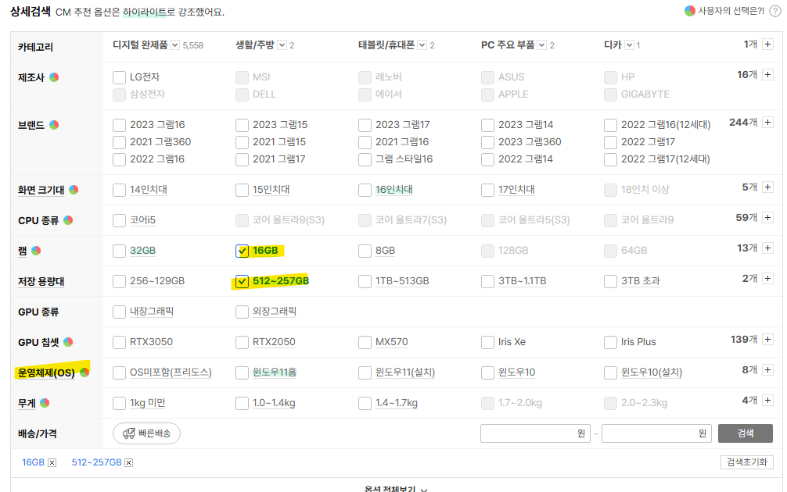
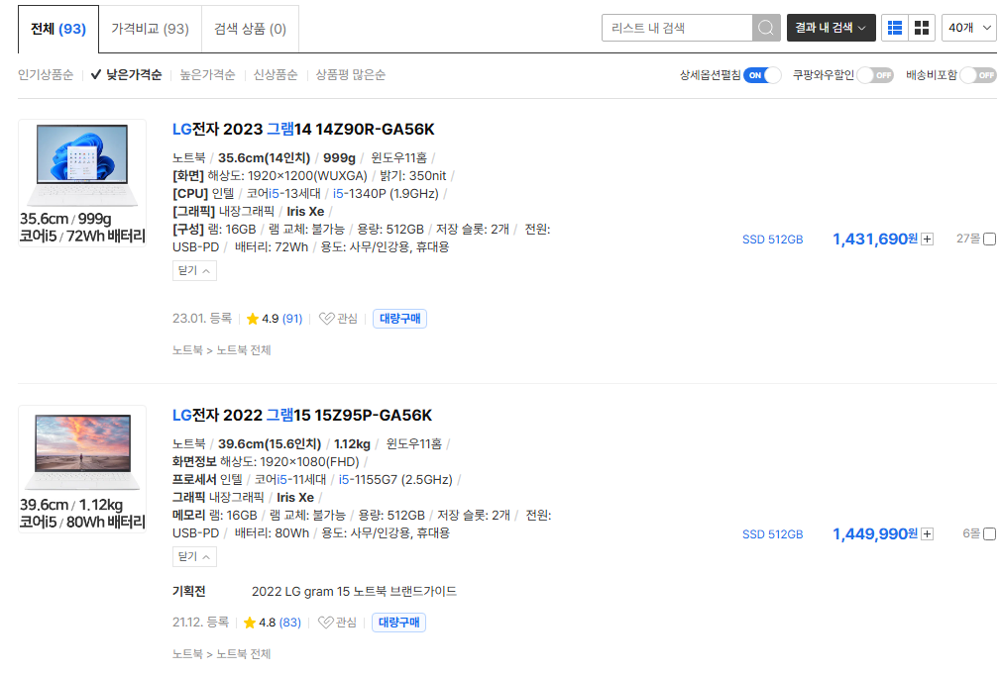
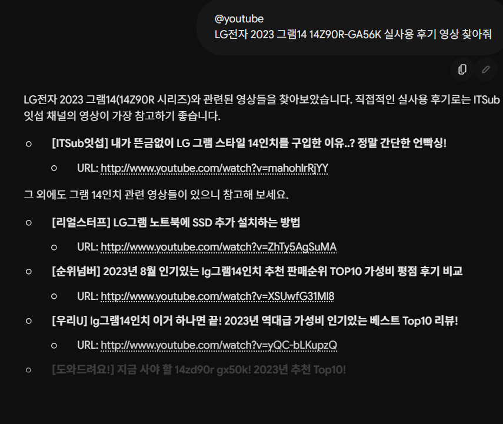
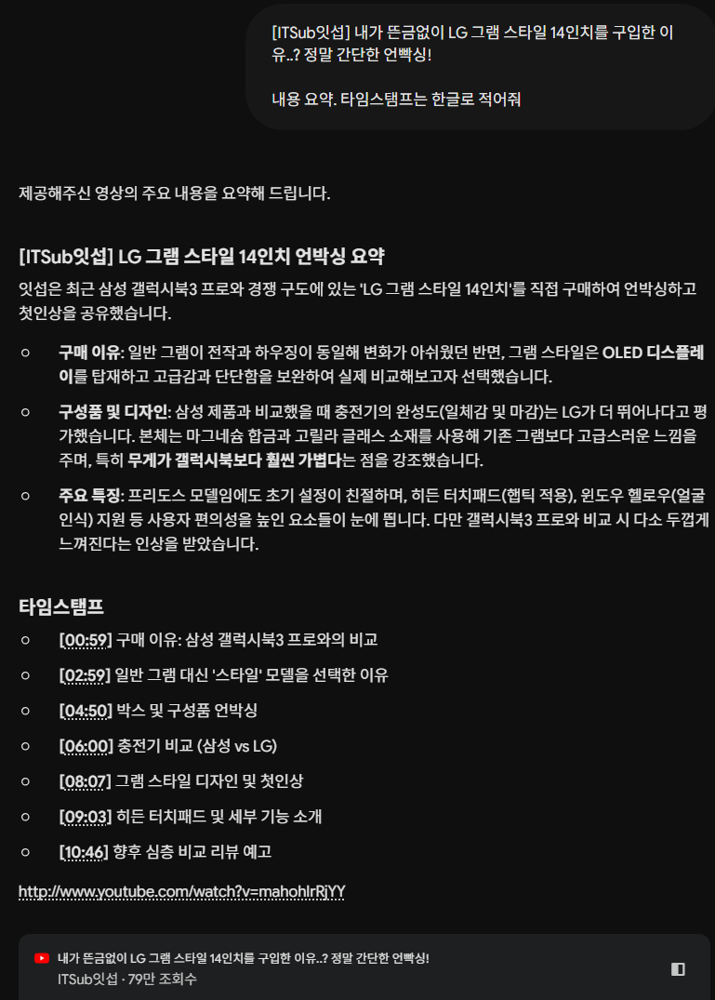
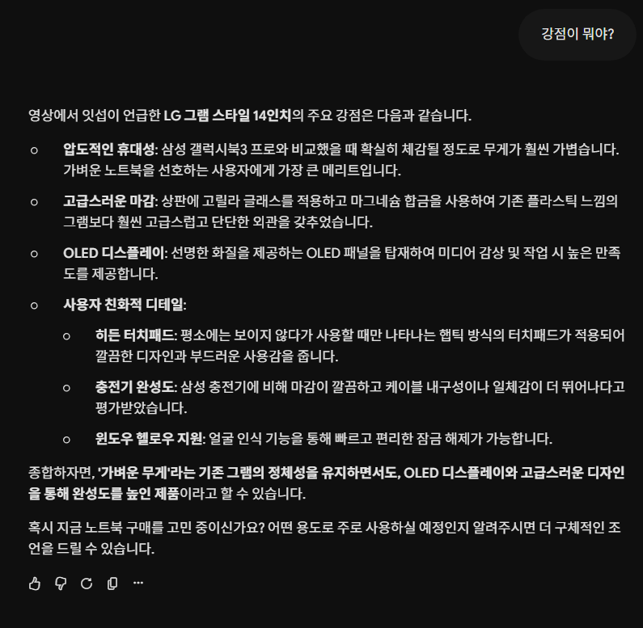
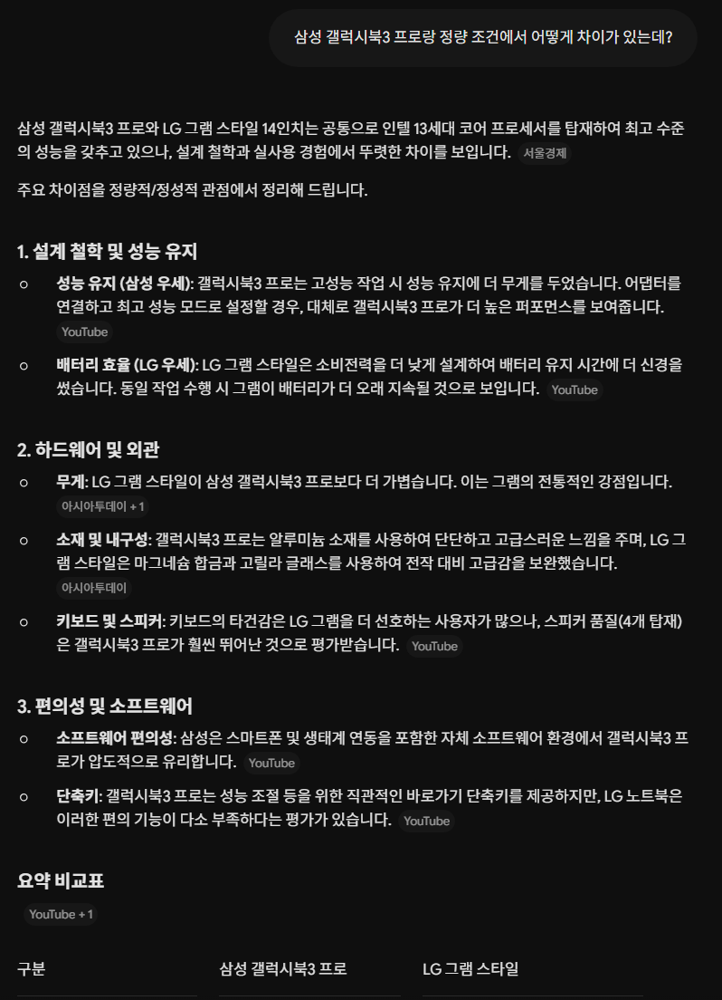

# 사무용 노트북, AI 노트북 추천해 주세요
**Date:** 2026. 6. 11. 23:07
**Category:** AI 활용
**Original URL:** https://blog.naver.com/xpfkwh56/224313289058
---

**1. AI 워크스테이션 겸용 노트북**

**​**

없습니다

​

데탑 말고는 실사용 면에서

제대로 성능을 낼 수가 없어요

​

2. 그냥 쓰기 좋은 사무용 노트북은?

​

**\* 애플은 특수성이 있어서 제외합니다**

​

1) 자주 들고 다니면 되는가?

아니면 **'최소한'** 의 이동만 되면?

​

출퇴근, 통학 등, 자주 들고 다닌다

​

**→ 그램**

​

집에다 놔두고 쓴다, 데탑은 공간을

많이 차지해서 부담스럽게 느껴진다

​

**→ 한성**

​

중국 제품이나, 특화 브랜드 찾으면

가격이 더 떨어지긴 하는데 대부분은

​

편의성 때문에 저 둘이 제일 낫습니다

​

만약 가격적으로 메리트를 얻고 싶으면

차라리 **중고, 리퍼** 제품을 알아봄을 권함

​

가격이 많이 빠집니다

​

2) 책상 크기가 큰가? 작은가?

작업 공간과 환경이 넓나? 좁나?

​

**작다 → 작은 인치**

**크다** **→ 큰 인치**

**​**

3) 성능은 어떤 것을 사야 하는가?

​

**노트북으로 최신 AI 작업은 불가능 하다**

**있으면 있는대로 쓰는 것 정도가 가능함**

​

즉, AI 를 돌리겠다 가 아니라

​

내 사양 안에서 돌아간다면

**그걸 찾아서 사용한다** 가 빠름

​

사무용 기준

​

cpu i5 이상

ram 16gb 이상

ssd 512gb 이상

​

주식 거래, 사무 작업 다 문제 X

​

**가끔 게임을 하는데?**

​

현재 나온 최고 사양 게임용 보다

2세대 빠지는 것을 구매하면 충분

​

경우에 따라, 본인 취향이 특이하면

그거에 맞게 조율해서 사용하면 됨

​

**3. 구입은 어떻게 하나?**

​

​

다나와 접속

​

​

제품명 체크 하고,

​

​

제미나이 인텔리전트 기능 활용

​

​

그렇다고 합니다

​

​

도란도란

​

​

이야기 하면 제미나이가 도와줍니다