# 제미나이를 활용해서 공문서 PDF 읽고 관리하기
**Date:** 2026. 6. 11. 11:14
**Category:** AI 활용
**Original URL:** https://blog.naver.com/xpfkwh56/224312610153
---

​

1. 클릭

​

​

2. 클릭

​

[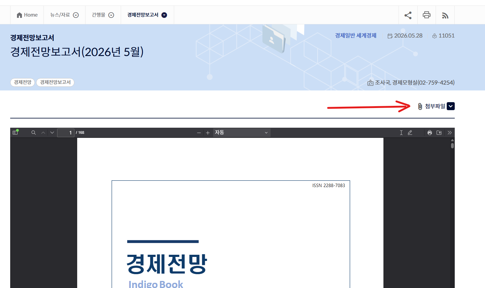](#)

​

3. 클릭

​

[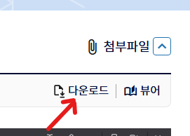](#)

​

4. 클릭

​

[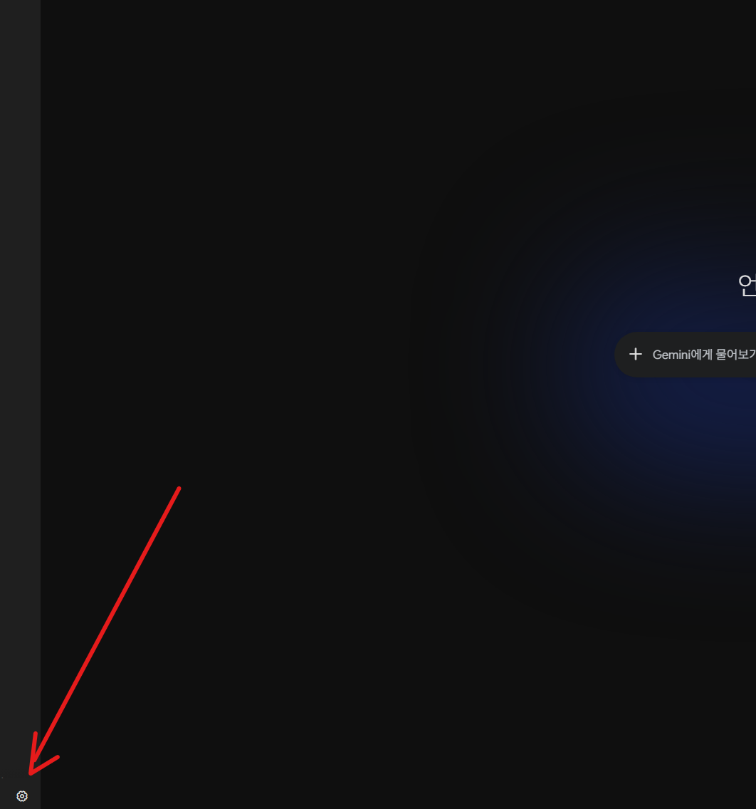](#)

​

5. 클릭

​

[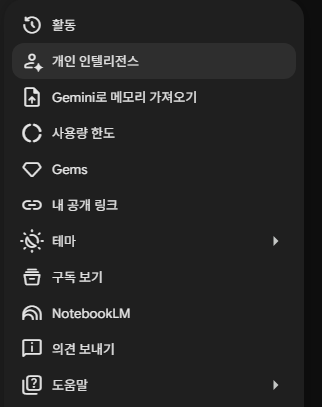](#)

​

6. 개인 인텔리전스 클릭

​

[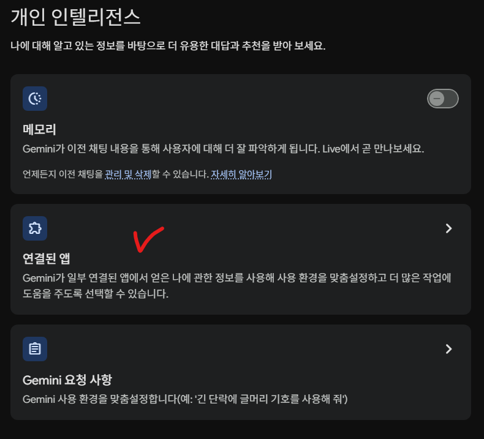](#)

​

7. 연결된 앱 클릭

​

시스템 프롬프트, 메모리는

**'충분히'** 익숙해지면 씁시다

​

[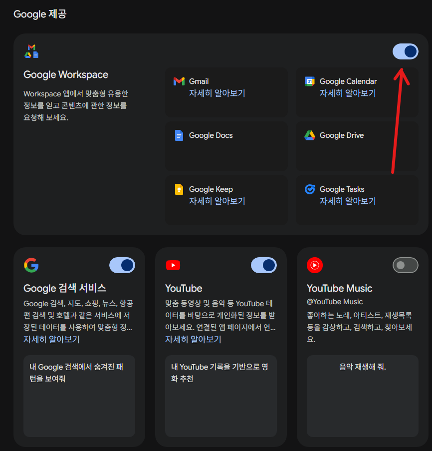](#)

​

8. 켜져있나 확인

​

[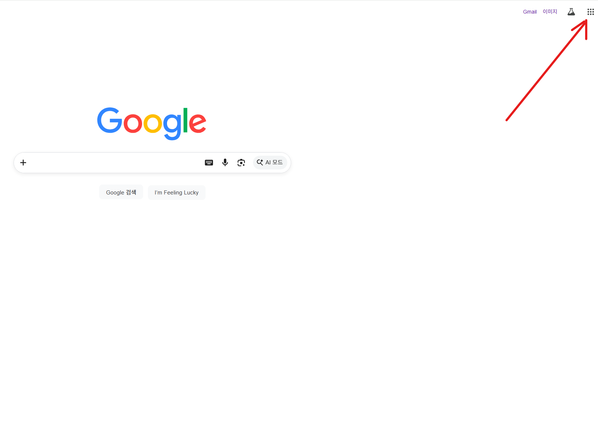](#)

​

9. 클릭

​

​

10. 드라이브 클릭

​

[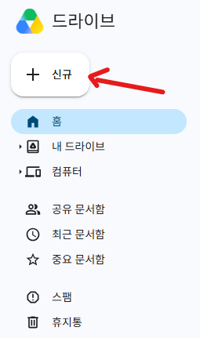](#)

​

11. 11시 방향 제일 끝에 신규 클릭

​

[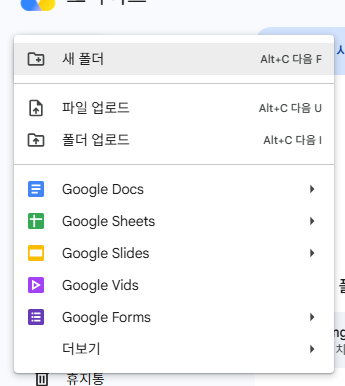](#)

​

12. 파일 업로드 클릭

​

[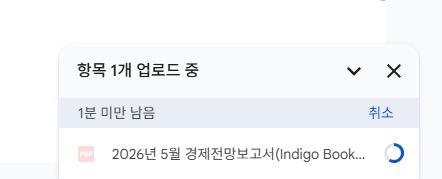](#)

​

13. 5시 방향을 보면

​

[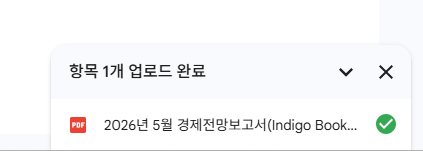](#)

​

업로드가 다 되면 이렇게 나옴

​

[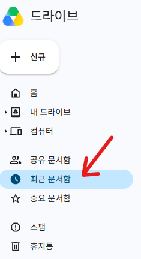](#)

​

14. 최근 문서함 클릭

​

[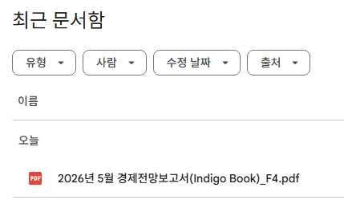](#)

​

15. 들어간 것 확인

​

[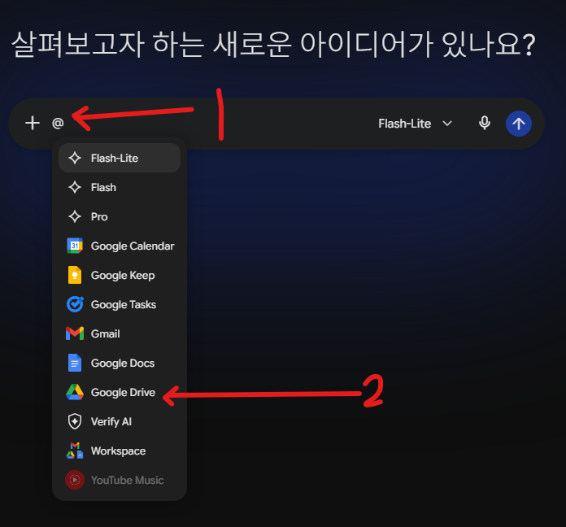](#)

​

16. 대화창에 '@' 입력

​

​

17. 구글 드라이브 클릭

​

직접 타이핑 해도 됩니다

​

[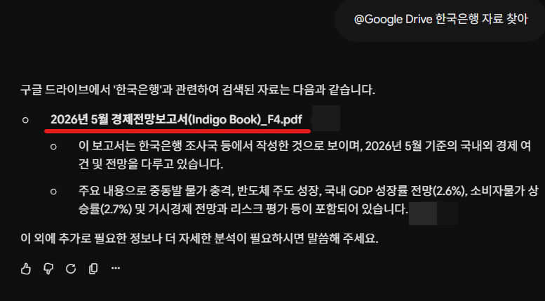](#)

​

18. 확인

​

[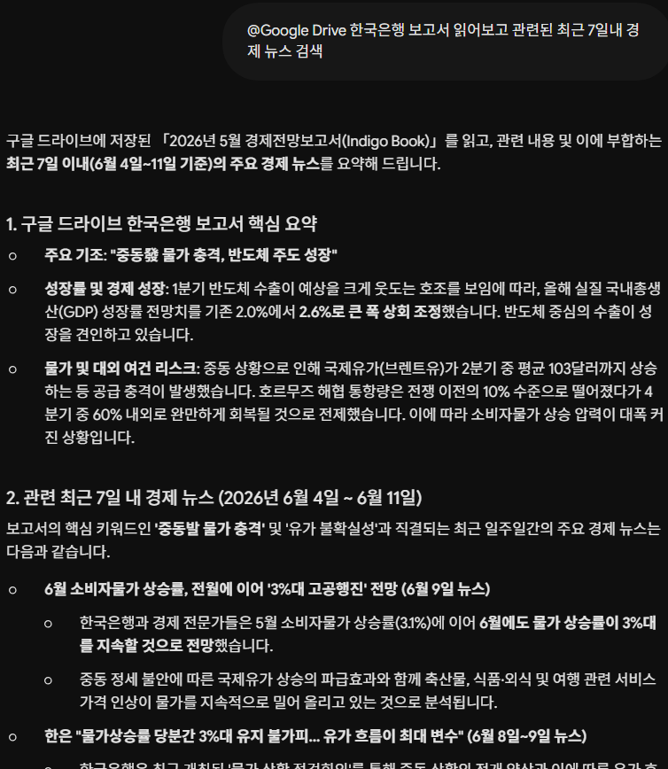](#)

​

19. 내가 갖고 있는 자료 기반으로 뉴스 찾기

​

​

20. 구글드라이브 + 뉴스검색 + 유튜브 검색

​

[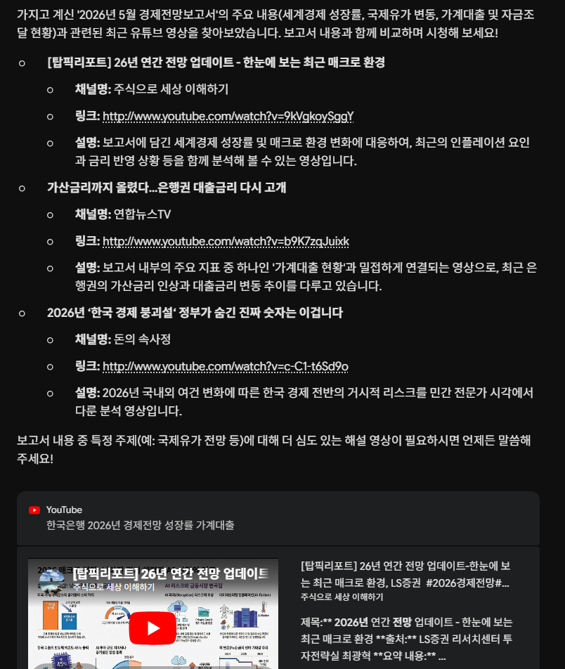](#)

​

21. 결과 확인

​

[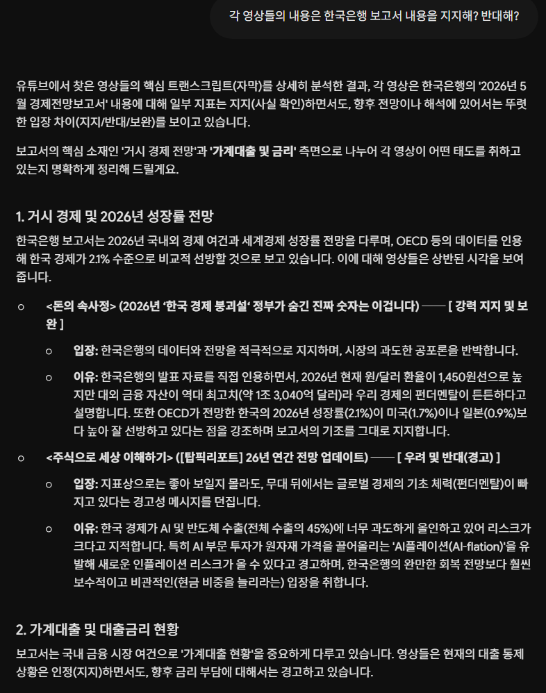](#)

​

22. 이제 하고 싶은 얘기 하면 됨

​

23. 페이지가 짧다 = 라이트

페이지가 많다 = 플래시

내용이 매우 방대하다 = 프로

​

​

24. 적절한 예시를 못 찾겠어서

그냥 적당한 이미지를 가져왔음

​

변환이 중요한 것이 아니고,

​

PDF 를 읽히는 것이 중요한 것이니

헷갈리시면 그건 스킵하셔도 무관함

​

[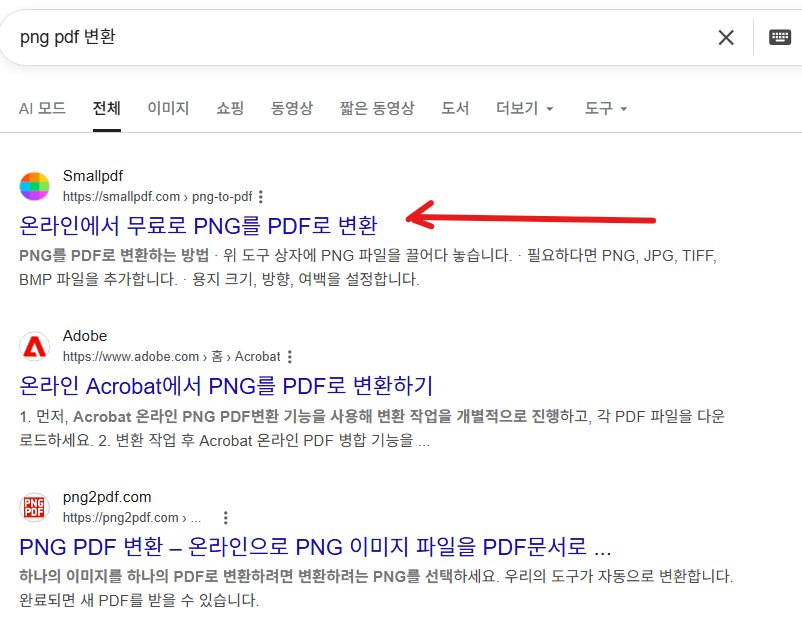](#)

​

25. 클릭

​

[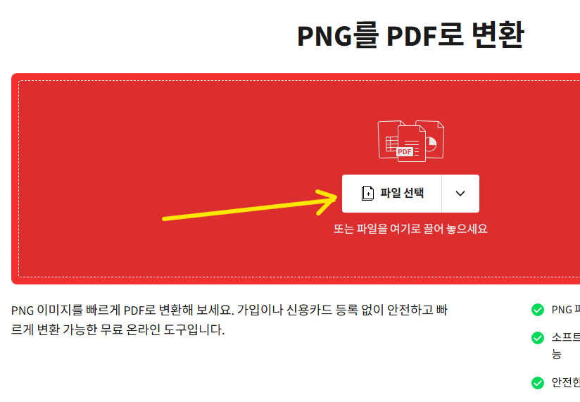](#)

​

26. 클릭

​

[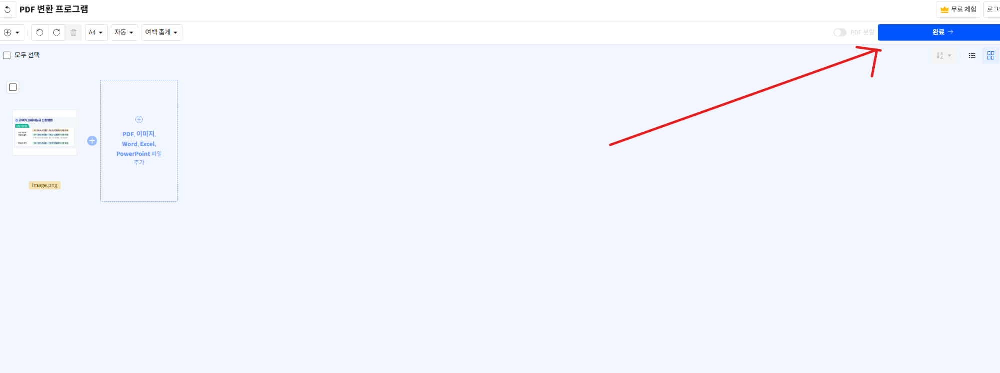](#)

​

27. 클릭

​

[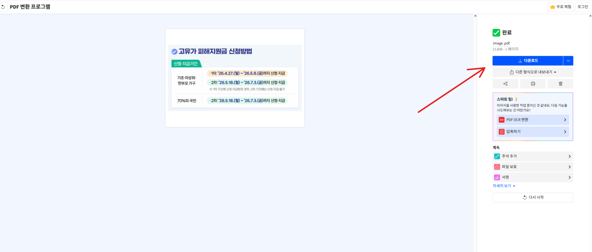](#)

​

28. 클릭

​

[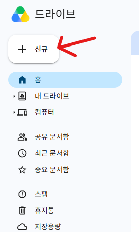](#)

​

29. 드라이브 들어가서 파일 넣고

​

[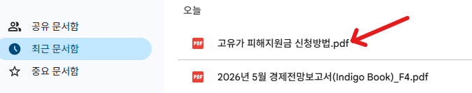](#)

​

30. 미리 파일 이름을 바꾸거나,

아니면 여기서 오른쪽버튼 눌러서

​

[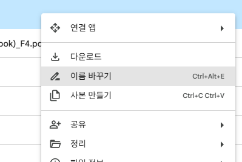](#)

​

이름 바꾸기 누르고 변경

​

[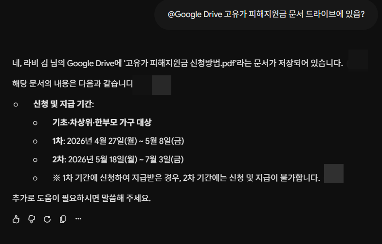](#)

​

31. 확인

​

​

32. 들어간 것 확인 했으니까 새로 켜고,

​

[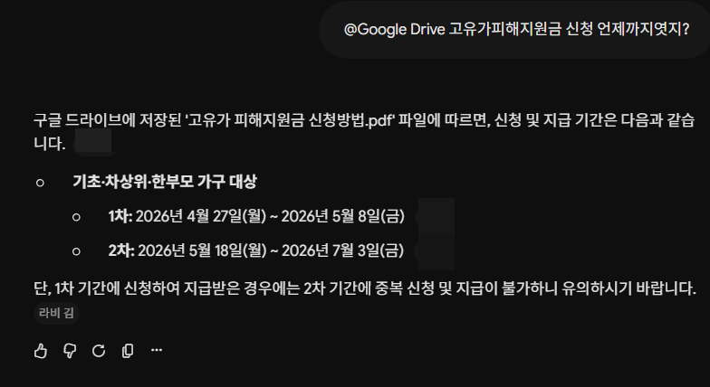](#)

​

33. 비서로 부리면 됨