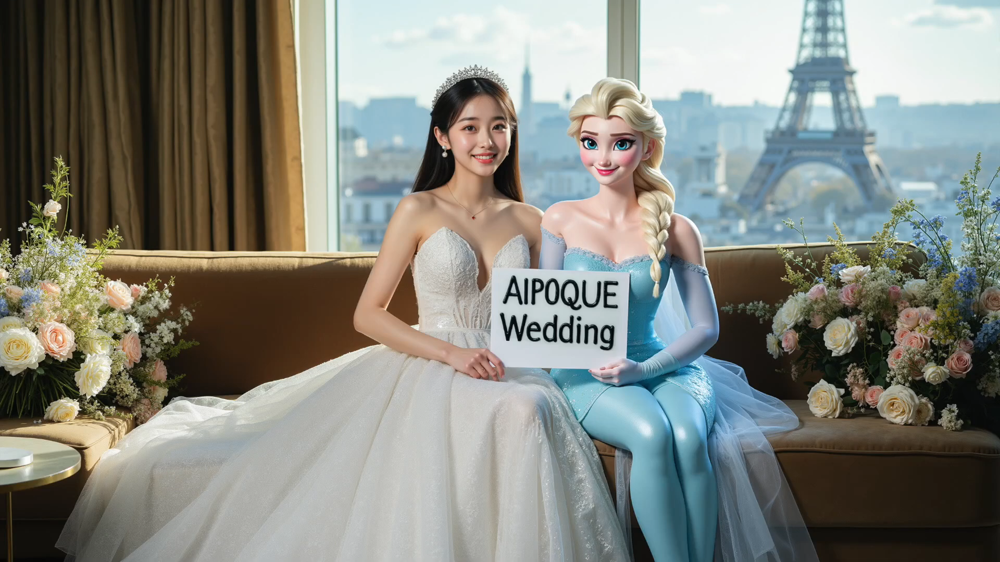
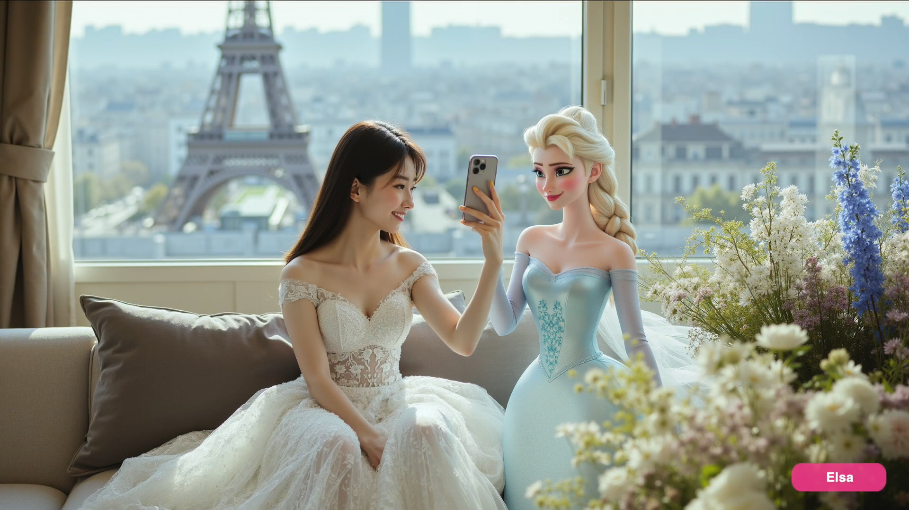
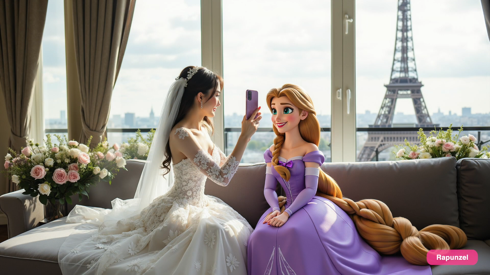
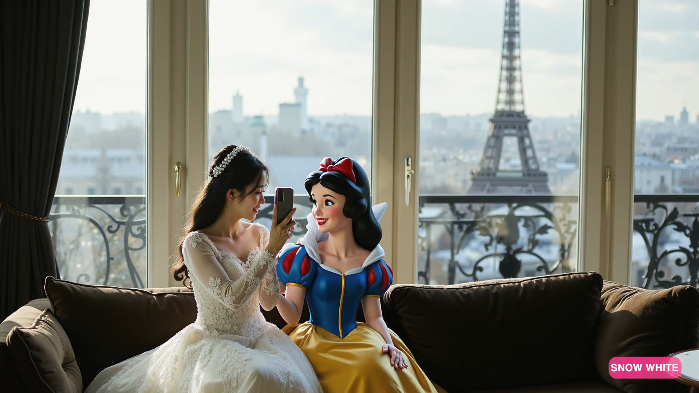
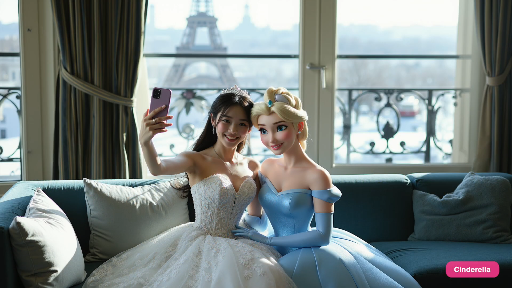

# 아이 사진 찍어둔 걸로 이미지 양산하기
**Date:** 2026. 6. 13. 15:28
**Category:** AI 활용
**Original URL:** https://blog.naver.com/xpfkwh56/224314815019
---

<https://youtu.be/FiRaWNUoJrM?si=KbdANk_UAfciERV2>

​

**1. 로라가 뭐임?**

​

모델, 체크포인트, 로라

이렇게 3개가 있는데

​

이미지 모델에 동양인 계열

체크포인트 설정을 하고,

​

로라를 씌우면 그 **'화풍'** 으로

고정해서 이미지 뽑을 수 있음

​

2. 즉, 장원영 로라가 있으면

​

이미지를 만들 때마다 모든 사람을

다 장원영으로 뽑아내는 것이 가능

**​**

**\* 이론상**

​

3. 아이 사진 2-30장 구한 다음에,

​

코랩 사용해서 로라를 만들고

​

<https://youtu.be/C8uEhp822BI?si=CJ9hVk8BESnTBGfv>

​

스테이블디퓨전 WebUI 라는 걸 쓰면

​

내 컴퓨터 GPU 성능에 관계없이

아주 좋은 퀄리티는 아니겠지만,

​

일단 내가 **'그림'** 을 만들어볼 수 있음

​

구글 무료 코랩 성능이

그럼 어느정돈데?

​

**4090** 정도 성능임

​

**단점** 은 셋방 사는 것이라서

작업하다가 서버 끊길 수 있음

​

4. 이거 딥페도 가능하겠는데요?

​

실제로 맞는 말 임

​

근데 적어도 현재 기술에 의하면

아무나 할 수 있는 것 까지는 아니고

​

본인이 장인정신 갖고 깎으면 가능

​

**5. 로라는 얼굴만 되는 건가요?**

​

아뇨, 화풍을 **'과적합'** 시켜서

고정된 하나만 뽑게 하는 거라서

​

내가 원하는 **'것'** 이면 다 가능함

​

손가락 로라, 머리카락 로라, 물 로라,

빛 로라, 게임 아이콘 로라 등등

​

**'금형'** 이랑 다를 바가 없기 때문에

종일 저거만 깎아서 파는 사람도 있음

​

**다른 것도 해볼 수 있나요?**

**​**

https://youtu.be/ZMjOnw4pF0s?si=a3QrZKe7fOJxT77F

​

강의 보고 따라하시면 이런 것도 가능