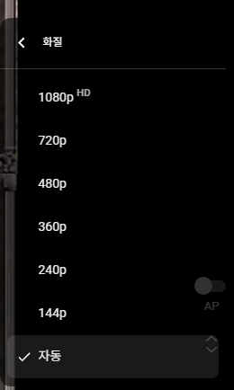

# 부지와 무지, 그리고 미지
**Date:** 2026. 6. 15. 14:18
**Category:** 일기장
**Original URL:** https://blog.naver.com/xpfkwh56/224316454603
---

1. 내가 가장 두려워하는 것은 두 가지다

​

1) 가난

2) **'모름'**

​

나는 100억, 1000억이 있을 때

얼마나 인생이 행복해지는지 **모른다**

​

하지만 사람 주머니에 단 돈 1만원이 없고

5만원이 없을 때 무슨 일이 발생하는지는

​

남부럽지 않게 **'정확히'** 이해하고 있다

​

가난과 결핍은 일상의 어느 한 부분을

지독할 정도로 집요하게 갉아먹기도 하고,

​

딱 1번의 안정권까지 올라오는 일,

그 일은 **'매우'** 운이 좋아야 가능하다

​

재밌는 점은, 한 번 튕겨 올라온 시점에는

자신이 **'가난'** 했다는 것을**'잊는단'** 것이다

​

나는 내가 살아왔던 것, 살아온 과정을

가능한 잊지 않으려고 노력하는 편이다

​

그럼에도 불구하고, 정말 **'기억이 안 난다'**

​

​

나한테 1천만원, 1억이 없어가지고

내 인생의 해상도가 144p 였던 기억이

​

어땠는지 까마득할 정도로 기억이 안 난다

​

**'자동'** 이라는 글자 위에,

144p 라는 버튼이 있고,

​

**'누군가들은 여전히 저 버튼이'**,

**'자동'** 으로 설정되었다는 정도

​

그리고 앞으로 내가 저걸 내 의지로

누를 일이 없다는 것 정도만 알 뿐이다

​

144p 위에 있는 모든 버튼들이

회색으로 **비활성화** 되는 상황,

​

심지어 144p 버튼 조차도

누를 수 없게 될 수 있음을 알면

​

토탈 이클립스

​

나는 그게 몸서리 쳐질 정도로 **무섭다**

​

**2. 부지와 무지**

​

무지는 부지(unknown unknowns)의 부분집합이다

​

모른다는 것은 그냥 지금 모르는 것이 있고,

내가 무엇을 모른다는 것조차 모르는 모름이 있다

​

나는 내가 무엇을 모르는지 모르기 때문에,

지금 내가 무엇을 모르는지 알 수가 없다

​

​

내가 말할 수 없는 것에 대해서 말을 하란 것은,

필연적으로 논리적 모순을 갖게 되기 때문이다

​

많은 투자자, 창업자, 그리고 돈을 만지는 사람들은

**'정보'** 의 가치를 **'무궁'** 하게 보는 경향이 아주 크다

​

**왜 why?**

​

무지는 내가 **'대가리 박으면 된다'**

​

하지만 부지는 아닌 말로다가

**'모르면 맞아야지'** 뿐이다

​

이게 닿는 것은 **'전적으로'** 운 이라서,

모르면 죽을 때까지 모르고 살아야 된다

​

**\* 듣는다고 알게 되는 것도 아님**

**​**

단어 1개, 발상 1번, 고작 아이디어 레벨의

작은 가능성이 어떤 경우에는 그 **'끝'** 까지를

이끌어내는 모든 것이 되는 경우도 자주 있고

​

더 높은 확률로, 자기 자신이

**'그 한 줄'** 로 현재 자신이 이룬

모든 것을 설명하게 되는 일이

​

**'굉장히'** 자주 나타나기 때문이다

​

**\* 바꿔 말하면, 호환성이 달라서**

**말하는 입장과 듣는 입장 싱크 다름**

​

무엇을 해야 하죠?

**많이, 오래, 생각해서 해야 된다**

​

듣는 입장에서는 부처님 대갈통 닦는

소리처럼 들리는 것이 **'당연'** 하지만

​

지난 뒤 내 입장에서 만약 저걸 내가 **'미리'**

알 수 있었다면 1년치 수명 쯤은 아깝지 않다

​

디테일은 여기에 있다,

​

**'내 입장에서'**

​

부지에서 일군 사람이 아는 부지와

미처 그 단계에 닿지 않은 사람의 부지는

​

**값이 다르다**

​

즉, 신경 시냅스에도 **'복리'** 가 붙는다

​

3. 내가 무엇을 모른다는 걸 알았으면

그 다음은 이제 **무지의 해소** 로 가게 된다

​

방구석에만 앉아있어도, 세계적인 석학들,

저명한 연구자들이 티스푼 하나를 들고

​

인류사의 지성 지평을 넓히는 과정을

실시간으로 얼마든 관찰할 수 있다

​

내가 블로그에 글을 쓰면 보통 1-2천

많으면 만 단위도 넘어가는 일이 흔하다

​

네이버 홈판에 올라가는 특정 섹터 글들은

하루에 조회수가 **'30만, 50만'** 도 터진다

​

내가 최근에 봤던 ML 논문은 피인용 횟수,

그러니까 스크랩이 5 를 넘지 않는다

​

그 사람이 그 공부를 하고, 저 깨달음을 얻어

저렇게 연구해서 남겼는데 아마? 내 생각에는

**정말 많이 읽어봤자 500명 봤을까 모르겠다**

​

내가 오늘 **'밥 먹었음'** 이라는 한 줄만 써도

최소 1천명한테는 **'전달'** 되는데 말이다

​

사람들이 어리석어서 그런 것이 아니다,

볼 거리는 너무 많고 그건 분야를 막론한다

​

무지를 해소한다는 것은 선별한다는 것이고,

선별된 것을 내가 이해하고, **'안다는 것'** 이다

​

이건 불가피하게 **'시간'** 을 소요한다

​

1분에 400자를 **'눈'** 으로 읽는다 치고,

1분에 400자를 **'손'** 으로 친다고 쳐도,

​

1분에 400자를 **'말'** 로 한다고 쳐도,

​

물리적으로 **'발목 잡힌'**

저 숫자를 바꿀 수 없다

​

사람이면, 1분에 4000자를 못 읽는다

사람이면, 1분에 4000자를 못 쳐낸다

​

사람이면, 1분에 4000자를 못 말한다

​

어떤 한 분야에, 내가 **'담기기 위해서'**

필요한 시간을 넉넉히 10년이라고 치자

​

30살이면, 100살까지 영원에 가깝게

자신의 현명함을 유지할 수 있다손 쳐도

​

고작 딱 7개 영역 쯤이 **'물리적 한계'** 다

​

1살에 태어나서, 5살 무렵에 말 배우고

80살 쯤에 천명이 다해서 죽는다고 치면

​

마찬가지로 많아야 6-7개 영역 외에,

그 인간은 그걸 **'알고 죽을 수가 없다'**

​

세상에 이런 영역이 몇 개나 있을까?

​

나로서는 **'부지'** 의 영역이지만,

1천개는 무조건 넘는다고 확신한다

​

내게 주어진 것은 많아야 5개 남짓,

나는 죽을 때 까지 몇 개나 알고 죽을까

​

생각하면 시간이 **두려워진다**

​

4. 내가 모른다는 것을 모른 이후에,

내가 무엇을 모르는 것인지 알고 났으면

​

무지의 영역에서 **미지**의 저편이 보인다

​

**'지금은 없지만, 미래에 존재하는 것'**

​

지금은 당연하지 않지만, 먼 미래 안에서는

당연한 상식이 되고, 당연한 표준이 되는 것

​

모르면 몰라도, 알면 안 할 수가

알면 안 쓸 수가 없는 그 **'당연함'**

​

> 국경의 긴 터널을 빠져나오자, 눈의 고장이었다.
>
> 밤의 밑바닥이 하얘졌다.
>
> 설국

​

그 미지의 첫 발을, 내가 처음 뗀 특권은

미래를 본 사람이 갖는 의무로 바뀌게 된다

​

죽어간 다른 사람들이 그랬던 것처럼