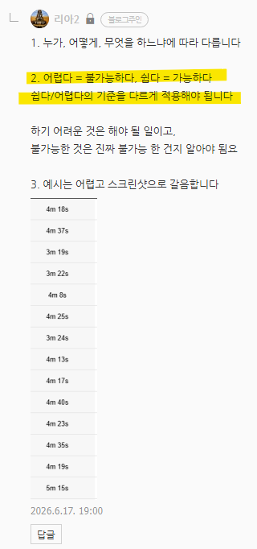

# 답변
**Date:** 2026. 6. 17. 19:01
**Category:** 일기장
**Original URL:** https://blog.naver.com/xpfkwh56/224319033721
---

​

1. 인간이 맨 몸으로 우주 가는 것 가능?

​

어려움 → 불가능함

​

2. 서울대 의대 가는 것 가능?

​

쉬움 → 가능하긴 함

​

3. 영생할 수 있음?

​

어려움

​

4. 100억 벌 수 있음?

​

쉬움

​

5. **'내가'** 가능하냐 를 앵커로 두면

대체로 야생에서 살아남기 쉽지 않음

​

6. 무슨 요령이 있는 것이 아닙니다

​

비밀스럽게 어디서 유출 문제집 구해서,

시험 문제 다 알고 답 외웠을 것이다 (x)

​

그냥 많이 열심히 했다 (o)

​

남들이 몰라서 안 하는 일로

경쟁력을 잡으려고 하면 피곤함

​

알아도 못 하는 일을 해야 됨

​

몰라서 할 수도 없는 부분도 있지만,

고런 것이 이제 정보 고 기술 이지요

​

**\* 이 분야는 3-4차 산업 임**

**​**

6월에 당장 나온 기술, 이제 3주도

안 찍었으니 이 분야는 무주공산이고

​

배울 것이 아니라 **'쌓을'**​ 영역 입니다

​

누가? 내가