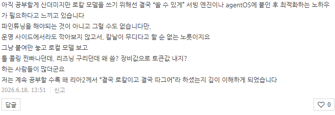

# 로칼
**Date:** 2026. 6. 18. 17:34
**Category:** 일기장
**Original URL:** https://blog.naver.com/xpfkwh56/224320037230
---

​

전 세계 인구 약 80억,

​

그 안에서 **'인공지능'** 이라는 것을

1번이라도 사용한 사람을 추리고

​

**\* 국내 GPT 일간 활성 사용자수 2천만 정도**

**가입자 기준으로 GPT 유료 사용자수 100만**

**​**

거기에서 로칼을 해봤던 사람 추리고,

깎아본 사람 추리고,

​

본인 파이프라인에 적용한 사람 추리면

**많아야** 10만명이나 나올까 모르겠음 ,,

​

제 뇌피셜이지만 국내 기준으로 본인이

**'모델'** 레벨로 만지는 사람 1만 명 안 됨

​

심지어 기업체, 연구소 소속도 아니고

집에서 혼자 가내 수공업으로 깎는다?

​

그거도 모자라서 **'내 도메인'**,

거기에 **'내 워크로드'** 라면?

​

**10명은 될까요?**

​

물어볼 이유도 없고, 찾아볼 이유도 없음

​

나는 5090 쓰는데, 6000 쓰는 사람이나

4090 쓰는 사람이 물어보면 할 말이 없음

​

**\* 브래지어랑 런닝구 만큼 다름**

​

나랑 토치가 다르면? **그냥 다른 외국어** 임

​

파이썬 버전 다르면? 패키지 다르면? ,,

서빙 채널이나 도구가 다르면? ,,

​

서양인 같이 생겼다고, 동양인 같이 생겼다고

다 묶어서 보는 모양새랑 똑같은 상황이 나옴

​

이 바닥은 **전문가** 가 없음

​

그게 **'가르치고 알려줄 수 없는'** 가장 큰 이유 임

​

1) 먼저 나랑 쓰임이 같을 리가 없고,

**​**

**\* 쓰는 당사자도 계속 바뀌는데?**

**​**

2) 내가 알려줄 정도로 배우고 나면,

유통기한 지나서 의미 없는 지식이 됨

​

한편, **'가르칠 정도로'** 배운다 라 ,,

조심스럽지만 불가능하지 않나 싶네요

​

찍먹이라도 해봤으면, 난 이걸 안다

라고 말을 할 용기를 갖기 **매우** 어려움