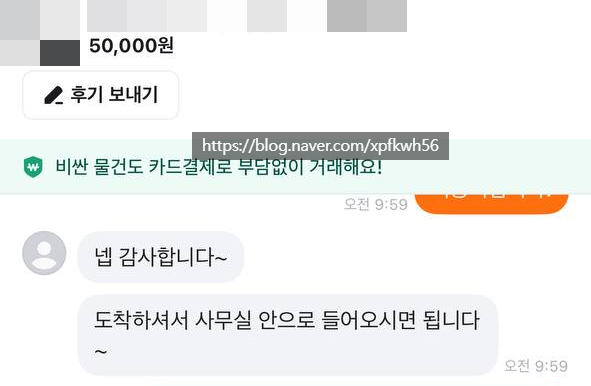
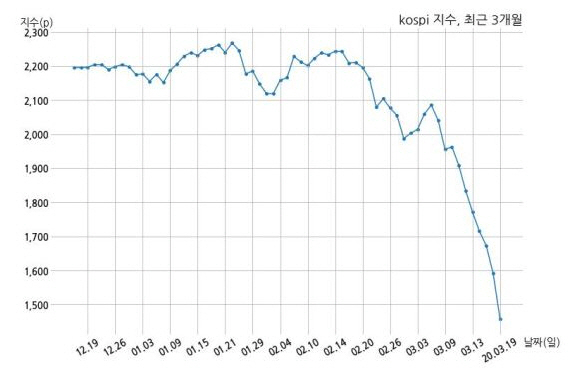

# 사업하는 남자 꼬시는 법
**Date:** 2026. 6. 24. 18:48
**Category:** 일기장
**Original URL:** https://blog.naver.com/xpfkwh56/224326050631
---

​

1. 집에 들어오면 애랑 좀 놀다가

바로 서재 박혀서 일 하러 감

​

**2. 여기서 일단 마음을 비워야 됨**

​

3. 담배 피러 나가거나,

잠깐 다른 일 하러 자리 비우면

​

애기 보고 내 할 일 하다가,

들어가서 간단히 치울 것 치우고

​

**\* 눈치껏**

​

클라우드로 연결된 작업 자료 보고,

​

오늘 이런 일이 있었군

이런 판단이 필요하군

이게 관심사군 파악

​

4. 책상 위에 미니 냉장고 있었는데,

냉장고 안에 보관을 안 하고 밖에 둠

​

**흠?**

​

1) 굳이 꺼내둔 이유가 뭘까?

2) 지금 어떤 불편이 있지?

​

무수리 ON

​

5. 냉장고를 바꿔줘야겠다고 판단

딱히 문제가 있는 건 아닌 것 같으니,

​

기존에 쓰던 작은 용량은 아기방으로,

그리고 리터를 키워서 서재에 두기로 함

​

6. 정가로 찾으면 최소 20만 스타트

하얀 고시원 냉장고 8만원

​

컴프레셔 이슈 있을 수 있고, 많지만

유지보수, 관리 측면에서 감안하면

​

감가율이 그렇게 부당한 것 같진 않음

​

7. 예산 범위는 10만원 이하로 결정

​

**'보이는 것'** 감안하면 그냥 냉장고보다

쇼케이스 형태가 **'모양'** 이 나올 것 같음

​

소싱 시작

​

​

**8. 80L AUX 냉장고가 5만원에 나옴**

​

사무실에 전화

​

용달 시간 있어요?

ㅇㅇ 있어요

​

동선 맞아요?

ㅇㅇ 맞아요

​

부탁 하나 합시다

​

1) 검수 매뉴얼 문자로

1페이지짜리 만들어서 보여줌

​

2) 판매자랑 호의적 관계 유지,

하면서 상품 정보 최대한 수집

​

9. 오며, 가며 오는 길에

들러서 갖다 달라고 함

​

공짜로 시키는 일이니 불편하면 안 됨

​

돈을 주는 것보다, 최근에 괜찮게 먹었던

다과랑, 음료 같은 것을 미리 준비했음

​

**\* 내 인건비는 0원**

​

10. 기사님 도착

​

둘이 일정 조율해서 맞추고

수다 잠깐 떨고, 2층으로 옮겨줌

​

**\* insider info**

**​**

쇼케이스 음료, 디저트 세팅

​

드링크, 두유, 탄산음료,

알콜, 과일 등

​

11. 신랑 도착

​

이거 머임?

​

바꿈

​

얼마임?

​

5만원

​

오우 잘샀네

​

맘에 들어?

​

ㅇㅇ

​

12. 이렇게 미리 미리 기회 될 때

포인트 적립해두면, 나중에 편함

​

**그게 뭐임?**

​

우리 와이프가 무슨 결정을 했다고?

그래? 흠 이유가 있겠지 ← **'이게 됨'**

​

**\* 사업하는 인간과는 이게 되면 끝 임**

**​**

**보고를 잘 하는 사람이 아니고,**

**보고가 필요 없는 인간이 되는 것**

**​**

머리로만 이해하지만, 이게

사업남에게 있어 **'사랑'** 임

​

**너한테는 내 등을 맡길 수 있다**

**​**

글에 있는 모든 디테일들이,

사업남들한테 **매우** 잘 먹힘

​

예쁜 여자, 어린 여자, 등등

흔히 아는 그 기준 경쟁 요소를

​

아무리 쌓아도 **'아내'** 와 **'엄마'** 로

이렇게 들어가는 거랑 경쟁이 안 됨

​

**왜 why?**

​

없다가 있으면 그런갑다 지만,

있다가 없으면 **체감** 으마으마 함

​

**\* 장기 연애는 스위칭 코스트 개념이 중요**

**​**

**이 사람이 없어지면 내 인생의 기능 훼손은?**

**내가 겪게 될 불편의 크기와 단위는? 같은,**

**​**

**뭐 맞고 틀리고는 모르겠고, 암튼 유리힙니다**

**​**

**대체** 가 어렵다는 점도 크구요